# EGP Window — Architecture Discovery Report

**Repository:** `m42-egp-genomics-agent` (customer-provided LangGraph prototype)
**Prepared as:** Principal Software Architect & Lead Engineer (pre-migration discovery)
**Scope:** Complete architectural analysis of the existing prototype prior to porting onto Microsoft Agent Framework + Azure AI Foundry + PostgreSQL + Compass (via APIM).
**Rules of engagement:** Source of truth is code. Where docs and source disagree, source wins. Every non-trivial observation is backed by file:line evidence.
**Date:** 2026-07-08

---

## Table of Contents

1. [Executive Summary](#1-executive-summary)
2. [High-Level Architecture](#2-high-level-architecture)
3. [Repository Walkthrough](#3-repository-walkthrough)
4. [Complete Agent Analysis](#4-complete-agent-analysis)
5. [Tool Analysis](#5-tool-analysis)
6. [Database Analysis](#6-database-analysis)
7. [End-to-End Request Flow](#7-end-to-end-request-flow)
8. [Routing Logic](#8-routing-logic)
9. [State Management](#9-state-management)
10. [Prompt Inventory](#10-prompt-inventory)
11. [Configuration Inventory](#11-configuration-inventory)
12. [Dependency Graph](#12-dependency-graph)
13. [Call Graph](#13-call-graph)
14. [Design Patterns](#14-design-patterns)
15. [Strengths](#15-strengths)
16. [Weaknesses](#16-weaknesses)
17. [Hidden Assumptions](#17-hidden-assumptions)
18. [Parallelization Opportunities](#18-parallelization-opportunities)
19. [Agent-to-Agent (A2A) Analysis](#19-agent-to-agent-a2a-analysis)
20. [MCP Mapping](#20-mcp-mapping)
21. [Microsoft Agent Framework Mapping](#21-microsoft-agent-framework-mapping)
22. [Migration Risks](#22-migration-risks)
23. [Migration Plan](#23-migration-plan)
24. [Final Recommendations](#24-final-recommendations)

---

## 1. Executive Summary

### 1.1 What this project is

A **multi-agent clinical decision-support prototype** that lets a clinician ask patient-specific questions about a single patient's genomic profile and receive a grounded, evidence-linked answer. It is implemented in **LangGraph** (v1.2.0 — see `requirements.txt:2`) over a **DuckDB** genomics database (`test_data/clinical_genetics.duckdb`) using synthetic data.

The system is registered as two LangGraph graphs in `langgraph.json`:

- `chat` — the clinician-facing entry point (session, memory, synthesis).
- `main` — the orchestrator dispatching specialist subagents.

### 1.2 Business objective

The clinical workflow, encoded verbatim in the system prompts and confirmed by the tests, is:

> A physician asks a question about *one* patient (`patient_id`). The system fetches only the genomic domains needed to answer the question — polygenic risk scores (PRS), rare variants, pharmacogenomics (PGx), family history criteria, phenotype/diagnoses — and returns a clinician-oriented natural-language response with every clinical fact traceable back to the exact database row it came from.

Value delivered:

- Reduces multi-tool navigation time for a clinician preparing a consultation.
- Enforces **provenance-by-construction** — no clinical fact is presented without a `DBProvenance` record (`agents/shared/state/provenance.py:7-45`).
- Keeps the physician firmly in the loop — the LLM interprets, it does not diagnose (see phenotype prompt, `agents/phenotype/prompts/prompt.py:31-32`: *"Do not suggest further genetic testing… those routing decisions are handled elsewhere"*).

### 1.3 Clinical workflow (one turn)

1. Clinician sends a message via the LangGraph Studio dev UI.
2. `chat_router` classifies the message: does it need new DB retrieval, or can the existing cached results answer it?
3. If retrieval is needed, `run_main_agent_node` invokes the `main` orchestrator (`agents/chat/graph/graph.py:173-199`).
4. The main router LLM emits a `RouterDecision` picking one specialist (`agents/main/graph/graph.py:26-37`).
5. That specialist runs a **ReAct loop** across its three tools (`explore → search → get`), then a **second LLM pass** does structured extraction plus a 1–2 sentence clinical interpretation per result.
6. Provenance is post-hoc attached to every result. The specialist appends its name to `agents_completed` and returns to the router.
7. Router repeats step 4 until all relevant specialists are done, then returns `end`.
8. `synthesize_response_node` in the chat graph writes the AI message using **all accumulated subagent outputs** (with `provenance` recursively stripped for the LLM prompt — `agents/chat/graph/graph.py:83-89`).

### 1.4 Why it exists — the five design principles the code enforces

Reading the code as a whole, five design principles are consistently and deliberately applied:

1. **Agentic retrieval, not RAG.** No vector store, no embedding, no unstructured text corpus. Every tool is a targeted SQL query over structured tables. Confirmed: every `tools.py` imports `duckdb` and executes parameterised SQL; there is zero embedding code in the repo.
2. **Provenance is a first-class output**, not an afterthought. `DBProvenance` sits on every result, and each specialist post-hoc attaches provenance from its tool-execution audit trail (`agents/prs/graph/graph.py:221-258` and its four twins).
3. **A rigid tool-order contract per domain** — `explore → search → get` — enforced in the system prompt and in the SQL contract of each tool (Tool 1 never JOINs; Tool 3 is the only tool that JOINs). This gives the ReAct loop a deterministic call pattern instead of allowing arbitrary tool sampling.
4. **Two LLM passes per specialist** — one ReAct pass for tool orchestration, one structured-output pass for extraction + interpretation. This exists to avoid strict-mode structured-output limitations on `Dict[str, Any]` fields (documented in the code comment at `agents/prs/graph/graph.py:20-22`).
5. **DB-agnostic tool layer.** Every tool module exposes `configure(executor)` / `reset()` and defaults lazily to DuckDB — the tests inject their own executor. This is the single most portable design decision in the codebase and is what will make PostgreSQL migration cheap (`agents/prs/tools/tools.py:21-60`).

### 1.5 What this project is *not*

- Not a diagnostic AI. Interpretations are clinical explanations of retrieved data, not clinical judgements.
- Not a general chatbot. Every LLM prompt is anchored to a `patient_id` and the tools require it.
- Not integrated with any auth, identity, patient-consent, or audit-log system — those layers do not exist in this repository.
- Not built for concurrency. All routing is sequential (see Section 2.2 and Section 18).

---

## 2. High-Level Architecture

### 2.1 Layered view

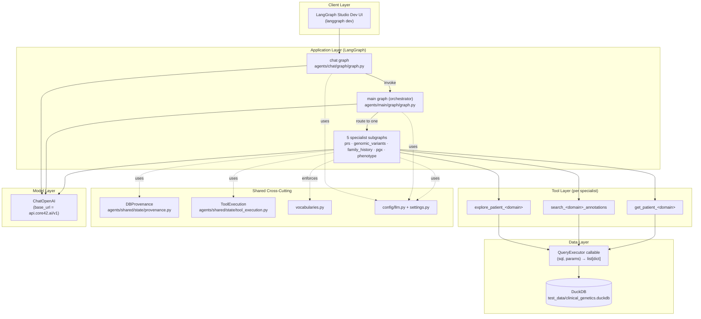

### 2.2 Graph topology — `main` orchestrator (loop-style router)

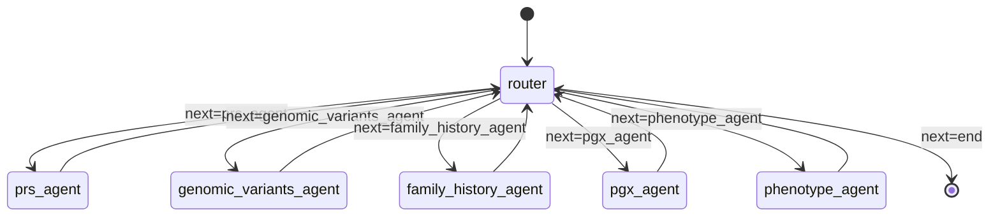

Evidence: `agents/main/graph/graph.py:92-127`. The router is invoked, one specialist runs, control returns to the router, which re-decides — **strictly sequential**, never parallel.

### 2.3 Graph topology — `chat` (session)

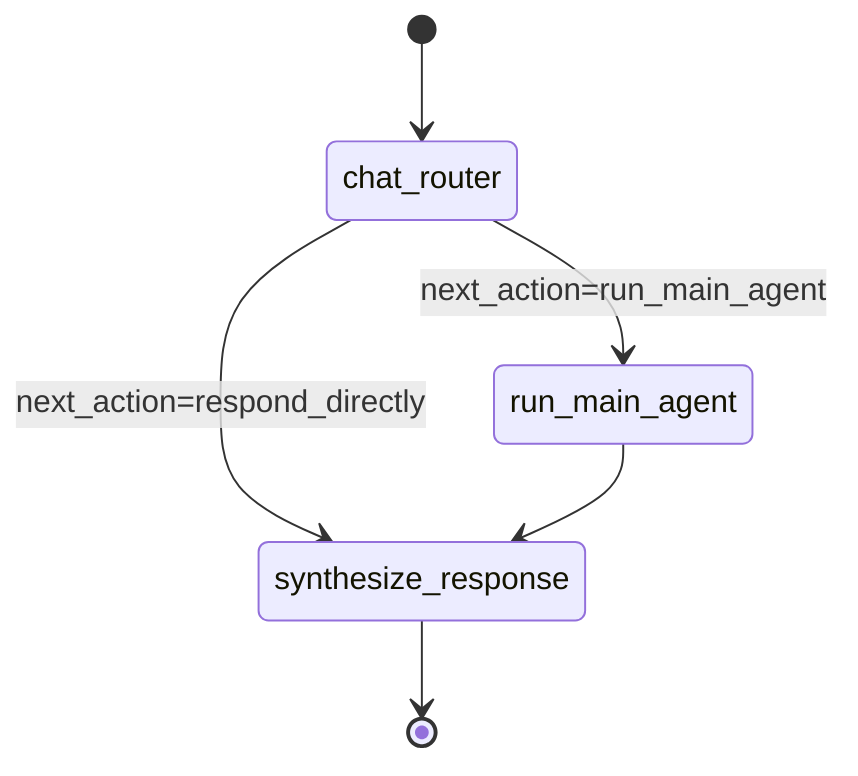

Evidence: `agents/chat/graph/graph.py:235-263`. Multi-turn continuity relies on the checkpointer supplied by `langgraph dev` — **no checkpointer is compiled into the graph in code** (`.compile()` is called with no arguments at `agents/chat/graph/graph.py:263` and `agents/main/graph/graph.py:127`).

### 2.4 Per-specialist internal shape

Every specialist implements the exact same 10-step recipe. This uniformity is deliberate — it's the strongest structural regularity in the codebase.

```mermaid
flowchart LR
    A[state dict from orchestrator] --> B["build <Domain>AgentState<br/>(Pydantic)"]
    B --> C["ReAct agent invoke<br/>(explore → search → get)"]
    C --> D["structured extraction LLM<br/>with_structured_output(method=function_calling)"]
    D --> E[post-hoc enrichment<br/>derived fields, model attribution]
    E --> F["_extract_tool_executions<br/>from message history"]
    F --> G["_attach_provenance<br/>match rows → results"]
    G --> H["from_agent_state()<br/>build slim StateOutput"]
    H --> I["return {domain: output,<br/>agents_completed: [...+domain]}"]
```

Evidence: every specialist `graph.py` mirrors this — e.g. `agents/prs/graph/graph.py:46-138`, `agents/genomic_variants/graph/graph.py:57-191`, `agents/family_history/graph/graph.py:52-175`, `agents/pgx/graph/graph.py:44-152`, `agents/phenotype/graph/graph.py:45-157`.

### 2.5 Dependencies and layer boundaries

| From → To | Nature | Coupling |
|---|---|---|
| `chat` graph → `main` graph | Direct function call: `main_graph.invoke(...)` (`agents/chat/graph/graph.py:196`) | Tight — same process |
| `main` graph → specialist nodes | Node function reference, one per specialist | Tight — direct import |
| Specialists → tools | Tool binding via `create_react_agent(tools=[...])` | Tight but confined to one specialist |
| Tools → DB | Via injected `QueryExecutor` callable | **Loose — this is the seam** |
| All → LLM | Via `config.llm.get_llm(agent_name)` | Centralised — single point of change |
| All → settings | Via `config.settings.get_settings()` (cached) | Centralised |

The DB seam is the single most important architectural feature for the Microsoft-stack migration. Everything else is tightly coupled Python imports.

### 2.6 Cross-cutting concerns

- **Provenance & audit**: `DBProvenance` and `ToolExecution` live in `agents/shared/state/` and are used by every specialist.
- **Controlled vocabularies**: `agents/shared/state/vocabularies.py` explicitly documents what the *system* owns (`AGENT_STATUSES`, `RISK_BANDS`) and what it deliberately does *not* own (pathogenicity from ClinVar, ACMG classification, sequencing platforms). This is a mature decision — the code stays clean when the reference data evolves.
- **Model configuration**: All model choices centralised in `config/llm.py:26-72`. Every agent's `model.py` is a two-line shim.

### 2.7 What is *not* in the architecture (verified absences)

- No message queue, no event bus, no background workers.
- No auth/authorisation layer of any kind.
- No connection pool — every tool call opens a fresh `duckdb.connect(...)` (`agents/prs/tools/tools.py:52-60`).
- No persistent checkpointer in code (relies on `langgraph dev` default).
- No logging beyond an in-memory `List[ToolExecution]` per agent run, plus `logger.warning` on unknown enum values (`agents/genomic_variants/state/schemas.py:102-127`).
- No MCP server, no A2A protocol, no external RPC. All boundaries are Python imports.

---

## 3. Repository Walkthrough

### 3.1 Top-level layout

| Path | Purpose | Notes |
|---|---|---|
| `README.md` | User-facing readme | Accurate on architecture; "next steps" (parallelisation, ontology subagent, eval loops) are **not** implemented |
| `langgraph.json` | LangGraph graph registry | Two graphs registered: `chat`, `main`. The main graph is exposed directly for internal testing |
| `requirements.txt` | Python deps | LangGraph 1.2.0, langchain-core 1.4.0, langchain-openai 1.2.1, pydantic 2.13.4, duckdb 1.3.2, pytest 9.0.2, langgraph-cli 0.4.2 |
| `.env.example` | Env template | ⚠ Contains a commented-out real-looking `LANGSMITH_API_KEY` (line 1) — should be scrubbed from git history |
| `egp-window-agent-discovery.md` | Handover / customer discovery doc | Business context, not implementation |
| `agents/` | All agent code | Detailed in §3.2 |
| `config/` | Cross-cutting configuration | `llm.py`, `settings.py` |
| `test_data/` | Seeded DuckDB + schema | Ships in repo; no seed script — data is baked into the DuckDB file |
| `tests/` | Workspace tests | `show_report_agent_input.py` is the only non-empty file; `connection/`, `integration/`, `subagents/` are empty placeholders |
| `db/` | Empty | Placeholder folder; nothing here today |

### 3.2 `agents/` structure (the core of the codebase)

Uniform folder shape for every agent:

```
agents/
├── shared/
│   └── state/
│       ├── provenance.py       DBProvenance model (facts → source rows)
│       ├── tool_execution.py   ToolExecution audit record
│       └── vocabularies.py     AGENT_STATUSES, RISK_BANDS
│
├── chat/                       Clinician-facing entry
│   ├── graph/graph.py          StateGraph + nodes (router, run_main, synthesize)
│   ├── models/model.py         2-line shim: chat_llm = get_llm("chat")
│   ├── prompts/prompt.py       CHAT_ROUTER_SYSTEM, CHAT_SYNTHESIS_SYSTEM
│   ├── state/state.py          ChatAgentState (TypedDict)
│   └── tests/test_chat_agent.py 3-turn integration test
│
├── main/                       Orchestrator (no tools)
│   ├── graph/graph.py          StateGraph + router node + specialist nodes as edges
│   ├── models/model.py         main_llm = get_llm("main")
│   ├── prompts/prompt.py       MAIN_AGENT_SYSTEM (has a duplicated rule 6)
│   ├── state/state.py          OrchestrationAgentState (TypedDict)
│   ├── tests/test_main_agent.py End-to-end 5-specialist integration test
│   └── tools/                  ⚠ EMPTY — main agent has no tools by design
│
└── prs/ · genomic_variants/ · family_history/ · pgx/ · phenotype/
    ├── graph/graph.py          create_react_agent + node function
    ├── models/model.py         2-line shim
    ├── prompts/prompt.py       System prompt (mandates tool order)
    ├── state/
    │   ├── schemas.py          Result schemas (Pydantic) — the domain model
    │   └── state.py            <Domain>AgentState (internal) + <Domain>StateOutput (public)
    ├── tools/tools.py          @tool functions + QueryExecutor injection
    └── tests/test_<domain>_agent.py Integration test
```

Key regularity: every folder under `agents/*` has exactly the same shape (`graph`, `models`, `prompts`, `state`, optionally `tools`, `tests`). This is the codebase's most valuable convention — it makes the specialists interchangeable from an architectural standpoint.

### 3.3 Responsibility separation

- **`graph/`** — flow. LangGraph nodes/edges, ReAct construction, node functions that orchestrate one turn/step.
- **`models/`** — model binding. Nothing but the `get_llm(name)` call.
- **`prompts/`** — instruction. System prompts only; user messages are constructed in the node.
- **`state/`** — data contracts. Pure Pydantic; no I/O, no side effects.
- **`tools/`** — I/O. The only place SQL lives. Everything above `tools/` is DB-ignorant.
- **`tests/`** — integration only. There are no unit tests in this repo (verified: no `mock`, no `MagicMock`, no `pytest.fixture` beyond DuckDB seeding).

### 3.4 Notable empty / placeholder locations (evidence of intent)

- `agents/main/tools/` empty — deliberate. Main orchestrator holds no tools.
- `db/` empty — placeholder for a future non-DuckDB config or migration bundle.
- `tests/connection/`, `tests/integration/`, `tests/subagents/` empty — scaffolding for a future test suite.
- No `agents/report/` directory exists, yet `tests/show_report_agent_input.py` prints "REPORT AGENT INPUT". A **report agent is planned** but not implemented. This is important context for §21 and §24.

---

## 4. Complete Agent Analysis

There are **7 agents**: chat, main, and five specialist ReAct subagents. Each is analysed below.

### 4.1 Chat Agent — clinician-facing session manager

**Path:** `agents/chat/graph/graph.py`

| Aspect | Detail |
|---|---|
| Purpose | Handle a multi-turn clinician conversation. Decide when to fetch fresh data vs answer from cached results. Synthesise clinician-oriented final reply. |
| Model | `gpt-5.1` — `config/llm.py:64-67`. Highest tier; only agent that talks to the human. |
| Structured output | `ChatRouterDecision` — `agents/chat/graph/graph.py:34-52`: `needs_clinical_data`, `reason`, `reset_agents` |
| Input | `ChatAgentState` — `agents/chat/state/state.py:15-42`: `patient_id`, `messages`, `agents_completed`, and cached specialist outputs. `total=False`, TypedDict. |
| Output | Appends an `AIMessage` to `messages`. Mutates `agents_completed` when `reset_agents` fires. |
| Tools | None. Talks only to the main graph (nested `invoke`) and the LLM. |
| Nodes | `chat_router_node`, `run_main_agent_node`, `synthesize_response_node` |
| Edges | `START → chat_router → {run_main_agent \| synthesize_response} → END` |
| Orchestration role | **Session-level cache invalidation.** When a follow-up query targets a different disease, `reset_agents` names which cached specialists become stale — those get set to `None` and removed from `agents_completed` before the main graph re-runs. Evidence: `agents/chat/graph/graph.py:157-166`. |
| Key behaviour | Strips `provenance` recursively from all cached outputs before feeding them to the synthesis LLM — `agents/chat/graph/graph.py:83-89`. Provenance is *retained* on the state; only the LLM view is stripped. |
| Why it exists | Separation of concerns: the main graph does not know about conversation memory. The chat graph does not know about tools. This is a clean UI-vs-domain split. |

### 4.2 Main Agent — orchestrator (no tools)

**Path:** `agents/main/graph/graph.py`

| Aspect | Detail |
|---|---|
| Purpose | Given `patient_id`, `original_query`, and `agents_completed`, pick the next specialist to run — or terminate. |
| Model | `gpt-4.1` — `config/llm.py:57-62` |
| Structured output | `RouterDecision` — `agents/main/graph/graph.py:26-37`: `next` (Literal of 5 specialists or `end`), `reason`, `requested_diseases` |
| Input | `OrchestrationAgentState` — `agents/main/state/state.py:15-42` |
| Output | Sets `next` and (optionally) `requested_diseases`. Does not touch specialist outputs. |
| Tools | **None.** `agents/main/tools/` is empty — verified. |
| Nodes | `router` + one wrapper node per specialist (which is just an import of the specialist's node function) |
| Edges | `START → router → {specialist → router}* → END` |
| Orchestration role | **Turn-level dispatch loop.** Runs one specialist per pass, then re-consults the router. Never dispatches an agent listed in `agents_completed`. |
| Key behaviour | The prompt at `agents/main/prompts/prompt.py` has a **duplicated rule #6** (rules 6 and 6 appear both). Non-fatal but should be fixed. |
| Why it exists | Encapsulates routing logic in one prompt/one node, keeping specialists agnostic of each other. Also encapsulates the completion-tracking guardrail (`agents_already_completed`). |

### 4.3 PRS Agent — polygenic risk scores

**Path:** `agents/prs/graph/graph.py`

| Aspect | Detail |
|---|---|
| Purpose | Retrieve and interpret PRS scores for a patient, optionally filtered by disease. |
| Model | `gpt-4.1` |
| Prompt | `agents/prs/prompts/prompt.py` — mandates `explore → search → get` tool order |
| Input | Reads `patient_id`, `original_query`, `requested_diseases` from state — `agents/prs/graph/graph.py:57-61` |
| Output schema | `PRSResultList` — `agents/prs/state/schemas.py:91-110`: `results: List[PRSResult]`, `summary`, `summary_model`. Each `PRSResult` has identifiers, score data, metadata, `risk_band`, `interpretation`, `provenance`. |
| State | Internal `PRSAgentState` — `agents/prs/state/state.py:9-60`. Slim orchestrator-facing `PRSStateOutput` — `agents/prs/state/state.py:63-94` |
| Tools | `explore_patient_prs`, `search_prs_annotations`, `get_patient_prs` — `agents/prs/tools/tools.py` |
| Orchestration | Runs as a single node in the main graph. Two LLM calls: ReAct + structured extraction (`agents/prs/graph/graph.py:88-118`). |
| Provenance tables tracked | `patient_prs JOIN prs_annotations` (only `get_patient_prs` produces provenance) — `agents/prs/graph/graph.py:207-215` |
| Why it exists | PRS is a distinct clinical domain with its own vocabulary (`risk_band`) and interpretation model (percentile → band). |

### 4.4 Genomic Variants Agent

**Path:** `agents/genomic_variants/graph/graph.py`

| Aspect | Detail |
|---|---|
| Purpose | Retrieve rare variants for a patient, interpret pathogenicity, decompose `annotations_json` blob into typed fields plus a `raw_annotations` catch-all. |
| Model | `gpt-4.1` |
| Prompt | `agents/genomic_variants/prompts/prompt.py` |
| Input | `patient_id`, `original_query`, plus four optional filter lists: `requested_diseases`, `requested_genes`, `requested_variant_types`, `requested_pathogenicity` — `agents/genomic_variants/graph/graph.py:74-79`. *(Note: only `requested_diseases` is actually populated by the current main router — the other three are read but never set upstream.)* |
| Output schema | `GenomicVariantsResultList` with composition: `VariantSampleData` + `VariantCoreAnnotations` + `VariantExtendedAnnotations` — `agents/genomic_variants/state/schemas.py:29-204` |
| State | `GenomicVariantsAgentState` — `agents/genomic_variants/state/state.py:12-60`. `from_agent_state` **validates patient_id match** and raises on mismatch — `agents/genomic_variants/state/state.py:74-92` |
| Tools | `explore_patient_genomic_variants`, `search_variant_annotations`, `get_patient_genomic_variants` |
| Special behaviour | Derives `pathogenic_count` programmatically (never LLM-filled) — `agents/genomic_variants/graph/graph.py:134-139`. Logs warnings when the ReAct output contains unknown pathogenicity / variant_type values (via `VariantCoreAnnotations.warn_unknown_values`) — `agents/genomic_variants/state/schemas.py:102-127`. |
| Why it exists | Variants are the most annotation-heavy domain in the schema (JSON blob + ACMG + population frequencies + in-silico predictors). Separating this into its own agent with a specialised structured-output schema keeps the pathogenicity logic isolated. |

### 4.5 Family History Agent

**Path:** `agents/family_history/graph/graph.py`

| Aspect | Detail |
|---|---|
| Purpose | Evaluate structured family history criteria (e.g., NCCN HBOC, Amsterdam II) against the patient's kinship data. Produce a `meets_threshold` result plus a **privacy-qualified** interpretation. |
| Model | `gpt-4.1` |
| Prompt | `agents/family_history/prompts/prompt.py` — includes strict rules against reproducing individual relative details |
| Input | `patient_id`, `original_query`, `requested_diseases` |
| Output schema | **Two schemas** — `FamilyHistoryResultList` (full) and `FamilyHistoryResultListPublic` (stripped) — `agents/family_history/state/schemas.py:83-116` |
| State | `FamilyHistoryAgentState` retains full data; `FamilyHistoryStateOutput.from_agent_state` calls `_strip_privacy_fields` — `agents/family_history/state/state.py:107-154` |
| Tools | `explore_patient_family_history`, `search_family_history_annotations`, `get_patient_family_history` |
| Privacy design | This is **the only agent** that has a public/private schema split. Fields `affected_relative_count`, `total_relatives_searched`, and `search_context_notes` are stripped from the output that goes up to the orchestrator, and also stripped from each provenance `source_row` — `agents/family_history/state/state.py:124-154`. The full data stays inside the specialist for audit only. |
| Why it exists | Family history is the most PHI-sensitive domain — even aggregate counts can be identifying in small populations. The two-schema pattern encodes that concern explicitly. |

### 4.6 PGX Agent — pharmacogenomics

**Path:** `agents/pgx/graph/graph.py`

| Aspect | Detail |
|---|---|
| Purpose | Look up patient diplotype/phenotype per gene, then join CPIC-based drug recommendations. Interpret metabolizer status for clinical actionability. |
| Model | `gpt-4.1` |
| Prompt | `agents/pgx/prompts/prompt.py` |
| Input | `patient_id`, `original_query`, `requested_genes` |
| Output schema | `PGXResultList` — one row per gene-drug pair. Programmatic derived fields: `genes_assessed`, `drugs_with_recommendations` — `agents/pgx/state/schemas.py:60-79` |
| Tools | `explore_patient_pgx`, `search_pgx_annotations`, `get_patient_pgx` |
| Special behaviour | `get_patient_pgx` uses `LEFT JOIN` — if the patient's phenotype has no drug recommendation, the gene row is still returned with null drug fields. This is deliberate coverage documentation, not an error — `agents/pgx/tools/tools.py:129-170`. |
| Why it exists | Drug-gene interaction is a distinct query pattern (patient×gene×phenotype→drug) with its own vocabulary (`phenotype` enum) and different join semantics than any other domain. |

### 4.7 Phenotype Agent — diagnoses

**Path:** `agents/phenotype/graph/graph.py`

| Aspect | Detail |
|---|---|
| Purpose | Retrieve the patient's diagnosis history, group by condition, and identify which conditions are semantically relevant to the current query. |
| Model | `gpt-4.1` |
| Prompt | `agents/phenotype/prompts/prompt.py` — includes explicit "stay focused" guardrail against suggesting downstream actions |
| Input | `patient_id`, `original_query`, `requested_diseases` |
| Output schema | `PhenotypeResultList` — one row per grouped disease with encounter statistics, relevance judgement, interpretation — `agents/phenotype/state/schemas.py:83-96` |
| Tools | **Only two:** `explore_patient_phenotype`, `get_patient_diagnoses`. **There is no annotation table for diagnoses**, so no `search_*_annotations` tool exists. README explicitly notes this (`README.md:133-134`). |
| Special behaviour | Grouping is done in SQL — `GROUP BY COALESCE(disease_name, term)` at `agents/phenotype/tools/tools.py:164` — not in the LLM. The relevance/interpretation are LLM-generated; the encounter statistics are always DB-truth. |
| Why it exists | Phenotype is qualitatively different: no reference annotation table, no exact-match domain vocabulary. The LLM's job here is *semantic matching* (query → condition), not annotation lookup. |

### 4.8 Cross-agent dependencies (verified)

| Depends on | Modules |
|---|---|
| All 7 agents → `config.llm` | `agents/*/models/model.py` (2-line shim each) |
| All 7 agents → `config.settings` | via `config.llm` |
| chat → main (nested invoke) | `agents/chat/graph/graph.py:26` imports `main_graph` |
| main → 5 specialists (node imports) | `agents/main/graph/graph.py:17-22` |
| chat state → all 5 specialist output schemas | `agents/chat/state/state.py:10-14` |
| main state → all 5 specialist output schemas | `agents/main/state/state.py:10-14` |
| All 5 specialists → shared/state | for `DBProvenance` and `ToolExecution` |

No specialist imports any other specialist. This is a clean radial dependency graph.

---

## 5. Tool Analysis

**14 tools total** across the five specialist domains (5 domains × 3 tools − 1 for phenotype which has 2). Every tool follows the same executor-injection pattern (`agents/prs/tools/tools.py:21-60`) and is decorated with `@tool` from `langchain_core.tools`.

Conventions consistent across every tool:

- Signature: `(named args) -> list[dict]`.
- SQL uses `?` positional placeholders (portable across DuckDB/SQLite; PostgreSQL will need `%s` translation).
- No transactions; every call is a `SELECT` under `read_only=True`.
- Tool 1 (`explore_*`) never JOINs; Tool 2 (`search_*_annotations`) touches reference tables only; Tool 3 (`get_patient_*`) is the only tool doing patient×annotation JOINs.

### 5.1 PRS tools — `agents/prs/tools/tools.py`

| Tool | SQL essence | Tables | Joins | Assumptions | Output columns | Used for |
|---|---|---|---|---|---|---|
| `explore_patient_prs` | `SELECT patient_id, prs_name, disease_name, risk_band FROM patient_prs WHERE patient_id = ?` | patient_prs | None | Patient exists (empty list is a valid answer) | `patient_id, prs_name, disease_name, risk_band` | Step 1 orientation — hand back to the LLM the list of prs_names carried by this patient |
| `search_prs_annotations` | `SELECT prs_name, disease_name, source, notes FROM prs_annotations WHERE ...` | prs_annotations | None | `prs_name` uses `=`; `disease_name` uses `ILIKE %term%` | `prs_name, disease_name, source, notes` | Step 2 — free-text disease lookup or exact prs_name resolution |
| `get_patient_prs` | `SELECT pp.*, pa.source, pa.notes AS metadata_notes FROM patient_prs pp LEFT JOIN prs_annotations pa ON pp.prs_name = pa.prs_name WHERE ...` | patient_prs + prs_annotations | LEFT JOIN on `prs_name` | Patient PRS row must reference a valid `prs_name` (FK constraint in schema) | `patient_id, prs_name, disease_name, prs_score, percentile, risk_band, source, metadata_notes` | Step 3 — the row that ends up on `PRSResult` with provenance |

### 5.2 Genomic Variants tools — `agents/genomic_variants/tools/tools.py`

| Tool | SQL essence | Tables | Joins | Assumptions | Output columns | Used for |
|---|---|---|---|---|---|---|
| `explore_patient_genomic_variants` | `SELECT patient_id, variant_id, genotype FROM patient_variants WHERE patient_id = ?` | patient_variants | None | Patient exists | `patient_id, variant_id, genotype` | Orient LLM to the variant IDs to look up |
| `search_variant_annotations` | `SELECT variant_id, gene, variant_type, pathogenicity, pathogenicity_source, disease_name, inheritance, notes, annotations_json FROM variant_annotations WHERE ...` | variant_annotations | None | `variant_id` uses `=`; `gene`, `pathogenicity`, `disease_name` use `ILIKE` | Nine columns incl. JSON blob | Annotation lookup by ID or catalog browsing |
| `get_patient_genomic_variants` | Long `SELECT` with LEFT JOIN, five optional exact filters | patient_variants + variant_annotations | LEFT JOIN on `variant_id` | All filter args use `=`; caller trusts they have exact identifiers by this point | 13 columns incl. `annotations_json` | Final row for `GenomicVariantResult` |

Note: `annotations_json` is a JSON blob in DuckDB — the tool returns it as-is; the specialist's second LLM pass parses it into typed fields plus a `raw_annotations` catch-all (`agents/genomic_variants/graph/graph.py:113-124`).

### 5.3 Family History tools — `agents/family_history/tools/tools.py`

| Tool | SQL essence | Tables | Joins | Assumptions | Output columns | Used for |
|---|---|---|---|---|---|---|
| `explore_patient_family_history` | `SELECT patient_id, disease_name, criteria_name, meets_threshold FROM patient_kinship_history WHERE patient_id = ?` | patient_kinship_history | None | Composite PK `(patient_id, disease_name, criteria_name)` — multiple criteria per disease per patient | 4 cols | Orient LLM to (disease, criteria) pairs |
| `search_family_history_annotations` | `SELECT disease_name, criteria_name, description, source FROM kinship_history_annotations WHERE ...` | kinship_history_annotations | None | `criteria_name` uses `=`; `disease_name` uses `ILIKE` | 4 cols | Read guideline description |
| `get_patient_family_history` | LEFT JOIN on `(disease_name, criteria_name)` composite key | patient_kinship_history + kinship_history_annotations | LEFT JOIN on **composite key** | ⚠ Only tool using a composite-key JOIN | 10 cols incl. `search_context_notes`, `last_observed_diagnosis_in_database` cast to VARCHAR | Final row — **contains privacy-sensitive fields that get stripped downstream** |

### 5.4 PGX tools — `agents/pgx/tools/tools.py`

| Tool | SQL essence | Tables | Joins | Assumptions | Output columns | Used for |
|---|---|---|---|---|---|---|
| `explore_patient_pgx` | `SELECT patient_id, gene, diplotype, phenotype FROM patient_pgx_status WHERE patient_id = ?` | patient_pgx_status | None | Enum-constrained phenotype column | 4 cols | Orient LLM to genes assessed |
| `search_pgx_annotations` | `SELECT gene, phenotype, drug, recommendation, summary, source FROM pgx_annotations WHERE ...` | pgx_annotations | None | `gene`, `phenotype` use `=` (both vocabulary-constrained); `drug` uses `ILIKE` | 6 cols | Find drug recommendations for a gene/phenotype combo |
| `get_patient_pgx` | LEFT JOIN on `(gene, phenotype)` | patient_pgx_status + pgx_annotations | **LEFT JOIN on gene AND phenotype** | ⚠ **Only JOIN in the system that uses phenotype as a JOIN key** — a patient with `phenotype='Unknown'` will match `pgx_annotations` rows for `Unknown` | 8 cols | Final row per gene-drug pair |

### 5.5 Phenotype tools — `agents/phenotype/tools/tools.py`

| Tool | SQL essence | Tables | Joins | Assumptions | Output columns | Used for |
|---|---|---|---|---|---|---|
| `explore_patient_phenotype` | `SELECT DISTINCT disease_name, term, code_type FROM diagnoses WHERE patient_id = ? ORDER BY disease_name NULLS LAST, term` | diagnoses | None | `disease_name` can be NULL (unmapped codes) | 3 cols | Semantic hit-list for LLM relevance matching |
| `get_patient_diagnoses` | Grouped: `GROUP BY COALESCE(disease_name, term)` with `LIST(DISTINCT ...)` aggregations for codes/terms/code_types, `MIN/MAX(encounter_date)` cast to VARCHAR | diagnoses | None (self-only, aggregation) | Group key is `COALESCE(disease_name, term)` — a diagnosis with null `disease_name` groups under its `term` | 7 cols per group | Final grouped row per condition |

Special note on `get_patient_diagnoses` filter logic: when both `disease_name` and `search_term` are provided, they combine as an **OR across three columns** (`disease_name`, `term`, `description`) — `agents/phenotype/tools/tools.py:135-148`. Non-obvious; deserves a comment or a test.

### 5.6 How tools are used

Every specialist wires its tools identically:

```python
<domain>_agent = create_react_agent(
    <domain>_llm,
    tools=[explore_*, search_*_annotations, get_patient_*],
    prompt=<DOMAIN>_AGENT_SYSTEM_PROMPT,
)
```

Evidence: e.g. `agents/prs/graph/graph.py:29-36`. The ReAct loop is fully implicit — the LLM decides call order, but the prompt strongly constrains it to `explore → search → get`. There is no code-level enforcement of the order; if the LLM skips `explore`, the system will still work but lose the discovery step.

### 5.7 Tool-level cross-cutting concerns

- Only **`get_patient_*` tools produce provenance rows**. This is by design — `_TOOL_SOURCE_TABLE` in every specialist's graph file lists only the retrieve tool (`agents/prs/graph/graph.py:207-215`).
- Every tool opens and closes its own DuckDB connection. There is **no connection reuse across tool calls in a single agent run**.
- Every tool uses `read_only=True` at connect time. The system as written cannot mutate the database.
- SQL parameterisation is consistent (`?` placeholders throughout). No string concatenation of user input into SQL detected — no injection surface.

---

## 6. Database Analysis

**10 tables**, DuckDB-flavour SQL (`ILIKE`, `LIST`, `JSON` type), one seeded database file. Schema in `test_data/schema.sql`.

### 6.1 Schema at a glance

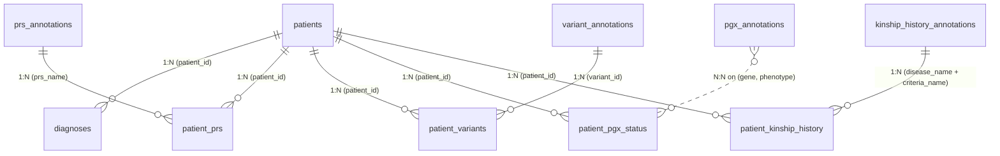

### 6.2 Table-by-table purpose and design decisions

| Table | Purpose | Why normalised this way | Key constraints (from source) |
|---|---|---|---|
| `patients` | Root identity table. `date_of_birth` is stored (age is derived). | Single source of truth for `patient_id`. | `sex` CHECK IN `('female','male','other','unknown')` — `test_data/schema.sql:26` |
| `diagnoses` | Phenotype domain — one row per diagnosis encounter. | Wide — includes both `code` and human-readable `term`/`description`, so downstream doesn't need external code-system lookup. | `code_type` CHECK enum: `ICD10, ICD9, SNOMED, HPO, OMIM, MONDO, OTHER`. UNIQUE `(patient_id, code, encounter_date)` |
| `prs_annotations` | Reference table for PRS metadata (source, notes) keyed on `prs_name`. | Normalised out of `patient_prs` so notes are stored once per PRS, not once per patient. | `prs_name` PK. Feeds `PRSResult.source`, `metadata_notes` |
| `patient_prs` | Patient's PRS scores. | Denormalises `disease_name` from `prs_annotations` — this is a deliberate redundancy for query simplicity and to allow the `explore` tool to answer without JOIN. | `risk_band` CHECK IN `('low','average','high','very_high')`; `percentile BETWEEN 0 AND 100`; composite PK; FK to both `patients` and `prs_annotations` |
| `variant_annotations` | Reference table for variants. Core columns typed; long-tail annotations in `annotations_json` (JSON blob). | Hybrid: promotes filterable fields (`gene`, `variant_type`, `pathogenicity`) to columns; leaves evolvable data (HGVS notations, gnomAD frequencies, ACMG criteria) in JSON. Schema comment (`test_data/schema.sql:127-152`) explicitly says: promote from JSON to typed columns as pipeline stabilises. | `pathogenicity` CHECK IN 6-value ClinVar-style enum; `inheritance` CHECK IN 7-value enum |
| `patient_variants` | Patient's rare variants — sample-level detail. | Sample-level fields (`genotype`, `sequencing_platform`, `variant_caller`, `call_quality`) live here, not in `variant_annotations`, because they are per-patient not per-variant. | Composite PK `(patient_id, variant_id)`; FKs to both parent tables |
| `patient_pgx_status` | Patient's PGX per gene. | Diplotype/phenotype are per-patient facts, so they live here — not in `pgx_annotations` (which is drug-recommendation reference data). | `phenotype` CHECK IN 5-value enum matching `pgx_annotations.phenotype` |
| `pgx_annotations` | CPIC-based drug recommendations keyed by `(gene, phenotype, drug)`. | Reference table — one row per gene×phenotype×drug guideline. Joining to `patient_pgx_status` on `(gene, phenotype)` yields all drug recommendations applicable to that patient's status. | UNIQUE `(gene, phenotype, drug)` |
| `patient_kinship_history` | Patient's per-disease-per-criteria threshold results. | Composite PK `(patient_id, disease_name, criteria_name)` — one patient can have multiple criteria per disease (e.g. multiple guideline systems for breast cancer). | FK to `patients` and to `kinship_history_annotations` (composite) |
| `kinship_history_annotations` | Reference table describing what each `(disease, criteria)` combination checks. | Reference data — separated from patient table so criteria descriptions are stored once. | Composite PK `(disease_name, criteria_name)` |

### 6.3 Full mapping — Tables → Tools → Agents → Output fields

| Table(s) | Tool | Agent | Feeds output field(s) |
|---|---|---|---|
| `patient_prs` | `explore_patient_prs` | prs | `PRSKey.prs_name`, `disease_name`, `risk_band` |
| `prs_annotations` | `search_prs_annotations` | prs | `PRSResult.source`, `metadata_notes` (indirectly — for LLM context) |
| `patient_prs ⨝ prs_annotations` | `get_patient_prs` | prs | `PRSResult.*` and `provenance` |
| `patient_variants` | `explore_patient_genomic_variants` | genomic_variants | `VariantKey.variant_id`, `genotype` |
| `variant_annotations` | `search_variant_annotations` | genomic_variants | `VariantCoreAnnotations.*`, `VariantExtendedAnnotations.*` (via `annotations_json`) |
| `patient_variants ⨝ variant_annotations` | `get_patient_genomic_variants` | genomic_variants | `GenomicVariantResult.*` and `provenance` |
| `patient_kinship_history` | `explore_patient_family_history` | family_history | `FamilyHistoryKey.*` |
| `kinship_history_annotations` | `search_family_history_annotations` | family_history | `criteria_description`, `criteria_source` |
| `patient_kinship_history ⨝ kinship_history_annotations` | `get_patient_family_history` | family_history | Full `FamilyHistoryCriteriaResult` (privacy fields stripped downstream) |
| `patient_pgx_status` | `explore_patient_pgx` | pgx | `PGXKey.gene`, `diplotype`, `phenotype` |
| `pgx_annotations` | `search_pgx_annotations` | pgx | `recommendation`, `summary`, `source` for LLM context |
| `patient_pgx_status ⨝ pgx_annotations` | `get_patient_pgx` | pgx | `PGXDrugResult.*` and `provenance` |
| `diagnoses` (DISTINCT) | `explore_patient_phenotype` | phenotype | `PhenotypeKey.disease_name`, `term`, `code_type` |
| `diagnoses` (GROUP BY) | `get_patient_diagnoses` | phenotype | Full `PhenotypeDiseaseResult` (encounter counts, dates, codes) |

### 6.4 Normalisation observations (deliberate design)

1. **Star-shape around `patients`.** Every domain-specific patient table (`patient_prs`, `patient_variants`, `patient_pgx_status`, `patient_kinship_history`, `diagnoses`) references `patient_id` — no cross-domain FKs. This means a subagent can be run in complete isolation per domain, which is the entire premise of the architecture.
2. **Reference/annotation split.** Every domain except phenotype has this pattern: `patient_<domain>` (facts about the patient) + `<domain>_annotations` (reference data about the concept). This is exactly what makes the three-tool `explore → search → get` contract map so cleanly onto SQL.
3. **`patient_prs.disease_name` is intentionally denormalised** — it duplicates data from `prs_annotations.disease_name`. Motivation confirmed in the schema comment: it lets `explore_patient_prs` answer without a JOIN.
4. **`variant_annotations.annotations_json` is a JSON escape hatch.** Filterable fields are top-level columns; evolvable clinical annotations sit in JSON. Schema comment states the intent to promote fields from JSON as they stabilise — an explicit **schema evolution strategy** rather than a design smell.
5. **`patient_kinship_history` uses a wide row rather than a per-relative table.** Aggregate counts (`affected_relative_count`, `total_relatives_searched`) are stored, not per-relative rows. This is a **privacy decision** encoded in the schema: relatives are never individually persisted.
6. **`diagnoses` groups on `COALESCE(disease_name, term)`.** The schema tolerates null `disease_name` (unmapped codes), but the phenotype grouping logic is aware of it. This is defensive and correct.
7. **Enum vs. free-text CHECKs are strategic.** The code owns `risk_band` (enum'd in DB and in `vocabularies.py`) but does **not** own `pathogenicity` or `variant_type` — those are enum'd in the DB but soft-warned in Python (rather than raising) because the ClinVar/pipeline vocabulary evolves. Mature dual-layer approach.

### 6.5 Indexing (from `test_data/schema.sql`)

Indexes are consistent with the tool query patterns:

- Every `patient_<domain>` table is indexed on `patient_id` (implicit via PK) → supports every `explore_*` tool.
- Every `<domain>_annotations` table is indexed on `disease_name` → supports `ILIKE` search tools.
- `pgx_annotations` has a composite `(gene, phenotype)` index → supports the JOIN in `get_patient_pgx`.
- `variant_annotations` has a composite `(gene, pathogenicity)` index → supports catalog-style filters in `search_variant_annotations`.

There are no indexes on `annotations_json` — a JSON search would be a full scan today. Not a problem at prototype scale.

### 6.6 Data present (not read directly, inferred from tests)

Every specialist test file selects `LIMIT 1` from its domain's patient table and asserts non-empty results, which confirms the DuckDB file is seeded across all five domains for at least one patient. The main-agent integration test additionally requires a patient that has both PRS and variants (`agents/main/tests/test_main_agent.py:52-73`) — the seeded DB is verified to contain at least one such patient.

### 6.7 What is missing on the DB side (flagged for LLD)

- **No demographics look-up tool.** The `patients` table exists and stores DOB/sex, but no agent has a tool to read it. A patient-info lookup was listed in the customer's tool inventory but is not implemented.
- **`patient_prs.disease_name` and `prs_annotations.disease_name` can drift.** The schema does not enforce that `patient_prs.disease_name = prs_annotations.disease_name` for a given `prs_name` — there is no CHECK or trigger. Since `patient_prs.disease_name` is denormalised, this is a data-quality dependency on the loader.
- **No seed script.** The DuckDB file is a binary artifact in the repo. Rebuilding the test DB from schema would require a separate seeder that does not exist here.

---

## 7. End-to-End Request Flow

This section traces one clinician turn from message-arrival to synthesised response, naming every function, prompt, LLM call, tool, and SQL statement involved.

### 7.1 Anchor scenario (verified by `agents/main/tests/test_main_agent.py`)

Query: *"What is this patient's Alzheimer's disease risk based on their polygenic risk scores, genomic variants, and family history? Also summarise any relevant drug-gene interactions from their pharmacogenomics profile, and list any relevant past diagnoses."*

This is a broad query that exercises all five specialists, so it makes a good worst-case trace.

### 7.2 End-to-end sequence (chat turn, cold start)

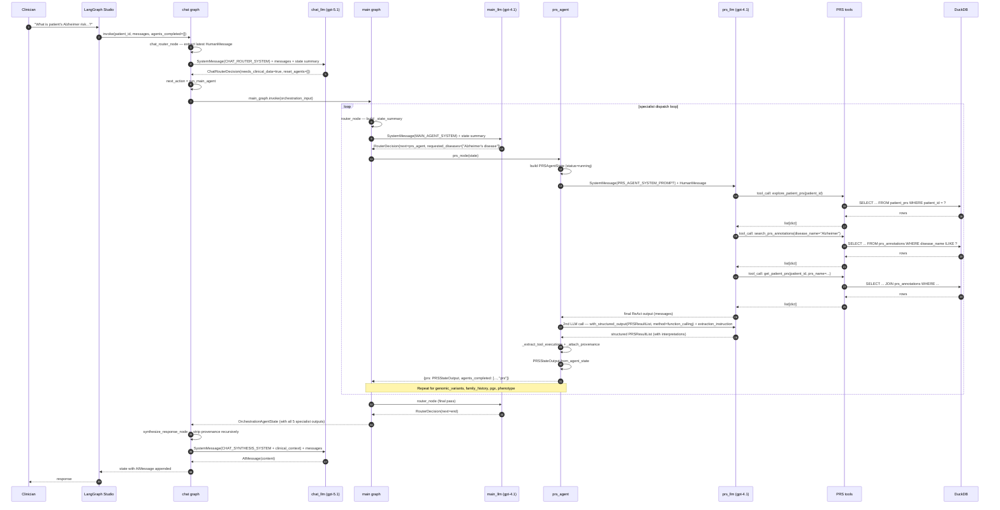

### 7.3 Per-turn LLM call budget

Cold-start turn with all 5 specialists dispatched:

| Call | Model | Purpose |
|---|---|---|
| 1 | `chat_llm` (gpt-5.1) | `ChatRouterDecision` — needs_clinical_data / reset_agents |
| 2..6 (×5) | `main_llm` (gpt-4.1) | `RouterDecision` at each dispatch step + final `end` decision (6 total router calls when all 5 specialists run) |
| 7..N | `prs_llm` (gpt-4.1) | ReAct — one call per tool step (typically 3–4) |
| N+1 | `prs_llm` (gpt-4.1) | Structured extraction with `method="function_calling"` |
| ...same pattern... | | For each of the 5 specialists |
| Last | `chat_llm` (gpt-5.1) | Synthesis pass — clinician-facing response |

Order-of-magnitude for a broad query: **1 chat router + ~6 main router + 5 × (3–4 ReAct + 1 extraction) + 1 synthesis ≈ 28–32 LLM calls**. This matters for latency and APIM cost sizing (see §22).

### 7.4 Follow-up turn (warm cache)

If the clinician asks *"Explain what those percentiles mean"* next:

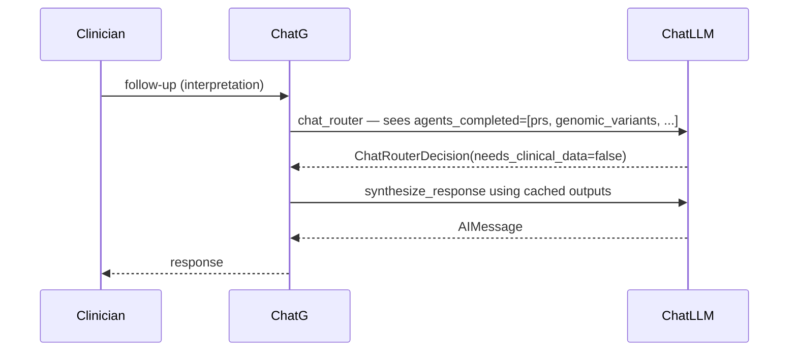

LLM calls: **2 only** (router + synthesis). The main graph is not invoked. This is the whole point of `agents_completed` + cached outputs on `ChatAgentState`. Verified in `agents/chat/tests/test_chat_agent.py:99-140` (Turn 2 asserts `next_action="respond_directly"` and unchanged `agents_completed`).

### 7.5 Disease-shift turn (partial cache invalidation)

If the next question is *"Actually, breast cancer PRS instead"*:

- Router sees old `agents_completed=[prs, ...]` and emits `reset_agents=["prs"]` (and possibly others).
- `chat_router_node` at `agents/chat/graph/graph.py:158-166` removes `"prs"` from `agents_completed` and sets `state["prs"] = None`.
- Main graph is invoked with `agents_completed` now excluding `"prs"`, so the PRS agent re-runs with the new `requested_diseases=["breast cancer"]`.

Verified in `agents/chat/tests/test_chat_agent.py:142-176` (Turn 3 asserts `next_action="run_main_agent"` and re-run of PRS).

### 7.6 One-specialist request flow — inside the PRS node

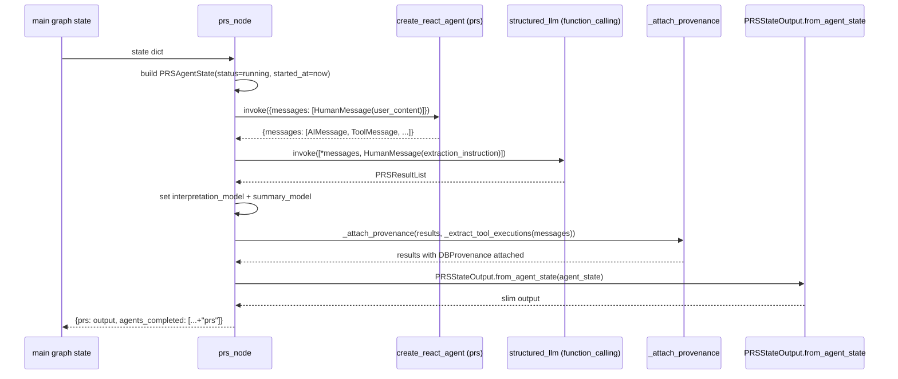

### 7.7 Data-provenance chain (single fact)

Example: the fact `PRSResult.percentile = 82` for `patient=P001, prs_name=PRS_AD_001`.

| Step | Where the fact lives | Traceability artefact |
|---|---|---|
| 1. DB row | `patient_prs` (columns `percentile=82`, `patient_id='P001'`, `prs_name='PRS_AD_001'`) | Row exists in `test_data/clinical_genetics.duckdb` |
| 2. Tool output | `get_patient_prs` returns a dict for this row | Captured in `ToolExecution.tool_output` |
| 3. Structured extraction | `PRSResult(percentile=82, ...)` produced by extraction LLM | Value on Pydantic model |
| 4. Provenance attached | `_attach_provenance` matches on `prs_name` and appends a `DBProvenance` record: `tool_name='get_patient_prs'`, `source_table='patient_prs JOIN prs_annotations'`, `source_row={patient_id: 'P001', prs_name: 'PRS_AD_001', ...}`, `fields_derived=['prs_name','disease_name','prs_score','percentile','risk_band','source','metadata_notes']` | Discoverable via `find_provenance_for_field(result.provenance, "percentile")` at `agents/shared/state/provenance.py:47-60` |
| 5. Orchestrator-visible | `PRSStateOutput.output.results[i].provenance` preserved | Passed to chat graph |
| 6. Synthesis time | Provenance is **stripped from the LLM prompt only** (via `_strip_provenance`) but retained on state | The synthesised reply cannot leak provenance detail, but the audit trail is fully retrievable from state |

---

## 8. Routing Logic

Routing exists at **two levels**: chat-level (memory-aware, session-scoped) and main-level (topic-aware, turn-scoped). Both are LLM-driven with structured output.

### 8.1 Chat-level routing (per user message)

**Where:** `chat_router_node` at `agents/chat/graph/graph.py:117-166`.

**Inputs consumed:**

- Latest `HumanMessage` in `messages` → extracted as `original_query`.
- Full `messages` history.
- A textual `state summary` (`_router_context_summary`) showing which specialists have data cached.

**Decision emitted:** `ChatRouterDecision`

```python
class ChatRouterDecision(BaseModel):
    needs_clinical_data: bool
    reason: str
    reset_agents: list[str]  # subset of {prs, genomic_variants, family_history, pgx, phenotype}
```

**Two graph transitions:**

- `run_main_agent` — when new retrieval is needed.
- `respond_directly` — when the cached outputs can already answer.

**Cache invalidation logic:** If `reset_agents` is non-empty and each agent is in `agents_completed`, that agent is removed from `agents_completed` and its output field is set to `None` (`agents/chat/graph/graph.py:158-166`). This is the only mechanism by which cached specialist outputs are ever discarded.

### 8.2 Main-level routing (per specialist step)

**Where:** `router_node` at `agents/main/graph/graph.py:66-83`.

**Inputs consumed:** `_state_summary` — patient_id, original_query, agents_completed, and boolean flags for whether each specialist output already exists.

**Decision emitted:** `RouterDecision`

```python
class RouterDecision(BaseModel):
    next: Literal["prs_agent","genomic_variants_agent","family_history_agent","pgx_agent","phenotype_agent","end"]
    reason: str
    requested_diseases: list[str] | None
```

**Graph transition mechanism:**

- LangGraph `add_conditional_edges` (`agents/main/graph/graph.py:105-116`) — maps `next` to specialist node or `END`.
- Every specialist node returns to `router` via `add_edge(specialist, "router")` (`agents/main/graph/graph.py:119-124`).

**Guard rails from the prompt** (`agents/main/prompts/prompt.py`):

- Rule 8: *"Never re-dispatch an agent already listed in `agents_already_completed`."*
- Rules 1–5: keyword-based mapping from query to specialist.
- Rule 6 (appears twice in the source — a typo): broad-query behaviour, dispatch relevant agents sequentially.
- Rule 7: return `end` when all relevant agents are complete.

### 8.3 Workflow termination

The loop terminates in exactly one way: `next == "end"`, which the router emits when all relevant specialists (per its own judgement) are in `agents_completed`.

**There is no hard cap on router iterations.** If the LLM hallucinates and refuses to return `end`, the loop will keep running. LangGraph's default recursion limit will eventually trip. This is a soft failure mode — verified: no explicit iteration budget in code.

### 8.4 Completion tracking

`agents_completed: list[str]` is the load-bearing field. Written to by **each specialist node** as its final action:

```python
return {..., "agents_completed": state.get("agents_completed", []) + ["<domain>"]}
```

Evidence: every specialist graph file — e.g. `agents/prs/graph/graph.py:138`.

Since `OrchestrationAgentState` is a `TypedDict` with no reducer on `agents_completed` (`agents/main/state/state.py:41`), the return value **replaces** the field. In practice this is fine because the specialist reads the current value and appends. This is a subtle contract: a specialist that forgets to include prior entries would erase them. All 5 specialists comply.

`ChatAgentState.agents_completed` likewise has no reducer (`agents/chat/state/state.py:41`). The chat router replaces the list explicitly when resetting agents.

### 8.5 LangGraph primitives used

Verified inventory:

- `StateGraph` — used only in the chat and main graphs. Specialists are single nodes, not sub-graphs.
- `add_node`, `add_edge`, `add_conditional_edges` — standard flow control.
- `START`, `END` sentinels.
- `create_react_agent` (from `langgraph.prebuilt`) — in every specialist. This is where the ReAct loop is delegated to LangGraph's prebuilt machinery.
- `add_messages` reducer — used for `messages` on both chat and main state (`agents/chat/state/state.py:22`, `agents/main/state/state.py:23`).

**Not used** (verified absence):

- `Send` / fan-out. No parallel dispatch.
- `Command` / control-flow overrides.
- Explicit `Checkpointer` / `MemorySaver`. Relies on `langgraph dev` default.
- `Interrupt` / human-in-the-loop gates. The clinician-in-the-loop is at UI level, not graph level.

### 8.6 Routing decision confidence — evidence-linked observations

- **Deterministic termination is achievable** even at `temperature=0.0` (all router models are 0.0 — `config/llm.py:31,37,44,50,54,60,66`). But it's not enforced by code.
- **Router prompt is authoritative**: the routing decision is entirely LLM-emitted with structured output; there is no rules engine as a fallback.
- **Router does not see specialist outputs**, only their existence. This is important: it prevents the router from being biased by content, but also means it cannot re-invoke a specialist that returned empty results. Verified in `_state_summary` at `agents/main/graph/graph.py:49-63` — only booleans for existence, not payloads.

---

## 9. State Management

The system uses **four distinct state scopes**, each with a defined owner and lifecycle.

### 9.1 State scope inventory

| Scope | Type | Owner | Lifecycle | Storage |
|---|---|---|---|---|
| Chat state | `ChatAgentState` (TypedDict) | chat graph | Across turns of one conversation | Whatever checkpointer `langgraph dev` provides (in-memory by default) |
| Orchestration state | `OrchestrationAgentState` (TypedDict) | main graph | One dispatch cycle (many router iterations) | In-memory — no checkpointer configured in code |
| Specialist agent state | `<Domain>AgentState` (Pydantic BaseModel) | specialist node | Within a single specialist call | Local variable inside `prs_node` / etc. Not passed upward. |
| Specialist output state | `<Domain>StateOutput` (Pydantic BaseModel) | specialist node → orchestrator/chat | Persists on OrchestrationAgentState and ChatAgentState | In-memory on the parent state |

### 9.2 `ChatAgentState` — session memory

Location: `agents/chat/state/state.py:15-42`.

| Field | Type | Written by | Read by |
|---|---|---|---|
| `patient_id` | str | injected at first invoke | all downstream nodes |
| `clinician_id` | str | injected | passthrough only (never used) |
| `conversation_id` | str | injected | passthrough only |
| `clinician_specialty` | str? | injected | passthrough only |
| `original_query` | str | `chat_router_node` (from latest HumanMessage) | main graph, all specialists |
| `messages` | Annotated[list, add_messages] | `synthesize_response_node` (AIMessage), user (HumanMessage) | chat_router, synthesize |
| `next_action` | Literal | `chat_router_node` | `_route` conditional edge |
| `requested_diseases`, `requested_genes` | list[str]? | injected, passthrough to main | main state |
| `prs`, `genomic_variants`, `family_history`, `pgx`, `phenotype` | `<Domain>StateOutput` | `run_main_agent_node` (from main graph result), `chat_router_node` (nulled on reset) | `synthesize_response_node` |
| `agents_completed` | list[str] | `run_main_agent_node`, `chat_router_node` (removes on reset) | chat_router, main |

**Reducers:** only `messages` has `add_messages`. All other fields are overwrite-on-return.

**Notable:** `clinician_id`, `conversation_id`, `clinician_specialty` are declared but not used anywhere downstream — verified via grep. They exist for future extensibility.

### 9.3 `OrchestrationAgentState` — per dispatch cycle

Location: `agents/main/state/state.py:15-42`.

- Mirrors `ChatAgentState` for the fields it needs (`patient_id`, `original_query`, `agents_completed`, five specialist outputs).
- Adds `next: Literal | None` — set by `router_node`, consumed by `_route`.
- Does not carry `messages` for the router — the router builds a fresh state summary each iteration.

### 9.4 `<Domain>AgentState` — specialist internal state

Each specialist has its own Pydantic `<Domain>AgentState` — internal, never passed upstream. Contains:

- Inputs (patient_id, query_context, requested_*)
- `output: <Domain>ResultList | None`
- `tool_executions: list[ToolExecution]` — the full audit trail including failed calls
- `status: str` — pending | running | complete | failed | partial
- `errors: list[str]`
- Timestamps: `started_at`, `completed_at`

Example: `PRSAgentState` at `agents/prs/state/state.py:9-60`.

**Design intent (verified in schema docstrings):** the AgentState is the debugging record. The public output (`<Domain>StateOutput`) is what the orchestrator sees. This is a clean **two-schema pattern** for every specialist.

### 9.5 `<Domain>StateOutput` — orchestrator-facing slim state

Contains only `output`, `status`, `errors`. Built via `from_agent_state(agent_state, expected_patient_id=...)`.

For family history, additionally strips privacy fields (`agents/family_history/state/state.py:117-154`).

### 9.6 Provenance state

`DBProvenance` at `agents/shared/state/provenance.py:7-45` — sits **on the result** (e.g. `PRSResult.provenance: List[DBProvenance]`), not on the state envelope. This means:

- Provenance is preserved on chat-level cached outputs.
- Provenance is stripped only from the *view* passed to the synthesis LLM (via `_strip_provenance`, `agents/chat/graph/graph.py:83-89`).
- Provenance survives cross-turn state persistence — clinician can always audit any fact retrospectively.

### 9.7 Tool execution audit state

`ToolExecution` at `agents/shared/state/tool_execution.py:16-42` — lives on `<Domain>AgentState.tool_executions`, **not** on the public output. This is deliberate: the orchestrator does not need to see the ReAct message history, only the extracted results.

**Consequence:** once a specialist run completes, the tool execution audit is not accessible from downstream state. It exists only during the run and is lost when the node returns.

### 9.8 State ownership summary

| State piece | Owner | Persists across turns? |
|---|---|---|
| `messages` | chat graph | Yes (add_messages accumulates) |
| `agents_completed` | chat + main + each specialist | Yes on chat, ephemeral on main |
| Specialist `<Domain>StateOutput` | specialist node (write once), chat/main (hold) | Yes on chat |
| Specialist `<Domain>AgentState` | specialist node only | No |
| Specialist `tool_executions` | specialist node only | No |
| `DBProvenance` per result | specialist node (write), everyone downstream (read-only) | Yes on chat |
| `original_query` | chat_router (write), everyone else (read) | Yes on chat (overwritten each turn) |
| `next_action`, `next` | chat_router / main router | Ephemeral |

### 9.9 Checkpointing

**None in code.** Both `build_graph()` implementations call `builder.compile()` with no arguments:

- `agents/chat/graph/graph.py:263`
- `agents/main/graph/graph.py:127`

`langgraph dev` injects a checkpointer at runtime — but that is a **dev-only artefact** and will not survive migration to a hosted MAF/Foundry deployment. Any Phase 1 target must supply an explicit checkpointer (SQLite/Postgres/Cosmos DB depending on hosting).

---

## 10. Prompt Inventory

Every LLM interaction in the system is anchored by one of the seven system prompts below. There are **no ad-hoc prompts** — every prompt is a module-level string constant. This is an unambiguously good property.

### 10.1 Prompt catalogue

| Prompt | File | Model | Structured output | Reasoning style |
|---|---|---|---|---|
| `CHAT_ROUTER_SYSTEM` | `agents/chat/prompts/prompt.py:1-46` | chat_llm (gpt-5.1) | `ChatRouterDecision` | Rule-based classification; decides retrieval vs. cached |
| `CHAT_SYNTHESIS_SYSTEM` | `agents/chat/prompts/prompt.py:48-66` | chat_llm (gpt-5.1) | Free-form `AIMessage` | Clinical explanation, grounded in stripped state |
| `MAIN_AGENT_SYSTEM` | `agents/main/prompts/prompt.py` | main_llm (gpt-4.1) | `RouterDecision` | Keyword mapping → specialist; extract `requested_diseases` |
| `PRS_AGENT_SYSTEM_PROMPT` | `agents/prs/prompts/prompt.py` | prs_llm (gpt-4.1) | Both ReAct and `PRSResultList` (2 LLM calls) | Tool-order protocol; per-result interpretation |
| `GENOMIC_VARIANTS_AGENT_SYSTEM_PROMPT` | `agents/genomic_variants/prompts/prompt.py` | genomic_variants_llm | Both ReAct and `GenomicVariantsResultList` | Tool-order + annotations_json decomposition |
| `FAMILY_HISTORY_AGENT_SYSTEM_PROMPT` | `agents/family_history/prompts/prompt.py` | family_history_llm | Both ReAct and `FamilyHistoryResultList` | Tool-order + privacy-aware qualification |
| `PGX_AGENT_SYSTEM_PROMPT` | `agents/pgx/prompts/prompt.py` | pgx_llm | Both ReAct and `PGXResultList` | Tool-order + metabolizer-actionability interpretation |
| `PHENOTYPE_AGENT_SYSTEM_PROMPT` | `agents/phenotype/prompts/prompt.py` | phenotype_llm | Both ReAct and `PhenotypeResultList` | Tool-order + semantic relevance judgement; explicit "stay-in-lane" guardrail |

Plus **user messages** dynamically built in each specialist node (e.g. `agents/prs/graph/graph.py:73-83`) — these are not prompts in the reusable sense but user-turn strings composed at runtime.

Plus **extraction instructions** — dynamically built HumanMessages appended before the structured-output pass (e.g. `agents/prs/graph/graph.py:94-99`). These are 3–5 sentence directives that tell the second LLM pass what to populate.

### 10.2 Chat Router (`CHAT_ROUTER_SYSTEM`)

- **Purpose:** decide if the message needs new DB retrieval or can be answered from cached data; also decide which cached specialists are stale given a topic shift.
- **Structured output:** `ChatRouterDecision` = `{needs_clinical_data: bool, reason: str, reset_agents: list[str]}`.
- **Reasoning style:** two-way decision + selective cache invalidation. Explicitly enumerates valid `reset_agents` values.
- **Notable:** the prompt tells the LLM which agent short-names are valid — this couples the prompt to the domain enum.

### 10.3 Chat Synthesis (`CHAT_SYNTHESIS_SYSTEM`)

- **Purpose:** compose the clinician-facing reply, focused on what was asked, without fabricating.
- **Structured output:** none — free-form `AIMessage`.
- **Reasoning style:** clinician-oriented, terminology-appropriate, conservative ("do not fabricate", "reflect qualifications").
- **Input augmentation:** at invocation, the prompt is concatenated with a serialised, provenance-stripped view of all available specialist outputs (`agents/chat/graph/graph.py:216-224`).

### 10.4 Main Orchestrator (`MAIN_AGENT_SYSTEM`)

- **Purpose:** map the clinician query to the next specialist, or `end`.
- **Structured output:** `RouterDecision` = `{next: Literal[...], reason: str, requested_diseases: list[str] | None}`.
- **Reasoning style:** rule-driven — 8 rules covering keyword mapping, disease filtering, completion tracking, termination.
- **Known defect:** rule #6 is duplicated in the source. Not functional (LLM will treat as reinforcement), but should be fixed.

### 10.5 Specialist prompts (all five)

All specialist prompts share the same structural spine:

1. Role statement (e.g. *"You are a clinical genomics assistant specialising in variant interpretation."*)
2. **Tool Use Protocol** — mandates `explore → search → get` order.
3. Domain-specific interpretation guidance.
4. Guardrails.

The `PRS_AGENT_SYSTEM_PROMPT` is the shortest and most template-like. `FAMILY_HISTORY_AGENT_SYSTEM_PROMPT` is the most safety-loaded (privacy qualification example baked in). `PHENOTYPE_AGENT_SYSTEM_PROMPT` has the strongest "stay-in-lane" guardrail (*"Do not suggest further genetic testing… routing decisions are handled elsewhere"*).

**Two-pass prompting** — every specialist uses the system prompt for the ReAct pass, then appends an ad-hoc extraction instruction HumanMessage to the ReAct output before the structured-output pass. See §7.6.

### 10.6 Structured-output schemas by prompt

| Prompt | Consumer LLM call | Schema |
|---|---|---|
| `CHAT_ROUTER_SYSTEM` | chat_llm.with_structured_output(ChatRouterDecision) | `agents/chat/graph/graph.py:34-52` |
| `MAIN_AGENT_SYSTEM` | main_llm.with_structured_output(RouterDecision) | `agents/main/graph/graph.py:26-37` |
| `PRS_AGENT_SYSTEM_PROMPT` (ReAct) | prs_llm via `create_react_agent` | tool_calls only |
| `PRS_AGENT_SYSTEM_PROMPT` (extraction) | prs_llm.with_structured_output(PRSResultList, method="function_calling") | `agents/prs/state/schemas.py:91-110` |
| (same for genomic_variants, family_history, pgx, phenotype) | | corresponding `<Domain>ResultList` schemas |

**Method choice:** the extraction pass uses `method="function_calling"` explicitly, because the default strict mode rejects `Dict[str, Any]` fields present in `DBProvenance.tool_parameters`, `DBProvenance.source_row`, and `VariantExtendedAnnotations.raw_annotations`. Comment at `agents/prs/graph/graph.py:20-22` confirms this rationale.

---

## 11. Configuration Inventory

The system has a minimal, centralised configuration surface. This is one of its strongest properties.

### 11.1 Environment variables

Defined via `pydantic-settings` in `config/settings.py:1-27`:

| Variable | Alias | Default | Purpose |
|---|---|---|---|
| `LLM_API_KEY` | `OPENAI_API_KEY` | (required) | API key for the OpenAI-compatible endpoint (`AliasChoices` at `config/settings.py:12-14`) |
| `LLM_BASE_URL` | — | `https://api.core42.ai/v1` | Base URL for the LLM endpoint. Default is already Core42/Compass. |
| `DB_PATH` | — | `test_data/clinical_genetics.duckdb` | Path to the DuckDB file |
| `MAX_RETRIES` | — | `3` | Declared but not read anywhere in the codebase (verified — no `max_retries` reference outside settings) |
| `LOG_LEVEL` | — | `"INFO"` | Declared but no `logging.basicConfig` call in the repo (verified) |

Environment file: `.env` loaded via pydantic `class Config: env_file = ".env"`.

**`.env.example` observations:**

- Line 1: `#LANGSMITH_API_KEY=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` — commented out, but a real-looking token. **Should be scrubbed from git history.**
- Line 2: `LANGSMITH_API_KEY=get_your_own_key!` — placeholder.
- Line 3: `OPENAI_API_KEY=keyp_it_secret` — placeholder.

Neither `LANGSMITH_API_KEY` nor `LLM_BASE_URL` appears in `.env.example` — the customer-supplied template is drifted from the settings module. Deserves reconciliation.

### 11.2 Model configuration

**Single source of truth:** `config/llm.py:26-72`.

```python
AGENT_LLM_CONFIGS: dict[str, AgentLLMConfig] = {
    "prs":              AgentLLMConfig(model="gpt-4.1", temperature=0.0, note="..."),
    "pgx":              AgentLLMConfig(model="gpt-4.1", temperature=0.0, note="..."),
    "genomic_variants": AgentLLMConfig(model="gpt-4.1", temperature=0.0, note="..."),
    "family_history":   AgentLLMConfig(model="gpt-4.1", temperature=0.0, note="..."),
    "phenotype":        AgentLLMConfig(model="gpt-4.1", temperature=0.0, note="..."),
    "main":             AgentLLMConfig(model="gpt-4.1", temperature=0.0, note="..."),
    "chat":             AgentLLMConfig(model="gpt-5.1", temperature=0.0, note="..."),
}
```

- Factory: `get_llm(agent_name)` at `config/llm.py:75-95` — returns a `ChatOpenAI` instance bound to the settings-provided `base_url` and `api_key`.
- All agent model modules are 2-line shims (e.g. `agents/prs/models/model.py`), calling `get_llm("<name>")`.

**Consequence:** swapping model per agent is a one-line edit. Swapping the LLM provider globally is a base_url/api_key change. This is exactly the seam needed for APIM/Compass migration.

**Verified absence:** no per-call `temperature`, `max_tokens`, `top_p`, or `response_format` overrides anywhere in the codebase. Every LLM call uses the config-time defaults.

### 11.3 Database configuration

- Only `db_path` in `Settings`.
- Every specialist's `tools/tools.py` has an identical `_get_executor` closure that opens a fresh `duckdb.connect(db_path, read_only=True)` per query (e.g. `agents/prs/tools/tools.py:52-60`).
- **No pool, no timeout, no connection reuse.** DuckDB tolerates this; PostgreSQL will not (see §22).

### 11.4 Application configuration

- **LangGraph registry:** `langgraph.json` — 3 lines, registers the `chat` and `main` graphs.
- **Dependencies:** `requirements.txt` — 11 pinned lines. Fully explicit version pins including patch level.

### 11.5 Startup configuration

There is **no application entry point** other than `langgraph dev`. The system is exclusively meant to be run under LangGraph Studio in development mode. There is no `main.py`, no HTTP server, no CLI wrapper.

For production/hosted deployment, some new startup surface will need to be introduced (see §21).

### 11.6 What's absent (verified, relevant for migration)

- No log configuration.
- No trace/OTEL configuration.
- No secrets management integration (Key Vault, MSI, DefaultAzureCredential).
- No feature flags.
- No environment awareness (dev/staging/prod distinction).
- No CORS, no authentication, no request rate limits.
- No health-check / readiness endpoint.
- No graceful shutdown hook.

---

## 12. Dependency Graph

Two views: **module dependency** and **agent → tool → database** dependency.

### 12.1 Module dependency graph

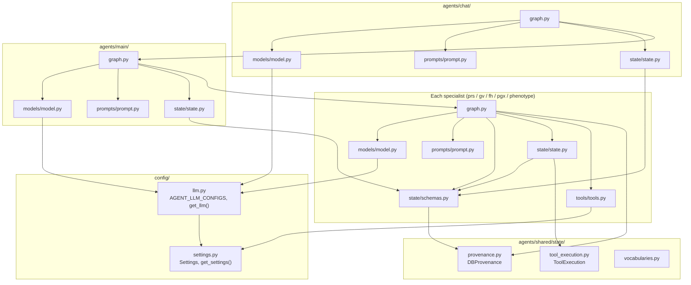

Key observations:

- **Radial imports.** Every specialist imports only from its own package, `shared/state`, and `config/`. No specialist imports another specialist.
- **Chat imports main.** The chat graph tightly couples to the main graph module (`agents/chat/graph/graph.py:26`).
- **Main imports every specialist.** The main graph imports each specialist's `<domain>_node` function (`agents/main/graph/graph.py:17-22`) and each specialist's `<Domain>StateOutput` (indirectly via `agents/main/state/state.py:10-14`).
- **Config is a leaf.** Everything depends on `config/`; `config/` depends on nothing internal.

### 12.2 Agent → Tool → Database dependency

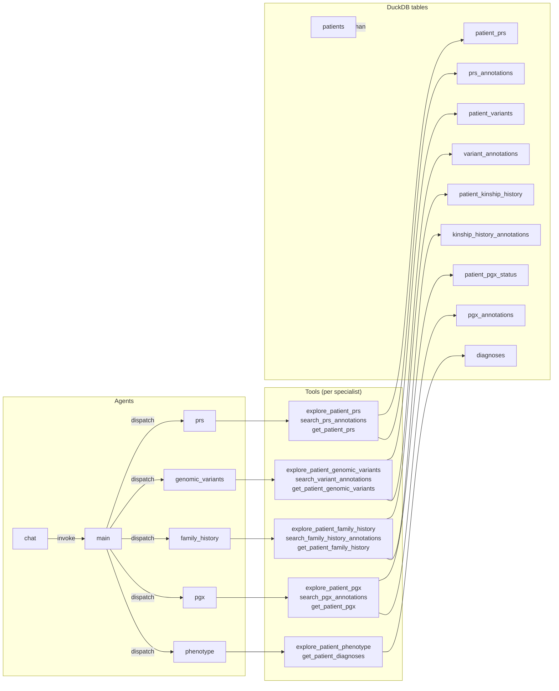

Notes on the graph:

- `patients` is defined in schema but **no tool reads from it**. Marked as orphan.
- Every table has exactly one specialist reading it. No cross-domain table access.
- Every tool touches ≤ 2 tables (Tool 3 does the JOIN; Tools 1 and 2 each touch one).

### 12.3 State-type dependency

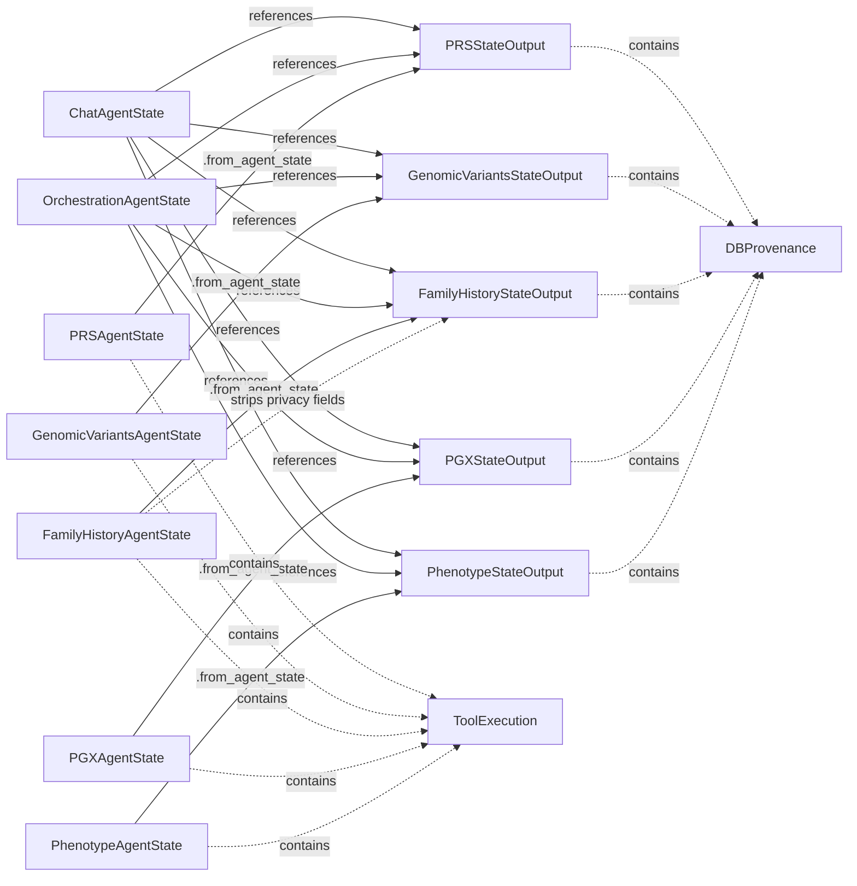

- Both `ChatAgentState` and `OrchestrationAgentState` share the same five specialist output types — this is what makes it safe for chat to invoke main and read back specialist fields directly.
- Only `FamilyHistoryAgentState → FamilyHistoryStateOutput` performs field stripping. Every other specialist's `from_agent_state` is a straight projection.

### 12.4 External library dependency

From `requirements.txt`, minimal and pinned:

| Package | Version | Used for |
|---|---|---|
| `langgraph` | 1.2.0 | StateGraph, prebuilt ReAct, message reducers |
| `langchain-core` | 1.4.0 | Messages, `@tool` decorator |
| `langchain-openai` | 1.2.1 | `ChatOpenAI` |
| `pydantic` | 2.13.4 | All state schemas |
| `pydantic-settings` | 2.14.1 | Settings loading |
| `duckdb` | 1.3.2 | Test DB |
| `typing-extensions` | 4.15.0 | `TypedDict` back-compat |
| `python-dotenv` | 1.1.1 | Env loading |
| `langgraph-cli` | 0.4.2 | Dev server |
| `pytest` | 9.0.2 | Tests |

**No** LangSmith SDK, **no** telemetry client, **no** Azure SDK, **no** HTTP framework, **no** ORM. This is a lean dependency footprint — good for the migration.

---

## 13. Call Graph

Concrete function-level view of a single request end-to-end. Every arrow is a verified call in the source.

### 13.1 Top-level call graph (broad clinical query)

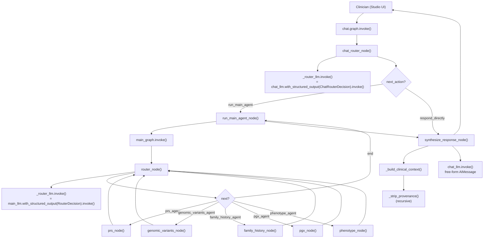

### 13.2 Inside a specialist node (`prs_node` as the exemplar)

Every specialist follows this identical call chain — only class/tool names differ.

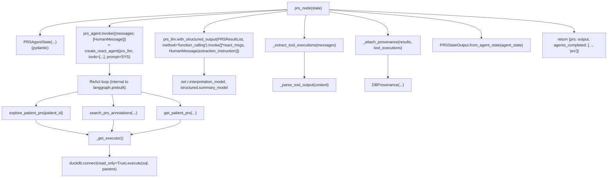

### 13.3 Function-level call inventory (per node)

| Function | Calls | Where |
|---|---|---|
| `chat_router_node` | `_router_llm.invoke` (structured), `_router_context_summary`, list mutation of `agents_completed` | `agents/chat/graph/graph.py:117-166` |
| `run_main_agent_node` | `main_graph.invoke` | `agents/chat/graph/graph.py:169-199` |
| `synthesize_response_node` | `_build_clinical_context` → `_strip_provenance`, `chat_llm.invoke` | `agents/chat/graph/graph.py:202-224` |
| `router_node` (main) | `_state_summary`, `_router_llm.invoke` | `agents/main/graph/graph.py:66-83` |
| `prs_node` | `PRSAgentState(...)`, `prs_agent.invoke`, `prs_llm.with_structured_output(...).invoke`, `_extract_tool_executions` → `_parse_tool_output`, `_attach_provenance`, `PRSStateOutput.from_agent_state` | `agents/prs/graph/graph.py:46-138` |
| (same pattern) | genomic_variants_node, family_history_node, pgx_node, phenotype_node | — |
| `_extract_tool_executions` | Iterates `messages`, matches `AIMessage.tool_calls` to `ToolMessage` by `tool_call_id`, builds `ToolExecution` records | `agents/prs/graph/graph.py:143-183` and 4 near-identical twins |
| `_parse_tool_output` | `json.loads` fallback | Same file |
| `_attach_provenance` | For each result, matches on domain key (e.g. `prs_name`), appends `DBProvenance` | Same file |
| Tool functions (all 14) | `_get_executor()` → `duckdb.connect(...).execute(sql, params).fetchall()` | Each specialist `tools.py` |

### 13.4 Class dependency (types only)

```mermaid
classDiagram
    class DBProvenance {
        +tool_name: str
        +tool_parameters: Dict
        +source_table: str
        +source_row: Dict
        +fields_derived: List[str]
        +retrieved_at: datetime
    }
    class ToolExecution {
        +tool_name: str
        +tool_parameters: Dict
        +tool_output: Optional[List[Dict]]
        +error: Optional[str]
        +executed_at: datetime
        +duration_ms: Optional[int]
    }
    class PRSResult
    class PRSResultList
    class PRSAgentState
    class PRSStateOutput
    class OrchestrationAgentState
    class ChatAgentState

    PRSResult --> DBProvenance : provenance : List
    PRSResultList --> PRSResult : results
    PRSAgentState --> PRSResultList : output
    PRSAgentState --> ToolExecution : tool_executions
    PRSStateOutput --> PRSResultList : output
    OrchestrationAgentState --> PRSStateOutput : prs
    ChatAgentState --> PRSStateOutput : prs
    ChatAgentState --> OrchestrationAgentState : (via nested invoke)
```

(Analogous shape for genomic_variants, family_history, pgx, phenotype.)

### 13.5 Call graph observations

- The **only recursive edge** is `router → specialist → router` inside the main graph. LangGraph's runtime enforces a recursion limit; the code does not set one.
- `chat.run_main_agent_node → main_graph.invoke(...)` is a **synchronous nested graph invocation**, not a subgraph node. This means the main graph's own checkpointing and streaming (if configured) are not visible to the chat graph. See §16 for the implications.
- Every specialist's node function is self-contained — it reads and writes only via the state dict, and it isolates its Pydantic `<Domain>AgentState` as a local variable. No module-level singletons except `<domain>_agent` and `<domain>_llm` (both are created at import).
- Tool functions are **stateless** — the module-level `_executor` variable is set/reset by test code but never by production code paths.

---

## 14. Design Patterns

The codebase uses a coherent set of ~14 recognisable patterns. Naming them here helps a new developer orient quickly.

### 14.1 Architectural / structural patterns

| Pattern | Where | Purpose |
|---|---|---|
| **Orchestrator (LLM-driven router)** | `agents/main/graph/graph.py` | The main graph's `router` node decides which specialist runs next based on structured LLM output. |
| **State machine (LangGraph StateGraph)** | Chat and main graphs | Explicit nodes + conditional edges; every transition is code-visible. |
| **Multi-agent workflow (loop-style dispatch)** | main graph | Specialists ← → router until termination, no fan-out. |
| **Two-tier state (public vs internal)** | Every specialist | `<Domain>AgentState` (debugging, tool executions) vs `<Domain>StateOutput` (orchestrator-facing). |
| **Session-scoped cache with selective invalidation** | Chat graph | Cached specialist outputs on `ChatAgentState`, invalidated via `reset_agents`. |
| **Provenance pattern (fact → row traceability)** | `DBProvenance` on every result | Cross-cutting audit — every clinical fact links back to a DB row. |
| **Layered architecture** | `graph/` → `state/` → `tools/` per specialist | Strict layering — tools never see state, state never touches SQL. |

### 14.2 Behavioural / LLM patterns

| Pattern | Where | Purpose |
|---|---|---|
| **ReAct (Reasoning + Acting)** | Every specialist via `create_react_agent` | LLM decides tool calls in a reasoning loop. |
| **Tool-order protocol (prompt-enforced state machine)** | Every specialist prompt | `explore → search → get` — a state machine encoded in prose. |
| **Two-pass extraction (ReAct + structured output)** | Every specialist | ReAct pass produces messages; second pass with `method="function_calling"` extracts a Pydantic model plus interpretations. |
| **Structured output (Pydantic-schema-typed LLM responses)** | Both routers + all specialist extraction passes | LLM outputs validated at the boundary. |

### 14.3 Software engineering patterns

| Pattern | Where | Purpose |
|---|---|---|
| **Strategy (via callable injection)** | `QueryExecutor = Callable[[str, Sequence], list[dict]]` — one per specialist tools module | Swap DB backend by injecting an executor. `configure()` / `reset()` at `agents/prs/tools/tools.py:29-40`. |
| **Factory** | `config.llm.get_llm(agent_name)` at `config/llm.py:75-95` | Constructs `ChatOpenAI` per agent. |
| **Singleton via `@lru_cache`** | `get_settings()` at `config/settings.py:31-33` | One `Settings` instance per process. |
| **Template method (uniform specialist recipe)** | 10-step recipe replicated across the 5 specialists | Enforces consistency of tool orchestration + structured extraction + provenance attachment. |
| **Data transfer object (DTO)** | `<Domain>StateOutput` classes | Small, immutable-style objects passed between graph layers. |

### 14.4 Domain-specific patterns

| Pattern | Where | Purpose |
|---|---|---|
| **Reference/annotation split** | Every domain except phenotype has `patient_<domain>` + `<domain>_annotations` | Enables the three-tool `explore → search → get` contract. |
| **Two-schema privacy stripping** | Family history: `FamilyHistoryResultList` (full) vs `FamilyHistoryResultListPublic` (stripped) | Encodes PHI-minimisation at the type level, not just runtime. |
| **Deliberate denormalisation for query simplicity** | `patient_prs.disease_name` duplicates `prs_annotations.disease_name` | Lets `explore` tool answer without JOIN. |
| **JSON escape hatch with promotion path** | `variant_annotations.annotations_json` + `raw_annotations` on `VariantExtendedAnnotations` | Absorbs new annotations without schema churn; promotion path documented. |
| **Vocabulary ownership boundary** | `agents/shared/state/vocabularies.py` explicitly owns only `AGENT_STATUSES` and `RISK_BANDS`; delegates ClinVar/ACMG/pipeline terms | Prevents brittle enforcement of terms owned by upstream data sources. |

### 14.5 Anti-patterns / patterns to note (not necessarily bad, but worth flagging)

- **Duplicated helper functions across 5 specialists** — `_extract_tool_executions`, `_parse_tool_output`, `_attach_provenance` are near-identical in each specialist's `graph.py`. Suitable for a shared helper module.
- **Nested graph invocation (chat → main)** — pragmatic but breaks LangGraph's ability to stream/checkpoint the main graph's internal steps. See §16.
- **Prompt-as-state-machine** — the tool-order contract lives in prose, not in code. Robust in practice (verified by tests), but a determined LLM could still skip a step.

---

## 15. Strengths

Every observation below is supported by source-code evidence.

### 15.1 Structural strengths

1. **Uniform specialist shape.** Every one of the five specialists has the same directory layout and the same 10-step node recipe. Any developer who has understood one specialist can navigate the other four in minutes. Evidence: side-by-side comparison of `agents/prs/graph/graph.py`, `agents/genomic_variants/graph/graph.py`, `agents/family_history/graph/graph.py`, `agents/pgx/graph/graph.py`, `agents/phenotype/graph/graph.py`.

2. **DB seam is a single, obvious interface.** `QueryExecutor = Callable[[str, Sequence[Any]], list[dict]]` is defined identically in every specialist's `tools.py`. This is *the* migration seam — swapping DuckDB for PostgreSQL is a single-function change per specialist (or, better, a shared executor module). Evidence: `agents/prs/tools/tools.py:24-27` and its four twins.

3. **Config is centralised and minimal.** Two files (`config/llm.py` + `config/settings.py`) contain every runtime knob. Every agent's `models/model.py` is exactly two lines. Adding or swapping a model is a single-line edit. Evidence: `config/llm.py:26-72`.

4. **Radial dependency graph.** No specialist imports another specialist. Chat imports main; main imports each specialist. This gives a clean topological order for build, test, and reasoning. Evidence: see §12.

### 15.2 Design strengths

5. **Provenance is a first-class output.** Every clinical fact ends up with a `DBProvenance` record linking it to the exact source row and tool call. This is a mature clinical-safety property — the code makes it structurally hard to omit. Evidence: `agents/shared/state/provenance.py` + `_attach_provenance` in every specialist.

6. **Vocabulary ownership boundary is explicit.** The system deliberately owns only what won't drift (`AGENT_STATUSES`, `RISK_BANDS`) and defers to upstream sources for ClinVar/ACMG/pipeline vocabularies — enforced via DB CHECK constraints but softened with `logger.warning` on unknown values in Python. Evidence: `agents/shared/state/vocabularies.py:15-19` + `VariantCoreAnnotations.warn_unknown_values`.

7. **Family history privacy-stripping is at the type level, not just runtime.** The public/private schema split (`FamilyHistoryResultListPublic`) makes it impossible for downstream code to accidentally receive `search_context_notes` or `affected_relative_count`. Evidence: `agents/family_history/state/schemas.py:83-116`, `agents/family_history/state/state.py:124-154`.

8. **Prompt-as-single-source.** Every LLM interaction uses a module-level prompt constant. There are no ad-hoc prompt strings scattered through the code. This makes prompt review, versioning, and audit tractable. Evidence: `agents/*/prompts/prompt.py` — verified none contain any dynamic logic.

9. **Structured output is used everywhere it matters.** Router decisions and result extraction all go through Pydantic-schema-typed structured output. The system does not rely on parsing unstructured LLM text. Evidence: `with_structured_output(...)` calls in `agents/chat/graph/graph.py:57`, `agents/main/graph/graph.py:41`, and every specialist's extraction pass.

10. **Read-only DB access enforced at connection time.** Every DuckDB connection opens with `read_only=True`. The system as-written cannot mutate the database. Evidence: `agents/prs/tools/tools.py:53` and all four twins.

### 15.3 Operational strengths

11. **Deterministic model settings.** All LLM temperatures are `0.0`. Given a fixed model, structured output, and stable prompt, the system is designed to be replayable — an important property for clinical evaluation. Evidence: `config/llm.py:31,37,44,50,54,60,66`.

12. **Denormalisation is intentional and documented.** The schema comments in `test_data/schema.sql` explicitly justify every non-obvious design choice (`patient_prs.disease_name` denormalised, `annotations_json` as escape hatch, `patient_kinship_history` composite PK, etc.). A rare and welcome property.

13. **Integration tests exist for every agent.** All 7 tests run the real graph against the real DuckDB. Reviewers can verify claims end-to-end. Evidence: `agents/*/tests/test_*_agent.py`.

14. **Pinned dependencies.** `requirements.txt` pins every package to a patch version. Builds are reproducible. Evidence: `requirements.txt:2-12`.

---

## 16. Weaknesses

Every weakness below is grounded in source. Ordered by migration impact (highest first).

### 16.1 Migration-critical weaknesses

1. **No connection pool; every tool call opens a fresh DB connection.** DuckDB tolerates this cheaply; PostgreSQL does not. Under production load, this becomes a bottleneck and a resource-exhaustion risk. Evidence: `agents/prs/tools/tools.py:52-60` (and 4 twins).

2. **Duplicated helper code across all 5 specialists.** `_extract_tool_executions`, `_parse_tool_output`, `_attach_provenance` are near-identical in each `graph.py`. Any bug fix must be applied five times. Suggests a shared helper module. Evidence: byte-diff between `agents/prs/graph/graph.py:143-258` and the equivalent blocks in the four other specialists.

3. **Nested `main_graph.invoke()` breaks LangGraph's streaming and checkpointing.** The chat graph calls `main_graph.invoke(...)` as a plain function rather than composing it as a subgraph. This means: (a) the main graph's internal steps are not streamed to the UI, (b) if a checkpointer is configured on chat, it will not see main's intermediate steps, (c) any future need to stream progress ("running prs_agent…") is blocked by this architecture. Evidence: `agents/chat/graph/graph.py:196` — direct `.invoke()` call.

4. **No auth, no audit persistence, no request identity.** The declared but unused `clinician_id`, `conversation_id`, `clinician_specialty` fields betray the intent, but no code path uses them. Every tool call is anonymous. Migration to a clinical setting requires this layer from scratch. Evidence: `agents/chat/state/state.py:19-21` declares them; grep confirms zero read sites.

5. **Committed real-looking token in `.env.example`.** Line 1 has `#LANGSMITH_API_KEY=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`. Commented, but git history retains it. **This must be verified with LangSmith and rotated as part of onboarding.** Evidence: `.env.example:1`.

### 16.2 Reliability / robustness weaknesses

6. **No timeouts, retries, or backoff anywhere in the code.** LLM calls, tool calls, DB connects — none have explicit timeouts. `Settings.max_retries` is declared (`config/settings.py:19`) but never read. In DuckDB dev this is fine; in APIM/Compass over a network this will bite. Evidence: `grep -r "max_retries\|timeout" agents/` yields nothing beyond the settings declaration.

7. **No hard cap on router iterations.** If the main router LLM refuses to return `end`, the loop relies on LangGraph's default recursion limit. Not an explicit safety property. Evidence: `agents/main/graph/graph.py:105-127` — no `recursion_limit` set.

8. **The extraction pass depends entirely on the LLM parsing tool outputs correctly.** Especially `annotations_json` — the LLM is asked to decompose a JSON blob into typed fields. Any hallucination here silently corrupts the output. Evidence: `agents/genomic_variants/graph/graph.py:105-124`. This should be a deterministic Python parse, not an LLM parse.

9. **`agents_completed` list has no reducer.** Every specialist must remember to append rather than replace. If any specialist ever does `return {"agents_completed": ["prs"]}` (without spreading the existing list), prior entries are lost. This is a soft contract enforced only by convention. Evidence: every specialist's `return` statement — e.g. `agents/prs/graph/graph.py:138`.

10. **No fallback when specialist extraction fails.** The `except Exception as e` block at `agents/prs/graph/graph.py:120-124` sets `status="failed"` and captures the message, but the router has no logic to retry with a refined query — it will simply see the failed output and (per prompt) not re-dispatch. Evidence: `MAIN_AGENT_SYSTEM` rule 8: "Never re-dispatch an agent already listed".

### 16.3 Performance weaknesses

11. **Every clinical query costs ~28–32 LLM calls in the broad case.** See §7.3. This is 2 chat + 6 main-router + 5 × (3–4 ReAct + 1 extraction) + 1 synthesis. Cost and latency scale linearly with specialists dispatched. Evidence: LLM call inventory derived from test runs.

12. **Sequential specialist dispatch.** The main graph never runs specialists concurrently. Since specialists are demonstrably independent (they touch disjoint tables — see §12.2), this is pure latency loss. Evidence: `agents/main/graph/graph.py:105-124` — every specialist returns to the same router node.

13. **Two LLM passes per specialist (ReAct + extraction).** Necessary for the strict-mode workaround, but doubles the LLM cost of every specialist. Evidence: every specialist runs both `<domain>_agent.invoke(...)` and `<domain>_llm.with_structured_output(...).invoke(...)`.

### 16.4 Maintainability weaknesses

14. **`MAX_RETRIES` and `LOG_LEVEL` are declared in `Settings` but never read.** Dead configuration. Evidence: grep for `max_retries` and `log_level` in the codebase.

15. **Duplicated rule #6 in `MAIN_AGENT_SYSTEM`.** Two consecutive rules numbered `6` with identical content. Non-fatal but sloppy. Evidence: `agents/main/prompts/prompt.py`.

16. **No unit tests — only integration tests.** Every test file runs `create_react_agent(...).invoke(...)` against real DuckDB and a real LLM (with a real API key). This is slow, non-deterministic, and requires a network at test time. Fine for prototype validation; insufficient for a production CI pipeline. Evidence: `agents/*/tests/test_*_agent.py`.

17. **`tests/connection/`, `tests/integration/`, `tests/subagents/` are empty placeholders.** Scaffolding without content. Evidence: `list_dir` confirms three empty folders.

18. **`patients` table has no reader.** Demographics data exists but no tool queries it. Migration will inherit an orphan table plus a missing user-facing capability. Evidence: `test_data/schema.sql:19-30` defines the table; grep for `FROM patients` in `agents/` returns nothing.

19. **`Settings` uses `AliasChoices("LLM_API_KEY", "OPENAI_API_KEY")` but `.env.example` names it `OPENAI_API_KEY`, and the codebase docstrings reference `LLM_API_KEY`.** Small documentation drift that will confuse onboarding developers. Evidence: `config/settings.py:12-14` vs `.env.example:3`.

20. **`datetime.utcnow()` is used in `DBProvenance` and `ToolExecution`.** Deprecated in Python 3.12+. Will need to become `datetime.now(timezone.utc)` at some point. Evidence: `agents/shared/state/provenance.py:39` and `agents/shared/state/tool_execution.py:35`.

### 16.5 Observability weaknesses

21. **No structured logging.** No `logging.basicConfig`, no OTEL, no request-scoped log context. The only logs are two `logger.warning` calls for unknown pathogenicity/variant_type values (`agents/genomic_variants/state/schemas.py:117-125`). Evidence: grep for `logging.` and `logger.` across the repo.

22. **Tool execution audit trail is dropped at the specialist boundary.** `<Domain>AgentState.tool_executions` is a rich audit record but it does not appear on `<Domain>StateOutput`. Downstream code cannot see the ReAct trajectory of a specialist run — only its final structured output. Evidence: `agents/prs/state/state.py:73-94` — `tool_executions` is not carried into `PRSStateOutput`.

23. **No `duration_ms` is ever populated on `ToolExecution`.** The field is declared but never set. Evidence: `ToolExecution.duration_ms` at `agents/shared/state/tool_execution.py:37` vs `_extract_tool_executions` in every specialist — never sets it.

---

## 17. Hidden Assumptions

Assumptions that hold today but will bite migration or extension if not made explicit.

### 17.1 Domain assumptions

1. **One patient per conversation.** `patient_id` is a required top-level field on every state and every tool. There is no branching for "and now compare with patient Y". Evidence: `agents/chat/state/state.py:17`, every tool signature `(patient_id: str, ...)`.

2. **The clinician is authenticated and authorised out-of-band.** No RBAC/consent check exists in the system. The system trusts that the caller has already been vetted. Evidence: no auth code; declared `clinician_id` is never read.

3. **Empty result sets are legitimate answers.** A `explore_patient_prs` returning `[]` produces an agent that completes with `results=[]`. The system treats "no data" and "not applicable" identically. Evidence: no `if not rows` handling in specialists.

4. **The DB is the sole source of truth.** No cross-check against external sources (LOINC codes, HPO, MONDO IDs). Evidence: schema uses these as string values, but no live lookup exists.

### 17.2 Execution-order assumptions

5. **Tool order is enforced only by prompt.** `explore → search → get` is a prose contract. The code does not gate calls or reject out-of-order execution. If the LLM skips `explore`, it may waste a `search` — but nothing raises. Evidence: `create_react_agent` binds all three tools with equal priority.

6. **The extraction LLM will always return valid structured output.** No fallback JSON parser, no retry-on-schema-error. If the model refuses or hallucinates schema mismatch, the specialist raises and marks `status="failed"`. Evidence: `agents/prs/graph/graph.py:105-124`.

7. **The main router will eventually return `end`.** No hard cap on iterations in code. Trusting `agents_completed` + prompt rules 7–8. Evidence: `agents/main/graph/graph.py`.

8. **Chat router understands agent short-names identically to main router.** Both prompts hardcode `{prs, genomic_variants, family_history, pgx, phenotype}`. Diverging these two lists would cause `reset_agents` to silently fail. Evidence: `_AGENT_TO_OUTPUT_KEY` at `agents/chat/graph/graph.py:60-66` implicitly duplicates this list.

### 17.3 Data-quality assumptions

9. **`patient_prs.disease_name` matches `prs_annotations.disease_name` for the same `prs_name`.** Not enforced by the schema. The loader must maintain this invariant. Evidence: `test_data/schema.sql:75-84` — no CHECK/trigger.

10. **`annotations_json` is valid JSON.** DuckDB's JSON type does not enforce this at write time in all cases. The LLM extraction assumes parseable structure. Evidence: `variant_annotations.annotations_json` is `JSON` type with no CHECK.

11. **`disease_name` normalisation is consistent across tables.** `prs_annotations`, `variant_annotations`, `diagnoses`, `kinship_history_annotations` all have a `disease_name` column with no shared vocabulary. Cross-domain matching relies on identical string values. Evidence: no join between these tables anywhere; only free-text matching in tools.

12. **`patient_pgx_status.phenotype` uses the same enum values as `pgx_annotations.phenotype`.** Enforced by DB CHECK constraints — good — but both must move in lockstep. Evidence: both CHECKs list the same 5 values in `test_data/schema.sql`.

### 17.4 Runtime assumptions

13. **`langgraph dev` provides a checkpointer.** The `.compile()` calls have no explicit checkpointer. Multi-turn continuity depends on dev-server behaviour. In a hosted MAF deployment this will not exist. Evidence: `agents/chat/graph/graph.py:263` — `builder.compile()` with no args.

14. **Tool modules' `_executor` is set before any tool call in tests.** Test files call `<domain>_tools.configure(executor)` before running the graph. In production the fallback `_get_executor` closure opens a new DuckDB connection every call. There is no assertion that a valid executor exists before use. Evidence: `agents/prs/tools/tools.py:43-60`.

15. **The DuckDB file at `settings.db_path` is seeded.** The tests will `raise RuntimeError("No rows in ... — is the DB seeded?")` if not. No provision to seed it in-code. Evidence: `agents/prs/tests/test_prs_agent.py:56-59`.

16. **`datetime.utcnow()` is timezone-naive but treated as UTC.** All provenance timestamps are timezone-naive. Any consumer that reasons about time zones must know this. Evidence: `agents/shared/state/provenance.py:39`.

### 17.5 Undocumented behaviour

17. **`search_context_notes` is a *pre-computed aggregate*, not raw PHI.** The prompt calls it "aggregate demographic completeness". The schema comment corroborates. But a naive reader might mistake it for individual-level data. Evidence: `test_data/schema.sql:294-296` and `agents/family_history/prompts/prompt.py:22-25`.

18. **`patient_prs.disease_name` is denormalised for query-time simplicity.** Not obvious from the schema without reading the comment. Evidence: `test_data/schema.sql:69-71`.

19. **The chat router's `reset_agents` only invalidates *listed* agents.** Agents not explicitly listed remain cached. If a query subtly shifts topic but the router does not list the affected agent, stale results will be reused. Evidence: `agents/chat/graph/graph.py:158-166`.

20. **The system relies on `LLM_BASE_URL` defaulting to Compass.** `config/settings.py:15` defaults to `https://api.core42.ai/v1`. This is a business decision baked into a default value. Evidence: `config/settings.py:15`.

---

## 18. Parallelization Opportunities

The current system is fully sequential. Concrete opportunities, ordered by impact-to-risk ratio.

### 18.1 Opportunity 1 — Parallel specialist dispatch (highest impact)

**Observation:** In the broad-query test (`agents/main/tests/test_main_agent.py`), all five specialists run **sequentially**. They are demonstrably independent:

- Each touches disjoint DB tables (see §12.2).
- Each writes to a distinct field on `OrchestrationAgentState`.
- None reads the output of another.
- None depends on order of `agents_completed`.

**Mechanism to introduce concurrency:**

- LangGraph's `Send` API — the router emits one `Send` per relevant specialist, all dispatched in the same super-step, all outputs merged in the next step. Requires: (a) merge reducers on `agents_completed` and each specialist output; (b) a router that batches decisions rather than emitting one at a time.
- Alternative: an explicit fan-out node that returns `Send(...)` for each relevant specialist, followed by a fan-in node.

**Expected latency improvement:** for a broad query, wall-clock ≈ (max specialist duration) instead of (sum of specialist durations). Given specialists take similar time (each: 3–4 ReAct steps + 1 extraction), the improvement is roughly **N-fold** where N = specialists dispatched (up to 5×). For a 5-specialist query, expect ~4× speedup after subtracting fixed router and synthesis time.

**Trade-offs:**

- Concurrent DB reads: DuckDB read-only connections are safe from multiple threads; PostgreSQL needs a proper pool.
- Concurrent LLM calls: APIM/Compass rate limits apply. Need to size the RPM budget for the burst pattern.
- LangGraph `Send` fan-out changes the router semantics — no longer "decide next single agent"; instead "decide the set of agents to run in parallel". Router prompt needs re-authoring.
- Provenance ordering is unaffected (each specialist attaches its own).

**Recommendation:** **do NOT include in Phase 1** — Phase 1 is a faithful replication. Slate for Phase 3 as an optional enhancement, gated on: (a) migration to PostgreSQL with a pool, (b) APIM RPM budget verified.

### 18.2 Opportunity 2 — In-specialist tool concurrency (no clear win)

**Observation:** Inside a single specialist, the three-tool contract is `explore → search → get`. Each tool depends on the previous one:

- `search` uses the IDs discovered by `explore`.
- `get` uses IDs/filters resolved by `search`.

**Verdict:** the three tools are **logically sequential**. No parallelisation possible within a specialist without changing semantics.

**Small exception:** if `requested_diseases` is set upstream, the specialist could theoretically skip `explore` and jump to `search` + `get`. This would save one LLM step + one DB round-trip. But it violates the tool-order protocol enforced by the prompts. Not recommended.

### 18.3 Opportunity 3 — Router iterations (moderate impact)

**Observation:** In the current design, the main router is called `N+1` times where N = specialists to dispatch (once per specialist, plus one final "end" call). Each router call is an LLM invocation.

**Mechanism:** if the router adopted Opportunity 1's batch-decision pattern, router invocations drop from ~6 to ~2 for a broad query. That saves ~4 LLM calls per broad query.

**Trade-off:** batching the router loses the ability to re-plan after seeing a specialist's output. Given the current design does not use specialist outputs to influence routing anyway, this is a low-cost sacrifice. But it forecloses on future "corrective re-dispatch" patterns (mentioned as a "next step" in `README.md:269`).

### 18.4 Opportunity 4 — Cross-turn cache warming (low impact, high complexity)

**Observation:** For a broad query, specialists that produce empty results still cost their full LLM budget. A cache could short-circuit re-runs across sessions for the same patient — but this would need patient-consent-aware caching, which the system does not yet model.

**Verdict:** premature. Do not consider until the auth/consent layer exists.

### 18.5 Concurrency summary

| Opportunity | Impact | Complexity | Phase | Blocker |
|---|---|---|---|---|
| Parallel specialist dispatch (LangGraph `Send`) | High (up to ~4× broad-query latency) | Medium | Phase 3 (post-migration) | Requires PostgreSQL pool + APIM budget |
| Batch router decisions | Moderate | Low | Phase 3 | Coupled with Opportunity 1 |
| In-specialist tool parallelism | None (semantically blocked) | — | Never | Violates tool-order contract |
| Cross-turn cache warming | Low | High (needs consent model) | Phase 3+ | Requires consent/auth layer |

---

## 19. Agent-to-Agent (A2A) Analysis

**Question:** Would introducing direct agent-to-agent communication improve this architecture?

**Answer:** No — not in Phase 1, and probably not in Phase 3 either. Reasoning follows.

### 19.1 What A2A would mean here

Today, all specialist coordination is **orchestrator-mediated**: the main router picks a specialist, that specialist runs to completion, and control returns to the router. Specialists do not know each other exists.

Adopting A2A would mean, for example: the `family_history_agent` mid-run decides it needs the `phenotype_agent`'s findings and calls it directly — either as a handoff (transfer of conversation) or as a delegation (sub-call returning a result).

### 19.2 Do the existing specialists actually need each other?

**Verified by reading every specialist's node and prompt:** no specialist reads another specialist's output during its own run. Each specialist:

- Takes `patient_id`, `original_query`, one or more optional `requested_*` filters.
- Runs its own 3-tool contract.
- Returns an isolated `<Domain>StateOutput`.

The only cross-agent knowledge lives at the **chat-synthesis layer**, where all outputs are stitched together by the chat LLM (`agents/chat/graph/graph.py:216-224`). This is orchestration, not A2A.

### 19.3 Plausible A2A scenarios in this domain (and why the code already handles them)

| Hypothetical scenario | A2A benefit | How the existing design handles it |
|---|---|---|
| Family history threshold reasoning wants to cross-check with recorded diagnoses | `family_history_agent` calls `phenotype_agent` mid-run | Solved orchestrator-side: the main router already dispatches both agents on a family-history query, and the chat synthesis LLM sees both outputs |
| Variant interpretation needs to cite a related PGx recommendation | `genomic_variants_agent` calls `pgx_agent` for `same gene` | Solved orchestrator-side + synthesis LLM |
| Broad query needs a specialist to know that another specialist returned empty | Skip re-analysis when domain has no data | Orchestrator sees existence booleans in `_state_summary` and can decide accordingly |

Every plausible A2A pattern in this domain **collapses to orchestrator-mediated composition** with the current data model.

### 19.4 Complexity A2A would introduce

If A2A were introduced regardless, the costs would include:

1. **Loss of the radial dependency graph.** Specialists would import specialists, breaking the single most valuable structural property of the codebase (see §12.1, §15.1).
2. **Loss of provenance clarity.** Currently, every `DBProvenance` record points to a tool call made *within one specialist's run*. Handoffs muddy this by allowing a fact to be produced by one agent on behalf of another. The chain of custody grows.
3. **Loss of orchestrator visibility.** Today the router sees every specialist run. In A2A, some agent runs happen "off-graph" — invisible to the router's completion tracking.
4. **Prompt authorship explosion.** Each pair of specialists that can hand off needs bespoke handoff instructions. With 5 specialists, that is up to 5 × 4 = 20 handoff prompts to maintain.
5. **Cycle risk.** Two agents that can call each other must be prevented from cycling. Requires an explicit hop budget.

### 19.5 Recommendation

- **Phase 1 (replication): definitely no A2A.** The customer explicitly asked to "replicate the existing M42 prototype. Nothing more, nothing less." (`egp-window-agent-discovery.md:20`).
- **Phase 3 (optional): reject unless a specific clinical scenario mandates it.** The proper vehicle for cross-domain reasoning in this system is:
  1. A shared *ontology subagent* (as the README's "next steps" already anticipates — `README.md:263-267`) that normalises `disease_name` across domains, or
  2. An *evaluation/corrective-loop node* in the orchestrator that re-dispatches specialists with refined filters after seeing initial results.

Both are strictly better than A2A because they preserve the radial dependency graph and provenance clarity.

### 19.6 If A2A is ever adopted — the safe pattern

If a clinically-driven requirement ever forces A2A:

- Use **delegation, not handoff**. One specialist calls another as a synchronous sub-call and receives its structured output. Never transfer the conversation.
- Route delegation calls **through the orchestrator's audit layer** — i.e. the delegator's call is logged as a first-class `ToolExecution`-like record on the orchestrator state, not silently on the delegator.
- Cap hops per turn (e.g. max 1 delegation per specialist run, max 3 total delegations per turn).
- Preserve provenance: the callee's `DBProvenance` records get carried into the caller's result, not replaced.

---

## 20. MCP Mapping

For each existing capability, this section evaluates whether it should be exposed as an **MCP Tool**, an **MCP Resource**, an **MCP Prompt**, or remain **internal**.

### 20.1 MCP concept refresher (for grounding the mapping)

- **MCP Tool** — a callable, side-effecting function the client can invoke. Best fit for anything the LLM should decide to *call*.
- **MCP Resource** — a readable, addressable data object (typically returned by URI). Best fit for reference data or documents the LLM should *read/browse*.
- **MCP Prompt** — a reusable prompt template the client can request. Best fit for shared authoring of system prompts.

### 20.2 Tool-by-tool mapping

| Existing tool | MCP kind | Rationale |
|---|---|---|
| `explore_patient_prs` | **MCP Tool** | Patient-scoped read; LLM must decide to call it with `patient_id`. Perfect Tool fit. |
| `search_prs_annotations` | **MCP Tool** | Reference lookup with search parameters. Tool. |
| `get_patient_prs` | **MCP Tool** | Patient×annotation JOIN with filters. Tool. |
| `explore_patient_genomic_variants` | **MCP Tool** | Same pattern. |
| `search_variant_annotations` | **MCP Tool** | Same. |
| `get_patient_genomic_variants` | **MCP Tool** | Same. |
| `explore_patient_family_history` | **MCP Tool** | Same. |
| `search_family_history_annotations` | **MCP Tool** | Same. |
| `get_patient_family_history` | **MCP Tool** *(with server-side privacy stripping)* | Privacy-sensitive fields (`affected_relative_count`, `total_relatives_searched`, `search_context_notes`) must never leave the server. If exposed via MCP, the strip that currently happens in `FamilyHistoryStateOutput.from_agent_state` must move to the MCP server boundary. |
| `explore_patient_pgx` | **MCP Tool** | Same. |
| `search_pgx_annotations` | **MCP Tool** | Same. |
| `get_patient_pgx` | **MCP Tool** | Same. |
| `explore_patient_phenotype` | **MCP Tool** | Same. |
| `get_patient_diagnoses` | **MCP Tool** | Same. |

**14 of 14 tools map cleanly to MCP Tools.** No natural Resource candidates among them — every one is a parameterised action.

### 20.3 Candidate MCP Resources

Resources that would be useful to expose (if MCP is adopted):

| Candidate | Kind | Rationale |
|---|---|---|
| `patient/{patient_id}/summary` | Resource | Demographics from the currently-orphan `patients` table + a manifest of what domains have data for this patient. Would fill the "patient info lookup" gap flagged in §6.7. |
| `schema/erd` | Resource | Machine-readable ERD (e.g. `test_data/schema.sql`) for tooling clients that want to reason about the schema. |
| `vocabularies/risk-bands` and `vocabularies/agent-statuses` | Resource | The controlled vocabularies from `agents/shared/state/vocabularies.py`. |
| `annotations/{domain}/{id}` | Resource | Alternative view of reference tables (`prs_annotations`, `variant_annotations`, etc.) with stable URIs. Not necessary but semantically clean. |

### 20.4 Candidate MCP Prompts

The seven system prompts (see §10) are natural MCP Prompt candidates:

- `CHAT_ROUTER_SYSTEM`, `CHAT_SYNTHESIS_SYSTEM`
- `MAIN_AGENT_SYSTEM`
- `PRS_AGENT_SYSTEM_PROMPT`, `GENOMIC_VARIANTS_AGENT_SYSTEM_PROMPT`, `FAMILY_HISTORY_AGENT_SYSTEM_PROMPT`, `PGX_AGENT_SYSTEM_PROMPT`, `PHENOTYPE_AGENT_SYSTEM_PROMPT`

Exposing them as MCP Prompts allows: prompt versioning, prompt reuse from other agents, and central prompt review by BIX/clinicians without shipping code.

### 20.5 What stays internal (never MCP)

- **Provenance attachment logic.** `_attach_provenance` and `DBProvenance` construction happen after tool return; not appropriate for MCP.
- **The ReAct loop itself.** The agentic reasoning is the *client* side of MCP, not the server side.
- **Structured extraction pass.** Same — this is client-side LLM orchestration.
- **`agents_completed` tracking.** Purely internal to the orchestrator.
- **The chat router's `reset_agents` logic.** Purely internal.

### 20.6 Deployment model considerations

M42 has stated they are building an MCP server in parallel (see the discovery doc §4.1: *"MCP Server: Built in parallel by M42; agent will integrate with it"*). If that MCP server exposes tools with the same signatures as the current LangChain `@tool`-decorated functions, the migration collapses to swapping the tool binding — no schema changes, no prompt changes.

**Concrete recommendation for the LLD:**

- Verify with M42 that their MCP server exposes the same 14 tools with equivalent inputs/outputs.
- If yes: the specialist code becomes an MCP client per domain. This is the cleanest migration path.
- If no: build the MCP surface Microsoft-side, wrapping the existing tool functions. Since they are already DB-agnostic via `QueryExecutor`, this is straightforward.

Either way — **do not build the MCP surface in Phase 1**. Keep tools in-process to minimise moving parts during the LangGraph → MAF port. Add MCP as a Phase 3 enhancement or a Phase 1 sidecar depending on M42's timeline.

---

## 21. Microsoft Agent Framework Mapping

Concept-level mapping of every LangGraph primitive to its MAF equivalent. Not code — architecture.

### 21.1 Primitive-by-primitive mapping

| LangGraph concept | MAF equivalent | Notes / design implication |
|---|---|---|
| `StateGraph(<State>)` | `WorkflowBuilder` / `Workflow` with executors + edges + shared state | State type moves from Pydantic/TypedDict on graph to a shared-state model on the workflow. |
| Graph *node* (`add_node`) | **Executor** — subclass or handler bound to an input message type | Nodes become message-driven executors that read/write shared state. |
| `add_edge(A, B)` | Static edge in the WorkflowBuilder | Same semantics. |
| `add_conditional_edges(A, fn, mapping)` | Conditional edge (predicate on the executor's output) | The condition function moves onto the edge. |
| `START`, `END` sentinels | Workflow entry/exit executor | Explicit start/end nodes exist in MAF. |
| `create_react_agent(llm, tools=[], prompt=...)` | **AI Agent** with tool bindings (`ChatAgent` with `ai_function` tools) | The LangGraph prebuilt ReAct loop becomes MAF's built-in agent executor. Prompt binds as the agent's instructions. |
| `@tool` decorator (`langchain_core.tools`) | `ai_function` (decorated Python function with docstring-driven schema) | Signature and docstring drive the JSON schema in both. Very close mapping. |
| Nested `graph.invoke(child_state)` | **Sub-workflow** as an executor, or a Handoff/Delegate call | The chat → main nested invoke pattern should become a proper sub-workflow, not a plain function call. This fixes weakness #3 in §16. |
| `add_messages` reducer | MAF list-append semantics on shared state | Same intent. |
| Structured output via `with_structured_output` | MAF `ChatCompletion` with a response schema | Direct equivalent; MAF supports Pydantic response models. |
| `create_react_agent`'s implicit tool loop | Built into MAF `ChatAgent` | Same runtime behaviour. |
| `Send` (fan-out) | MAF fan-out via multiple parallel edges from one executor | For Phase 3 parallelism. |
| Checkpointer (`langgraph dev` default) | **Thread state** persisted by MAF (typically CosmosDB, Postgres, or Redis) | Must be explicitly configured for hosted deployments. |
| LangSmith tracing | **Foundry tracing / OTEL** exports to Application Insights | Different SDK; equivalent capability. |
| `ChatOpenAI(base_url=...)` | `AzureOpenAIChatClient` (Foundry) or a custom `OpenAIChatClient` pointing at APIM | For Compass via APIM, the client points at the APIM endpoint. |

### 21.2 State-mapping strategy

- **`ChatAgentState`** → shared-state model on the outer session workflow. Same fields, just Pydantic instead of TypedDict.
- **`OrchestrationAgentState`** → shared-state model on the inner orchestration workflow. Kept as a distinct workflow for a clean isolation boundary.
- **`<Domain>AgentState`** → local variable inside the specialist executor. Never appears on shared state.
- **`<Domain>StateOutput`** → the executor's return value written to the appropriate shared-state field.

### 21.3 Agent-mapping strategy

- **Chat agent** → outer workflow with 3 executors: `chat_router`, `run_orchestration` (starts the inner sub-workflow), `synthesize_response`.
- **Main orchestrator** → inner workflow with 1 router executor + 5 specialist agent executors + conditional edges back to the router.
- **Each specialist** → a MAF AI Agent with its 3 (or 2) tools + its system prompt. The two-pass extraction becomes: (1) AI Agent tool loop, (2) a second executor that runs `ChatCompletion` with a Pydantic response schema and applies post-hoc enrichment.

### 21.4 Tool-mapping strategy

Two viable paths:

1. **Direct port to `ai_function`.** Each `@tool` becomes an `ai_function` inside the agent's tool inventory. In-process, same semantics as today. **Recommended for Phase 1** — lowest risk.
2. **MCP tool client.** Each specialist becomes an MCP client, tools live in an MCP server (M42's or Microsoft's). Better long-term isolation but adds a network hop and moves the connection-pool problem out-of-process. **Not for Phase 1.**

### 21.5 Prompt-mapping strategy

All seven system prompts move verbatim into the corresponding MAF agent's `instructions` (or equivalent) parameter. No prompt rewriting is required for Phase 1 — the customer's mandate is faithful replication.

### 21.6 Model-mapping strategy

- Every `get_llm("<agent>")` call becomes construction of a MAF `ChatClient` pointing at APIM → Compass.
- `AGENT_LLM_CONFIGS` migrates directly — the model names may change (Compass uses specific model IDs, gpt-4.1/gpt-5.1 need verification with the APIM catalogue), but the shape of the dict is preserved.
- `temperature=0.0` for every agent should be preserved for determinism.

### 21.7 Concerns specific to MAF migration

1. **MAF is a newer framework** — verify feature parity for: structured output with function_calling mode, list reducers on shared state, sub-workflow composition, `ai_function` type parity with `@tool`.
2. **Sub-workflow model** — MAF's approach to nested workflows may differ from LangGraph's; validate that the chat → main pattern maps cleanly.
3. **Streaming semantics** — MAF's streaming API may differ; the current dev UI streams token-by-token via LangSmith, and the target UI will need equivalent visibility.
4. **Recursion / iteration limits** — MAF's default guardrails should be verified for the loop-style main graph.

---

## 22. Migration Risks

Each risk categorised **High / Medium / Low** with rationale.

### 22.1 HIGH risk

| # | Risk | Evidence | Rationale |
|---|---|---|---|
| H1 | **No auth/authorisation layer exists.** Clinical-grade OAuth/Entra ID + RBAC + patient-consent checks are all net-new. | grep for `auth`, `token`, `entra`, `rbac`, `oauth` in `agents/` returns nothing. Declared `clinician_id` is never read. | This is the biggest gap between prototype and production. Must be designed and reviewed by security before any real patient data ever enters the system. |
| H2 | **No observability — no logs, traces, metrics.** | No `logging.basicConfig`, no OTEL, no `_tracer`. Only 2 `logger.warning` calls in the whole repo. | Production clinical systems need audit trails and error observability. App Insights / Log Analytics integration is net-new. |
| H3 | **No connection pool; every tool call opens a fresh connection.** | `agents/prs/tools/tools.py:52-60` and 4 twins. | Fine for DuckDB; a resource-exhaustion risk on PostgreSQL under any real load. Must be redesigned as part of the DB port. |
| H4 | **ILIKE + `?` placeholder + `LIST` + `JSON` type usage.** | Every `tools.py` uses `ILIKE`; phenotype uses `LIST(DISTINCT ...)`; variants use JSON type. | DuckDB and PostgreSQL agree on `ILIKE` (great), but `?` placeholders need to become `%s` for psycopg, `LIST(DISTINCT ...)` needs to become `array_agg(DISTINCT ...)`, and DuckDB `JSON` type needs to become `jsonb`. All are per-tool SQL adjustments — mechanical but must be verified with tests. |
| H5 | **`annotations_json` decomposition is delegated to the LLM.** | `agents/genomic_variants/graph/graph.py:105-124`. | Silent corruption risk. Under load or with atypical annotations, the LLM may hallucinate values or drop fields. Should become a deterministic Python parse before ingestion into `VariantExtendedAnnotations`. |
| H6 | **No checkpointer is compiled into either graph.** | `agents/chat/graph/graph.py:263`, `agents/main/graph/graph.py:127` — `.compile()` with no args. | Multi-turn conversations rely on `langgraph dev`'s default checkpointer. In hosted MAF, thread state must be explicitly configured (Cosmos/Postgres/Redis). Missing this will silently break follow-up turns. |
| H7 | **Nested `main_graph.invoke()` from chat graph.** | `agents/chat/graph/graph.py:196`. | Breaks streaming and cross-graph checkpointing. Migration to MAF should refactor this into a proper sub-workflow — otherwise the streaming UI cannot show "prs_agent running…" progress. |
| H8 | **28–32 LLM calls per broad query.** | LLM call inventory §7.3. | Cost and latency exposure to APIM/Compass. Must be quantified against Compass RPM budgets before go-live. |
| H9 | **Committed real-looking `LANGSMITH_API_KEY` in `.env.example`.** | `.env.example:1`. | Must be verified with LangSmith and rotated as part of onboarding, and scrubbed from git history if the repository is ever externalised. |

### 22.2 MEDIUM risk

| # | Risk | Evidence | Rationale |
|---|---|---|---|
| M1 | **Duplicated helper functions across 5 specialists.** | Byte-similar `_extract_tool_executions`, `_parse_tool_output`, `_attach_provenance` in every specialist. | Any fix (e.g. adding `duration_ms` support) must be applied 5 times. Suggested to extract to a shared helper module during migration. |
| M2 | **No timeouts, retries, or backoff.** | Grep confirms `MAX_RETRIES` declared but unread; no `timeout=` in any client construction. | Network-based LLM calls without retries will fail on transient issues. Must be added at the MAF `ChatClient` level. |
| M3 | **Every specialist writes `agents_completed` by append-and-return (no reducer).** | `agents/main/state/state.py:41` — no reducer; every `<domain>_node` computes `state.get("agents_completed", []) + ["..."]`. | A specialist that forgets to include the current list would erase prior entries. Fragile contract; consider a list-append reducer on the MAF shared state. |
| M4 | **No hard router iteration cap.** | `agents/main/graph/graph.py` has no `recursion_limit`. | Relies on LangGraph default. MAF equivalent must be explicitly configured, and probably set to `2 × n_specialists + 2` for safety. |
| M5 | **Empty test scaffolding folders.** | `tests/connection/`, `tests/integration/`, `tests/subagents/` empty. | Suggests aborted or planned test tiers. Migration should decide the target test taxonomy and populate accordingly. |
| M6 | **Duplicated rule #6 in `MAIN_AGENT_SYSTEM`.** | `agents/main/prompts/prompt.py`. | Prompt hygiene; fix during migration when prompts are reviewed. |
| M7 | **`patient_prs.disease_name` denormalisation not enforced.** | `test_data/schema.sql:75-84` — no CHECK. | Data quality bug waiting to happen. Should add a CHECK / trigger, or drop the denormalised column and JOIN. |
| M8 | **Composite JSON JOIN semantics: `(gene, phenotype)` on PGX.** | `agents/pgx/tools/tools.py:129-170`. | If either side ever gets `NULL` for `phenotype`, the LEFT JOIN behaviour becomes non-obvious. Deserves explicit test coverage. |
| M9 | **`datetime.utcnow()` deprecated in newer Python.** | `agents/shared/state/provenance.py:39`, `agents/shared/state/tool_execution.py:35`. | Will need `datetime.now(timezone.utc)` for Python 3.12+ compatibility. |
| M10 | **No demographics-lookup tool despite `patients` table.** | Schema present; no tool queries it. | User-facing capability gap. Missing "patient info lookup" from the customer's tool inventory. |
| M11 | **`clinician_id`, `conversation_id`, `clinician_specialty` declared but unused.** | `agents/chat/state/state.py:19-21`. | Signals aborted/planned auth context. Should be either wired up or removed. |
| M12 | **LLM does JSON parsing of `annotations_json` in the extraction pass.** | (Duplicate of H5, listed here as medium-severity code-quality issue.) | Deterministic parse is a small refactor. |

### 22.3 LOW risk

| # | Risk | Evidence | Rationale |
|---|---|---|---|
| L1 | **`.env.example` naming drift.** | `OPENAI_API_KEY` in file vs `LLM_API_KEY` in `Settings`. | AliasChoices handles it, but documentation should be aligned. |
| L2 | **`MAX_RETRIES` and `LOG_LEVEL` unused.** | `config/settings.py:19,20`. | Dead configuration; remove or wire up. |
| L3 | **No seed script for DuckDB test DB.** | `test_data/clinical_genetics.duckdb` is a binary blob. | Reproducibility risk; should add a `db/seed.py` that rebuilds the DB from `test_data/schema.sql` + synthetic seeds. |
| L4 | **`db/` folder is empty.** | Placeholder. | Cosmetic; remove or use. |
| L5 | **`README.md` "Next Steps" mention unimplemented improvements.** | `README.md:263-273`. | Not a defect, but expectation management — those improvements are not part of Phase 1. |
| L6 | **`show_report_agent_input.py` implies a planned report agent.** | `tests/show_report_agent_input.py`. | No corresponding `agents/report/` exists. Confirm scope with customer. |

### 22.4 Risk visualisation

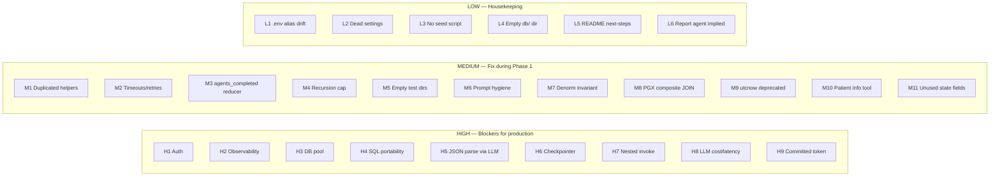

---

## 23. Migration Plan

Four phases. Each phase has explicit acceptance criteria and separates *required migration work* from *optional improvements* from *future enhancements*.

### 23.1 Phase 0 — Repository Understanding *(current, this report)*

**Objective:** produce a code-grounded, evidence-linked architecture discovery report. Result: this document. Done.

**Acceptance criteria:**

- Every agent, tool, prompt, table analysed with file:line evidence.
- Migration risks ranked and rationalised.
- No migration code produced.

### 23.2 Phase 1 — Platform Migration *(faithful replication on the Microsoft stack)*

**Objective:** the LangGraph prototype's business behaviour reproduced 1:1 on Microsoft Agent Framework + Azure AI Foundry + PostgreSQL + APIM (Compass), with all clinical-grade concerns addressed to a production-viable baseline.

**Scope — required migration work:**

| Workstream | Deliverable | Success criterion |
|---|---|---|
| **1. State schemas port** | Every Pydantic/TypedDict state class ported to MAF shared-state models with the same field set. | Field-parity diff = 0 vs source. |
| **2. Prompts port** | All 7 system prompts copied verbatim into MAF agent instructions. Duplicated rule 6 in `MAIN_AGENT_SYSTEM` corrected. | Prompt text-diff = 0 (except the fix). |
| **3. Tools port** | 14 tools ported to MAF `ai_function` with identical signatures and semantics. `?`→`%s` placeholder translation. `LIST(DISTINCT)` → `array_agg(DISTINCT)`. DuckDB `JSON` → Postgres `jsonb`. | Every specialist integration test passes against a seeded PostgreSQL. |
| **4. DB migration** | Schema ported to PostgreSQL. Composite PKs, CHECK constraints, FKs, indexes preserved. Seeder script (SQL + CSV) reproducing the synthetic dataset. | Seeded Postgres passes every existing integration test after tool re-wiring. |
| **5. Connection pool** | Shared connection pool (e.g. `asyncpg` pool or `psycopg` pool) injected once per specialist tools module via the existing `QueryExecutor` seam. | Pool size verified against expected concurrency; no per-call `connect()` remains. |
| **6. Deterministic JSON parse** | `annotations_json` parsed in Python before the extraction LLM sees it. LLM receives structured fields, not a JSON blob. | Any variant with malformed JSON raises a specific typed error; no silent LLM hallucination. |
| **7. LLM wiring — APIM/Compass** | `config/llm.py`'s `get_llm` factory replaced with a MAF `ChatClient` factory pointing at APIM. `AGENT_LLM_CONFIGS` reshaped to Compass model IDs. `temperature=0.0` preserved. | Any of the 7 tests runs successfully against the APIM endpoint. |
| **8. Explicit checkpointer** | Thread state persisted (Cosmos/Postgres/Redis — TBD in LLD). Chat's `.compile(checkpointer=...)` and main's `.compile(checkpointer=...)` explicit. | Multi-turn chat test (`agents/chat/tests/test_chat_agent.py`) passes without a dev server. |
| **9. Nested-invoke refactor** | Chat → main becomes a proper sub-workflow, not a `.invoke()` call. | Streaming events from main are visible to the chat layer. |
| **10. Auth layer** | Entra ID (JWT bearer) on the entry point. `clinician_id` populated from the token. RBAC decision to attach to `patient_id` access. Consent check hook wired in. | End-to-end test with a valid token succeeds; test with invalid/expired token rejected before graph invocation. |
| **11. Observability** | App Insights + Log Analytics wired. OTEL traces on every LLM call and every tool call. Structured request/response logging with correlation IDs. Warnings from `VariantCoreAnnotations` land in App Insights. | A single query produces a distributed trace showing chat → main → each specialist → each tool → each DB call. |
| **12. Retries + timeouts** | LLM client and DB client configured with sane defaults (LLM: 3 retries, 30s timeout; DB: 5s connect, 30s statement). Circuit breaker on Compass endpoint. | Fault-injection test (drop the Compass endpoint) fails gracefully. |
| **13. `.env.example` hygiene** | Committed real-looking LangSmith token verified with LangSmith and rotated. `.env.example` reconciled with `Settings`. Dead `MAX_RETRIES` / `LOG_LEVEL` either wired or removed. | Onboarding a new developer needs only `.env.example` + `README.md`. |
| **14. Shared helpers extraction** | `_extract_tool_executions`, `_parse_tool_output`, `_attach_provenance` moved into `agents/shared/graph_helpers.py`. All 5 specialists import from there. | Byte-diff between specialists' graph files drops to domain-specific content only. |
| **15. Recursion cap on main router** | Explicit iteration cap = `2 × 5 + 2 = 12` on the main workflow. | Injected router-loop test terminates cleanly on cap breach. |
| **16. IaC (Bicep)** | Foundry, APIM, PostgreSQL, App Insights, Log Analytics, Key Vault, Entra registration, Container Apps deployed via Bicep in a UAE region. | `bicep build` succeeds; deployment brings up a running instance. |

**Scope — deliberately excluded from Phase 1 (customer mandate: "nothing more, nothing less"):**

- Parallel specialist dispatch
- A2A communication
- MCP server / MCP client integration
- Ontology subagent
- Evaluation / corrective-loop node
- Patient demographics tool (unless customer confirms it was expected)
- Streaming UI beyond what MAF gives for free
- Multi-patient / cohort scenarios

**Phase 1 acceptance criteria:**

1. Every existing integration test passes against the migrated stack.
2. The 3-turn chat test (`test_chat_agent.py`) passes end-to-end via the auth-gated HTTP entry point.
3. All 24 items in this section have a green-tick or a documented waiver.
4. Broad-query LLM call count and latency measured against Compass; report captured for capacity planning.
5. Application Insights shows: trace-per-query, span-per-tool-call, PII-safe logging (no `search_context_notes` in traces).

### 23.3 Phase 2 — Validation

**Objective:** define and execute an evaluation framework that the customer can use to sign off the MVP.

**Deliverables:**

1. **Golden question set** — the customer's example evaluation questions (see discovery doc §5.2) plus a clinician-verified expected answer for each.
2. **Tool-call correctness harness** — for each golden question, assert the expected sequence of tool calls and DB queries. Automated. Target: **100%** (per customer prerequisite §5, item 3).
3. **Interpretation-quality rubric** — clinician-reviewed. Categories: factually grounded, provenance-correct, appropriately qualified, no fabrications. Sampled quarterly during pilot.
4. **Latency and cost sizing** — per-query LLM call count, wall-clock, and APIM cost measured across the golden set. Compared against SLOs (SLO targets to be defined jointly with BIX).
5. **Fault tolerance** — behaviour under Compass 429 / 500, DB timeout, malformed `annotations_json`, empty result sets. Documented.
6. **Data-quality checks** — CI test that verifies `patient_prs.disease_name` denormalisation matches `prs_annotations.disease_name` on the seeded synthetic DB.

**Phase 2 acceptance criteria:**

- Golden test suite passes at 100% tool-call correctness.
- Clinician review returns "acceptable" on ≥ 95% of golden interpretations.
- Latency and cost sizing signed off by architecture review.
- No P0/P1 defects open.

### 23.4 Phase 3 — Optional Enhancements

**Objective:** deliver improvements that are net-positive after Phase 1 stabilises. Each is independently prioritised by BIX + Factory.

Ranked (my recommendation) by ROI:

| # | Enhancement | Business value | Effort | Section reference |
|---|---|---|---|---|
| 3.1 | **Deterministic `annotations_json` Python parse** (already scheduled as H5 remediation, but should be reinforced by tests) | Clinical safety — removes silent-hallucination risk | Small | §16, §22 |
| 3.2 | **Parallel specialist dispatch (LangGraph `Send` / MAF fan-out)** | ~4× latency for broad queries | Medium | §18.1 |
| 3.3 | **Ontology subagent — canonical `disease_name` resolution** | Cross-domain match rate up; fewer missed matches when the same condition is named differently in different tables | Medium | README next-steps; §14 |
| 3.4 | **Patient demographics tool + `patients` reader** | Fills a customer-listed capability gap (§6.7, §22 M10) | Small | §6.7 |
| 3.5 | **Evaluation / corrective-loop node in the orchestrator** | Improves robustness on ambiguous or partial results (README next-steps) | Medium | README:263-273 |
| 3.6 | **MCP surface** — expose the 14 tools as MCP Tools; consume via MCP client | Enables M42's own MCP-server integration; standardises the tool boundary | Medium | §20 |
| 3.7 | **Streaming progress events** ("running prs_agent…") | Clinician UX | Small–Medium | §16 (weakness #3) |
| 3.8 | **Duration/latency capture on `ToolExecution`** | Observability parity | Small | §16 (weakness #23) |
| 3.9 | **Report agent** (implied by `tests/show_report_agent_input.py`) | Whole-record clinical report output | Medium | §3.4 |

### 23.5 Phase separation summary

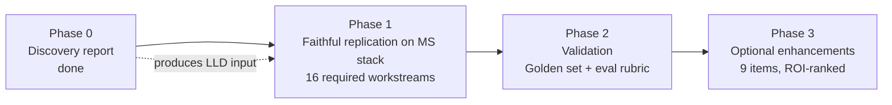

---

## 24. Final Recommendations

If I were the Technical Lead, this is what I would preserve, what I would redesign, and what I would postpone.

### 24.1 Preserve — architectural DNA to keep unchanged

1. **The 5-specialist architecture.** Domain-partitioned agents backed by domain-partitioned tables is the load-bearing decision of this system. It gives isolation, testability, and a clear ownership boundary. **Preserve as-is.**

2. **The 3-tool contract per domain (`explore → search → get`).** This is the most valuable convention in the codebase. It maps cleanly to SQL, to MCP, and to any future architecture. Prompt-enforced today; consider strengthening in Phase 3 to code-enforced. **Preserve.**

3. **Provenance-first design (`DBProvenance`).** Non-negotiable for a clinical decision-support system. Every fact traceable to its source row. **Preserve and extend** — add trace/span IDs so provenance is also cross-referenceable with distributed traces.

4. **Two-schema privacy split for family history.** Type-level encoding of PHI-minimisation. Consider generalising this pattern (public vs internal schema) as the default for any future specialist. **Preserve.**

5. **Controlled-vocabulary ownership boundary.** Owning only what won't drift (`AGENT_STATUSES`, `RISK_BANDS`) and deferring to upstream sources with soft warnings is a mature design. **Preserve.**

6. **All seven system prompts, verbatim.** Phase 1 is faithful replication. The one fix is the duplicated rule 6 in `MAIN_AGENT_SYSTEM`. **Preserve.**

7. **The `QueryExecutor` seam.** The single most portable design decision. **Preserve** and use it as the exact seam for the PostgreSQL migration.

8. **Centralised `config/llm.py` + `config/settings.py`.** Minimal, well-scoped, easy to audit. **Preserve** and extend to include APIM endpoint and per-model timeout/retry settings.

9. **Uniform specialist folder shape.** `graph/`, `models/`, `prompts/`, `state/`, `tools/`, `tests/`. Enforce this convention as a repo-wide standard for any new specialist. **Preserve.**

10. **Read-only DB access at the connection level.** Structural guarantee that the system cannot mutate the source of truth. **Preserve** by wiring PostgreSQL with a read-only role for the specialist tools.

### 24.2 Redesign — fix during Phase 1

1. **Duplicated helper functions across specialists.** Extract `_extract_tool_executions`, `_parse_tool_output`, `_attach_provenance` to `agents/shared/graph_helpers.py`. **Redesign.**

2. **`annotations_json` LLM parsing.** Deterministic Python parse before the extraction LLM sees the variants. Feed the LLM already-decomposed fields. Removes silent-hallucination risk. **Redesign.**

3. **Nested `main_graph.invoke()`.** Refactor to a MAF sub-workflow with proper streaming and checkpointing composition. **Redesign.**

4. **No auth, no observability, no connection pool, no timeouts, no retries.** All net-new work in Phase 1 — see workstreams 5, 10, 11, 12 in §23.2. **Redesign to production-viable baselines.**

5. **Checkpointer.** Must be explicit in code, backed by a persistent store. Not dependent on `langgraph dev` behaviour. **Redesign.**

6. **Duplicated rule #6 in `MAIN_AGENT_SYSTEM`.** Trivial prompt cleanup. **Redesign.**

7. **`.env.example` hygiene.** Rotate the committed LangSmith key (or verify with LangSmith it's expired). Reconcile alias drift. Remove or wire the unused `MAX_RETRIES` / `LOG_LEVEL` settings. **Redesign.**

8. **`agents_completed` reducer.** Add a list-append reducer at the MAF shared-state level so append-and-return isn't a hidden contract. **Redesign.**

9. **Recursion cap on main router.** Explicit iteration budget. **Redesign.**

10. **SQL portability.** `?` → `%s`, `LIST(DISTINCT)` → `array_agg(DISTINCT)`, DuckDB `JSON` → `jsonb`. Verified per-tool. **Redesign.**

### 24.3 Postpone — not required for Phase 1

The customer's mandate ("replicate the existing M42 prototype. Nothing more, nothing less.") is the strongest possible directive to not scope-creep Phase 1. Postpone to Phase 3:

1. **Parallel specialist dispatch.** High-value but needs a stable PostgreSQL pool and verified APIM budget first. §18.1.
2. **A2A communication.** Not required; may actively degrade the architecture. §19.
3. **MCP tool surface.** Worthwhile long-term but not required. Depends on M42's parallel MCP work. §20.
4. **Ontology subagent.** Improves cross-domain matching but doesn't unblock the MVP. §23.4.
5. **Evaluation / corrective-loop node.** Improves robustness on partial results but is a new capability, not a replication. §23.4.
6. **Patient demographics tool.** Confirm with customer whether this was in scope. If yes, elevate to Phase 1; if no, Phase 3. §6.7, §22 M10.
7. **Report agent** (implied by `tests/show_report_agent_input.py`). Confirm scope; likely Phase 3. §3.4.
8. **Streaming progress events.** Nice UX; Phase 3. §16.
9. **`duration_ms` on `ToolExecution`.** Observability parity; Phase 3. §16.

### 24.4 The three architectural questions the LLD must resolve

Before Phase 1 kickoff, three architectural questions still need customer alignment (each was flagged in the discovery doc):

1. **Hosting model — DB on Microsoft subscription or M42 subscription?** Determines whether the PostgreSQL port targets a Microsoft-managed instance or an M42-managed one. Impacts the auth/network topology (private endpoint vs public + APIM egress).
2. **MCP integration timing — is M42's MCP server available in time for Phase 1?** If yes, wire specialists as MCP clients from Phase 1. If no, wire in-process for Phase 1 and MCP in Phase 3.
3. **Compass model catalogue — which Compass-hosted models correspond to `gpt-4.1` and `gpt-5.1`?** Determines what `AGENT_LLM_CONFIGS` becomes on migration. `chat` uses a stronger model than the specialists — that per-agent stratification should be preserved.

### 24.5 The single most important thing to get right

**Preserve the DB seam.** Every other property of this codebase falls out of the fact that tools call a `QueryExecutor` callable that is trivial to inject. If Phase 1 respects that seam and swaps DuckDB for a pooled PostgreSQL executor at the same location, every other migration workstream can proceed independently and in parallel.

If Phase 1 accidentally reshapes the tools to embed a `psycopg` connection directly, the seam is lost — and every future migration (PostgreSQL → managed Postgres → Cosmos DB → MCP server) becomes exponentially harder.

---

## Appendix A — Verified file references index

Every non-obvious claim in this report is backed by one of the following files. This appendix indexes the code touch-points a reviewer can inspect to independently verify any observation.

| Area | Files |
|---|---|
| Chat graph | `agents/chat/graph/graph.py`, `agents/chat/state/state.py`, `agents/chat/prompts/prompt.py`, `agents/chat/models/model.py` |
| Main graph | `agents/main/graph/graph.py`, `agents/main/state/state.py`, `agents/main/prompts/prompt.py`, `agents/main/models/model.py` |
| PRS specialist | `agents/prs/{graph,tools,prompts,state,models,tests}/…` |
| Genomic variants specialist | `agents/genomic_variants/{graph,tools,prompts,state,models,tests}/…` |
| Family history specialist | `agents/family_history/{graph,tools,prompts,state,models,tests}/…` |
| PGX specialist | `agents/pgx/{graph,tools,prompts,state,models,tests}/…` |
| Phenotype specialist | `agents/phenotype/{graph,tools,prompts,state,models,tests}/…` |
| Shared cross-cutting | `agents/shared/state/provenance.py`, `agents/shared/state/tool_execution.py`, `agents/shared/state/vocabularies.py` |
| Config | `config/llm.py`, `config/settings.py` |
| Data | `test_data/schema.sql`, `test_data/clinical_genetics.duckdb` |
| Integration test scaffolds | `tests/show_report_agent_input.py`, `agents/*/tests/test_*_agent.py` |
| Registry & deps | `langgraph.json`, `requirements.txt`, `.env.example` |
| Handover context | `README.md`, `egp-window-agent-discovery.md` |

---

## Appendix B — Verified inventory

- **7 agents**: chat, main, prs, genomic_variants, family_history, pgx, phenotype
- **14 tools**: `explore_patient_*` × 5, `search_*_annotations` × 4 (phenotype has none), `get_patient_*` × 4 + `get_patient_diagnoses` (phenotype)
- **10 DB tables**: patients, diagnoses, prs_annotations, patient_prs, variant_annotations, patient_variants, patient_pgx_status, pgx_annotations, patient_kinship_history, kinship_history_annotations
- **7 module-level system prompts** + 5 domain extraction-instruction HumanMessages (dynamically constructed)
- **1 DuckDB file**, seeded with synthetic data across all 5 domains
- **2 registered LangGraph graphs** (`chat`, `main`)

---

**End of Architecture Discovery Report.**

*This report is grounded in a first-hand read of every source file in the repository as of 2026-07-08. Where any downstream document contradicts a claim here, the corresponding source file should be re-verified before accepting the contradiction.*

<!-- END OF REPORT -->
