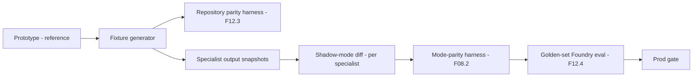
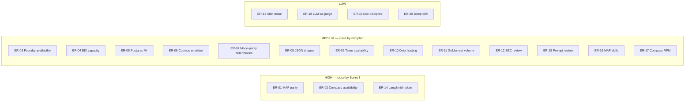

# EGP Window — Engineering Implementation Plan (Phase 1)

**Repository:** `m42-egp-genomics-agent`
**Prepared as:** Delivery Lead & Technical Lead
**Companion documents:** [architecture-discovery-report.md](architecture-discovery-report.md) · [solution-design-package.md](solution-design-package.md) (both treated as baseline; no further architectural changes in this plan)
**Refinements incorporated:**
  1. **Cosmos DB** is confirmed as the standard conversation state store (aligned to the Landing Zone GenAI platform standards).
  2. **Parallel specialist execution is a Phase 1 capability**, controlled by a configuration/feature flag. Sequential and parallel modes must produce identical business behaviour. The flag may remain off until performance validation is complete, but the plumbing is built and tested from day one.
**Scope:** Execution plan for Phase 1 (faithful replication on Microsoft stack). No production code below — this is the work-breakdown, sequencing, ownership, tests, and roadmap.
**Estimating unit:** T-shirt sizes (XS / S / M / L / XL) at Epic / Feature; story points (1 / 2 / 3 / 5 / 8) at Story.
**Team topology (assumed, ref. Design §29.5):** 1 Lead SA, 2 backend engineers (BE1, BE2), 1 platform engineer (PE), 1 data engineer (DE), 1 QA engineer, part-time BIX SME + Security reviewer.
**Date:** 2026-07-08

---

## Table of Contents

1. [Executive Summary](#1-executive-summary)
2. [Refinements Confirmed & Their Impact on the Plan](#2-refinements-confirmed--their-impact-on-the-plan)
3. [Team Topology, Ownership & Cadence](#3-team-topology-ownership--cadence)
4. [Work Breakdown Structure (WBS) — Epics, Features, Stories, Tasks](#4-work-breakdown-structure-wbs--epics-features-stories-tasks)
   - [E01. Foundations](#e01-foundations)
   - [E02. Clinical Data Layer](#e02-clinical-data-layer)
   - [E03. Repository & Service Layer](#e03-repository--service-layer)
   - [E04. Prompt Catalog & LLM Integration](#e04-prompt-catalog--llm-integration)
   - [E05. Session & Thread State](#e05-session--thread-state)
   - [E06. MAF Workflow Skeleton](#e06-maf-workflow-skeleton)
   - [E07. Specialist Agents](#e07-specialist-agents)
   - [E08. Parallel Execution Capability](#e08-parallel-execution-capability)
   - [E09. Authentication, Authorization & Clinician Context](#e09-authentication-authorization--clinician-context)
   - [E10. Observability](#e10-observability)
   - [E11. Resilience, Error Handling & Retries](#e11-resilience-error-handling--retries)
   - [E12. Testing & Evaluation](#e12-testing--evaluation)
   - [E13. Cutover, Release, Dashboards & Runbooks](#e13-cutover-release-dashboards--runbooks)
5. [Critical Path Analysis](#5-critical-path-analysis)
6. [Parallelization Plan](#6-parallelization-plan)
7. [Incremental Migration & Continuous Validation Against LangGraph](#7-incremental-migration--continuous-validation-against-langgraph)
8. [Sprint Roadmap (Phase 1)](#8-sprint-roadmap-phase-1)
9. [Execution Risks](#9-execution-risks)
10. [Appendix A — Feature Index](#appendix-a--feature-index)
11. [Appendix B — Definition of Done](#appendix-b--definition-of-done)

---

## 1. Executive Summary

### 1.1 What this plan delivers

An 8-sprint execution plan that carries the team from an empty target environment to a Phase-1 pilot-ready deployment of EGP Window on Microsoft Agent Framework + Azure. The plan preserves the LangGraph prototype's business behaviour verbatim while replacing every substrate layer (framework, DB, hosting, model provider, auth, observability).

### 1.2 Shape of the work

Thirteen epics, roughly forty features, ~120 stories. Two chains constrain the schedule and must complete in order (critical path); most other epics can run in parallel among team members.

### 1.3 Delivery approach

- **Behaviour-preservation-first.** Every merge is gated by a shadow-mode diff against the LangGraph prototype using a shared golden question set. If outputs diverge, the merge is blocked.
- **Repository seam first.** The load-bearing porting seam identified in the discovery report is built in Sprint 2. Everything downstream depends on it.
- **Parallel fan-out as a first-class capability from Day 1.** Reducers, dispatch-set decision types, and fan-out edges are built and unit-tested even while the runtime flag is disabled. Sequential and parallel modes are proven equivalent by a specific class of tests.
- **Trunk-based with feature flags.** No long-lived migration branches. Behaviour toggles are configurations, not build variants.

### 1.4 Phase 1 exit criteria (summary — full detail in §8)

- All prototype integration tests pass against the new stack.
- Golden question suite passes at 100% tool-call correctness.
- Both dispatch modes (sequential, parallel) produce identical outputs for the golden set.
- Production stack deployed, dashboards live, runbooks published, LLD sign-off received.

---

## 2. Refinements Confirmed & Their Impact on the Plan

### 2.1 Cosmos DB as conversation state store

Adopted verbatim. This aligns with the design's ADR-010. No plan changes needed; E05 continues as previously scoped.

### 2.2 Parallel specialist execution as a Phase 1 capability

Design impact — **feature moves from Phase 3 into Phase 1 build**, but the runtime flag stays configurable:

| Aspect | Effect on this plan |
|---|---|
| Router decision type | `SpecialistDispatchSet` is the Phase 1 target (not `RouterDecision → single specialist`). Includes a `mode: sequential\|parallel` field. |
| Reducers | `agents_completed` list-append reducer is not just a safety net — it is exercised in Phase 1 tests under fan-out. |
| Workflow edges | Fan-out and fan-in edges are Phase 1 code paths (feature `E08.1`). |
| Prompt | `MAIN_AGENT_SYSTEM v1.0.0` published to Foundry supports both modes. In `SEQUENTIAL_ONLY=true` mode the prompt is instructed to return `|set|=1`. |
| Configuration | Two flags: `ORCH_DISPATCH_MODE` (`sequential` \| `parallel`) and `ORCH_MAX_FANOUT_WIDTH` (default 1 in prod pilot, up to 5). |
| Behavioural equivalence | Golden-set tests run in **both modes** and compare outputs (structural equality) — proves the flag does not change business behaviour. |
| Enablement gate | Design §16.8 checklist becomes part of the Phase 1 exit criteria. Passing it is required to *enable* the flag; not required to *ship* the code. |

### 2.3 Net effect on scope, sequence, and ownership

- New feature epic `E08. Parallel Execution Capability` fully in-scope for Phase 1.
- `E06` (workflow skeleton) needs to bake in the fan-out edge from the start.
- `E12` (testing) gains a "mode-parity" test class.
- Ownership: BE1 owns E08 in parallel with E06; both stabilise together in Sprint 5.

### 2.4 What we do NOT re-open

Per the mission's guardrail: no further architecture redesign. Any request to revisit an ADR is triaged as a defect (if evidence of a regression) or a Phase 3 candidate (if a new capability).

---

## 3. Team Topology, Ownership & Cadence

### 3.1 Team roster (reference §29.5 of Design)

| ID | Role | Primary areas |
|---|---|---|
| SA | Lead Solution Architect | Design custody, reviews, LLD updates, auth design, evaluations |
| BE1 | Senior Backend Engineer | E06 Workflow, E08 Parallel, E11 Resilience |
| BE2 | Backend Engineer | E03 Repositories, E04 LLM/Prompts, E07 Specialists |
| PE | Platform Engineer | E01 Foundations/IaC, E10 Obs infra, E13 Release |
| DE | Data Engineer | E02 Data, E12 Test data, ingest scripts |
| QA | Test Engineer | E12 Test framework, load tests, chaos, PHI CI |
| BIX | Part-time SME | Prompt review, golden set, clinical acceptance |
| SEC | Part-time Security | E09 Auth review, PHI checks, secrets |

### 3.2 Cadence

- **Sprint cadence:** two-week iterations. Numbered `Sprint 1..8`. The plan does not depend on any wall-clock date — the numbering is the schedule.
- **Standup:** daily 15-min; async-first via Teams thread.
- **Design reviews:** every Wed with SA on the queue. Any change to shared contracts (state schemas, prompts, workflow edges) requires SA approval before merge.
- **Sprint review + retro:** end of every sprint. Golden-set metrics reviewed.
- **Change control on prompts:** BIX approves every Foundry-Catalog version bump.
- **Change control on infra:** PE + SA approve every Bicep merge.

### 3.3 Definition of Done (baseline; expanded in Appendix B)

- Merged behind a green CI pipeline.
- Unit + integration tests present with ≥ 80% coverage on any touched file.
- Golden-set (where applicable) passes in both dispatch modes.
- No new PHI attribute names appear in emitted logs/spans (CI check).
- Documentation updated where the change affects a public contract.

### 3.4 Working agreements

- **No merges without a code review from someone in a different epic.**
- **No prompt or state-schema changes without SA sign-off.**
- **No feature flag defaults changed without a docs update.**
- **All secrets via Key Vault refs; no secrets in code or Bicep parameters.**
- **Every PR touching SQL includes the exact `EXPLAIN` output in the PR description.**

---

## 4. Work Breakdown Structure (WBS) — Epics, Features, Stories, Tasks

### Notation

Work item IDs follow `E<epic>.F<feature>.S<story>.T<task>`. Complexity is T-shirt for Epic/Feature; story points for Stories. "Order" is a global integer indicating suggested implementation order across the whole programme (Section 5 explains how these serialise onto the critical path).

Every Feature carries the standard fields required by the mission:

- **Objective, Scope, Dependencies, Files/modules affected, Acceptance Criteria, Unit tests, Integration tests, Risks, Complexity, Order.**

Where a Story adds no material information beyond the Feature, it is enumerated with its acceptance summary only.

---

### E01. Foundations

- **Objective:** stand up the Azure Landing Zone footprint and CI/CD needed for any subsequent epic to make progress. Everything else is blocked without this.
- **Scope:** Bicep IaC modules, `dev` + `preprod` environments deployed end-to-end, GitHub Actions with OIDC federation, ACR, private networking baseline, secrets management. Prod environment deploys in Sprint 8.
- **Owner:** PE (primary), SA (review), Security (auth review of federation).
- **Complexity:** L
- **Order:** 1 (prerequisite for everything).

#### F01.1 — Bicep module baseline

- **Objective:** produce reviewed, versioned Bicep modules for network, ACR, ACA env, ACA app, PostgreSQL Flex, Cosmos, Key Vault, App Insights, Log Analytics, APIM, Front Door + WAF, and identity/RBAC.
- **Scope:** module-per-resource, composed by `main.bicep` per environment. Parameter files for `dev` and `preprod`.
- **Dependencies:** none.
- **Files/modules affected:** `infra/modules/*.bicep`, `infra/env/dev.bicepparam`, `infra/env/preprod.bicepparam`, `infra/main.bicep`, `infra/README.md`.
- **Acceptance criteria:**
  - [ ] `bicep build main.bicep` succeeds without warnings.
  - [ ] `az deployment sub what-if` for both env param files produces no unexpected changes.
  - [ ] `dev` env deployed once end-to-end; every resource reaches "Succeeded" state.
  - [ ] All resources have consistent naming and tagging as per Landing Zone standard.
  - [ ] All data-plane resources are on private endpoints; no public network access.
- **Unit tests:** N/A (IaC). ARM template linter in CI.
- **Integration tests:**
  - `azure/deploy-what-if` job in CI on every PR.
  - Post-deploy smoke: ACA app returns 200 on `/healthz`.
- **Risks:** Landing Zone module versions drift → pin all modules to specific tags. Private-DNS zones not delegated at the sub level → coordinate with Hari.
- **Complexity:** L
- **Order:** 1

**Stories:**

- **S01.1.1 — Network + private DNS module** [3 pts]. VNet, subnets (ACA delegated + PE subnet), NSGs, private DNS zones for Postgres/Cosmos/KV. AC: private-endpoint DNS resolves from ACA.
- **S01.1.2 — Data resource modules** [5 pts]. Postgres Flex (with PGVector disabled), Cosmos NoSQL account + session container, Key Vault. AC: PE connectivity verified.
- **S01.1.3 — Compute modules** [3 pts]. ACR (premium), ACA environment (VNet-integrated), ACA app placeholder, ACA migration job. AC: placeholder returns 200.
- **S01.1.4 — Ingress modules** [3 pts]. Front Door + WAF, APIM (Developer for dev, Standard v2 for preprod), Compass backend policy skeleton. AC: request routes reach the placeholder app.
- **S01.1.5 — Observability modules** [2 pts]. LAW, App Insights workspace-based, Diagnostic Settings across data + compute resources. AC: logs arrive in LAW.
- **S01.1.6 — Identity + RBAC module** [2 pts]. User-assigned MI for app; RBAC bindings to Postgres/Cosmos/KV; Entra app registration skeleton. AC: MI can read Key Vault secret in a smoke test.

**Tasks (representative, not exhaustive):**

- [ ] Adopt Landing Zone naming policy tokens.
- [ ] Bicep lint check to CI.
- [ ] What-if job in PR check.
- [ ] Tag policy validated by Azure Policy compliance.
- [ ] Deploy `dev` from a manual GH Actions run; capture outputs.

#### F01.2 — GitHub Actions CI/CD

- **Objective:** provide the four core pipelines (lint, build+test, image build+scan+push, IaC deploy).
- **Scope:** federated OIDC to Azure, no long-lived secrets. Artifact promotion `dev → preprod → prod` (prod is Sprint 8 only). Reusable workflow YAML.
- **Dependencies:** F01.1 (needs ACR to push).
- **Files/modules affected:** `.github/workflows/*.yaml`, `.github/composite/*` (reusable).
- **Acceptance criteria:**
  - [ ] PR pipeline: lint + unit tests + integration tests (dockerised Postgres) all pass.
  - [ ] Merge-to-main pipeline: builds image, scans, pushes to ACR, deploys `dev`, runs smoke.
  - [ ] Manual dispatch pipeline promotes an image tag to `preprod` and runs the golden set.
  - [ ] Zero secrets in workflow YAML; every Azure step uses `azure/login@v2` with OIDC.
  - [ ] All pipelines produce SBOM (`syft`) and image scan (`trivy` or Defender for DevOps).
- **Unit tests:** shellcheck on scripts; YAML validator.
- **Integration tests:** end-to-end deploy on merge to `main` into `dev`.
- **Risks:** federation trust misconfigured → block early; caller identity assertions logged.
- **Complexity:** M
- **Order:** 2

**Stories:**

- **S01.2.1 — OIDC federation setup** [2 pts]. Entra app + federated credentials for GHA.
- **S01.2.2 — Lint & unit pipeline** [2 pts]. `ruff`, `mypy`, `black --check`, `import-linter`, `pytest -m unit`.
- **S01.2.3 — Image build + scan pipeline** [3 pts]. Multi-stage Dockerfile, `docker buildx`, `trivy`, push to ACR with immutable tag.
- **S01.2.4 — Deploy pipeline** [3 pts]. Bicep what-if → apply → ACA revision update → smoke.
- **S01.2.5 — Environment promotion pipeline** [2 pts]. Manual dispatch to `preprod`; requires green golden-set (from Sprint 7 onward).

#### F01.3 — Secrets management + Key Vault wiring

- **Objective:** every secret is a Key Vault reference; no static secrets in code, container, or Bicep parameters.
- **Scope:** APIM subscription key(s), any Compass client-cert material, Cosmos throughput override, Postgres admin bootstrap (temporary), etc.
- **Dependencies:** F01.1 (KV exists).
- **Files/modules affected:** `infra/modules/keyvault.bicep`, ACA `secretRef` bindings.
- **Acceptance criteria:**
  - [ ] `grep -r "OPENAI_API_KEY=" .` returns no hard-coded values.
  - [ ] ACA app resolves KV refs at startup; a `secret-not-found` produces a clear startup failure.
  - [ ] `LANGSMITH_API_KEY` line in `.env.example` **rotated and scrubbed from history** as a one-time task.
- **Unit tests:** N/A (config).
- **Integration tests:** start ACA app locally with `az cli`-emulated env; app reads secret via MI.
- **Risks:** history scrub is destructive → coordinate with SA + Security; require a maintainer commit + protected branch policy.
- **Complexity:** S
- **Order:** 3

#### F01.4 — Local developer environment

- **Objective:** every engineer can run the full app locally against Postgres + Cosmos emulator + mock APIM within 15 minutes of clone.
- **Scope:** `docker compose` with Postgres, Azurite (for storage if needed), Cosmos emulator, WireMock (for APIM/Compass). `pyproject.toml` with dev extras. `direnv`/`.envrc` template.
- **Dependencies:** F01.1.
- **Files/modules affected:** `dev/compose.yaml`, `dev/wiremock/*`, `pyproject.toml`, `Makefile` targets `make setup`, `make dev`, `make test`.
- **Acceptance criteria:**
  - [ ] `make setup && make test` passes on a clean machine in < 15 minutes.
  - [ ] README's "Setup" section walks a new hire through in under 30 minutes.
- **Unit tests:** N/A.
- **Integration tests:** CI runs a subset with the same compose stack.
- **Risks:** OS-specific issues (Windows/macOS/Linux) → require Devcontainer as a fallback.
- **Complexity:** M
- **Order:** 4

---

### E02. Clinical Data Layer

- **Objective:** produce a production-ready PostgreSQL representation of the current DuckDB clinical genomics schema, with seed data and a reproducible migration mechanism.
- **Scope:** schema port, index & constraint parity, seed dataset generated from the current DuckDB snapshot, Alembic baseline + migration workflow, connection pool bootstrap.
- **Owner:** DE (primary), BE2 (integration), SA (review).
- **Complexity:** L
- **Order:** 5 (immediate follow-on from E01).

#### F02.1 — Schema port

- **Objective:** faithful port of `test_data/schema.sql` (10 tables, all CHECK, FK, index, PK constraints) to PostgreSQL 16 with idiomatic replacements documented in Design §11.2.
- **Scope:** ordered DDL scripts; no data.
- **Dependencies:** F01.1.
- **Files/modules affected:** `db/schema/V001__baseline.sql`, `db/README.md`.
- **Acceptance criteria:**
  - [ ] Every table from `test_data/schema.sql` exists with same columns and constraints.
  - [ ] Enums preserved as `VARCHAR + CHECK IN (...)` (Design §11.3).
  - [ ] `annotations_json` typed `jsonb`.
  - [ ] Every index present.
  - [ ] `pg_dump -s` diff between test envs is empty.
- **Unit tests:** SQLFluff lint; DDL parses in a temp Postgres container.
- **Integration tests:** apply to a temp Postgres and run `SELECT count(*) FROM patient_prs;` — schema queryable.
- **Risks:** DuckDB `LIST` types / `JSON` semantics may vary in edge cases → captured in F02.4 test corpus.
- **Complexity:** M
- **Order:** 5

#### F02.2 — Seed data export from DuckDB

- **Objective:** deterministic seed for CI and dev envs derived from the existing seeded DuckDB.
- **Scope:** Python script exports every table to CSV / JSON preserving foreign-key order; `psql \copy`-compatible.
- **Dependencies:** F02.1.
- **Files/modules affected:** `db/seed/export_from_duckdb.py`, `db/seed/data/*.csv`, `db/seed/load.sql`.
- **Acceptance criteria:**
  - [ ] Row counts in Postgres match DuckDB for every table.
  - [ ] `patient_prs.disease_name` == `prs_annotations.disease_name` on every join (data-quality invariant per Discovery §22 M7).
  - [ ] `annotations_json` values round-trip byte-equal.
- **Unit tests:** export script tested on a fixture DuckDB with 5 patients.
- **Integration tests:** CI seeds Postgres from CSVs and asserts row counts + invariants.
- **Risks:** float precision on `prs_score` — use `NUMERIC` or accept float rounding tolerance documented.
- **Complexity:** M
- **Order:** 6

#### F02.3 — Alembic migration mechanism

- **Objective:** hand-written revisions, baseline captured, downgrade paths documented.
- **Scope:** Alembic env, revision numbering policy, migration container job.
- **Dependencies:** F02.1, F01.1 (ACA migration job resource).
- **Files/modules affected:** `db/alembic/*`, `docs/data/migrations.md`.
- **Acceptance criteria:**
  - [ ] Baseline revision reproduces F02.1 exactly.
  - [ ] `alembic upgrade head` runs against a fresh Postgres.
  - [ ] `alembic downgrade base` cleanly removes everything.
  - [ ] CI runs migration on every PR.
- **Unit tests:** Alembic env test that lists revisions.
- **Integration tests:** deploy migration job to `dev` and confirm schema equality with expected DDL.
- **Risks:** two-role separation (`egp_migrator` vs `egp_agent_ro`) — must be created before Alembic runs.
- **Complexity:** M
- **Order:** 7

#### F02.4 — Connection pool + role setup

- **Objective:** `psycopg 3` async pool sized per Design §11.4, plus Postgres roles.
- **Scope:** `AsyncConnectionPool` singleton wired to DI; `egp_agent_ro` / `egp_migrator` roles bootstrap; Entra ID auth to Postgres via MI.
- **Dependencies:** F02.1, F02.3, F01.1.
- **Files/modules affected:** `src/infrastructure/db_pool.py`, `src/services/repositories/base.py`, `db/bootstrap/roles.sql`.
- **Acceptance criteria:**
  - [ ] Pool opens `min_size` connections at startup within 3s.
  - [ ] Pool `max_size` respects the formula `concurrent_specialists × request_concurrency_per_replica` (Design §11.4).
  - [ ] Pool exposes `utilisation` gauge for §22 dashboards.
  - [ ] MI (managed identity) auth end-to-end: no static Postgres password in prod.
- **Unit tests:** pool factory returns a singleton; timeout raises typed exception.
- **Integration tests:** 20 concurrent `SELECT 1` calls under a pool of 10; queue behaviour asserted.
- **Risks:** MI token refresh in psycopg → verify with the driver's plugin or a custom `_password` provider.
- **Complexity:** M
- **Order:** 8

#### F02.5 — Data-quality invariant tests

- **Objective:** capture and enforce the denormalisation invariants called out in Discovery §22.
- **Scope:** SQL queries that assert `patient_prs.disease_name = prs_annotations.disease_name for same prs_name`; other cross-domain string invariants.
- **Dependencies:** F02.2.
- **Files/modules affected:** `tests/data/test_invariants.py`.
- **Acceptance criteria:** all invariants pass on the seeded dataset; a violation fails CI.
- **Unit tests:** pytest against a temp Postgres.
- **Integration tests:** run daily in preprod as a scheduled job.
- **Risks:** any future data source not maintaining the invariant → test surfaces it early.
- **Complexity:** S
- **Order:** 9

---

### E03. Repository & Service Layer

- **Objective:** implement the DB-access abstraction (Repositories + Services) that will be consumed by tool shims. This is the load-bearing porting seam identified in Design ADR-005 and ADR-015.
- **Scope:** 5 domain Repositories, 5 thin domain Services, ProvenanceService, AuthzPolicy, base classes, DI wiring. Tools become thin shims over these.
- **Owner:** BE2 (primary), SA (contract review).
- **Complexity:** XL (broken into features).
- **Order:** 10 (starts after F02.4).

#### F03.1 — Base classes and shared services

- **Objective:** the shared types (`IRepository`, `ClinicianContext`, `ProvenanceService`, `AuthzPolicy` allowlist v1) that all Repositories depend on.
- **Scope:** interfaces, base classes, DI container wiring.
- **Dependencies:** F02.4.
- **Files/modules affected:** `src/services/repositories/base.py`, `src/services/provenance.py`, `src/services/authz.py`, `src/state/clinician_context.py`, `src/di/container.py`.
- **Acceptance criteria:**
  - [ ] `IRepository[TQuery, TResult]` interface defined; every method takes `ClinicianContext`.
  - [ ] `ProvenanceService.build(...)` produces `DBProvenance` records; unit-tested.
  - [ ] `AuthzPolicy.can_read(ctx, patient_id)` reads an allowlist from Key Vault (JSON) at startup; hot-reload via a background refresh task.
  - [ ] DI container yields singletons for pool, provenance, authz, LLM factory.
- **Unit tests:**
  - `ProvenanceService` builds a record with the correct `source_table`, `source_row`, `fields_derived`, and preserves `retrieved_at`.
  - `AuthzPolicy` allow/deny cases; unknown patient denied; unknown clinician denied; audit event emitted on denial.
  - DI container returns the same pool instance twice.
- **Integration tests:** repository built on top of `IRepository` can be resolved and `.execute()` returns rows.
- **Risks:** allowlist source of truth uncertainty → SEC to confirm before Sprint 3.
- **Complexity:** M
- **Order:** 10

**Stories:**

- **S03.1.1 — `IRepository` + base class** [3 pts].
- **S03.1.2 — `ProvenanceService`** [3 pts] with tests for construction-time provenance (Design §11.7).
- **S03.1.3 — `AuthzPolicy` allowlist v1** [3 pts] backed by KV JSON, hot-reload.
- **S03.1.4 — DI container** [2 pts] with lifecycles.

#### F03.2 — Domain Repositories (×5)

- **Objective:** one Repository per specialist domain, wrapping the exact 3 (or 2 for phenotype) SQL queries from the prototype, ported to psycopg 3.
- **Scope:** `PRSRepository`, `GenomicVariantsRepository`, `FamilyHistoryRepository`, `PGXRepository`, `PhenotypeRepository`.
- **Dependencies:** F03.1, F02.4.
- **Files/modules affected:** `src/services/repositories/{prs,genomic_variants,family_history,pgx,phenotype}.py`.
- **Acceptance criteria (per Repository):**
  - [ ] Each SQL query matches the prototype semantically; SQL text captured in module docstring.
  - [ ] Every returning row is bundled with a `DBProvenance` record built at construction time (Design §11.7).
  - [ ] `explore_*` never JOINs; `search_*_annotations` touches only annotation tables; `get_patient_*` is the only JOIN tool.
  - [ ] `family_history` Repository returns two projections: `internal` (with privacy fields) and `public` (stripped). Public is the default; internal available only to specialist-scoped audit code.
  - [ ] `AuthzPolicy.can_read(ctx, patient_id)` invoked at method entry.
  - [ ] Row types are Pydantic models mirroring the prototype's `<Domain>Result*` schemas.
- **Unit tests (per Repository):**
  - Query issued matches expected SQL (regex-normalise whitespace).
  - Provenance record has correct `source_table` for each tool.
  - Empty result set returns `[]` (not `None`).
  - Access denied raises `AccessDenied`.
- **Integration tests:**
  - Against a fresh Postgres seeded by F02.2. Every prototype integration-test assertion (e.g. `agents/prs/tests/test_prs_agent.py:110-118`) is replayed at the Repository level.
- **Risks:** subtle SQL semantic differences (ILIKE collation, LIST vs array_agg) → capture in comparison harness (§7.2).
- **Complexity:** L (M per Repository).
- **Order:** 11 – 15 (parallelisable — see §6).

**Stories:**

- **S03.2.1 — PRS Repository** [5 pts]. AC: 3 methods with 3 provenance records; parity with prototype tests.
- **S03.2.2 — Genomic Variants Repository** [5 pts]. Same shape. Deterministic parse of `annotations_json` happens at Repository level (see F03.4).
- **S03.2.3 — Family History Repository** [8 pts]. Adds public/internal projection.
- **S03.2.4 — PGX Repository** [5 pts]. Composite JOIN on `(gene, phenotype)` (Design §11.8).
- **S03.2.5 — Phenotype Repository** [5 pts]. GROUP BY `COALESCE(disease_name, term)`.

#### F03.3 — Domain Services (thin pass-through in Phase 1)

- **Objective:** provide the domain-service layer that specialists call. In Phase 1 most services are pass-throughs to the Repository — the layer exists so Phase 3 additions don't retrofit it.
- **Scope:** 5 `<Domain>Service` classes; each depends on its Repository + `ProvenanceService`.
- **Dependencies:** F03.2.
- **Files/modules affected:** `src/services/domain/{prs,genomic_variants,family_history,pgx,phenotype}.py`.
- **Acceptance criteria:**
  - [ ] Each Service exposes methods matching the 3 (or 2) prototype tools.
  - [ ] Family-history service is the only one that surfaces two projections.
- **Unit tests:** service delegates to repo; mock repo asserts correct call arguments.
- **Integration tests:** covered by F03.2 (same DB).
- **Risks:** none; low-risk layer.
- **Complexity:** S
- **Order:** 16

#### F03.4 — Deterministic `annotations_json` parser

- **Objective:** move JSON decomposition out of the LLM path (Design ADR-006) and into Python before the specialist's structured-extraction call.
- **Scope:** parser producing `VariantSampleData` + `VariantCoreAnnotations` + `VariantExtendedAnnotations`; `raw_annotations` catches unknown fields; unit-tested against every value present in the seed DuckDB `annotations_json` column.
- **Dependencies:** F03.2 (Repository returns raw JSON).
- **Files/modules affected:** `src/services/domain/genomic_variants.py`, `src/state/genomic_variants_models.py`.
- **Acceptance criteria:**
  - [ ] Every seed row produces a valid `VariantExtendedAnnotations` object.
  - [ ] Malformed JSON raises `AnnotationsParseError` (typed).
  - [ ] Unknown keys land in `raw_annotations` (never dropped).
  - [ ] Round-trip test: parse → dump → parse yields identical structure.
- **Unit tests:** parser tested with fixture-based table-driven cases (10+ scenarios).
- **Integration tests:** Repository → parser → structured extraction produces the same top-level fields as the prototype for a known variant.
- **Risks:** unexpected JSON shapes in future seed data → `raw_annotations` catch-all is the safety valve.
- **Complexity:** M
- **Order:** 17

#### F03.5 — Tool shims (`ai_function`s bound to Services)

- **Objective:** produce 14 `ai_function` shims that the MAF `ChatAgent` will bind. Each shim delegates to the appropriate Service and returns `list[dict]` for LLM compatibility.
- **Scope:** one shim module per specialist; docstrings copied from prototype tools (they drive the JSON schema); `ClinicianContext` sourced from workflow shared state.
- **Dependencies:** F03.3, F03.4.
- **Files/modules affected:** `src/agents/{prs,genomic_variants,family_history,pgx,phenotype}/tools/tool_shims.py`.
- **Acceptance criteria:**
  - [ ] JSON schema of each shim matches the prototype tool's inferred schema (`inspect` diff = empty).
  - [ ] Every shim is < 15 LOC (pure delegation).
  - [ ] Docstrings verbatim.
- **Unit tests:** call the shim with mocked Service; verify return shape and Ctx propagation.
- **Integration tests:** end-to-end shim → repo → DB → back.
- **Risks:** `ClinicianContext` propagation from workflow state to shim — captured under F06.
- **Complexity:** S
- **Order:** 18

---

### E04. Prompt Catalog & LLM Integration

- **Objective:** wire APIM ↔ Compass, publish the 7 system prompts to the Foundry Prompt Catalog with a local fallback bundle, and provide a `LlmClient` factory per agent.
- **Scope:** APIM AI-Gateway policy, Compass model routing, `LlmClient`, `PromptService`, per-agent config.
- **Owner:** BE2 (primary), PE (APIM policy), BIX (prompt review), SA (contract review).
- **Complexity:** L
- **Order:** 19 (parallelisable with early E03).

#### F04.1 — APIM AI-Gateway policy skeleton

- **Objective:** Compass reachable through APIM with retry, timeout, and circuit-breaker per Design ADR-022.
- **Scope:** APIM product + subscription; policies for JWT validation (if used at ingress here), rate-limit per-subject, retry/backoff, circuit-breaker, mTLS to Compass (if applicable).
- **Dependencies:** F01.1.
- **Files/modules affected:** `infra/modules/apim.bicep`, `infra/apim/policies/*.xml`.
- **Acceptance criteria:**
  - [ ] `curl` against APIM with a valid key returns a Compass response.
  - [ ] APIM `retry` on `429/5xx` verified with a test upstream that intermittently fails.
  - [ ] Circuit-breaker opens after `n` failures within window; recovers after cool-down.
  - [ ] Per-subject rate limit enforced.
- **Unit tests:** XML linter on policy files; XSLT tests where reasonable.
- **Integration tests:** end-to-end against a WireMock Compass emulator in CI.
- **Risks:** Compass endpoint URL / auth mechanism uncertain until LLD kickoff — placeholder policy with a versioned parameter file.
- **Complexity:** M
- **Order:** 19

#### F04.2 — `LlmClient` factory

- **Objective:** replace `config/llm.py` with a MAF-compatible `LlmClient` factory pointing at APIM.
- **Scope:** `AGENT_LLM_CONFIGS` ported (same shape); per-agent `ChatClient`; base_url = APIM; auth via APIM subscription key from Key Vault.
- **Dependencies:** F04.1, F03.1 (DI container).
- **Files/modules affected:** `src/config/llm.py`, `src/services/llm_client.py`.
- **Acceptance criteria:**
  - [ ] `LlmClient.get(agent_name)` returns a cached client per agent.
  - [ ] `temperature=0.0` on every client.
  - [ ] Model IDs sourced from `AGENT_LLM_CONFIGS`; per-agent model preserved (chat gets the stronger model).
- **Unit tests:** factory returns different clients per agent; caches; raises on unknown agent name.
- **Integration tests:** hit Compass through APIM with a trivial completion; assert 200.
- **Risks:** MAF `ChatClient` structured-output flag (`method="function_calling"`-equivalent) — verify in F06.1.
- **Complexity:** S
- **Order:** 20

#### F04.3 — Prompt Catalog publication + `PromptService`

- **Objective:** 7 system prompts + 5 extraction-instruction templates published to Foundry Prompt Catalog v1.0.0; app fetches on startup with a bundled fallback.
- **Scope:** Foundry Prompt Catalog setup; publication workflow; `PromptService` with fetch + fallback + cache.
- **Dependencies:** F04.1 (Foundry connectivity), F03.1 (DI).
- **Files/modules affected:** `src/services/prompt_service.py`, `src/agents/*/prompts/prompt.py` (bundle), `docs/prompts.lock.json`.
- **Acceptance criteria:**
  - [ ] All 7 system prompts published to Foundry as version `v1.0.0`.
  - [ ] `MAIN_AGENT_SYSTEM v1.0.0` has the duplicated-rule-6 typo fixed.
  - [ ] Local bundle byte-equal to Foundry's `v1.0.0`.
  - [ ] `PromptService.get(name)` tries Foundry (3s timeout), falls back to bundle, emits `prompt.fallback` metric on fallback.
  - [ ] Every prompt fetch cached at startup (no per-turn round-trips).
- **Unit tests:**
  - `PromptService` returns bundled prompt on Foundry unreachable.
  - Version drift beyond tolerance → fallback + warning.
  - Fetch success caches the result.
- **Integration tests:** end-to-end fetch from a real Foundry Catalog (preprod).
- **Risks:** Foundry Catalog availability in the customer's Azure region — confirm at kickoff; fallback bundle mitigates.
- **Complexity:** M
- **Order:** 21

**Stories:**

- **S04.3.1 — Publish prompts to Foundry** [3 pts]. BIX + SA review each prompt in Foundry UI; v1.0.0 pinned.
- **S04.3.2 — `PromptService` implementation** [5 pts].
- **S04.3.3 — Bundle sync tool** [2 pts]. CI job that ensures `docs/prompts.lock.json` bundle sha matches the pinned Foundry version.

---

### E05. Session & Thread State

- **Objective:** Cosmos DB thread state store, MAF checkpointer, session lifecycle (create/load/save/expire).
- **Scope:** `ThreadStateProvider` backed by `azure-cosmos-aio`; Cosmos session container with TTL; MAF checkpointer adapter.
- **Owner:** BE1 (primary), SA (schema review).
- **Complexity:** M
- **Order:** 22 (parallelisable with E04).

#### F05.1 — Cosmos session container + provider

- **Objective:** provisioned Cosmos container with the schema in Design §13.2 and a Python provider that reads/writes `SessionDocument` with ETag concurrency.
- **Scope:** Bicep for the container; provider class with load/save/delete; TTL enforcement.
- **Dependencies:** F01.1 (Cosmos), F03.1 (DI).
- **Files/modules affected:** `infra/modules/cosmos.bicep`, `src/services/thread_state.py`, `src/state/session_document.py`.
- **Acceptance criteria:**
  - [ ] Container `sessions` exists with partition key `/clinician_id`, TTL default 86400s.
  - [ ] `SessionDocument` Pydantic model matches Design §13.2 schema.
  - [ ] `save()` uses ETag; conflict retries once with fresh load.
  - [ ] Round-trip: load nonexistent → returns empty template; save → subsequent load returns the doc.
- **Unit tests:** ETag conflict path; TTL refresh on save; schema version enforced.
- **Integration tests:** Cosmos emulator in Docker; concurrent save conflict handled.
- **Risks:** RU sizing — start with autoscale 400–4000; observed under load in Sprint 7.
- **Complexity:** M
- **Order:** 22

#### F05.2 — MAF checkpointer adapter

- **Objective:** MAF workflow uses `ThreadStateProvider` as its checkpointer.
- **Scope:** adapter class conforming to MAF's checkpointer interface.
- **Dependencies:** F05.1, F06.1 (WorkflowRuntime bootstrap).
- **Files/modules affected:** `src/workflow/checkpointer.py`.
- **Acceptance criteria:**
  - [ ] Chat workflow's `.compile()` receives an explicit checkpointer (no dev-server default).
  - [ ] Turn 1 saves; Turn 2 loads correctly; `agents_completed` persists.
- **Unit tests:** adapter interface conformance test.
- **Integration tests:** 3-turn chat scenario passes across process restarts.
- **Risks:** MAF checkpointer interface parity — verify in F06.1.
- **Complexity:** S
- **Order:** 23

---

### E06. MAF Workflow Skeleton

- **Objective:** the chat workflow + orchestration sub-workflow + fan-out-ready edges, empty of specialists at first, then the specialists are plugged in during E07.
- **Scope:** WorkflowRuntime bootstrap, `chat_router`, `synthesize_response`, orchestration sub-workflow with `orch_router` and fan-out/fan-in edges, `SpecialistDispatchSet` decision type, reducers.
- **Owner:** BE1 (primary), SA (workflow shape review).
- **Complexity:** L
- **Order:** 24.

#### F06.1 — WorkflowRuntime + shared state

- **Objective:** MAF `WorkflowRuntime` initialised at startup; `ChatWorkflowState` and `OrchestrationWorkflowState` Pydantic models with reducers.
- **Scope:** shared-state models; list-append reducer for `agents_completed` (ADR-009); overwrite reducers for domain slots; `Remove` sentinel for cache invalidation.
- **Dependencies:** F03.1 (DI), F05.2 (checkpointer).
- **Files/modules affected:** `src/workflow/runtime.py`, `src/workflow/state/*.py`.
- **Acceptance criteria:**
  - [ ] Runtime constructed once at startup.
  - [ ] Shared-state models mirror prototype `ChatAgentState` + `OrchestrationAgentState` field-for-field.
  - [ ] `agents_completed` reducer: append idempotent (set semantics); `Remove(name)` removes.
- **Unit tests:** reducer table-driven cases; `Remove` sentinel; concurrent appends.
- **Integration tests:** covered by F06.4 + F06.5.
- **Risks:** MAF reducer semantics for concurrent writes — verify by test in fan-out path.
- **Complexity:** M
- **Order:** 24

#### F06.2 — Chat workflow executors

- **Objective:** `chat_router` and `synthesize_response` executors.
- **Scope:** two executors; `ChatRouterDecision` structured output; provenance stripping in synthesis.
- **Dependencies:** F06.1, F04.2 (LlmClient), F04.3 (PromptService).
- **Files/modules affected:** `src/workflow/chat/{chat_router.py,synthesize_response.py}`.
- **Acceptance criteria:**
  - [ ] `chat_router` emits `ChatRouterDecision` with `needs_clinical_data`, `reason`, `reset_agents`.
  - [ ] `reset_agents` triggers `Remove` sentinel on `agents_completed` and nulls the domain slot.
  - [ ] `synthesize_response` strips `provenance` from the LLM view but preserves it on state (recursive stripper unit-tested).
- **Unit tests:** router decision paths (needs / doesn't need / resets); synthesis with 0/1/many domains.
- **Integration tests:** 3-turn scenario (§7.2) passes.
- **Risks:** MAF structured output support for `ChatRouterDecision` — verified in F04.2.
- **Complexity:** M
- **Order:** 25

#### F06.3 — Sub-workflow composition + streaming

- **Objective:** orchestration is a proper MAF sub-workflow invoked from the chat workflow (Design ADR-007). Sub-workflow events propagate to the outer stream.
- **Scope:** sub-workflow definition; event forwarding; graceful failure surfacing.
- **Dependencies:** F06.1.
- **Files/modules affected:** `src/workflow/orchestration/subworkflow.py`, `src/workflow/chat/run_orchestration.py`.
- **Acceptance criteria:**
  - [ ] Chat workflow's `run_orchestration` executor invokes the sub-workflow (not a plain `.invoke`).
  - [ ] Every specialist entry/exit event surfaces to the outer chat workflow's event stream.
  - [ ] Sub-workflow failure surfaces as a `SpecialistFailed` state, not a workflow abort.
- **Unit tests:** event bus fake asserts forwarded event count and types.
- **Integration tests:** end-to-end 3-turn plus event stream assertion.
- **Risks:** MAF sub-workflow parity — R-01 in Design §30 mitigated by this test.
- **Complexity:** M
- **Order:** 26

#### F06.4 — `orch_router` executor + `SpecialistDispatchSet`

- **Objective:** the orchestration router emits `SpecialistDispatchSet` (Phase 1 outputs a singleton set; the type accommodates a multi-set for Phase 3).
- **Scope:** structured output decision type; router prompt binding; `SEQUENTIAL_ONLY` mode toggle.
- **Dependencies:** F06.1, F04.3.
- **Files/modules affected:** `src/workflow/orchestration/router.py`, `src/state/decisions.py`.
- **Acceptance criteria:**
  - [ ] Decision type is `SpecialistDispatchSet(specialists: list[str], mode: str, requested_diseases: list[str]|None)`.
  - [ ] `SEQUENTIAL_ONLY=true` mode enforces `len(specialists) == 1`.
  - [ ] `SEQUENTIAL_ONLY=false` allows sets — validated as legal subset of the 5 specialist names.
  - [ ] Prompt fetched from Foundry Catalog (v1.0.0 fixed rule 6 typo).
  - [ ] Iteration budget = `2 × 5 + 2 = 12` enforced; `RoutingBudgetExceeded` emitted on breach.
- **Unit tests:** decision validation; budget breach; malformed decision falls back to `end`.
- **Integration tests:** covered by F06.5 + E07 end-to-end tests.
- **Risks:** LLM emitting `mode="parallel"` when we want sequential — sanitised in the reducer; typed error surfaced.
- **Complexity:** M
- **Order:** 27

#### F06.5 — Fan-out / fan-in edges

- **Objective:** the orchestration sub-workflow's dispatch is fan-out capable from day one.
- **Scope:** conditional edge splits per specialist in `dispatch_set`; fan-in edge waits for all; reducers commutative-safe.
- **Dependencies:** F06.4, F06.1.
- **Files/modules affected:** `src/workflow/orchestration/edges.py`.
- **Acceptance criteria:**
  - [ ] With `|set|=1`, behaviour is identical to sequential dispatch.
  - [ ] With `|set|=n>1`, all n specialists execute concurrently; fan-in edge waits for all before re-entering `orch_router`.
  - [ ] Reducer applied deterministically regardless of specialist completion order.
- **Unit tests:** edge partition function correctness; fan-in wait for a fake slow specialist.
- **Integration tests:** run under both modes with a controlled specialist set and verify identical final state (E08 covers business-behaviour parity).
- **Risks:** MAF fan-out primitives parity — build a spike in Sprint 4 to prove out.
- **Complexity:** L
- **Order:** 28

---

### E07. Specialist Agents

- **Objective:** implement each of the 5 specialist agents (chat_router, synthesize, and orch_router are E06) with the ReAct + structured-extraction two-pass shape.
- **Scope:** 5 specialist wrappers, each invoking a `ChatAgent` bound to the tool shims, then a structured-extraction call, then provenance attachment (via ProvenanceService), then privacy strip (family_history), then `<Domain>StateOutput` construction.
- **Owner:** BE2 (primary), BIX (prompt review), SA (contract review).
- **Complexity:** XL (per specialist L).
- **Order:** 29 – 33 (parallelisable within the epic).

#### F07.1 — Uniform specialist wrapper pattern

- **Objective:** build a reusable specialist-executor template (Design §5.5) so each of the 5 specialists follows the same 10-step recipe (Discovery §2.4).
- **Scope:** base class + protocol; `<Domain>SpecialistExecutor` subclass per specialist.
- **Dependencies:** F03.5, F04.2, F04.3, F06.
- **Files/modules affected:** `src/workflow/orchestration/specialist_base.py`.
- **Acceptance criteria:**
  - [ ] Base class implements: input read → ReAct → extraction → provenance attach → StateOutput conversion → state write.
  - [ ] `_extract_tool_executions`, `_parse_tool_output`, `_attach_provenance` live only in `agents/shared/graph_helpers.py` (Design ADR-011).
  - [ ] Duplication check: byte diff between specialist executor files is domain-specific only.
- **Unit tests:** template method invoked in order; overridable hooks tested.
- **Integration tests:** covered by individual specialist tests (F07.2–F07.6).
- **Risks:** contract mismatch between `ChatAgent`'s output and the extraction step — spike in Sprint 4.
- **Complexity:** M
- **Order:** 29

#### F07.2 — PRS specialist

- **Objective:** port the prototype's PRS agent end-to-end.
- **Scope:** PRS `ChatAgent` (system prompt + 3 tools); extraction pass with `PRSResultList` schema; provenance attach; `PRSStateOutput` write.
- **Dependencies:** F07.1, F03.2 (PRS Repository), F03.5 (PRS tool shims).
- **Files/modules affected:** `src/agents/prs/graph.py`, `src/state/prs_models.py`.
- **Acceptance criteria:**
  - [ ] Given a patient with PRS data, executor produces a non-empty `PRSResultList`.
  - [ ] Every `PRSResult` has a `DBProvenance` with `source_table='patient_prs JOIN prs_annotations'`.
  - [ ] `risk_band` values match prototype for identical inputs.
  - [ ] `interpretation_model` set from `AGENT_LLM_CONFIGS['prs'].model`.
- **Unit tests:**
  - Wrapper produces the expected sequence of tool calls given canned LLM responses.
  - `PRSStateOutput.from_agent_state` conversion — round-trip.
- **Integration tests:**
  - Ported version of `agents/prs/tests/test_prs_agent.py` runs against Postgres.
  - Shadow test: same input, prototype output ≡ target output (structural equality on `results`, `summary` allowed to differ modulo whitespace).
- **Risks:** LLM emitting a `prs_name` not present in the DB — unit-test the failure surface.
- **Complexity:** L
- **Order:** 30

**Stories:**

- **S07.2.1 — PRS wrapper + prompt binding** [3 pts].
- **S07.2.2 — Structured extraction + interpretation model attribution** [3 pts].
- **S07.2.3 — Integration test parity with prototype** [3 pts].

#### F07.3 — Genomic Variants specialist

- **Objective:** port variant specialist including the deterministic JSON parse ahead of extraction (F03.4).
- **Scope:** same shape as PRS, plus decomposition of `annotations_json` before the LLM sees the payload.
- **Dependencies:** F07.1, F03.2, F03.4, F03.5.
- **Files/modules affected:** `src/agents/genomic_variants/graph.py`, `src/state/genomic_variants_models.py`.
- **Acceptance criteria:**
  - [ ] Structured extraction input contains already-typed `VariantSampleData`/`VariantCoreAnnotations`/`VariantExtendedAnnotations` — LLM never parses JSON.
  - [ ] `pathogenic_count` derived programmatically, not by LLM (parity with prototype `agents/genomic_variants/graph/graph.py:134-139`).
  - [ ] `raw_annotations` catches unknown keys.
  - [ ] Prototype's `warn_unknown_values` warning surfaces as an OTEL span attribute (`variant.unknown_value=<field>`) — not a `logger.warning`.
- **Unit tests:** parser fixtures for every observed JSON shape; unknown-keys go to `raw_annotations`.
- **Integration tests:** ported version of `agents/genomic_variants/tests/test_genomic_variants_agent.py`; shadow test.
- **Risks:** JSON schema drift — mitigated by parser + `raw_annotations`.
- **Complexity:** L
- **Order:** 31

#### F07.4 — Family History specialist

- **Objective:** port family history specialist with **construction-time privacy stripping** (Design §11.7).
- **Scope:** Repository returns two projections; wrapper always writes the public one to shared state. Internal projection available only for audit code.
- **Dependencies:** F07.1, F03.2 (FH Repository — with dual projection), F03.5.
- **Files/modules affected:** `src/agents/family_history/graph.py`, `src/state/family_history_models.py`.
- **Acceptance criteria:**
  - [ ] `FamilyHistoryStateOutput` published to shared state is `FamilyHistoryResultListPublic` (privacy fields absent from types, not just null).
  - [ ] `search_context_notes`, `affected_relative_count`, `total_relatives_searched` never appear in `logger.info`, spans, or the LLM synthesis view.
  - [ ] PHI CI check for these attribute names passes.
  - [ ] Interpretation is qualified when Repository indicates incomplete search (existing prototype behaviour).
- **Unit tests:** conversion from internal to public projection strips the correct fields; PHI leakage test asserts `search_context_notes` not present anywhere in downstream state.
- **Integration tests:** ported prototype test; shadow test.
- **Risks:** clinical reasoning depends on `search_context_notes` — mitigated because the internal state has it and the LLM sees a qualified interpretation string prepared by the executor.
- **Complexity:** L
- **Order:** 32

#### F07.5 — PGX specialist

- **Objective:** port PGX specialist with composite `(gene, phenotype)` JOIN preserved.
- **Scope:** wrapper + extraction; derived fields `genes_assessed`, `drugs_with_recommendations` computed programmatically (parity with prototype `agents/pgx/graph/graph.py:139-152`).
- **Dependencies:** F07.1, F03.2, F03.5.
- **Files/modules affected:** `src/agents/pgx/graph.py`.
- **Acceptance criteria:**
  - [ ] `LEFT JOIN` semantics preserved (patient with unmatched phenotype still returns the gene row).
  - [ ] Derived fields set correctly.
- **Unit tests:** derived-field cases (0/1/many drugs).
- **Integration tests:** ported prototype test; shadow test.
- **Risks:** `phenotype='Unknown'` behaviour — asserted in test.
- **Complexity:** L
- **Order:** 33

#### F07.6 — Phenotype specialist

- **Objective:** port phenotype specialist with 2-tool contract and `GROUP BY COALESCE(disease_name, term)` grouping preserved.
- **Scope:** wrapper + extraction; `relevant_disease_names` derived from LLM's `relevant_to_query` (programmatic).
- **Dependencies:** F07.1, F03.2, F03.5.
- **Files/modules affected:** `src/agents/phenotype/graph.py`.
- **Acceptance criteria:**
  - [ ] Grouping happens in SQL; `disease_name` NULL groups by `term` (parity).
  - [ ] Interpretation only present where `relevant_to_query=True` (prototype behaviour).
- **Unit tests:** grouping fixture cases; relevance filtering.
- **Integration tests:** ported prototype test; shadow test.
- **Risks:** none major.
- **Complexity:** L
- **Order:** 34

---

### E08. Parallel Execution Capability

- **Objective:** deliver the fan-out capability so that specialists can execute sequentially or concurrently under a runtime flag, producing **identical business outputs** in both modes.
- **Scope:** fan-out edge (built in F06.5), `SpecialistDispatchSet` (built in F06.4), configuration flag, mode-parity tests, telemetry per-mode.
- **Owner:** BE1 (primary), QA (parity harness), SA (contract review).
- **Complexity:** M (most primitives live in E06; E08 is the flag + parity harness).
- **Order:** 35.

#### F08.1 — Configuration flags

- **Objective:** two runtime flags controlling dispatch behaviour, documented in `docs/config/orchestration.md`.
- **Scope:** `ORCH_DISPATCH_MODE` (`sequential` | `parallel`, default `sequential`); `ORCH_MAX_FANOUT_WIDTH` (int, default 1); env-source + KV-source; hot-reload optional.
- **Dependencies:** F06.4.
- **Files/modules affected:** `src/config/settings.py`, `docs/config/orchestration.md`.
- **Acceptance criteria:**
  - [ ] Both flags loaded from `Settings`.
  - [ ] `sequential` mode enforces `|dispatch_set|=1` regardless of router output (safety net).
  - [ ] `parallel` mode enforces `|dispatch_set| ≤ ORCH_MAX_FANOUT_WIDTH`.
  - [ ] Flag values surfaced as span attribute `orch.mode` on the workflow root span.
- **Unit tests:** setting boundary values; invalid mode raises at startup.
- **Integration tests:** two runs of the same query — sequential and parallel — produce identical `<Domain>StateOutput`s (structural equality, ignoring timing fields).
- **Risks:** LLM emits `mode="parallel"` when flag is `sequential` — safety net silently truncates set.
- **Complexity:** S
- **Order:** 35

#### F08.2 — Business-behaviour parity harness

- **Objective:** a QA test class that runs the golden question suite under both dispatch modes and asserts identical outputs.
- **Scope:** parity harness in the test suite; per-question diff report; blocks CI on any diff.
- **Dependencies:** F08.1, F07.*, F12.1.
- **Files/modules affected:** `tests/mode_parity/test_mode_parity.py`, `docs/testing/mode-parity.md`.
- **Acceptance criteria:**
  - [ ] Every golden question passes under both `sequential` and `parallel` mode.
  - [ ] Structural equality: `<Domain>StateOutput` (post-privacy-strip) deep-diff = empty modulo timing.
  - [ ] Any diff produces a rich HTML report attached to the CI run.
- **Unit tests:** harness's diff function itself (fixture inputs).
- **Integration tests:** the harness in CI.
- **Risks:** LLM non-determinism can cause spurious diffs — mitigated by `temperature=0.0` and by comparing structured fields, not free-text `interpretation`.
- **Complexity:** M
- **Order:** 36

#### F08.3 — Per-mode telemetry and cost surfacing

- **Objective:** metrics tagged with `orch.mode` so §22 dashboards can compare cost + latency across modes.
- **Scope:** span attribute + metric tag; dashboard panel.
- **Dependencies:** F08.1, F10.
- **Files/modules affected:** `src/telemetry/attributes.py`, dashboards.
- **Acceptance criteria:** dashboard filter by mode; latency histograms per mode visible.
- **Unit tests:** attribute setter unit test.
- **Integration tests:** load run in preprod under both modes; dashboards populate.
- **Risks:** none major.
- **Complexity:** S
- **Order:** 37

#### F08.4 — Enablement gate documentation

- **Objective:** publish the checklist (Design §16.8) that must pass before `parallel` mode is enabled in prod.
- **Scope:** runbook + review process.
- **Dependencies:** F22, F23 (dashboards + load tests).
- **Files/modules affected:** `docs/runbooks/enable-parallel-dispatch.md`.
- **Acceptance criteria:**
  - [ ] Checklist covers: Compass RPM sizing, Postgres pool sizing, provenance concurrent-write test, chaos-kill test.
  - [ ] Publishing gated by SA sign-off + BIX awareness.
- **Unit tests:** N/A.
- **Integration tests:** N/A.
- **Risks:** premature enable → thundering herd. Documentation is the mitigation.
- **Complexity:** XS
- **Order:** 38 (near-end).

---

### E09. Authentication, Authorization & Clinician Context

- **Objective:** clinical-grade auth via Entra ID, `ClinicianContext` propagated across the workflow, `AuthzPolicy` enforced at Repository entry (last-mile RBAC).
- **Scope:** JWT middleware, Entra app registration, `ClinicianContext` population, allowlist v1, audit events.
- **Owner:** SA (design), BE2 (implementation), SEC (review).
- **Complexity:** L
- **Order:** 39 (parallelisable — see §6).

#### F09.1 — Entra ID app registration + roles

- **Objective:** app registration in Entra with app roles `Clinician`, `Auditor`, `Admin`; consented scopes.
- **Scope:** Entra config as Bicep (or `az ad` scripts committed to `infra/entra/`).
- **Dependencies:** F01.1.
- **Files/modules affected:** `infra/entra/app-registration.bicep`, `docs/security/entra.md`.
- **Acceptance criteria:**
  - [ ] Test user with `Clinician` role obtains a token with the expected `aud`, `iss`, roles.
  - [ ] Token acceptable to APIM's `validate-jwt` policy.
- **Unit tests:** N/A.
- **Integration tests:** manual issuance + curl against `/chat`.
- **Risks:** SEC review approval — planned in Sprint 6.
- **Complexity:** M
- **Order:** 39

#### F09.2 — JWT middleware + `ClinicianContext`

- **Objective:** FastAPI middleware validates the token (already validated by APIM; we re-validate defensively), extracts claims into `ClinicianContext`, and injects into the workflow shared state.
- **Scope:** middleware + context propagation.
- **Dependencies:** F09.1, F06.
- **Files/modules affected:** `src/api/middleware/auth.py`, `src/state/clinician_context.py`.
- **Acceptance criteria:**
  - [ ] Missing token → 401 with `WWW-Authenticate`.
  - [ ] Invalid signature/expired → 401.
  - [ ] `Auditor`-scoped token cannot invoke `/chat` — 403.
  - [ ] `ClinicianContext` populated with `clinician_id`, `tenant_id`, `roles`, `token_expires_at`.
- **Unit tests:** middleware table-driven cases; `ClinicianContext` immutability.
- **Integration tests:** end-to-end with a real Entra token; downstream Repository sees the ctx.
- **Risks:** clock skew on token `nbf` — 30s leeway.
- **Complexity:** M
- **Order:** 40

#### F09.3 — Patient-scope RBAC (allowlist v1)

- **Objective:** deny non-authorised patient access at the Repository entry (last-mile check).
- **Scope:** `AuthzPolicy` implementation from F03.1.3 wired end-to-end; allowlist file schema; audit events on denial.
- **Dependencies:** F03.1, F09.2.
- **Files/modules affected:** `src/services/authz.py`, `docs/security/allowlist.md`.
- **Acceptance criteria:**
  - [ ] Clinician's token maps to a set of authorised `patient_id`s.
  - [ ] Denied access → `AccessDenied` → 403 with trace_id + audit event.
  - [ ] Allowlist reloads on file change (hot).
  - [ ] Test matrix: allowed × denied × unknown clinician × unknown patient — all pass.
- **Unit tests:** policy cases.
- **Integration tests:** end-to-end with a curated allowlist; RBAC denial surfaces cleanly.
- **Risks:** allowlist source of truth — Phase 3 migrates to policy engine (§R-09 in Design §30).
- **Complexity:** M
- **Order:** 41

#### F09.4 — Audit event schema for authz

- **Objective:** structured `authz.denied` events in App Insights.
- **Scope:** event emitter; schema documented; retention aligned with §21.
- **Dependencies:** F09.3, F10.
- **Files/modules affected:** `src/telemetry/audit.py`.
- **Acceptance criteria:**
  - [ ] Denied access emits `authz.denied` with `clinician_id`, `patient_id`, `route`, `trace_id`.
  - [ ] Event present in LAW query.
- **Unit tests:** emitter mock capture.
- **Integration tests:** deny access, query LAW after 5 min.
- **Risks:** none major.
- **Complexity:** S
- **Order:** 42

---

### E10. Observability

- **Objective:** OpenTelemetry tracing, structured logging, metrics per Design §20–22.
- **Scope:** OTEL SDK setup, App Insights exporter, span/metric taxonomy, PHI-safe serializer, dashboards.
- **Owner:** PE + BE1 (instrumentation), QA (PHI CI), SA (attribute taxonomy).
- **Complexity:** L
- **Order:** 43 (parallelisable).

#### F10.1 — OTEL SDK + App Insights exporter

- **Objective:** OTEL Python SDK wired with the App Insights exporter; auto-instrumentation for FastAPI, psycopg 3, aiohttp.
- **Scope:** SDK setup at startup; resource attributes (`service.name`, `service.version`, `env`); exporter batch config.
- **Dependencies:** F01.1 (AI+LAW), F04, F05 (to have something to trace).
- **Files/modules affected:** `src/telemetry/otel.py`.
- **Acceptance criteria:**
  - [ ] Auto-instrumented spans visible in App Insights within 30s of startup.
  - [ ] Resource attributes present on every span.
  - [ ] Sampler = 100% in dev/preprod; parent-based(1.0) in prod pilot.
- **Unit tests:** SDK bootstraps in a clean process; exporter mock captures spans.
- **Integration tests:** send 100 traces; App Insights query returns 100.
- **Risks:** exporter batching drops on process kill — flush on shutdown.
- **Complexity:** M
- **Order:** 43

#### F10.2 — Custom span taxonomy

- **Objective:** manual spans at workflow, executor, agent, tool, LLM, and repository layers, with the attributes named in Design §20.3.
- **Scope:** span decorators / context managers for each layer.
- **Dependencies:** F10.1.
- **Files/modules affected:** `src/telemetry/spans.py`, various.
- **Acceptance criteria:**
  - [ ] `workflow.request`, `workflow.executor`, `tool.call`, `llm.call`, `db.query` span kinds present.
  - [ ] LLM spans expose `model`, `phase`, `prompt_tokens`, `completion_tokens`.
  - [ ] DB spans expose `table`, `row_count`, `duration_ms`.
- **Unit tests:** decorator applies attributes; nested spans inherit trace_id.
- **Integration tests:** trace hierarchy inspection in App Insights.
- **Risks:** attribute name drift — controlled by a `KNOWN_ATTRIBUTES` set (CI check).
- **Complexity:** M
- **Order:** 44

#### F10.3 — Metric taxonomy

- **Objective:** the 10 metrics named in Design §20.4.
- **Scope:** OTEL Meter singletons; increments in the appropriate code paths.
- **Dependencies:** F10.1.
- **Files/modules affected:** `src/telemetry/metrics.py`.
- **Acceptance criteria:**
  - [ ] All 10 metrics registered; visible in App Insights.
  - [ ] Cardinality bounded (labels enumerated).
- **Unit tests:** metric emitter unit test; cardinality guard.
- **Integration tests:** dashboard renders.
- **Risks:** high cardinality on `patient_id` — do NOT label with it.
- **Complexity:** M
- **Order:** 45

#### F10.4 — PHI-safe serializer

- **Objective:** prevent PHI attribute names from ever appearing in spans/logs.
- **Scope:** allowlist-driven attribute filter; CI check on emitted span attribute names in tests.
- **Dependencies:** F10.2, F07.4 (family_history model).
- **Files/modules affected:** `src/telemetry/phi_safe.py`, `tests/security/test_phi_hygiene.py`.
- **Acceptance criteria:**
  - [ ] Forbidden keys: `search_context_notes`, `affected_relative_count`, `total_relatives_searched`, `message.content`, `row.body`, `prompt_text`, `completion_text`.
  - [ ] Any attempt to add one of these to a span raises in tests.
  - [ ] CI check greps span attribute constants for forbidden names.
- **Unit tests:** attempt to emit a forbidden attribute name → typed exception.
- **Integration tests:** end-to-end run, assert no forbidden names in App Insights query.
- **Risks:** developer bypasses via raw OTEL API — enforced by import-linter (only `src.telemetry.spans` may set span attributes).
- **Complexity:** M
- **Order:** 46

#### F10.5 — Provenance ↔ trace correlation

- **Objective:** `DBProvenance` records carry `trace_id` and `span_id` (Design §20.6).
- **Scope:** extend `DBProvenance` field set; propagate through `ProvenanceService`.
- **Dependencies:** F10.1, F03.1 (ProvenanceService).
- **Files/modules affected:** `src/state/provenance.py`, `src/services/provenance.py`.
- **Acceptance criteria:**
  - [ ] Every `DBProvenance` has `trace_id` and `span_id` populated when running in a traced context.
  - [ ] Absent in test runs without OTEL (no dependency on active trace).
- **Unit tests:** provenance built inside a traced span carries the id; outside a span, ids are null.
- **Integration tests:** end-to-end — pull a `DBProvenance` from a session doc, query LAW for that trace_id, expect a match.
- **Risks:** none major.
- **Complexity:** S
- **Order:** 47

---

### E11. Resilience, Error Handling & Retries

- **Objective:** typed exceptions, response contract, retry/backoff/circuit-breaker per Design ADR-022 and §25–26.
- **Scope:** error taxonomy, response formatter, retry policy on LLM (APIM), pool timeouts on DB, Cosmos ETag retry, specialist-failure isolation.
- **Owner:** BE1 (primary), QA (chaos), SA (contract review).
- **Complexity:** M
- **Order:** 48.

#### F11.1 — Error taxonomy

- **Objective:** typed exceptions per Design §25.1 with a stable HTTP mapping.
- **Scope:** exception module + response formatter middleware.
- **Dependencies:** F09.2.
- **Files/modules affected:** `src/errors/__init__.py`, `src/api/middleware/errors.py`.
- **Acceptance criteria:**
  - [ ] Each typed exception has a stable `error_code` and HTTP status.
  - [ ] Response body: `{error_code, message, trace_id}` — no stack traces, no PHI.
- **Unit tests:** middleware maps every typed exception to the expected response.
- **Integration tests:** trigger each error class end-to-end.
- **Risks:** none major.
- **Complexity:** S
- **Order:** 48

#### F11.2 — LLM retry / timeout / circuit-breaker

- **Objective:** wire ADR-022's LLM policies at the APIM level.
- **Scope:** APIM policy XML; validation via WireMock upstream fault injection.
- **Dependencies:** F04.1.
- **Files/modules affected:** `infra/apim/policies/retry.xml`, `infra/apim/policies/circuit-breaker.xml`.
- **Acceptance criteria:**
  - [ ] APIM retries 429/5xx up to 3 times with jitter.
  - [ ] Circuit-breaker opens after `n` failures within window; half-open probe every 30s.
  - [ ] Per-request timeout = 30s.
- **Unit tests:** policy XML lint.
- **Integration tests:** injecting 429/500 upstream produces expected retry counts.
- **Risks:** APIM policy scoping — verified against a test product.
- **Complexity:** M
- **Order:** 49

#### F11.3 — DB timeouts + pool connect retries

- **Objective:** pool connect retries; statement timeout server-side.
- **Scope:** `psycopg_pool` config; server-side `SET statement_timeout` per connection.
- **Dependencies:** F02.4.
- **Files/modules affected:** `src/infrastructure/db_pool.py`, `db/bootstrap/roles.sql`.
- **Acceptance criteria:**
  - [ ] Pool `connect` timeout = 5s; retries 3× with exponential backoff.
  - [ ] Statement timeout = 30s (server-side).
  - [ ] Timeouts surface as `DatabaseUnavailable` typed exception.
- **Unit tests:** pool factory with unreachable host → retries then raises.
- **Integration tests:** slow query → `DatabaseUnavailable` on 30s.
- **Risks:** connection eviction during migrations — schedule migrations off-peak.
- **Complexity:** S
- **Order:** 50

#### F11.4 — Cosmos ETag retry + fallback

- **Objective:** transient Cosmos write conflicts retry once; on second failure fail-fast.
- **Scope:** `ThreadStateProvider.save()` retry logic.
- **Dependencies:** F05.1.
- **Files/modules affected:** `src/services/thread_state.py`.
- **Acceptance criteria:** first conflict → reload → retry; second conflict → 409.
- **Unit tests:** simulated conflict path.
- **Integration tests:** two clients writing simultaneously against emulator.
- **Risks:** conflict storms — Design §14 assumes serialised turns per thread.
- **Complexity:** S
- **Order:** 51

#### F11.5 — Specialist-failure isolation

- **Objective:** a specialist exception marks it `status="failed"` and orchestration continues (Design §7.5).
- **Scope:** try/except in specialist wrapper; failed state serialised; synthesis prompt aware of failures.
- **Dependencies:** F07.1.
- **Files/modules affected:** `src/workflow/orchestration/specialist_base.py`.
- **Acceptance criteria:**
  - [ ] Injected exception in one specialist does not stop the others.
  - [ ] `<Domain>StateOutput.status = "failed"` with `errors` populated.
  - [ ] Synthesis reflects the gap in the response.
- **Unit tests:** wrapper unit test with a failing tool call.
- **Integration tests:** end-to-end 5-specialist run with one specialist forced to fail.
- **Risks:** synthesis may hallucinate around a failed specialist — mitigated by extraction-instruction template.
- **Complexity:** M
- **Order:** 52

#### F11.6 — Recursion budget on orchestration

- **Objective:** hard cap = `2 × 5 + 2 = 12` iterations of `orch_router` (ADR-009).
- **Scope:** budget counter on `OrchestrationWorkflowState`; typed `RoutingBudgetExceeded` on breach.
- **Dependencies:** F06.4.
- **Files/modules affected:** `src/workflow/orchestration/subworkflow.py`.
- **Acceptance criteria:**
  - [ ] Budget breach emits `orchestration.budget.exceeded` metric and returns partial state.
  - [ ] Synthesis reflects the truncation.
- **Unit tests:** looping router mock → budget triggers.
- **Integration tests:** chaos scenario with a hallucinating router.
- **Risks:** none major.
- **Complexity:** S
- **Order:** 53

---

### E12. Testing & Evaluation

- **Objective:** deliver the test pyramid, golden set, load tests, chaos scenarios, and PHI-safety CI checks per Design §27.
- **Scope:** unit test scaffolds, integration harness with dockerised Postgres + Cosmos emulator, golden set fixtures, Locust/k6 scripts, chaos runbook + scripts, PHI CI.
- **Owner:** QA (primary), BE1/BE2 (unit tests inside their features), BIX (golden set curation).
- **Complexity:** L
- **Order:** 54 (spans multiple sprints; some features start earlier alongside E03/E07).

#### F12.1 — Golden question set + expected outputs

- **Objective:** curated golden set of clinician questions, expected tool-call sequences, and expected structured outputs (post-privacy-strip).
- **Scope:** 30–50 questions covering all five domains, edge cases (empty results, disease shift, multi-domain), and privacy scenarios.
- **Dependencies:** BIX SME availability.
- **Files/modules affected:** `tests/golden/fixtures/*.json`, `docs/testing/golden-set.md`.
- **Acceptance criteria:**
  - [ ] BIX signs off on 100% of items.
  - [ ] Every item has: question, patient_id, expected tool-call set, expected `<Domain>StateOutput` structure.
  - [ ] Items tagged by domain and by dispatch-mode-relevance.
- **Unit tests:** N/A (data).
- **Integration tests:** covered by F12.4.
- **Risks:** BIX availability — schedule early.
- **Complexity:** M
- **Order:** 54 (starts Sprint 3; ready by Sprint 5).

#### F12.2 — Integration harness with docker services

- **Objective:** CI service stack (Postgres, Cosmos emulator, WireMock APIM) that mirrors prod semantics.
- **Scope:** GHA service containers; matching env variables; teardown scripts.
- **Dependencies:** F01.2, F02.2 (seed).
- **Files/modules affected:** `.github/workflows/integration.yml`, `tests/infra/*`.
- **Acceptance criteria:**
  - [ ] `pytest -m integration` runs against the service stack.
  - [ ] Runtime < 10 minutes on the pipeline.
- **Unit tests:** N/A.
- **Integration tests:** self-test — the harness itself.
- **Risks:** Cosmos emulator flakiness on some CI runners — pin runner image.
- **Complexity:** M
- **Order:** 55

#### F12.3 — Repository parity harness (against prototype)

- **Objective:** every prototype tool test replays through the new Repository against Postgres and asserts equivalent output.
- **Scope:** parity fixtures generated from a run of the prototype tools against the DuckDB seed; new Repositories re-execute and compare.
- **Dependencies:** F03.2, F02.2.
- **Files/modules affected:** `tests/parity/repositories/*.py`.
- **Acceptance criteria:**
  - [ ] Every prototype tool has a parity case.
  - [ ] Comparison is field-by-field; float tolerance defined; provenance shape matches.
- **Unit tests:** the comparator itself.
- **Integration tests:** the parity suite.
- **Risks:** semantic drift caught here rather than in production.
- **Complexity:** M
- **Order:** 56

#### F12.4 — Foundry Evaluations integration

- **Objective:** golden set runs as a Foundry evaluation on every deploy.
- **Scope:** Foundry evaluation project + data source; upload of golden set; scorer functions (tool-call correctness deterministic; interpretation-quality LLM-as-judge).
- **Dependencies:** F12.1, F04.3.
- **Files/modules affected:** `evals/foundry/*.yml`, `evals/scorers/*.py`.
- **Acceptance criteria:**
  - [ ] Foundry evaluation runs on merge to `main`.
  - [ ] Result feed exports pass rate to LAW.
  - [ ] Failing evaluation blocks prod promotion.
- **Unit tests:** scorer unit tests.
- **Integration tests:** end-to-end evaluation run.
- **Risks:** Foundry Evaluations availability — Design §30 R-05.
- **Complexity:** L
- **Order:** 57

#### F12.5 — Load tests (Locust / k6)

- **Objective:** load scripts per Design §23.7; baseline captured pre-launch.
- **Scope:** ramping / sustained-load scenarios; both dispatch modes; result capture.
- **Dependencies:** F09.2 (auth), F10 (dashboards).
- **Files/modules affected:** `tests/load/*.py`, `docs/testing/load.md`.
- **Acceptance criteria:**
  - [ ] Baseline: 20 concurrent clinicians, p95 latency, error rate < 1%.
  - [ ] Stress: 100 concurrent; captured under both modes.
- **Unit tests:** N/A.
- **Integration tests:** run against preprod nightly.
- **Risks:** APIM sandbox rate limits — coordinate with PE for a dedicated test product.
- **Complexity:** M
- **Order:** 58

#### F12.6 — Chaos scenarios

- **Objective:** kill-replica, DB pause, APIM 429 storm, Foundry outage.
- **Scope:** scripts + a runbook that describes recovery expectations.
- **Dependencies:** F11 (resilience wired).
- **Files/modules affected:** `tests/chaos/*.py`, `docs/testing/chaos.md`.
- **Acceptance criteria:**
  - [ ] Each scenario runs; system fails gracefully; alerts fire; no state corruption.
- **Unit tests:** N/A.
- **Integration tests:** chaos suite run in preprod pre-launch.
- **Risks:** none — this is where we surface unknowns.
- **Complexity:** M
- **Order:** 59

#### F12.7 — PHI-safety CI

- **Objective:** CI gates that assert no forbidden PHI attributes reach logs/spans.
- **Scope:** static grep + runtime hygiene test (Design §27.6).
- **Dependencies:** F10.4.
- **Files/modules affected:** `tests/security/test_phi_hygiene.py`, `.github/workflows/phi.yml`.
- **Acceptance criteria:**
  - [ ] CI job fails if a forbidden attribute name appears in any exported span/log during the golden set run.
- **Unit tests:** the forbidden-name detector.
- **Integration tests:** the CI job.
- **Risks:** false negatives — mitigated by an allowlist and regular re-review.
- **Complexity:** S
- **Order:** 60

---

### E13. Cutover, Release, Dashboards & Runbooks

- **Objective:** deploy to prod, wire dashboards + alerts, publish runbooks, receive LLD sign-off.
- **Scope:** prod env deploy (via IaC that's been validated in dev/preprod), Grafana/Workbook JSON, Azure Monitor alerts, runbooks per §22.5, release notes.
- **Owner:** PE (primary), SA (sign-off), QA (final gate).
- **Complexity:** L
- **Order:** 61 – 66 (Sprint 8).

#### F13.1 — Prod environment deploy

- **Objective:** the reviewed IaC applied to prod; Compass endpoint bound; Postgres + Cosmos zone-redundant.
- **Scope:** prod bicepparam file; deploy via GHA with mandatory approval.
- **Dependencies:** F01, all preprod validation.
- **Files/modules affected:** `infra/env/prod.bicepparam`.
- **Acceptance criteria:**
  - [ ] Every resource "Succeeded".
  - [ ] Smoke test passes.
  - [ ] Change ticket lodged and approved per landing-zone policy.
- **Unit tests:** N/A.
- **Integration tests:** post-deploy smoke.
- **Risks:** last-mile network config differences vs preprod — dry-run reduces this.
- **Complexity:** M
- **Order:** 61

#### F13.2 — Dashboards codified

- **Objective:** the three dashboards from Design §22.1 as reviewable JSON in the repo.
- **Scope:** business, ops, security dashboards; queries in `docs/monitoring/queries.kusto.md`.
- **Dependencies:** F10.
- **Files/modules affected:** `dashboards/*.json`, `docs/monitoring/queries.kusto.md`.
- **Acceptance criteria:**
  - [ ] Every panel populated with real data in prod pilot.
  - [ ] Dashboards deployed via `azcli` script in CI.
- **Unit tests:** JSON schema check.
- **Integration tests:** manual visual verification.
- **Risks:** none.
- **Complexity:** S
- **Order:** 62

#### F13.3 — Alerts + Action Groups

- **Objective:** all 9 alerts from Design §22.2 configured with an Action Group to email + Teams webhook.
- **Scope:** `monitor.bicep` alerts; contact rotation.
- **Dependencies:** F10.
- **Files/modules affected:** `infra/modules/monitoring.bicep`, `infra/monitoring/alerts.bicep`.
- **Acceptance criteria:**
  - [ ] Each alert fires on injected condition in preprod.
  - [ ] Runbook link included in alert payload.
- **Unit tests:** N/A.
- **Integration tests:** alert injection test in preprod.
- **Risks:** notification fatigue → thresholds tuned in Sprint 7.
- **Complexity:** M
- **Order:** 63

#### F13.4 — Runbooks

- **Objective:** one runbook per Sev 1/Sev 2 alert per Design §22.5.
- **Scope:** markdown runbooks with symptom → diagnosis → mitigation → escalation → post-mortem template.
- **Dependencies:** F13.3.
- **Files/modules affected:** `docs/runbooks/*.md`.
- **Acceptance criteria:**
  - [ ] Every Sev 1/2 alert has a runbook.
  - [ ] SA reviewed; QA validated by tabletop.
- **Unit tests:** N/A.
- **Integration tests:** tabletop exercise per runbook.
- **Risks:** stale runbooks — quarterly review scheduled.
- **Complexity:** M
- **Order:** 64

#### F13.5 — Release notes + LLD sign-off

- **Objective:** publish release notes; hold LLD sign-off review; capture waivers.
- **Scope:** `docs/releases/v1.0.0.md` + a formal LLD review meeting.
- **Dependencies:** F13.1–F13.4.
- **Files/modules affected:** `docs/releases/*`.
- **Acceptance criteria:**
  - [ ] Sign-off from SA + BIX + Security + PM.
  - [ ] All 16 workstreams (Discovery §23.2) marked green or documented waiver.
- **Unit tests:** N/A.
- **Integration tests:** N/A.
- **Risks:** waiver creep — SA is the gate.
- **Complexity:** S
- **Order:** 65

#### F13.6 — Pilot cutover playbook

- **Objective:** documented cutover steps and rollback path.
- **Scope:** step-by-step playbook: pre-flight, deploy, canary, smoke, promote, monitor, rollback.
- **Dependencies:** F13.1.
- **Files/modules affected:** `docs/runbooks/cutover.md`.
- **Acceptance criteria:**
  - [ ] Playbook rehearsed in preprod.
  - [ ] Rollback rehearsed successfully.
- **Unit tests:** N/A.
- **Integration tests:** rehearsal.
- **Risks:** decision-point ambiguity on rollback — playbook makes each decision binary.
- **Complexity:** S
- **Order:** 66

---

## 5. Critical Path Analysis

The critical path is the longest chain of dependent work items — a delay on any node here delays the release.

### 5.1 Critical path (nine nodes)

### 5.2 Why these are on the critical path

| # | Node | Why critical |
|---|---|---|
| 1 | F01.1 Bicep baseline | Any env-dependent test needs Postgres/Cosmos/APIM at least in dev. |
| 2 | F01.2 CI/CD | Merges without CI are unmergeable. Blocks parallel dev. |
| 3 | F02.1 Schema port | Postgres schema needed before any Repository test can be meaningful. |
| 4 | F02.2 Seed | Repositories need real data for behaviour-equivalence checks. |
| 5 | F02.4 Pool | Every Repository takes a pool dependency. |
| 6 | F03.1 Base + Provenance + Authz | Every Repository inherits from `IRepository`; every specialist writes provenance via ProvenanceService. |
| 7 | F03.2 Repositories x5 | Specialists cannot be built without Repositories. |
| 8 | E07 Specialist agents | Everything else exists to run specialists. |
| 9 | F12.4 Foundry Evaluations | Golden-set pass required for prod promotion. |
| 10 | F13.5 LLD sign-off + release | The formal release gate. |

### 5.3 Critical path notes

- **The single fastest way to hit release** is a linear pass through this chain by two backend engineers pair-programming on E03 → E07 with SA reviewing.
- **Off-critical-path epics** (E04 partially, E05, E08, E09, E10, E11, E12 partially, E13 up to F13.1) can be built in parallel and integrated at pre-defined stitching points.
- **F04.3 (Prompt Catalog)** is *near-critical*: specialists cannot pass integration tests until the prompts are published — treat it as a Sprint 3 hard milestone.
- **F09 (Auth)** is *not* on the critical path — auth can be wired into a working workflow in Sprint 6 without regressing earlier work, because the workflow accepts a `ClinicianContext` from Day 1 (constructed by a test factory in the interim).

### 5.4 Anti-fragility of the critical path

Because the Repository seam (F03) is the load-bearing decision, we invest early in F12.3 (Repository parity harness). Any regression in E03 shows immediately, before it can propagate to E07 or E08. This is the strongest possible defensive posture given the timeline.

---

## 6. Parallelization Plan

### 6.1 Concurrent workstreams by engineer

The plan is designed for a small team (§3.1). Below is the ownership assignment per sprint. Cells show the primary epic/feature the engineer is on.

| Engineer | Sprint 1 | Sprint 2 | Sprint 3 | Sprint 4 | Sprint 5 | Sprint 6 | Sprint 7 | Sprint 8 |
|---|---|---|---|---|---|---|---|---|
| **PE** | E01.1 IaC | E01.2 CI/CD, E01.3 Secrets | E01.4 dev env, F10.1 OTEL infra | F04.1 APIM policy | F04.1 APIM policy hardening | F10.2 dashboards infra | F10.3 metrics, F12.5 load infra | E13 prod deploy + dashboards |
| **DE** | (bootstrap) | E02.1 schema, E02.2 seed | E02.3 Alembic, E02.5 invariants | (support BE2) | F12.1 golden set (with BIX) | F12.1 continue | F12.3 parity harness | F12.5 load data |
| **BE1** | Docker compose skeleton | F02.4 pool, F03.1 base + provenance | F05 Cosmos + checkpointer | F06 workflow skeleton | F08.1 flags, F08.2 mode-parity | F11 resilience | F11 continue, chaos support | F13 cutover playbook |
| **BE2** | (bootstrap) | (support DE) | F04.2 LlmClient, F04.3 PromptService | F07.1 wrapper + F07.2 PRS | F07.3 GV + F07.4 FH + F07.5 PGX + F07.6 Phen | F09 auth | F09 continue | F13 release notes |
| **SA** | Architecture reviews | ADR walkthroughs, F03.1 review | F04.3 prompts + F05 schema review | F06.4 router contract review | F08 parity signoff | F09 design | F13 sign-off prep | F13.5 LLD sign-off |
| **QA** | Test strategy doc | Fixture generation, test harness spike | F12.2 integration harness | F12.3 parity harness | F12.4 Foundry eval scaffold | F12.6 chaos scripts | F12.4 eval hardening, F12.7 PHI CI | Release gate + regression sweep |

### 6.2 Coordination points

Every sprint has 1–2 hard coordination points where two workstreams must merge:

| Sprint | Merge point | Who |
|---|---|---|
| 2 | F03.1 base classes reviewed + merged before F03.2 starts | SA + BE1 |
| 3 | F04.3 Prompt Catalog published v1.0.0 before F07.2 can pass tests | BE2 + BIX + SA |
| 4 | F06 workflow skeleton merged before F07.2 can integrate | BE1 + BE2 |
| 5 | F08.1 + F08.2 merged; mode-parity green | BE1 + QA |
| 6 | F09.2 auth middleware merged; downstream Repositories now enforce RBAC | BE2 + SA + SEC |
| 7 | Golden set full and stable | BIX + QA |
| 8 | Prod deploy + dashboards + sign-off | PE + SA + QA |

### 6.3 Parallelizable epic pairs

Concrete "these two epics can run without stepping on each other":

- **E02 ∥ E04.1** (schema port ∥ APIM policy skeleton)
- **E03 ∥ E04.2 + E04.3** (Repositories ∥ LlmClient + PromptService) — different repos, different files
- **E03 ∥ E05** (Repositories ∥ Cosmos wiring) — no shared code
- **E06 ∥ E10.1** (workflow skeleton ∥ OTEL bootstrap) — instrumentation is additive
- **E07 ∥ E08.2** (specialists build-out ∥ mode-parity harness build) — parity harness can run against a placeholder specialist
- **E09 ∥ E10.2–3** (auth ∥ span/metric taxonomy)
- **E11 ∥ E12.4** (resilience ∥ Foundry Evaluations wiring)

### 6.4 What we deliberately do NOT parallelise

- E03.2 (5 Repositories) is split across BE2's sprints but not across engineers — the pattern is uniform and easier maintained by one owner.
- E07 specialists are similarly owned by BE2 to preserve pattern consistency.
- Prompt authorship is a single-owner activity (BIX drives; SA reviews).

---

## 7. Incremental Migration & Continuous Validation Against LangGraph

The plan preserves behaviour by treating the current LangGraph implementation as **the reference implementation** throughout Phase 1. Every merge is measured against it.

### 7.1 Validation harnesses (built in order)

### 7.2 Reference-implementation fixture generation (Sprint 2)

- Run the existing LangGraph app against the DuckDB seed for a curated set of `(patient_id, query)` pairs.
- Capture:
  - **Tool call sequence** (name + params).
  - **Structured `<Domain>StateOutput`** (post-privacy-strip).
  - **Provenance records** (schema, not exact IDs since row ordering may differ).
  - **Chat AI message** (retained for qualitative review; not asserted structurally).
- Persist as JSON fixtures under `tests/fixtures/reference/*.json`.

Owner: DE + QA. Prerequisite for every parity/shadow test downstream.

### 7.3 Repository parity harness (Sprint 2 → 3)

Feature F12.3.
- For each of the 14 tools, replay the exact tool inputs against the new Repository (backed by Postgres seeded from the same DuckDB) and compare outputs.
- Comparison is per-column; float tolerance for `prs_score`; ordering-insensitive on lists where the SQL does not enforce order.
- On mismatch: fail CI with a diff.

### 7.4 Specialist output snapshots (Sprint 4 → 5)

Feature F07.2–F07.6 tests.
- Per specialist: given the same input and canned LLM responses (`fake_llm_client` fixture) the wrapper produces byte-equal `<Domain>StateOutput` to a captured prototype snapshot.
- Rationale for canned LLM: eliminates non-determinism when the goal is verifying the surrounding plumbing (parsing, provenance attach, privacy strip).

### 7.5 Shadow-mode diff — end-to-end (Sprint 5)

- One nightly job in CI runs the same golden question set against:
  - **A** — the current LangGraph prototype (invoked as a library from the test harness).
  - **B** — the new MAF workflow.
- Deep-diffs the two `SessionDocument` structures (post-privacy-strip).
- Diff is non-blocking initially (Sprint 5); blocking from Sprint 6 onward.

### 7.6 Mode-parity harness (Sprint 5)

Feature F08.2.
- For each golden question, run the MAF workflow under `sequential` and `parallel` modes and diff outputs.
- Blocking from Day 1.
- Any diff is a P0 defect.

### 7.7 Foundry Evaluations (Sprint 5 → 7)

Feature F12.4.
- The golden question set becomes a Foundry Evaluation project.
- Scorers:
  - **Deterministic:** tool-call correctness (must match expected set of tool names invoked).
  - **LLM-as-judge:** interpretation quality per rubric.
  - **Human review:** BIX samples 10% quarterly (Phase 3 cadence).
- Failing evaluation blocks prod promotion.

### 7.8 Continuous validation cadence

| Cadence | Test |
|---|---|
| Every PR | Unit + integration harness (F12.2); PHI CI (F12.7) |
| Every merge to `main` | Repository parity (F12.3); specialist snapshots; mode-parity (F08.2) |
| Nightly on `preprod` | Shadow-mode diff vs prototype; load smoke; chaos smoke |
| On tag `vX.Y.Z-rc` | Full Foundry evaluation (F12.4); load stress; full chaos suite |
| Weekly | Data-quality invariants (F02.5); dashboard review |

### 7.9 What we do when the diff surfaces something

1. **P0** (behavioural regression): stop merges, root-cause, fix, re-run harness. SA + BE1 pair.
2. **P1** (interpretation drift): triage — if it's an LLM temperature 0.0 quirk, capture in an `AllowedDrift` list with rationale and BIX sign-off. Anything unexplained blocks.
3. **P2** (cosmetic): tracked, non-blocking.

### 7.10 Exit criterion (validation)

Phase 1 exits with:

- Repository parity harness: **zero diffs** for every tool.
- Specialist snapshots: **zero diffs**.
- Shadow-mode diff: **zero P0/P1 diffs**; P2 diffs documented.
- Mode-parity harness: **zero diffs**.
- Foundry evaluation: **100% tool-call correctness**, ≥ 95% interpretation acceptable.

---

## 8. Sprint Roadmap (Phase 1)

Eight sprints. Cadence in §3.2 (two-week iterations recommended; the roadmap is agnostic to length — it is a sequence, not a calendar).

### 8.1 Sprint 1 — Foundations

**Theme:** Environments stand up. Team can push code. Nothing else in the plan is possible until this is done.

**Focus epics:** E01

**Deliverables:**

- Bicep baseline (F01.1) applied to `dev` environment.
- All six Sprint-1 Stories under F01.1 merged.
- GitHub Actions pipelines (F01.2) — lint, unit, image build, deploy.
- Secrets in Key Vault (F01.3); `.env.example` scrubbed of the LangSmith token.
- Local dev environment (F01.4) `make setup && make test` in under 15 minutes.
- Docker compose skeleton with Postgres, Cosmos emulator, WireMock.

**Milestones:**

- **M1:** `dev` environment reaches "Succeeded" state; smoke test passes.
- **M2:** CI pipeline green on an empty commit.

**Exit criteria:**

- Any engineer can push a branch, open a PR, and have CI complete.
- `dev` env can be redeployed idempotently.
- No hard-coded secrets remain in the repo.

**Risks watched:** Landing Zone module version drift; federation trust misconfiguration; ACR quota.

### 8.2 Sprint 2 — Data layer + Repository seam

**Theme:** Every SQL query the prototype uses is answerable through a Postgres-backed Repository. This is the load-bearing porting seam.

**Focus epics:** E02 (all features), E03.1–E03.2 (base + 5 Repositories)

**Deliverables:**

- Postgres schema applied via Alembic; seed dataset loaded from a DuckDB export.
- 5 Repositories built and unit-tested.
- ProvenanceService + AuthzPolicy allowlist v1 in place.
- Reference-implementation fixture generator ran against the prototype; JSON fixtures committed.
- Repository parity harness (F12.3) — nightly job wired.

**Milestones:**

- **M3:** Every prototype tool has a parity test that passes for the seeded data.

**Exit criteria:**

- 5 Repositories pass parity tests with zero diffs.
- Postgres pool sized and load-tested locally (20 concurrent SELECT 1).
- Alembic upgrade/downgrade both green in CI.

**Risks watched:** DuckDB → Postgres semantic drift (`LIST` vs `array_agg`, ILIKE collation), pool timeout in emulator.

### 8.3 Sprint 3 — LLM + Prompts + Session foundation

**Theme:** The model plane and session plane come online.

**Focus epics:** E04 (APIM policy, LlmClient, PromptService), E05 (Cosmos + checkpointer)

**Deliverables:**

- APIM policy skeleton reachable end-to-end to Compass (or WireMock emulator if Compass not yet live).
- `LlmClient` factory returning per-agent `ChatClient`.
- 7 system prompts + 5 extraction-instruction templates published to Foundry Prompt Catalog as `v1.0.0`.
- Local bundle synced (F04.3 story 3).
- `PromptService` with fetch + fallback + cache.
- Cosmos session container provisioned; `ThreadStateProvider` operational.
- Deterministic `annotations_json` parser (F03.4) — parses every seed value.

**Milestones:**

- **M4:** Compass reachable through APIM with a trivial completion.
- **M5:** Prompt Catalog `v1.0.0` reviewed and signed off by BIX.

**Exit criteria:**

- One test specialist ("thin" placeholder) makes a real Compass call through APIM.
- Session round-trip: turn 1 saves, turn 2 loads, `agents_completed` persists.
- Fallback bundle path exercised in unit tests.

**Risks watched:** Compass model IDs, Foundry Catalog availability in region.

### 8.4 Sprint 4 — MAF skeleton + first two specialists

**Theme:** The workflow runs end-to-end for the two simplest specialists.

**Focus epics:** E06 (all features), E07.1–E07.3 (wrapper + PRS + Genomic Variants)

**Deliverables:**

- WorkflowRuntime bootstrap (F06.1).
- Chat workflow executors: `chat_router`, `synthesize_response` (F06.2).
- Sub-workflow composition with event forwarding (F06.3).
- `orch_router` with `SpecialistDispatchSet` decision type (F06.4).
- Fan-out / fan-in edges (F06.5) — dormant with `|set|=1`.
- PRS specialist (F07.2) end-to-end.
- Genomic Variants specialist (F07.3) end-to-end with deterministic JSON parse.
- Shadow-mode diff nightly job (non-blocking) up.

**Milestones:**

- **M6:** Prototype's `test_prs_agent.py` and `test_genomic_variants_agent.py` pass against the new stack.

**Exit criteria:**

- 3-turn chat scenario (cold / warm / disease-shift) passes.
- Specialist output snapshots for PRS and GV are zero-diff.
- Sub-workflow events surface to the outer chat stream.

**Risks watched:** MAF sub-workflow parity (Design R-01, R-06); LlmClient structured output flag.

### 8.5 Sprint 5 — Remaining specialists + parallel fan-out live

**Theme:** All 5 specialists functional. Parallel mode works. Business behaviour identical across modes.

**Focus epics:** E07 (Family History, PGX, Phenotype), E08 (flags, mode-parity harness), F12.1 (golden set finalised)

**Deliverables:**

- Family History specialist with privacy-strip at Repository level (F07.4).
- PGX specialist (F07.5).
- Phenotype specialist (F07.6).
- Configuration flags `ORCH_DISPATCH_MODE` and `ORCH_MAX_FANOUT_WIDTH` (F08.1).
- Mode-parity harness (F08.2) — running under both modes.
- Per-mode telemetry (F08.3).
- Golden set at 30+ items, BIX-approved (F12.1 finalised).
- Shadow-mode diff → blocking.

**Milestones:**

- **M7:** All 5 specialist prototype tests pass.
- **M8:** Mode-parity harness green — sequential and parallel produce identical outputs for every golden question.

**Exit criteria:**

- Every specialist has zero-diff output snapshot vs the prototype.
- Mode-parity blocking merges.
- BIX sign-off on golden set.
- **Parallel dispatch capability shipped**, flag off in prod pilot by default (per Section 2.2).

**Risks watched:** LLM emitting `mode="parallel"` when `sequential` (safety-net truncation); Cosmos concurrent-write conflicts under fan-out.

### 8.6 Sprint 6 — Auth + Observability + Resilience

**Theme:** Production-grade cross-cutting concerns.

**Focus epics:** E09 (Auth, RBAC), E10 (OTEL, spans, metrics, PHI serializer, provenance↔trace), E11 (error taxonomy, retries)

**Deliverables:**

- Entra app registration + JWT middleware (F09.1, F09.2).
- Allowlist-based RBAC enforced at Repository entry (F09.3).
- Audit event schema for authz denials (F09.4).
- Full OTEL setup — spans, metrics, PHI-safe serializer, provenance ↔ trace correlation (F10.1–F10.5).
- Error taxonomy + response formatter (F11.1).
- LLM retry / timeout / circuit-breaker at APIM (F11.2).
- DB timeouts + pool retries (F11.3).
- Cosmos ETag retry (F11.4).
- Specialist-failure isolation (F11.5).
- Recursion budget (F11.6).

**Milestones:**

- **M9:** Security review of F09 with SEC — sign-off.
- **M10:** OTEL traces + metrics visible in App Insights for every request.

**Exit criteria:**

- Auth-gated ingress works end-to-end.
- Every request produces a full trace.
- Chaos-injected LLM failure surfaces as `SpecialistFailed`; orchestration continues.
- PHI CI (F12.7) blocks forbidden attribute names.

**Risks watched:** SEC review timing; APIM policy scoping.

### 8.7 Sprint 7 — Testing hardening + Load + Chaos + Golden set

**Theme:** Confidence.

**Focus epics:** E12 (F12.3 harden, F12.4 Foundry eval, F12.5 load, F12.6 chaos, F12.7 PHI CI)

**Deliverables:**

- Foundry Evaluations project + scorers (F12.4).
- Load-test scripts + baseline captured on preprod (F12.5).
- Chaos scenarios executed + runbook updated (F12.6).
- PHI CI check in place (F12.7).
- Dashboards codified (F13.2 early); alerts staged.
- Repository parity harness fully green with zero diffs.

**Milestones:**

- **M11:** Foundry evaluation runs green with 100% tool-call correctness.
- **M12:** Load baseline: 20 concurrent clinicians, p95 < 8s (sequential mode).
- **M13:** Chaos suite passes cleanly.

**Exit criteria:**

- All harnesses green.
- Load and chaos results captured with SA + PE sign-off.
- No P0 or P1 defects open.

**Risks watched:** Cosmos RU pressure under load; APIM RPM budget vs concurrency.

### 8.8 Sprint 8 — Cutover + Release

**Theme:** Prod live. Sign-off received.

**Focus epics:** E13 (all features), residual clean-up

**Deliverables:**

- Prod environment deployed via IaC (F13.1).
- Dashboards + Action Groups + alerts live (F13.2, F13.3).
- Runbooks published; tabletop rehearsals done (F13.4).
- Cutover playbook rehearsed in preprod (F13.6).
- Release notes drafted; LLD sign-off review held (F13.5).
- Enablement-gate documentation for parallel dispatch (F08.4).

**Milestones:**

- **M14:** Prod smoke test passes.
- **M15:** LLD sign-off received from SA + BIX + Security + PM.

**Exit criteria:**

- All 16 Discovery §23.2 workstreams marked green or waived.
- All 20 risks (Discovery §22) mitigated or downgraded per §30 of Design.
- Pilot ready to onboard the first clinician.

**Risks watched:** last-mile production network config; alert-tuning noise; approval timelines.

### 8.9 Roadmap-at-a-glance

```mermaid
gantt
    title Phase 1 Sprint Plan (sprint numbers only; no dates)
    dateFormat X
    axisFormat S%d

    section Sprint 1
    E01 Foundations               :s1a, 0, 1
    section Sprint 2
    E02 Data + E03 Repos base     :s2a, 1, 1
    section Sprint 3
    E04 LLM/Prompts + E05 Cosmos  :s3a, 2, 1
    section Sprint 4
    E06 MAF + PRS + GV            :s4a, 3, 1
    section Sprint 5
    E07 remaining + E08 parallel  :s5a, 4, 1
    section Sprint 6
    E09 Auth + E10 Obs + E11      :s6a, 5, 1
    section Sprint 7
    E12 Test + Load + Chaos       :s7a, 6, 1
    section Sprint 8
    E13 Cutover + Release         :s8a, 7, 1
```

### 8.10 Phase 1 exit criteria (consolidated)

- [ ] All prototype integration tests pass against the new stack.
- [ ] Repository parity harness: 0 diffs.
- [ ] Specialist output snapshots: 0 diffs.
- [ ] Shadow-mode diff vs prototype: 0 P0/P1 diffs; P2 documented.
- [ ] Mode-parity harness: 0 diffs.
- [ ] Foundry evaluation: 100% tool-call correctness; ≥ 95% interpretation acceptable.
- [ ] Load baseline signed off.
- [ ] Chaos suite green.
- [ ] PHI CI: no forbidden attribute names in emitted spans/logs for a full golden-set run.
- [ ] Auth end-to-end with Entra ID; RBAC enforced at Repository entry.
- [ ] Prod deploy successful; dashboards and alerts live.
- [ ] Runbooks published; cutover rehearsed.
- [ ] LLD sign-off from SA + BIX + Security + PM.
- [ ] All 16 Discovery §23.2 workstreams marked green or waived.
- [ ] Parallel dispatch **implemented, tested, and shippable**; flag stays off in prod until enablement gate (F08.4) is passed.

---

## 9. Execution Risks

Execution-specific risks (distinct from Design §30 architectural risks). Ranked by residual exposure at the end of Sprint 1.

| # | Risk | Category | Sev | Mitigation | Owner | Sprint to close by |
|---|---|---|---|---|---|---|
| ER-01 | MAF SDK feature parity for sub-workflows / list reducers / structured output slower than expected | Framework | H | Spike in Sprint 1 (spike PR); if a primitive is missing, escalate to SA + Product for a decision on workaround vs. escalation | SA + BE1 | 3 |
| ER-02 | Compass endpoint not available in the customer's Foundry / APIM region on Day 1 | Environment | H | WireMock emulator wired from Sprint 2; PE follows up with Core42; APIM policy parametrises the upstream URL | PE + SA | 4 |
| ER-03 | Foundry Prompt Catalog + Evaluations feature availability in the region | Environment | M | Local fallback bundle from Day 1 (ADR-016); Sprint 1 confirmation with Foundry team | PE + SA | 3 |
| ER-04 | BIX SME availability for golden set finalisation slower than plan | Stakeholder | M | Kick off golden-set item authoring in Sprint 3; hold weekly BIX sync from Sprint 3 onward | SA + BIX | 5 |
| ER-05 | Postgres MI (managed identity) auth via psycopg 3 has driver quirks | Platform | M | Sprint 2 spike; fallback: single-tenant Postgres admin secret in Key Vault (documented waiver) | BE1 + PE | 2 |
| ER-06 | Cosmos emulator flakiness in CI causes false failures | CI | M | Pin CI runner image; explicit health check before test suite; retry test setup once | QA + PE | 3 |
| ER-07 | Fan-out (parallel) mode produces subtle non-determinism due to LLM stateless reruns | Correctness | M | `temperature=0.0` on every specialist; mode-parity harness compares structured fields only (interpretation text differences allowed but flagged) | BE1 + QA | 5 |
| ER-08 | Prototype's `annotations_json` seed data has unexpected shapes not covered by parser fixtures | Correctness | M | Sprint 3 fixture sweep — parse every distinct JSON blob in the seed; `raw_annotations` catch-all as safety valve | BE2 + QA | 3 |
| ER-09 | Team member unavailability (sickness / competing project) | Resourcing | M | Cross-train BE1/BE2 on both E03 and E07 areas via pairing; SA can back up for reviews only | Lead | continuous |
| ER-10 | Data-hosting decision (Discovery §24.4 point 1) delayed → networking config uncertain | Governance | M | Design accommodates either option (Design §4.6); Sprint 1 networking is generic; hard commit needed by Sprint 5 for production topology | SA + M42 | 5 |
| ER-11 | Golden-set item volume insufficient to give clinical confidence | QA | M | Target 30+ items in Sprint 5, 50+ in Sprint 7; combine with LLM-as-judge to broaden coverage | BIX + QA | 7 |
| ER-12 | Security review of auth design (F09) rejected by SEC late | Governance | M | Early SEC touch-point in Sprint 3; documented design pre-reviewed before Sprint 6 implementation kickoff | SEC + SA | 6 |
| ER-13 | Alert noise post-launch causes on-call fatigue | Ops | L | Thresholds tuned in Sprint 7 pre-launch; false-positive rate reviewed each sprint after go-live | PE + QA | 8 |
| ER-14 | The LangSmith token still in `.env.example` history not rotated by first commit to a shared remote | Security | H (immediate) | Rotate before any push; scrubbed from git history as one-time task in Sprint 1 F01.3 | SEC + PE | 1 |
| ER-15 | Prompt v1.0.0 review by BIX takes longer than expected → specialist tests can't start | Stakeholder | M | Draft prompts published to Foundry in Sprint 2 for review; final approval Sprint 3 hard gate | BIX + SA | 3 |
| ER-16 | Team lacks MAF experience → productivity slow in Sprints 3–4 | Skill | M | Kick-off training session; SA pair-programs on F06.1 and F06.3; Microsoft MAF SME on-call via CSA channel | SA + BE1 | 4 |
| ER-17 | Load tests reveal Compass RPM cannot support the required peak → mode-parity in prod not viable | Capacity | M | Load-test in Sprint 7; if breach, size Compass RPM upward via Core42 or defer parallel-mode enablement to Phase 3 (design allows) | PE + SA + M42 | 7 |
| ER-18 | Foundry evaluation LLM-as-judge scorer produces inconsistent verdicts | Test | L | Deterministic scorers (tool-call correctness) are the gate; LLM-as-judge is advisory; BIX manual sample provides third opinion | QA + BIX | 7 |
| ER-19 | The AGENTS instruction to "not create markdown files unless requested" — this doc is explicitly requested; other docs must remain minimal | Housekeeping | L | Only create markdown per explicit user request | Lead | continuous |
| ER-20 | Bicep module version drift causes silent config changes | IaC | L | Pin all module versions; `what-if` on every PR; SA + PE reviews Bicep | PE + SA | 1 |

### 9.1 Execution risk visualisation

### 9.2 Weekly risk review cadence

- Every sprint review includes a risk-triage slot.
- H risks reviewed weekly by SA + Lead until closed.
- M risks reviewed sprint-by-sprint.
- L risks reviewed at sprint boundaries only.
- Closed risks archived with rationale.

---

## Appendix A — Feature Index

Reference cheat-sheet. All features listed with epic, dependencies, complexity, and target sprint.

| Feature | Title | Epic | Deps | Complexity | Sprint |
|---|---|---|---|---|---|
| F01.1 | Bicep module baseline | E01 | — | L | 1 |
| F01.2 | GitHub Actions CI/CD | E01 | F01.1 | M | 1 |
| F01.3 | Secrets management + KV wiring | E01 | F01.1 | S | 1 |
| F01.4 | Local developer environment | E01 | F01.1 | M | 1 |
| F02.1 | Schema port | E02 | F01.1 | M | 2 |
| F02.2 | Seed data export | E02 | F02.1 | M | 2 |
| F02.3 | Alembic migration mechanism | E02 | F02.1 | M | 2 |
| F02.4 | Connection pool + roles | E02 | F02.1, F02.3 | M | 2 |
| F02.5 | Data-quality invariants | E02 | F02.2 | S | 2 |
| F03.1 | Base classes + Provenance + Authz | E03 | F02.4 | M | 2 |
| F03.2 | Domain Repositories (×5) | E03 | F03.1 | L | 2 |
| F03.3 | Domain Services (thin) | E03 | F03.2 | S | 2 |
| F03.4 | Deterministic JSON parser | E03 | F03.2 | M | 3 |
| F03.5 | Tool shims (`ai_function`s) | E03 | F03.3 | S | 4 |
| F04.1 | APIM AI-Gateway policy | E04 | F01.1 | M | 3 |
| F04.2 | LlmClient factory | E04 | F04.1, F03.1 | S | 3 |
| F04.3 | Prompt Catalog + PromptService | E04 | F04.1, F03.1 | M | 3 |
| F05.1 | Cosmos + ThreadStateProvider | E05 | F01.1, F03.1 | M | 3 |
| F05.2 | MAF checkpointer adapter | E05 | F05.1, F06.1 | S | 4 |
| F06.1 | WorkflowRuntime + shared state | E06 | F03.1, F05.2 | M | 4 |
| F06.2 | Chat workflow executors | E06 | F06.1, F04.2, F04.3 | M | 4 |
| F06.3 | Sub-workflow composition | E06 | F06.1 | M | 4 |
| F06.4 | `orch_router` + SpecialistDispatchSet | E06 | F06.1, F04.3 | M | 4 |
| F06.5 | Fan-out / fan-in edges | E06 | F06.4, F06.1 | L | 4 |
| F07.1 | Specialist wrapper base | E07 | F03.5, F04.2, F04.3, F06 | M | 4 |
| F07.2 | PRS specialist | E07 | F07.1, F03.2, F03.5 | L | 4 |
| F07.3 | Genomic Variants specialist | E07 | F07.1, F03.2, F03.4, F03.5 | L | 4 |
| F07.4 | Family History specialist | E07 | F07.1, F03.2, F03.5 | L | 5 |
| F07.5 | PGX specialist | E07 | F07.1, F03.2, F03.5 | L | 5 |
| F07.6 | Phenotype specialist | E07 | F07.1, F03.2, F03.5 | L | 5 |
| F08.1 | Dispatch config flags | E08 | F06.4 | S | 5 |
| F08.2 | Mode-parity harness | E08 | F08.1, F07.*, F12.1 | M | 5 |
| F08.3 | Per-mode telemetry | E08 | F08.1, F10 | S | 5 |
| F08.4 | Enablement gate docs | E08 | F22/F23 | XS | 8 |
| F09.1 | Entra app + roles | E09 | F01.1 | M | 6 |
| F09.2 | JWT middleware + ClinicianContext | E09 | F09.1, F06 | M | 6 |
| F09.3 | RBAC allowlist v1 | E09 | F03.1, F09.2 | M | 6 |
| F09.4 | Authz audit event schema | E09 | F09.3, F10 | S | 6 |
| F10.1 | OTEL SDK + AI exporter | E10 | F01.1 | M | 3 (early), 6 (hardening) |
| F10.2 | Custom span taxonomy | E10 | F10.1 | M | 6 |
| F10.3 | Metric taxonomy | E10 | F10.1 | M | 6 |
| F10.4 | PHI-safe serializer | E10 | F10.2, F07.4 | M | 6 |
| F10.5 | Provenance ↔ trace | E10 | F10.1, F03.1 | S | 6 |
| F11.1 | Error taxonomy + response fmt | E11 | F09.2 | S | 6 |
| F11.2 | LLM retry / CB (APIM) | E11 | F04.1 | M | 6 |
| F11.3 | DB timeouts + pool retries | E11 | F02.4 | S | 6 |
| F11.4 | Cosmos ETag retry | E11 | F05.1 | S | 6 |
| F11.5 | Specialist-failure isolation | E11 | F07.1 | M | 6 |
| F11.6 | Recursion budget | E11 | F06.4 | S | 6 |
| F12.1 | Golden question set | E12 | BIX | M | 3–5 |
| F12.2 | Integration harness | E12 | F01.2, F02.2 | M | 3 |
| F12.3 | Repository parity harness | E12 | F03.2, F02.2 | M | 2 |
| F12.4 | Foundry Evaluations | E12 | F12.1, F04.3 | L | 7 |
| F12.5 | Load tests | E12 | F09.2, F10 | M | 7 |
| F12.6 | Chaos scenarios | E12 | F11 | M | 7 |
| F12.7 | PHI-safety CI | E12 | F10.4 | S | 6 |
| F13.1 | Prod environment deploy | E13 | F01, preprod green | M | 8 |
| F13.2 | Dashboards codified | E13 | F10 | S | 7–8 |
| F13.3 | Alerts + Action Groups | E13 | F10 | M | 8 |
| F13.4 | Runbooks | E13 | F13.3 | M | 8 |
| F13.5 | Release notes + LLD sign-off | E13 | F13.1–4 | S | 8 |
| F13.6 | Pilot cutover playbook | E13 | F13.1 | S | 8 |

Total: 62 features across 13 epics.

---

## Appendix B — Definition of Done

Baseline DoD applies to every merge; additional criteria apply per work-item type.

### Baseline DoD (every PR)

- [ ] Code reviewed by an engineer in a different epic (per §3.4).
- [ ] CI green (lint, unit, integration, PHI check).
- [ ] Coverage ≥ 80% on touched files.
- [ ] No new PHI attribute names in emitted spans/logs.
- [ ] No new hard-coded secrets.
- [ ] Related documentation updated where the change affects a public contract.
- [ ] All new/modified public functions have docstrings.
- [ ] Type hints present and `mypy` green on touched files.

### Additional DoD for a Feature

- [ ] Acceptance criteria enumerated in this document all checked.
- [ ] Feature-level integration test present and green.
- [ ] Complexity vs. actual effort captured in retrospective.
- [ ] Follow-up tasks (if any) opened as tracked items, not left implicit.

### Additional DoD for an Epic

- [ ] All features complete and DoD-compliant.
- [ ] Epic-level integration test (typically the golden-set case that exercises the epic).
- [ ] Documentation section reflecting any deviation from the design.
- [ ] SA sign-off on the epic exit.

### Additional DoD for a Sprint

- [ ] Sprint milestones (M-N) reached.
- [ ] Sprint exit criteria (§8.x) satisfied.
- [ ] Retro captured; carry-overs enumerated.
- [ ] Risk register refreshed.

### Additional DoD for Phase 1 (§8.10)

Applies once, at Sprint 8 close.

---

**End of Engineering Implementation Plan.**

*Baseline for Phase 1 execution. Any change to Epic/Feature scope or ordering requires SA approval and a note against the affected item in this document. The plan does not repeat architectural decisions — those live in [architecture-discovery-report.md](architecture-discovery-report.md) and [solution-design-package.md](solution-design-package.md).*

<!-- END OF DOCUMENT -->
