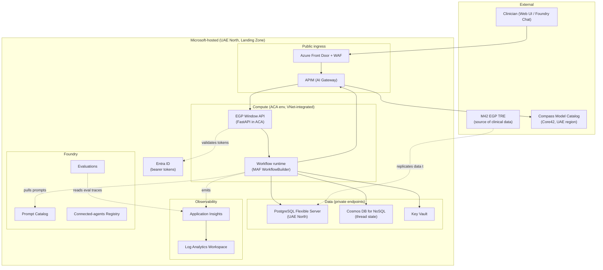
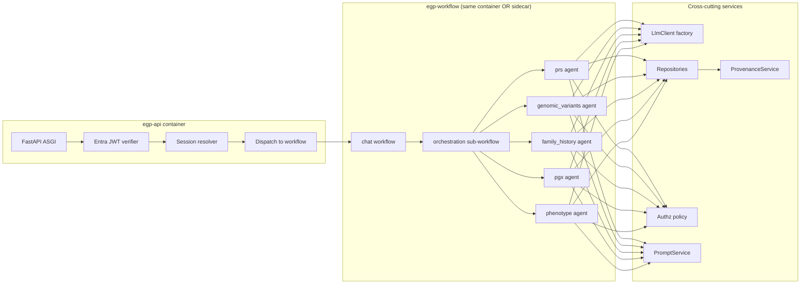
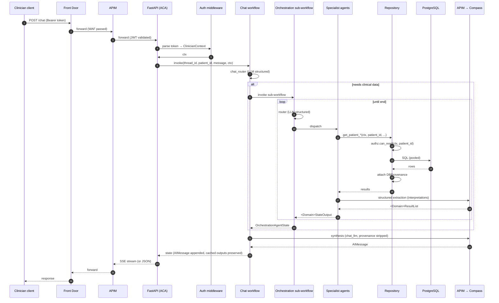
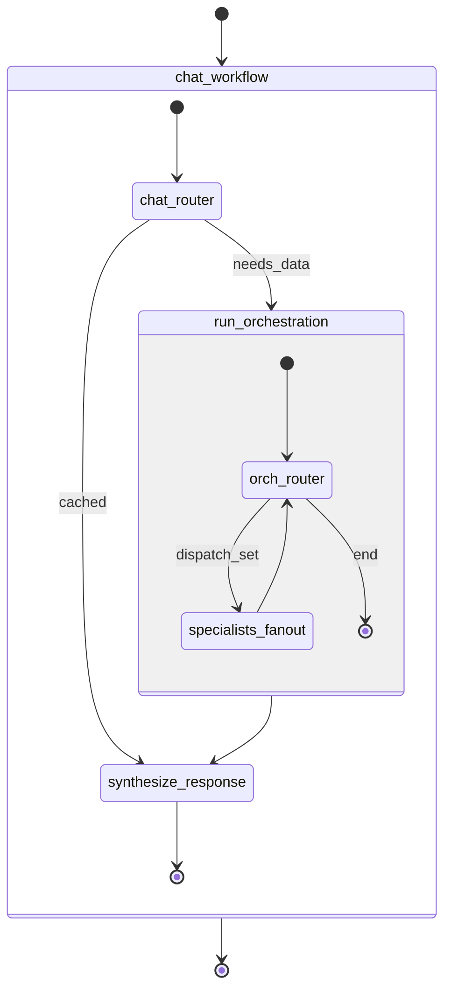
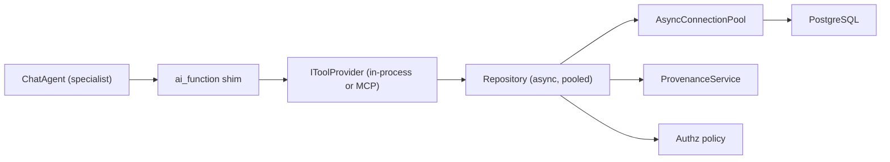
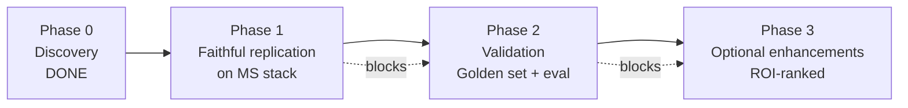
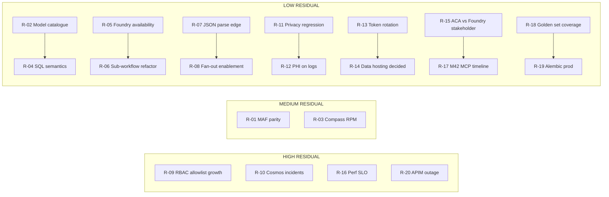

# EGP Window — Solution Design Package (Target Microsoft Implementation)

**Repository:** `m42-egp-genomics-agent`
**Prepared as:** Lead Solution Architect
**Companion document:** [architecture-discovery-report.md](architecture-discovery-report.md) (Phase 0 — treat as understanding of the existing system)
**Scope:** Target Microsoft-stack design for **Phase 1** (faithful replication) and readiness hooks for Phase 3 (enhancements)
**Target platforms:** Microsoft Agent Framework · Azure AI Foundry · Compass via APIM · Azure Container Apps · Azure Landing Zone · PostgreSQL Flexible Server · Azure Monitor + Application Insights
**Guiding principles:** preserve business behaviour · preserve clinical reasoning · avoid unnecessary redesign · prefer Microsoft-native patterns · design for future A2A · parallelise where safe · introduce clean abstractions · design for production on Azure · justify every decision
**Date:** 2026-07-08

---

## Table of Contents

1. [Executive Summary](#1-executive-summary)
2. [Architecture Decision Records (ADRs)](#2-architecture-decision-records-adrs)
3. [High Level Design (HLD)](#3-high-level-design-hld)
4. [Low Level Design (LLD)](#4-low-level-design-lld)
5. [Microsoft Agent Framework Architecture](#5-microsoft-agent-framework-architecture)
6. [Agent Responsibilities](#6-agent-responsibilities)
7. [Agent Orchestration](#7-agent-orchestration)
8. [Agent-to-Agent Readiness Design](#8-agent-to-agent-readiness-design)
9. [MCP Strategy](#9-mcp-strategy)
10. [Tool Design](#10-tool-design)
11. [PostgreSQL Data Access Design](#11-postgresql-data-access-design)
12. [Repository and Service Layer Design](#12-repository-and-service-layer-design)
13. [Shared State Design](#13-shared-state-design)
14. [Session Management](#14-session-management)
15. [Prompt Management](#15-prompt-management)
16. [Parallel Execution Strategy](#16-parallel-execution-strategy)
17. [Deployment Architecture](#17-deployment-architecture)
18. [Azure Resource Architecture](#18-azure-resource-architecture)
19. [Security Design](#19-security-design)
20. [Observability](#20-observability)
21. [Logging](#21-logging)
22. [Monitoring](#22-monitoring)
23. [Scalability](#23-scalability)
24. [Performance Optimizations](#24-performance-optimizations)
25. [Error Handling](#25-error-handling)
26. [Retry Strategy](#26-retry-strategy)
27. [Testing Strategy](#27-testing-strategy)
28. [Migration Strategy](#28-migration-strategy)
29. [Implementation Roadmap](#29-implementation-roadmap)
30. [Risks and Mitigations](#30-risks-and-mitigations)

---

## 1. Executive Summary

### 1.1 What we are building

A production-grade, Microsoft-hosted implementation of the M42 clinical genomics decision-support agent. Business behaviour — clinician asks patient-scoped question, system dispatches domain specialists, returns provenance-linked answer — is preserved verbatim. Only the substrate changes:

| Concern | Existing prototype | Target design |
|---|---|---|
| Orchestration framework | LangGraph 1.2 | **Microsoft Agent Framework (MAF)** |
| ReAct agent runtime | `langgraph.prebuilt.create_react_agent` | **MAF `ChatAgent` with `ai_function` tools** |
| Model provider | OpenAI-compatible (Core42 default) | **Compass via APIM** (primary), Azure OpenAI (optional fallback) |
| Database | DuckDB (embedded, read-only) | **Azure Database for PostgreSQL Flexible Server** (UAE, PITR, private endpoint) |
| Hosting | `langgraph dev` (developer laptop only) | **Azure Container Apps** (revision-based, min=0/max=n, ingress via APIM) |
| Session/thread state | In-memory (dev checkpointer) | **Cosmos DB for NoSQL** (or Postgres if same-database is preferred — see ADR-010) |
| Auth | None | **Entra ID (bearer)** with clinician-context propagation |
| Observability | 2 log lines total | **Application Insights + OpenTelemetry** — trace per request, span per tool call |
| Secrets | `.env` | **Azure Key Vault** referenced by ACA via managed identity |
| Deployment | None | **Bicep + GitHub Actions (OIDC)** into an Azure Landing Zone subscription in UAE North |

### 1.2 What we deliberately preserve

Directly quoted from the discovery report (§24.1), and adopted here as a hard design constraint:

- The **5-specialist architecture** (PRS, genomic variants, family history, PGX, phenotype).
- The **three-tool contract per domain** (`explore → search → get`).
- **Provenance-first output** (`DBProvenance` on every fact).
- The **two-schema privacy split** for family history (public vs. internal).
- The **controlled-vocabulary ownership boundary** (own only what won't drift).
- The **seven system prompts** verbatim (plus one typo fix in the main router prompt).
- The **`QueryExecutor` seam** as the DB abstraction — this is the load-bearing porting seam.
- The **centralised model configuration** (`AGENT_LLM_CONFIGS` shape).
- The **uniform specialist folder shape** (`graph/models/prompts/state/tools/tests`).
- **Read-only DB access at connection level.**

### 1.3 What we redesign in Phase 1

Non-negotiable, all justified in ADRs:

1. Auth, observability, connection pooling, timeouts, retries (net-new production baselines).
2. **Sub-workflow composition** — chat and orchestration become properly composed workflows, not a nested `.invoke(...)` call. Enables end-to-end streaming and unified checkpointing.
3. **Deterministic JSON parse** for `annotations_json` — Python before LLM, never LLM alone.
4. **Explicit checkpointer** — thread state persisted (Cosmos DB), not dependent on dev-server defaults.
5. **Shared helpers extraction** — `_extract_tool_executions`, `_parse_tool_output`, `_attach_provenance` moved to a single shared module (5× de-dup).
6. **Explicit recursion cap** on the orchestration workflow (2·N + 2 where N = specialists).
7. **SQL portability** — `?` → `%s`, `LIST(DISTINCT)` → `array_agg(DISTINCT)`, DuckDB `JSON` → `jsonb`.

### 1.4 What we design *for* but do not build in Phase 1

The customer directive is "replicate the existing M42 prototype. Nothing more, nothing less." The following are **hooks and seams only** in Phase 1, ready to be enabled in Phase 3 without re-architecture:

- **Parallel specialist dispatch** (design the router around a `SpecialistDecision` set; enable fan-out in Phase 3).
- **Agent-to-Agent communication** (design tools/agents as MCP-swappable; allow specialist-as-tool exposure via MAF handoff pattern in Phase 3).
- **MCP tool surface** (the `QueryExecutor` becomes an `IToolProvider` that can be either in-process or an MCP client).
- **Ontology subagent** and **corrective-loop node** — enumerated in the enhancement backlog (§29).

### 1.5 Success criteria for Phase 1

| Criterion | Target |
|---|---|
| Tool-call correctness on the customer's golden question set | 100% |
| Provenance completeness | 100% of clinical facts carry a `DBProvenance` record |
| Latency (p50 / p95) for a broad five-specialist query, sequential | To be measured against Compass — sizing captured in §22–24; SLO to be signed off in LLD review |
| Availability | ≥ 99.5% for a Phase 1 pilot (upgradeable) |
| PHI safety | Family-history privacy fields never appear in orchestrator, chat state, logs, or traces (verified via CI) |
| Reproducibility | Every existing integration test passes against the new stack (PostgreSQL + APIM/Compass) |

### 1.6 What this document is not

- Not migration code. No implementation files are produced.
- Not a re-scope. Any behaviour beyond the existing prototype is explicitly slotted to Phase 3.
- Not a Foundry-first design. See ADR-002 for why ACA + MAF SDK is chosen as the primary runtime.

---

## 2. Architecture Decision Records (ADRs)

Each ADR uses the standard Nygard structure (Context / Decision / Alternatives / Consequences / Status). ADRs are numbered for stable reference.

### ADR-001 — Adopt Microsoft Agent Framework as the orchestration runtime

- **Status:** Accepted (Phase 1)
- **Context:** The existing prototype is on LangGraph 1.2. Customer direction is to standardise on Microsoft-native tooling for supportability and Azure integration.
- **Decision:** Rebuild the two graphs (`chat`, `main`) and the five specialists on Microsoft Agent Framework, using `WorkflowBuilder` / `Workflow` for the state-graph replacement and `ChatAgent` with `ai_function` tools for the ReAct specialists.
- **Alternatives considered:**
  - *Keep LangGraph on Azure Container Apps.* Rejected — customer standardisation, and LangGraph does not natively integrate with Foundry evaluations, connected agents, or the MAF SDK improvements landing on the Microsoft roadmap.
  - *Semantic Kernel only.* Rejected — SK's Process/Planner model is less directly aligned with the router/loop pattern than MAF workflows.
- **Consequences:** Positive — first-class integration with Foundry, Entra, OTEL. Negative — MAF is newer than LangGraph; some feature parity (list reducers, sub-workflow streaming, `method="function_calling"` structured output) must be verified early — captured as Phase-1 milestone in §29.

### ADR-002 — Host the runtime on Azure Container Apps, not Foundry Agent Service

- **Status:** Accepted (Phase 1)
- **Context:** Foundry Agent Service can host agents directly; ACA can host containerised Python workloads with the MAF SDK. Customer requirement: "hosted on Azure AI Foundry".
- **Decision:** **ACA hosts the runtime.** Foundry provides supporting services — connected-agent registry, prompt catalog, evaluation harness, model catalog for Compass integration.
- **Rationale:**
  - The prototype's specialist logic (structured extraction, provenance attachment, privacy stripping) is code, not prompts. Hosting code on ACA is more natural than shoehorning it into Foundry's hosted-agent runtime.
  - Portability. M42 may need to bring this back on-premise or to their VDI; a containerised MAF app is portable, a Foundry-hosted agent is not.
  - Testability. Integration tests can run the container locally (docker compose with a local Postgres).
  - Cost predictability. ACA's scale-to-zero + revision-based deployment fits pilot economics.
- **Alternatives considered:**
  - *Foundry Agent Service only.* Rejected on portability and code-vs-prompt fit.
  - *Azure Kubernetes Service.* Rejected — over-engineered for this scale.
- **Consequences:** Positive — clean container boundary, standard CI/CD, portable. Negative — Foundry's native "hosted agent" affordances (auto-scaling per agent, built-in threading) are not used; we replicate them via MAF's own thread state + ACA autoscaling.

### ADR-003 — Compass via APIM as the primary LLM provider; Azure OpenAI as optional fallback

- **Status:** Accepted (Phase 1)
- **Context:** Customer requirement: "LLM MUST be Compass-hosted, UAE region." The target-platform brief also listed Azure OpenAI. These are not equivalent — Compass is a Core42 model catalog fronted by an API, Azure OpenAI is a Microsoft-native model provider.
- **Decision:**
  - Primary: **all LLM calls go through APIM to Compass** in UAE.
  - Optional secondary: an Azure OpenAI resource may be provisioned in UAE for **any model Compass does not yet offer** (e.g. a specific reasoning tier). Wired as a named sub-provider in `AGENT_LLM_CONFIGS`.
  - APIM policy chooses provider per model ID, applies mTLS to Compass, applies retry/timeout/circuit-breaker.
- **Alternatives considered:**
  - *Azure OpenAI-only.* Rejected — violates customer data-residency/model-provider directive.
  - *Compass-only, no fallback.* Discouraged — if a needed model becomes unavailable, we lose a graceful degradation path.
- **Consequences:** Positive — data residency preserved, single ingress for cost and quota control, per-agent model choice preserved. Negative — APIM becomes a critical path; requires monitoring, versioned policies, and a defined DR plan.

### ADR-004 — PostgreSQL Flexible Server replaces DuckDB

- **Status:** Accepted (Phase 1)
- **Context:** DuckDB is embedded and read-only in the prototype. Not suitable for concurrent production access.
- **Decision:** Azure Database for **PostgreSQL Flexible Server** in UAE North. Zone-redundant HA for pilot phase optional; single-zone with PITR sufficient for MVP. Private endpoint into the VNet. Read/write role split.
- **Alternatives considered:**
  - *Azure SQL.* Rejected — the schema uses `jsonb`-natural constructs (`annotations_json`) and DuckDB-flavour features that map more cleanly to Postgres.
  - *Cosmos DB.* Rejected — the workload is relational (composite keys, JOINs, CHECK constraints).
  - *Managed Postgres on Aiven / third-party.* Rejected — landing-zone standardisation.
- **Consequences:** Positive — full SQL portability, `jsonb`, first-class managed identity via Entra, familiar tooling. Negative — DuckDB's zero-cost per-call connection pattern is unusable; requires a real pool (see ADR-005).

### ADR-005 — Introduce an explicit connection pool via a Repository / Executor layer

- **Status:** Accepted (Phase 1)
- **Context:** The prototype opens a fresh DuckDB connection per tool call (14 potential connections per specialist). PostgreSQL will not tolerate this.
- **Decision:** Introduce a **Repository layer** per domain. Each Repository consumes an `AsyncConnectionPool` (from `psycopg_pool`) provided by a process-wide DI container. Tools become thin wrappers that call Repositories. The `QueryExecutor` seam is preserved as the *test* injection point — production uses the Repository.
- **Alternatives considered:**
  - *Keep the executor callable, inject a `psycopg_pool` closure.* Rejected — muddles ownership; the executor was designed for test injection, not for prod resource management.
  - *ORM (SQLAlchemy).* Rejected — the tools are already SQL-native and provenance-aware; an ORM would obscure the exact SQL that is currently the audit surface.
- **Consequences:** Positive — production concurrency, single connection lifecycle to reason about, testable via pool mocks. Negative — one more layer to build; specialists need to be re-wired from tools directly to Repositories via tools.

### ADR-006 — Two-pass extraction stays; JSON blob decoded deterministically before the second LLM pass

- **Status:** Accepted (Phase 1)
- **Context:** Existing agents make two LLM calls per specialist (ReAct + `with_structured_output(method="function_calling")`). This exists because strict-mode structured output rejects `Dict[str, Any]` in `DBProvenance` and `annotations_json.raw_annotations`. Silent risk: variant specialist asks the LLM to *parse* `annotations_json`.
- **Decision:** Keep the two-pass shape (it's business logic — it produces interpretations, not just extractions). But **decode `annotations_json` in Python** before the second LLM pass. The LLM receives already-typed `VariantExtendedAnnotations` with `raw_annotations` for the tail; it only *interprets*, never *parses JSON*.
- **Alternatives considered:**
  - *Single-pass with strict-mode structured output.* Rejected — would force removal of `Dict[str, Any]` from provenance/raw_annotations. Loses information.
  - *LLM parses JSON as today.* Rejected — silent-hallucination clinical risk.
- **Consequences:** Positive — removes a class of clinical-correctness bug; interpretation quality preserved. Negative — slightly more Python code in `genomic_variants_node`; no LLM cost change.

### ADR-007 — Nested `main_graph.invoke()` becomes a MAF sub-workflow

- **Status:** Accepted (Phase 1)
- **Context:** Chat calls `main_graph.invoke(...)` as a plain function. Streaming and checkpointing of the orchestration are invisible to the chat layer.
- **Decision:** Compose orchestration as a proper **sub-workflow** invoked from a chat-level executor. The orchestration workflow exposes its intermediate events (specialist entered / completed / failed) to the outer chat workflow's event stream.
- **Alternatives considered:**
  - *Keep the nested `.invoke()`.* Rejected — precludes progress UX and unified checkpointing.
  - *Fully collapse into a single workflow.* Rejected — loses the chat/orchestration separation, which is a valuable architectural boundary (chat = memory + synthesis, orchestration = domain routing).
- **Consequences:** Positive — enables `"running family_history_agent…"` UX, enables per-super-step checkpointing. Negative — small refactor to add the sub-workflow interface.

### ADR-008 — Auth via Entra ID; clinician context propagated through workflow state

- **Status:** Accepted (Phase 1)
- **Context:** No auth in the prototype. `clinician_id`, `conversation_id`, `clinician_specialty` are declared but unused. Clinical grade auth is mandatory for pilot.
- **Decision:**
  - Ingress via **Entra ID bearer token** validated at the APIM layer.
  - The API's request handler resolves token claims into a `ClinicianContext` object populated onto the workflow's shared state (previously-unused fields become required).
  - **Repository layer enforces access checks** for `patient_id` against the token subject's RBAC scope (Phase 1: allowlist; Phase 3: policy engine).
- **Alternatives considered:**
  - *Auth at ACA ingress only.* Rejected — claims are needed downstream for RBAC and audit.
  - *Postpone to Phase 3.* Rejected — clinical-grade auth is a Phase 1 mandate.
- **Consequences:** Positive — closes the largest single production gap. Negative — the RBAC catalogue itself needs a source of truth (see §19).

### ADR-009 — Explicit list-append reducer on `agents_completed`; explicit recursion cap on orchestration

- **Status:** Accepted (Phase 1)
- **Context:** Prototype's `agents_completed` field has no reducer; every specialist must remember to append rather than replace. Prototype has no hard router iteration cap.
- **Decision:**
  - MAF shared-state field `agents_completed` gets a list-append reducer (typed as a `Set[str]` internally to prevent duplicates).
  - Orchestration workflow declares an iteration budget = `2 × n_specialists + 2 = 12`. On breach: emit a `RoutingBudgetExceededError` (typed), degrade gracefully, still return whatever specialists have completed.
- **Alternatives considered:**
  - *Trust the prompt.* Rejected — soft safety property; violated by any router hallucination.
- **Consequences:** Positive — structural safety. Negative — mild — one branch that must be tested (§27).

### ADR-010 — Cosmos DB for NoSQL as the thread-state store; Postgres reserved for clinical data only

- **Status:** Accepted (Phase 1)
- **Context:** MAF needs a checkpointer. We can put threads in Postgres (same DB) or in a separate store (Cosmos, Redis).
- **Decision:** **Cosmos DB for NoSQL** (session container, TTL = 24h configurable). Rationale:
  - Isolates *conversational state* from *clinical data of record* — clean audit boundary.
  - TTL and per-partition-key throughput fit the session model.
  - Cosmos supports managed identity and private endpoint.
  - Avoids growing Postgres tables with conversation blobs.
- **Alternatives considered:**
  - *Postgres same-DB checkpointer.* Rejected on audit separation.
  - *Redis for Azure Cache.* Considered — cheaper, but no first-class MAF checkpointer for Redis at time of writing; add if Cosmos proves too expensive.
- **Consequences:** Positive — clean separation, TTL. Negative — one more Azure service to operate; costs to monitor.

### ADR-011 — Shared helpers extracted to `agents/shared/graph_helpers.py`

- **Status:** Accepted (Phase 1)
- **Context:** `_extract_tool_executions`, `_parse_tool_output`, `_attach_provenance` are duplicated across 5 specialists.
- **Decision:** Extract into `agents/shared/graph_helpers.py`. Specialists provide their `_TOOL_SOURCE_TABLE` and `_TOOL_FIELDS_DERIVED` maps as arguments. Behaviour preserved bit-for-bit; only the location changes.
- **Consequences:** Positive — a single place to add features (e.g. `duration_ms`, OTEL spans). Negative — small refactor risk (all 5 specialists must be re-tested).

### ADR-012 — Structured OTEL tracing at three levels; no PHI on spans

- **Status:** Accepted (Phase 1)
- **Context:** Prototype has no observability.
- **Decision:** OpenTelemetry instrumentation with three span types:
  - `workflow.request` — one per clinician turn (root).
  - `workflow.executor` — one per MAF executor / node run (chat_router, orchestration.router, specialist entry, specialist extract, synthesize).
  - `tool.call` — one per repository call (SQL text + row count, never row content). LLM calls span type `llm.call` (model, prompt tokens, completion tokens; no prompt content unless a debug flag is set in a non-prod environment).
- **PHI rule:** span attributes may include patient_id (a pseudonymous key) but never `search_context_notes`, never row content, never message text.
- **Consequences:** Positive — production observability. Negative — team must exercise discipline; a linter is added to CI to catch known-PHI attribute names.

### ADR-013 — Parallel specialist dispatch designed in Phase 1; enabled in Phase 3

- **Status:** Accepted (Phase 1 design; Phase 3 enablement)
- **Context:** Specialists are demonstrably independent (see discovery report §18.1). Sequential dispatch is up to 4× slower than needed. Customer directive: preserve business behaviour in Phase 1.
- **Decision:**
  - The orchestration router's decision type is `SpecialistDispatchSet` (a set of specialists to run in parallel), not a single-specialist enum. In Phase 1 the router is prompted to return single-specialist sets; the fan-out plumbing exists but only ever dispatches one at a time. In Phase 3, the prompt is relaxed to allow multi-specialist sets, and the workflow's fan-out edge runs them concurrently.
  - The dispatch strategy is a **workflow-level policy**, not a code change — flip a config flag to enable.
- **Consequences:** Positive — 3–4× latency improvement available with a flag flip once APIM RPM and Postgres pool are sized. Negative — a Phase-1 code path exists to support fan-out that is (initially) never taken; must be documented.

### ADR-014 — A2A designed in but not enabled

- **Status:** Accepted (design-only in Phase 1)
- **Context:** A2A would let specialists call each other. Discovery report §19 concludes A2A is not needed given the current data model.
- **Decision:** The tool interface abstraction (see ADR-015) makes any specialist exposable as an MCP tool. In Phase 3, if a clinical scenario emerges (e.g. `family_history_agent` needs to call `phenotype_agent` mid-run), we expose the callee as an MCP tool and hand it off via MAF's Handoff pattern — no new architecture is required. Phase 1 does not enable this.
- **Consequences:** Positive — future-proofing without commitment. Negative — none if we don't invoke.

### ADR-015 — Tools designed against an `IToolProvider` seam; MCP as a swap-in option

- **Status:** Accepted (Phase 1)
- **Context:** M42 is building an MCP server in parallel. We do not know its timeline. Discovery report §20 recommends MCP as a Phase-3 seam.
- **Decision:** All 14 tools are backed by concrete `Repository` classes (see §12). The MAF agent binds *`ai_function` shims* that delegate to a domain-scoped `IToolProvider` — implemented either as an `InProcessToolProvider` (Phase 1 default) or an `McpToolProvider` (Phase 3 swap-in). Prompt, agent definition, and tool signatures do not change.
- **Consequences:** Positive — swapping to MCP is a DI wiring change, not an agent redesign. Negative — one extra indirection layer in Phase 1.

### ADR-016 — Prompts moved to Foundry Prompt Catalog; runtime uses a local fallback

- **Status:** Accepted (Phase 1)
- **Context:** All 7 prompts are Python string constants today. Foundry's Prompt Catalog offers versioning, review workflows, and evaluation integration.
- **Decision:** Prompts live in the Foundry Prompt Catalog as the source of truth. The application ships **a bundled local copy** of every prompt as a fallback (in case Foundry is unreachable at startup). At startup, we attempt to fetch the current pinned version from Foundry; on failure or timeout, fall back to the bundled copy and emit a warning metric.
- **Consequences:** Positive — clinician/BIX review workflow; version pinning; A/B evaluation. Negative — one more startup dependency (mitigated by fallback).

### ADR-017 — Deterministic `patient_id` scoping and RBAC at the Repository layer

- **Status:** Accepted (Phase 1)
- **Context:** The tools all take `patient_id` as an argument; no code enforces that the caller is authorised to see that patient.
- **Decision:** Every Repository method takes `(clinician_ctx: ClinicianContext, patient_id: str, ...)`. Method entry checks `authz.can_read(clinician_ctx, patient_id)` before hitting the DB. Denial emits an audit event and a typed `AccessDenied` exception that surfaces as a clean 403 with no PHI in the message.
- **Consequences:** Positive — RBAC enforced at the last mile before the database, not just at ingress. Negative — every Repository method signature carries the context.

### ADR-018 — Preserve deterministic behaviour: `temperature=0.0` everywhere, no LLM-driven JSON parsing

- **Status:** Accepted (Phase 1)
- **Context:** Prototype uses `temperature=0.0` uniformly. Evaluation and clinical audit rely on replayability.
- **Decision:** Preserve `temperature=0.0` for all seven agents. Do not introduce any LLM-driven parsing of source-of-truth data (see ADR-006).
- **Consequences:** Positive — evaluation harness can rerun a golden set and expect stable outputs. Negative — minor — no creativity in synthesis (this is a feature, not a bug, in a clinical domain).

### ADR-019 — Report agent (implied by `tests/show_report_agent_input.py`) is Phase 3

- **Status:** Accepted
- **Context:** The prototype has scaffolding for a report agent but no implementation.
- **Decision:** Phase 1 does not build the report agent. Phase 3 backlog item. The `OrchestrationAgentState` schema is preserved so the future report agent can consume it directly.
- **Consequences:** Positive — Phase 1 scope discipline. Negative — none unless customer disagrees on scope.

### ADR-020 — Prefer psycopg 3 (async) over asyncpg

- **Status:** Accepted (Phase 1)
- **Context:** Both psycopg 3 and asyncpg are viable async PostgreSQL drivers.
- **Decision:** Use **psycopg 3** with `psycopg_pool.AsyncConnectionPool`.
- **Rationale:** Positional `%s` placeholders match the migration from DuckDB `?` more mechanically. First-class server-side cursors. Better `LISTEN/NOTIFY` support if we later add event-driven cache invalidation. Native support for `jsonb` and typed parameters.
- **Consequences:** Neutral — asyncpg is faster in synthetic benchmarks; psycopg's ergonomics + adapter breadth win in this context.

### ADR-021 — Structured output extraction uses MAF `ChatCompletion` with a Pydantic response schema

- **Status:** Accepted (Phase 1)
- **Context:** The prototype uses `with_structured_output(method="function_calling")` to bypass strict-mode limitations.
- **Decision:** In MAF, the extraction pass uses `ChatCompletion` with an explicit response schema. Where `Dict[str, Any]` fields exist (provenance parameters, `raw_annotations`), we use MAF's equivalent of `method="function_calling"` (verified during ADR review).
- **Consequences:** Positive — matches prototype behaviour. Risk: MAF version parity to be confirmed during Phase 1 kickoff (see risk register §30).

### ADR-022 — Retry / timeout / circuit-breaker at APIM for LLM; at the pool for DB

- **Status:** Accepted (Phase 1)
- **Context:** No retries/timeouts in prototype.
- **Decision:**
  - **LLM:** APIM enforces per-request timeout (30 s), exponential backoff retry (n=3, base 500 ms, jitter), circuit breaker on Compass endpoint 5xx-burst.
  - **DB:** `psycopg_pool` connect timeout (5 s), statement timeout (30 s server-side), no application-level retry on `SELECT` errors — surface to the agent as a typed exception.
- **Consequences:** Positive — one place per axis to change resilience policy. Negative — none.

### ADR-023 — Terraform / Bicep as IaC; Bicep chosen for landing-zone alignment

- **Status:** Accepted (Phase 1)
- **Context:** Customer landing zone is Bicep-standardised.
- **Decision:** **Bicep modules**, one per resource type, composed by an environment stack. Modules pinned to versioned artifacts in the internal registry.
- **Consequences:** Consistent with landing zone; well-supported tooling. Terraform ruled out on convention.

---

## 3. High Level Design (HLD)

### 3.1 System context



Notes:

- **Data flow into Postgres.** Phase 1 assumes an M42-owned pipeline populates the target Postgres schema. If Postgres is hosted in the Microsoft subscription (see LLD §4.6), a Data Factory / DMS process replicates from the M42 EGP source. Alternatively — Postgres stays in the M42 subscription and is accessed cross-VNet via a private-endpoint-linked service. Both options are enumerated in §4.6; recommendation is captured there.
- **UI**. Phase 1 UI is a Foundry-hosted chat surface (standalone, per customer preference). A Blazor / React SPA is a Phase-3 option (§29).

### 3.2 Logical layers (target)

| Layer | Responsibility | Preserved from prototype? |
|---|---|---|
| **Ingress / Auth** | Front Door + WAF, APIM validating Entra JWT | ⛔ Net-new |
| **API** | Thin FastAPI-in-ACA: request → workflow invocation, streams events back via SSE | ⛔ Net-new |
| **Workflow (MAF)** | `chat` workflow + `orchestration` sub-workflow + 5 specialists | 🟢 Behaviour preserved, framework changed |
| **Agent** | `ChatAgent` per specialist with `ai_function` tools and system prompt | 🟢 Same shape |
| **Tool shim** | `ai_function` delegates to `IToolProvider` (in-process today, MCP-swappable) | 🟠 New abstraction, same signatures |
| **Repository** | Domain-scoped SQL access via `AsyncConnectionPool`, with RBAC on entry | 🟠 New layer around existing SQL |
| **Data** | PostgreSQL Flexible Server (clinical), Cosmos (threads) | 🟠 Substrate change; schema preserved |
| **Observability** | OTEL exporters → App Insights → LAW | ⛔ Net-new |
| **Config** | Foundry Prompt Catalog (source), local fallback bundle, `AGENT_LLM_CONFIGS` per agent, `Settings` (env + Key Vault) | 🟠 Reshaped |

### 3.3 Cross-cutting boundaries

- **Provenance boundary**: every `DBProvenance` record is created inside the Repository (which knows the source table and JOIN shape) before returning to the tool shim. This is a hardening move — provenance no longer depends on a post-hoc match by row key.
- **PHI boundary**: `FamilyHistoryRepository.get_patient_family_history()` returns two projections, `internal` and `public`. Only `public` is ever put on shared state or logged.
- **Auth boundary**: RBAC decision is made inside each Repository, on method entry, before any SQL is issued.
- **Model boundary**: every LLM call goes through APIM. No `OpenAI` SDK call bypasses APIM even in tests.

### 3.4 Behavioural preservation guarantees

Written for auditor readability:

1. Same seven prompts.
2. Same three-tool contract per specialist.
3. Same result schemas (`PRSResultList`, `GenomicVariantsResultList`, `FamilyHistoryResultList`, `PGXResultList`, `PhenotypeResultList`).
4. Same routing decision types (`ChatRouterDecision`, `RouterDecision`) — the router decision may become a set of specialists (see ADR-013) but Phase 1 only ever emits singleton sets.
5. Same provenance attachment semantics.
6. Same privacy-stripping rules.
7. Same completion-tracking guardrails.
8. Same `temperature=0.0`.

---

## 4. Low Level Design (LLD)

### 4.1 Service composition



### 4.2 Container decomposition

Phase 1 ships a **single container image** (`egp-window`) exposing the API and hosting the workflows in-process. Motivation:

- The workflow is stateless per request (thread state is in Cosmos); horizontal scale is by replicas.
- Splitting API and workflow into two containers introduces a network hop for every specialist LLM call orchestration — measurable latency cost with no clear architectural benefit at Phase 1 scale.
- Optional Phase 3: split off a `egp-mcp-server` container if we decide to expose tools via MCP.

### 4.3 Runtime process shape

- FastAPI + Uvicorn (single-process asyncio; 1 worker per container; ACA horizontal scale via `min=0, max=n` and HTTP concurrency rule).
- MAF WorkflowRuntime constructed once at startup, injected into request handlers.
- `psycopg_pool.AsyncConnectionPool` opened at startup, sized (see §11.4), closed on shutdown.
- Prompt cache warmed at startup (Foundry Prompt Catalog fetch, on failure use bundled fallback).

### 4.4 Request lifecycle



### 4.5 State shape (LLD-level)

Full details in §13. LLD-level summary:

- **Session state (Cosmos)** — one document per `thread_id`, containing the `messages`, `agents_completed`, and specialist outputs. TTL = 24h configurable.
- **Request-scoped state (workflow shared state)** — a Pydantic model that mirrors the prototype's `ChatAgentState` and `OrchestrationAgentState`, with the additions from ADR-008 (populated `ClinicianContext`) and ADR-009 (list-append reducer on `agents_completed`).
- **Local state (specialist executor variables)** — never on shared state. Includes the full `tool_executions` audit trail (§13.5 explains the new persistence policy).

### 4.6 Data-hosting decision — Postgres in the Microsoft subscription or in M42

Two options, both viable:

| Option | Where Postgres lives | Data movement | Trust boundary | Recommendation |
|---|---|---|---|---|
| A | Microsoft subscription (UAE North) | M42 pushes data via Data Factory / DMS on a schedule | Data crosses subscription boundary | **Recommended for Phase 1** — simplest network topology, fastest tests, cleanest ops |
| B | M42 subscription (existing EGP) | No movement | Cross-subscription private-link consumption; agent connects to M42-managed DB | Alternative — decision required from Hamza + Hari |

Design in this document assumes Option A. Switching to Option B only changes the networking chapter (§18) — no code changes because the DB seam is preserved.

### 4.7 Non-functional targets (baselines, refined in §22–24)

| Metric | Target | Basis |
|---|---|---|
| Availability | ≥ 99.5% | Pilot phase; upgradable to 99.9% by enabling zone-redundant HA on Postgres and ACA. |
| p50 latency, 1 specialist | ≤ 6 s | Estimate: 2 LLM calls (~2 s each) + 3 DB round-trips + overhead. To be measured in Phase 1 milestone M4. |
| p95 latency, broad 5-specialist (sequential Phase 1) | ≤ 45 s | Estimate: 5 × single-specialist path + router overhead. |
| p95 latency, broad 5-specialist (parallel Phase 3) | ≤ 12 s | Fan-out with the pool sized (see §16). |
| RPO (Postgres) | 5 min | Flexible Server PITR default. |
| RTO (Postgres) | 30 min | Restore-from-PITR SLA. |
| Concurrent clinicians (pilot) | 50 | Sizes ACA replicas + APIM RPM budget. |

---

## 5. Microsoft Agent Framework Architecture

### 5.1 Concept mapping (concise; full mapping in discovery §21)

| LangGraph concept (source) | MAF concept (target) |
|---|---|
| `StateGraph(<State>)` | `WorkflowBuilder` / `Workflow` |
| Node (`add_node`) | Executor (message-driven handler) |
| `add_edge` / `add_conditional_edges` | Static and conditional edges |
| `create_react_agent(llm, tools, prompt)` | `ChatAgent(instructions, model, tools=[...])` |
| `@tool` | `ai_function` |
| `with_structured_output(method="function_calling")` | `ChatCompletion` with Pydantic response schema (see ADR-021) |
| `main_graph.invoke(...)` from chat graph | Sub-workflow executor (ADR-007) |
| `add_messages` reducer | Shared-state list-append semantics |
| `Send` (fan-out) | Parallel-edge fan-out with reducers (ADR-013) |
| Dev checkpointer | Cosmos DB thread-state provider (ADR-010) |

### 5.2 Workflow topology (target)



- Phase 1: `specialists_fanout` always contains exactly one specialist. All plumbing is fan-out-safe.
- Phase 3: `specialists_fanout` may contain multiple specialists; MAF runs them concurrently; results merge via the shared-state reducer.

### 5.3 Agent inventory (per MAF)

| Agent | Kind | Model | Tools bound | Structured output |
|---|---|---|---|---|
| `chat_router` | Chat completion (structured) | chat_llm (Compass equivalent) | none | `ChatRouterDecision` |
| `synthesize_response` | Chat completion | chat_llm | none | free-form `AIMessage` |
| `orch_router` | Chat completion (structured) | main_llm | none | `RouterDecision` (Phase 1) → `SpecialistDispatchSet` (Phase 3) |
| `prs_agent` | `ChatAgent` (ReAct-equivalent) | prs_llm | 3 tools | Two-pass: ReAct → `PRSResultList` |
| `genomic_variants_agent` | `ChatAgent` | genomic_variants_llm | 3 tools | Two-pass: ReAct → `GenomicVariantsResultList` |
| `family_history_agent` | `ChatAgent` | family_history_llm | 3 tools | Two-pass: ReAct → `FamilyHistoryResultList` |
| `pgx_agent` | `ChatAgent` | pgx_llm | 3 tools | Two-pass: ReAct → `PGXResultList` |
| `phenotype_agent` | `ChatAgent` | phenotype_llm | 2 tools | Two-pass: ReAct → `PhenotypeResultList` |

### 5.4 Executor decomposition (Chat workflow)

- **`chat_router` executor**
  Input: shared state (messages, cache flags). Output: `next_action`, updates to `agents_completed`/cache. LLM call: `chat_llm` structured to `ChatRouterDecision`.
- **`run_orchestration` executor**
  Wraps the orchestration sub-workflow invocation, forwards `patient_id`, `original_query`, `ctx`. Streams events upward.
- **`synthesize_response` executor**
  Composes clinical context (via `_build_clinical_context` service — provenance stripped), issues `chat_llm.complete(...)`, appends `AIMessage` to state.

### 5.5 Executor decomposition (Orchestration sub-workflow)

- **`orch_router` executor**
  Emits `RouterDecision(next, reason, requested_diseases)`. If Phase 3 enabled, emits `SpecialistDispatchSet(specialists, requested_diseases)`.
- **`specialist_*` executors** (5)
  Each is a wrapper around a `ChatAgent` invocation. Wrapper responsibilities:
  1. Read inputs from shared state.
  2. Invoke the `ChatAgent` (ReAct pass).
  3. Run structured extraction (LLM pass 2) with Python-parsed inputs.
  4. Attach provenance (delegated to `ProvenanceService`).
  5. Convert to `<Domain>StateOutput` (privacy-strip if family_history).
  6. Return outputs + `agents_completed` delta.

### 5.6 Sub-workflow composition and streaming

- The `run_orchestration` executor in the outer workflow subscribes to the sub-workflow's event bus and re-emits `specialist.started`, `specialist.tool.called`, `specialist.completed` events to the outer workflow's stream.
- The FastAPI layer streams these events to the client via SSE (Foundry chat UI understands the schema).

---

## 6. Agent Responsibilities

Preserving the responsibilities from the discovery report §4, restated as target contracts.

### 6.1 chat_router

- **Responsibility:** decide `needs_clinical_data`; identify stale cached specialists via `reset_agents`.
- **Input:** shared state (messages, cache flags).
- **Output:** `ChatRouterDecision`.
- **Tools:** none.
- **Prompt:** `CHAT_ROUTER_SYSTEM` (verbatim; sourced from Foundry Prompt Catalog).

### 6.2 synthesize_response

- **Responsibility:** compose the clinician-facing reply, grounded in cached specialist outputs (provenance stripped).
- **Input:** shared state.
- **Output:** `AIMessage`.
- **Tools:** none.
- **Prompt:** `CHAT_SYNTHESIS_SYSTEM` + injected clinical context.

### 6.3 orch_router

- **Responsibility:** decide the next specialist (Phase 1) or the set of specialists (Phase 3) to dispatch, or `end`. Populate `requested_diseases`.
- **Input:** state summary (patient_id, original_query, completion booleans).
- **Output:** `RouterDecision` (Phase 1) / `SpecialistDispatchSet` (Phase 3).
- **Prompt:** `MAIN_AGENT_SYSTEM` (with duplicated rule 6 fixed).

### 6.4 prs_agent, genomic_variants_agent, family_history_agent, pgx_agent, phenotype_agent

Uniform contract for all specialists:

- **Responsibility:** given patient_id and optional filters, run the domain's three-tool contract (two for phenotype), extract structured results, attach provenance, produce interpretations.
- **Input:** shared state (`patient_id`, `original_query`, `requested_*` filters).
- **Output:** `<Domain>StateOutput` written to the shared state field for the domain; `agents_completed` appended.
- **Tools:** the domain's `ai_function`s (see §10).
- **Prompt:** the domain's `<DOMAIN>_AGENT_SYSTEM_PROMPT`.
- **Extraction prompt:** dynamic HumanMessage, unchanged from prototype (see discovery §7.6).
- **Special:** `family_history` privacy-strips before writing to shared state.

### 6.5 Agent contract summary table

| Agent | Turn ownership | Reads | Writes | Failure semantics |
|---|---|---|---|---|
| chat_router | chat workflow | messages, cache flags | next_action, reset_cache updates | fail-open — assume `respond_directly` on router failure with explicit error banner in response |
| synthesize_response | chat workflow | shared state (provenance stripped) | messages | fail-hard — surface 500 |
| orch_router | orchestration sub-workflow | state summary | next / dispatch_set | fail-hard — surface to chat as a graceful "unable to route" |
| specialist_* (any) | orchestration sub-workflow | inputs from state | `<domain>` slot, `agents_completed` | isolated failure — mark specialist `status=failed`, orchestration continues, synthesis surfaces the gap |

Failure semantics matter: a specialist failure does **not** stop the orchestration. This is a change vs the prototype (which raised out of the node) — see §25.

---

## 7. Agent Orchestration

### 7.1 Orchestration algorithm (Phase 1)

1. `orch_router` inspects state summary (patient_id, query, completion flags).
2. Emits `RouterDecision(next=..., requested_diseases=...)`.
3. If `next != end`, dispatch the named specialist wrapper.
4. Specialist wrapper executes (ReAct → extract → provenance → strip → return).
5. Return-edge back to `orch_router`.
6. Repeat until `next == end` or iteration cap = 12 (ADR-009).

### 7.2 Orchestration algorithm (Phase 3 fan-out enabled)

1. `orch_router` inspects state summary.
2. Emits `SpecialistDispatchSet(specialists=[...], requested_diseases=...)`.
3. MAF fan-out edge dispatches all named specialists **concurrently** to their wrapper executors.
4. Each wrapper writes its output + appends to `agents_completed` via the reducer.
5. Fan-in edge returns to `orch_router`.
6. Repeat until `specialists == []` returned.

### 7.3 Cache-aware routing behaviour (preserved from prototype)

- `orch_router` never dispatches a specialist listed in `agents_completed`. Enforced by the prompt (rule 8) AND by a code-side guard in the specialist wrapper (short-circuit if already present).
- `chat_router` selectively invalidates via `reset_agents`. Enforced by the shared-state operation: `agents_completed` reducer supports removal via a `Remove(name)` sentinel.

### 7.4 Termination guarantees

- **Prompt-driven:** `MAIN_AGENT_SYSTEM` rule 7 returns `end` when relevant agents complete.
- **Code-driven safety net:** iteration cap = 12 (ADR-009). On breach: log `orchestration.budget.exceeded`, return partial state, chat synthesis writes a qualification into the reply.

### 7.5 Failure isolation

Specialist failures are captured and returned as `<Domain>StateOutput(status="failed", errors=[...], output=None)`. Consequences:

- Orchestration continues — other specialists remain reachable.
- Synthesis is aware of failures and reflects them ("PGX data was unavailable for this turn; please retry.").
- `agents_completed` **does not include** the failed specialist name (only successful completions block re-dispatch).
- Metric: `specialist.failed{domain=...}` for alerting.

### 7.6 Concurrency and idempotence

- All specialist reads are idempotent (Postgres `SELECT` on read-only role).
- Fan-out is safe because specialists write to disjoint state slots and the `agents_completed` reducer is commutative append.

---

## 8. Agent-to-Agent Readiness Design

Per ADR-014, A2A is designed *for*, not enabled. The design property below is: any specialist can be exposed to any other specialist through a controlled interface without redesigning the orchestration.

### 8.1 The A2A boundary is the tool interface

- Every specialist is fronted by an `IToolProvider` (§10, ADR-015). The provider can be `InProcessToolProvider` (Phase 1) or an `McpToolProvider` (Phase 3).
- To make specialist `A` callable by specialist `B`, we add an `ai_function` on `B` that delegates to an `IAgentProvider` (analogous shape) which invokes `A`'s workflow.
- This uses MAF's **Handoff** pattern — a well-defined intra-workflow delegation.

### 8.2 Design constraints for A2A (baked into Phase 1)

- **Provenance carries through handoffs.** A specialist that consumes another's output must preserve the callee's `DBProvenance` records on its own results (they are not replaced).
- **Hop budget.** Each turn has a soft cap of 3 handoffs total. Enforced at the orchestration level.
- **Auth propagation.** `ClinicianContext` propagates on every handoff. RBAC checks re-run on each nested Repository call.
- **Cycle detection.** A specialist may not directly or transitively call itself within a single orchestration cycle.

### 8.3 Recommended future scenarios

Two candidate A2A flows the design accommodates without changes:

1. `family_history_agent` needs a phenotype cross-check (e.g. does the patient have a diagnosis that changes threshold interpretation?). In Phase 3, `phenotype_agent` is exposed via MCP; `family_history_agent` calls it via a single `check_phenotype_relevance` `ai_function`.
2. `genomic_variants_agent` needs PGx context for a specific gene (does a pathogenic variant in `CYP2D6` correlate with the patient's PGx phenotype?). In Phase 3, `pgx_agent` is exposed via MCP; `genomic_variants_agent` calls it for a single gene.

### 8.4 What we do NOT design for

- Peer-to-peer specialist chat (LLM-to-LLM message passing). All A2A is handoff-shaped (structured request → structured response).
- Long-running background specialist processes. All specialist runs are synchronous within a turn.

---

## 9. MCP Strategy

Consistent with ADR-015 and discovery §20.

### 9.1 Phase 1 — MCP not enabled

- All 14 tools are wired in-process via `InProcessToolProvider`.
- No MCP server is deployed by Microsoft in Phase 1.
- Design property: any tool can be swapped to an MCP client with only DI wiring changes.

### 9.2 Phase 3 — MCP swap-in

Two possible pivots, both accommodated:

**Pivot A — M42-hosted MCP server matures.**
- Add `McpToolProvider` implementations for each domain, pointing at the M42 MCP endpoint URLs.
- Configuration flag `TOOL_PROVIDER_MODE=mcp` per domain.
- Auth: M42-issued OIDC federation or shared-secret via Key Vault. To be negotiated with M42 (§19).

**Pivot B — Microsoft-hosted MCP surface.**
- Deploy an `egp-mcp-server` container in the ACA environment.
- The server exposes the same 14 tools, backed by the same Repositories.
- Specialists become MCP clients even for our own tools. Cleanest boundary if we want to serve tools to third-party agents (e.g. CCAD Caregiver Assistant).

**Recommendation:** wait for M42's MCP server. If it materialises with equivalent tool signatures, adopt Pivot A. Only pursue Pivot B if Microsoft-side control is required for some reason (e.g. RBAC differences).

### 9.3 MCP mapping (14 tools → 14 MCP Tools)

Fully covered in discovery §20.2. Every tool becomes an MCP Tool (not a Resource). No Prompts or Resources are exposed via MCP in Phase 1.

### 9.4 Server-side privacy stripping

If `get_patient_family_history` is exposed via MCP (in either pivot), the privacy-sensitive fields (`affected_relative_count`, `total_relatives_searched`, `search_context_notes`) must never leave the server. The current in-process strip in `FamilyHistoryStateOutput.from_agent_state` moves *into the Repository* under Phase 1, so it is already applied before any MCP boundary.

---

## 10. Tool Design

### 10.1 Tool inventory (unchanged from prototype)

Same 14 tools, same signatures, same SQL semantics. Full list in discovery §5.

### 10.2 Target-shape layering



- Agent knows about `ai_function` only.
- `ai_function` delegates to `IToolProvider` — this is the seam.
- Provider delegates to the domain Repository.
- Repository handles pool, authz, SQL, provenance construction.

### 10.3 Contract details

Every `ai_function` shim:

- Has the same signature and docstring as the prototype's `@tool` function.
- Is a thin 2–5 line adapter.
- Injects `ClinicianContext` from the current workflow state.
- Returns `list[dict]` for backward compatibility with the ReAct loop's expectations.

### 10.4 Repository responsibilities (per domain)

- Own the SQL. Same query text, ported for Postgres syntax.
- Own the connection acquisition (`async with pool.connection() as conn`).
- Own the authz check.
- Own the provenance construction (moved from post-hoc `_attach_provenance` — see §11.7).
- Own the family-history privacy stripping (moved from `FamilyHistoryStateOutput.from_agent_state`).

### 10.5 Why we do not eliminate the shim layer

Alternative considered: make `ai_function`s call Repositories directly. Rejected because:

- The `IToolProvider` indirection is the MCP-swap seam. Losing it forces per-tool changes when adopting MCP.
- The shim is where per-tool metrics/tracing are added uniformly (a single decorator in one place).
- Test isolation: tests can inject a mock `IToolProvider` without needing a real pool.

### 10.6 Tool metadata for Foundry / MCP

Each tool ships with:

- **Name** — unchanged from prototype.
- **Description** — the current Python docstring (already high-quality; verified against discovery §5).
- **JSON schema** — auto-generated from Python type hints, published to Foundry connected-agents registry (Phase 3 A2A prerequisite).

---

## 11. PostgreSQL Data Access Design

### 11.1 Server choice and topology

- **Azure Database for PostgreSQL Flexible Server**, PostgreSQL 16.
- Region: **UAE North**. Same region as ACA and Compass; residency preserved.
- Private endpoint into the ACA VNet; no public network access.
- Zone-redundant HA optional for pilot; enabled for production.
- PITR enabled (default 7 days for pilot; 14–35 days for production).
- Backups: same-region for pilot; consider geo-backups for production per M42 policy.

### 11.2 Schema port

Direct port of the 10 tables from `test_data/schema.sql`. Changes are mechanical only:

| Prototype (DuckDB) | Target (Postgres) |
|---|---|
| `?` parameter placeholders | `%s` (psycopg 3) |
| `ILIKE` | `ILIKE` (same, native) |
| `LIST(DISTINCT x)` | `array_agg(DISTINCT x)` |
| `JSON` type on `annotations_json` | `jsonb` |
| `CAST(... AS VARCHAR)` for date columns | `to_char(...)` or `::text` |
| `DEFAULT nextval('seq')` | `GENERATED BY DEFAULT AS IDENTITY` (idiomatic) — sequences allowed |
| Row `CHECK` constraints on enums | Preserved verbatim, or promoted to Postgres `ENUM` types (see §11.3) |

All primary keys, foreign keys, indexes, and CHECK constraints preserved verbatim.

### 11.3 Enum handling

Prototype uses `VARCHAR + CHECK IN (...)`. Two options in Postgres:

- **Option A (chosen):** keep `VARCHAR + CHECK IN (...)`. Enum evolution (adding a new pathogenicity class) is a single `ALTER TABLE` — no `ALTER TYPE`.
- Option B: `CREATE TYPE ... AS ENUM (...)`. Cleaner but harder to evolve without downtime.

Rationale: consistent with the discovery report's vocabulary-ownership principle — the schema tolerates upstream vocabulary drift with soft warnings.

### 11.4 Connection pool sizing

- Driver: **psycopg 3** with `psycopg_pool.AsyncConnectionPool`.
- Pool per ACA replica.
- Formula: `pool.max_size = concurrent_specialists_per_request × request_concurrency_per_replica`.
- Phase 1 sequential dispatch: `1 × 10 = 10 connections` per replica. Pool `min_size=2, max_size=10, timeout=5s`.
- Phase 3 fan-out (5-way): `5 × 10 = 50`. Pool `min_size=5, max_size=50`. Verify server-side `max_connections` allowance on Postgres tier.

### 11.5 Roles and RBAC (database-level)

Two roles:

- **`egp_agent_ro`** — `SELECT` on all clinical tables. Used by the application. Managed identity authentication (Entra ID → Postgres) — no shared secret.
- **`egp_migrator`** — DDL rights. Used only by CI-driven migrations. Separate service principal.

Read-only enforcement doubles the prototype's connection-time `read_only=True` at a stronger level: even a bug that tries to `INSERT/UPDATE/DELETE` will be rejected by Postgres.

### 11.6 Migrations

- Managed via **Alembic** (async engine, autogenerate off — hand-written revisions).
- Baseline migration reproduces the current schema verbatim.
- Migration runs in a **short-lived container job** in ACA — not in the app container. Job is invoked from GitHub Actions on release.
- Alembic uses `egp_migrator` credentials; app uses `egp_agent_ro`.

### 11.7 Provenance construction moves into the Repository

Design change vs prototype (backward-compatible at the output layer):

- Prototype: tools return `list[dict]`; specialist's `_attach_provenance` matches rows to results by domain key.
- Target: **Repository returns `list[<ResultRow, DBProvenance>]` pairs**, where each row is packaged with the provenance record at the point the query is issued (the repository knows the source table and JOINed fields).
- Benefit: eliminates the post-hoc row-key matching (which is fragile if the LLM renames a field or drops a key). Provenance becomes *construction-time truth*, not *reconstruction*.
- The specialist wrapper still attaches provenance onto the final Pydantic result — the source of the `DBProvenance` is now the Repository, not `_attach_provenance`. The uniform helper in `agents/shared/graph_helpers.py` (ADR-011) now consumes pre-built provenance records instead of computing them.

### 11.8 Query patterns preserved

- Every SQL query text from discovery §5 is preserved 1:1 (with the mechanical changes in §11.2).
- The Repository does not batch, cache, or transform beyond what the SQL returns.
- No cross-domain JOINs added — the star-shape around `patients` (discovery §6.4) is preserved.

### 11.9 What we do not do to Postgres

- No triggers (data quality is enforced by CHECK constraints and the ingest pipeline upstream).
- No stored procedures. Business logic lives in Python.
- No LISTEN/NOTIFY in Phase 1. Reserved for Phase 3 if event-driven cache invalidation becomes useful.
- No pgvector / no full-text search in Phase 1. This system is agentic retrieval, not RAG.

---

## 12. Repository and Service Layer Design

### 12.1 Layer taxonomy

```
Presentation:   FastAPI request handler
   │
Workflow:       MAF WorkflowRuntime → chat_workflow → orchestration sub-workflow
   │
Agent:          ChatAgent per specialist (ReAct + structured extract)
   │
Tool shim:      ai_function → IToolProvider (in-process or MCP)
   │
Service:        DomainService (orchestrates repository + policy + provenance)
   │
Repository:     <Domain>Repository — SQL, pool, authz on entry, provenance construction
   │
Infrastructure: AsyncConnectionPool, LlmClient, ProvenanceService, AuthzPolicy, PromptService, ThreadStateProvider
```

Rationale for the two-tier "Service + Repository" split:

- **Repository = data access.** SQL + pool + provenance + authz on the resource. One per domain.
- **Service = domain use-case orchestration.** Combines multiple Repositories where needed (Phase 1: rarely; Phase 3: enabler for A2A and ontology subagent). One per domain.

In Phase 1, several services are pass-throughs to the Repository. The layer exists so Phase 3 additions don't have to invent it.

### 12.2 Interfaces (design shape only — not code)

**`IRepository[TQuery, TResult]`** — read-only. Every method takes `(ctx: ClinicianContext, query: TQuery) -> list[TResult]`. Every method returns `TResult` bundled with `DBProvenance` at the row level.

**`IToolProvider`** — one per domain. Methods correspond 1:1 to the tools. Wraps the Repository with `list[dict]` output for compatibility with `ai_function` shape.

**`IAgentProvider`** *(Phase 3)* — one per specialist. Method `invoke(ctx, input) -> <Domain>StateOutput`. Enables A2A.

**`ILlmClient`** — factory returns a `ChatClient` per agent name. Configured to route through APIM.

**`IThreadStateProvider`** — CRUD on thread documents in Cosmos. Backed by `azure-cosmos-aio`.

**`IPromptService`** — `get(name, version) -> str`. Backed by Foundry Prompt Catalog with local fallback bundle.

**`IAuthzPolicy`** — `can_read(ctx, patient_id) -> bool`. Backed by an allowlist (Phase 1) or a policy engine (Phase 3).

**`IProvenanceService`** — `build(tool_name, params, table, row, fields) -> DBProvenance`. Centralises construction and (Phase 3) hashes source_row for tamper-evidence.

### 12.3 Composition and dependency injection

- Single DI container at process startup (`dependency-injector` or `punq`).
- All singletons: `AsyncConnectionPool`, `ILlmClient`, `IPromptService`, `IAuthzPolicy`, `IProvenanceService`, `IThreadStateProvider`.
- Per-request: `ClinicianContext` (from JWT), workflow shared state.
- Per-specialist: `IToolProvider` instance (light-weight; bound to Repository + provenance service).

### 12.4 Layering rules (enforced by lint / CI)

- `graph/` may import from `models/`, `prompts/`, `state/`, `tools/` (shims only), `shared/graph_helpers`.
- `tools/` shims may import from `services/` and `state/`.
- `services/` may import from `repositories/`, `state/`, `shared/`.
- `repositories/` may import from `infrastructure/` (pool, provenance) and `state/`.
- **No upward imports.** No SQL in anything above `repositories/`.
- Lint rule enforces via `import-linter` config in CI.

### 12.5 Testing seams

- Unit test a Repository against a temp Postgres (or the same DuckDB seed for cheap dev tests — via a `DuckDbAdapter` that translates the mechanical differences; not for CI).
- Unit test a Service with a mock Repository.
- Integration-test a specialist with a `FakeToolProvider` that returns canned rows — validates prompts and extraction without a real DB.
- End-to-end test against the deployed stack in the pre-prod environment.

### 12.6 Why this is worth doing

- Testability jumps from "integration only" to "unit + integration + e2e."
- The A2A and MCP swap paths become mechanical (change DI wiring).
- The provenance provenance and authz become impossible to bypass (they live one layer below the tool shim).
- Prod diagnostics are cleaner — a Repository has a stable log surface per method.

---

## 13. Shared State Design

### 13.1 Scope taxonomy (target)

| Scope | Persisted? | Backed by | Model |
|---|---|---|---|
| Session state | Yes (24h TTL default) | Cosmos DB for NoSQL | `SessionDocument` (see §13.2) |
| Workflow shared state (request-scoped) | No | MAF in-memory | `ChatWorkflowState`, `OrchestrationWorkflowState` (Pydantic) |
| Specialist internal state | No | Local variable | `<Domain>AgentState` (as prototype) |
| Provenance (per result) | Yes (on session doc) | Cosmos DB | `DBProvenance` embedded on results |
| ToolExecution audit | Yes (opt-in per env; see §13.5) | Cosmos DB / App Insights | `ToolExecution` |

### 13.2 SessionDocument (Cosmos schema — LLD level)

```
partition_key:      clinician_id
id:                 thread_id
tenant_id:          str            (Entra tenant)
patient_id:         str
clinician_specialty: str | null
created_at:         iso8601
last_activity:      iso8601
ttl:                86400          (Cosmos native TTL, refreshed on activity)
messages:           [ { role, content, timestamp } ]
agents_completed:   [str]
prs:                <PRSStateOutput> | null
genomic_variants:   <GVStateOutput> | null
family_history:     <FHStateOutput> | null   # public projection only
pgx:                <PGXStateOutput> | null
phenotype:          <PhStateOutput> | null
schema_version:     int
```

Notes:

- Partition key = `clinician_id`, item id = `thread_id` — even distribution across clinicians, single-partition queries per session.
- TTL is refreshed on each write (Cosmos supports per-item TTL).
- `schema_version` guards forward-compatible schema changes.

### 13.3 Reducer semantics

- **`messages`**: append-only. Reducer prevents duplicates via `message_id`.
- **`agents_completed`**: set-append via reducer (ADR-009). Supports `Remove(name)` sentinel for cache invalidation.
- **Domain slots** (`prs`, `genomic_variants`, ...): overwrite; `None` sentinel invalidates.

### 13.4 State ownership (target)

| Field | Owner (only writer) | Readers |
|---|---|---|
| `messages` | synthesize_response, request handler | chat_router, synthesize_response |
| `agents_completed` | chat_router (remove), specialists (append), request handler (init) | orch_router, chat_router |
| `<domain>` slot | specialist wrapper | orch_router (existence only), synthesize_response, follow-up chat_router |
| `original_query` | chat_router | orch_router, specialists |
| `next` / `next_action` | orch_router / chat_router | conditional edges |
| `requested_diseases`, `requested_genes` | request handler, orch_router | specialists |
| `ClinicianContext` | request handler | everyone (read-only propagation) |

### 13.5 Tool-execution audit persistence

- Prototype loses the audit trail at the specialist boundary.
- Target: **`ToolExecution` records are persisted to App Insights** as structured events (one custom event per tool call). Optionally embedded on the SessionDocument behind an env flag for pre-prod debugging (default off — keeps Cosmos docs small).
- Includes `tool_name`, `tool_parameters` (params only, no full rows), `output_row_count`, `duration_ms`, `error?`, `trace_id`, `span_id`.

### 13.6 Provenance persistence

- Provenance stays on results in the SessionDocument (Cosmos).
- Provenance is stripped from the *view fed to the synthesis LLM* (as today).
- Cosmos document size is bounded because provenance `source_row` is a small dict per result. If a document grows past 1 MB, split by turn — a Phase 3 concern.

### 13.7 Cross-turn state hydration

On each request:

1. Request handler resolves `thread_id` (from header or generated).
2. `ThreadStateProvider.load(thread_id)` returns `SessionDocument` (or empty).
3. Chat workflow shared state is populated from the document.
4. On workflow completion, `ThreadStateProvider.save(document)` writes back.

The MAF checkpointer wraps this — the developer does not manage it directly.

### 13.8 Concurrency control

- Cosmos ETag-based optimistic concurrency on `SessionDocument` writes.
- Conflict handling: retry once with fresh load; if it conflicts again, fail-fast with a 409 (client is expected to serialise turns on the same thread).

---

## 14. Session Management

### 14.1 Session identity

- A session = one `thread_id` bound to (`clinician_id`, `patient_id`, `conversation_id`).
- The client generates `thread_id` (client-side UUID) OR the API mints one on first turn.
- `thread_id` is sent as a request header on every turn.

### 14.2 Session lifecycle

```mermaid
stateDiagram-v2
    [*] --> Initialising: first request
    Initialising --> Active: SessionDocument created
    Active --> Active: turn completes; TTL refreshed
    Active --> Expired: 24h idle → Cosmos TTL sweep
    Active --> Terminated: explicit DELETE
    Expired --> [*]
    Terminated --> [*]
```



### 14.3 Session TTL

- Default 24h. Refreshed on every write.
- Configurable per environment (dev: 1h; pre-prod: 8h; prod: 24h).
- Rationale: consultations are typically completed within a single working session; multi-day continuity is not a requirement for Phase 1.

### 14.4 Session boundaries

- **One patient per session.** Enforced at request-handler entry: the patient_id in the request must match the session document's `patient_id`. Mismatch = 409.
- **One clinician per session.** The token's subject must match the session's `clinician_id`. Mismatch = 403.

### 14.5 Multi-turn cache behaviour (preserved)

Discovery §7 identified three turn types. All preserved:

- **Cold turn** (no cache): full main workflow.
- **Warm turn** (interpretation of cached data): chat_router returns `respond_directly`; no orchestration invocation.
- **Disease-shift turn** (cache invalidation): chat_router returns `reset_agents=[...]`; the reducer removes them from `agents_completed` and nulls the slots.

### 14.6 Session pruning and disposal

- Cosmos native TTL disposes expired documents.
- A daily background job (`egp-audit-export`) exports the last 24h of session summaries to Log Analytics for audit retention (retention beyond Cosmos TTL is done in LAW, not Cosmos, to keep Cosmos hot storage small).

### 14.7 Session portability across environments

- SessionDocument schema versioned (`schema_version`).
- Cross-environment migration (dev → pre-prod) not supported (nor required) in Phase 1.

---

## 15. Prompt Management

### 15.1 Source of truth

- **Foundry Prompt Catalog** hosts the 7 system prompts as the source of truth.
- Each prompt is versioned. The application pins a specific version per environment (dev might pin `latest`, prod pins `v1.4.2`).

### 15.2 Local fallback bundle (ADR-016)

- Every prompt is also shipped in `agents/*/prompts/prompt.py` — the exact strings, byte-for-byte identical to a specific published Foundry version.
- The bundled version's tag lives in a manifest (`docs/prompts.lock.json`) that maps `prompt_name → foundry_version → bundle_sha256`.
- At startup, `PromptService` tries Foundry with a short timeout (3 s). On failure or version drift beyond a tolerance, it uses the bundle and emits `prompt.fallback` metric.

### 15.3 Prompt review workflow

```mermaid
flowchart LR
    BIX[BIX / Clinician] -->|proposes edit| DRAFT[Draft in Foundry]
    DRAFT -->|evaluates against golden set| EVAL[Foundry Evaluations]
    EVAL -->|pass| REVIEW[Architect review]
    REVIEW -->|approves| PUBLISH[Publish new version]
    PUBLISH -->|PR against docs/prompts.lock.json| CI[CI regenerates bundle]
    CI --> DEPLOY[Deploy]
```



### 15.4 Extraction-instruction prompts

- Currently constructed as dynamic `HumanMessage` in each specialist node.
- Target: promoted to the Prompt Catalog as `<domain>_extraction_instruction`, so any change goes through the same review workflow.
- Template variables (`patient_id`) are filled at runtime.

### 15.5 Router prompt fix

- `MAIN_AGENT_SYSTEM` has a duplicated rule 6 in the prototype. Foundry version `v1.0.0` (initial publication) fixes this.

### 15.6 Prompt security

- Prompts do not contain secrets.
- Prompt Catalog access is via managed identity — read-only for the app, write via BIX/Architect roles.

### 15.7 Prompt-driven regression testing

- Every published prompt version triggers the golden-question suite (§27) against a snapshot of the seed DB in a Foundry evaluation.
- Failing evaluations block publication.

---

## 16. Parallel Execution Strategy

### 16.1 Parallelisable units

From discovery §18:

| Unit | Parallelisable? | Rationale |
|---|---|---|
| Specialist agents (up to 5) | **YES** | Disjoint tables, disjoint state slots, no cross-agent data flow |
| Tools within a specialist | NO | The 3-tool contract is sequential by construction |
| Chat router / orchestration router calls | NO | Sequential by design |
| Structured extraction pass per specialist | NO (already after ReAct in the same specialist) | Depends on ReAct output |

### 16.2 Phase 1 — sequential; fan-out plumbing present but dormant

- `orch_router` returns a `SpecialistDispatchSet` with `|set| = 1`.
- Fan-out edge dispatches the single specialist.
- Fan-in edge waits for the specialist and returns to `orch_router`.
- Repeated until `end`.

### 16.3 Phase 3 — fan-out enabled

- `orch_router` returns `SpecialistDispatchSet` with `|set| ≥ 1`.
- MAF fan-out dispatches the set concurrently.
- Reducers on `agents_completed` and per-domain slots handle concurrent writes.
- Fan-in edge waits for **all** specialists in the set to complete (including failures).
- Loop back to `orch_router`, which may return `end` if remaining specialists are complete.

### 16.4 Latency budget (illustrative — refined post-measurement in §22)

| Scenario | Sequential (Phase 1) | Parallel (Phase 3) |
|---|---|---|
| 1 specialist | ~6s | ~6s |
| 3 specialists | ~18s | ~7s |
| 5 specialists | ~30s | ~8s |

Assumes ~6s per specialist (2 LLM calls + 3 DB round-trips + overhead). Real numbers to be measured in Phase 1 milestone M4 (§29).

### 16.5 Concurrency safety properties

- **State writes are commutative.** Each specialist writes to a distinct slot; `agents_completed` uses set-append.
- **Provenance is scoped per result.** No cross-agent provenance concurrency.
- **DB reads use pooled read-only connections.** Postgres handles concurrent `SELECT` trivially; pool size sized for peak (§11.4).
- **LLM calls are independent.** Compass RPM budget must accommodate the burst (see §22, §30 R-08).

### 16.6 Backpressure

- If APIM detects Compass rate limits (`429`), it enqueues per its retry policy (ADR-022). If exhausted, the specialist wrapper returns `status="failed"` with a `RateLimited` typed error.
- Fan-out does not pre-check APIM headroom. Adaptive throttling is a Phase 3 optimisation (see §30 R-08).

### 16.7 When we would recommend NOT enabling fan-out

- APIM budget for concurrent Compass calls is under-sized.
- Postgres pool cannot accommodate the concurrency (unlikely at Phase 1 scale).
- User-visible latency requirement already met sequentially (unlikely for broad queries).

### 16.8 Enablement gate for Phase 3

Explicit checklist before flipping the flag:

- [ ] Compass RPM budget verified against expected concurrency
- [ ] Postgres pool `max_size` verified against server `max_connections`
- [ ] Provenance concurrent-write test passes
- [ ] Chaos test: kill one specialist mid-fan-out; verify others complete

---

## 17. Deployment Architecture

### 17.1 Environments

Three long-lived environments:

| Env | Purpose | Compute | Data |
|---|---|---|---|
| `dev` | Developer inner loop | ACA min=0/max=1 | Postgres Flex Server B-tier, small; Cosmos serverless |
| `preprod` | Integration + evaluation | ACA min=1/max=3 | Postgres Flex Server GP-tier; Cosmos provisioned |
| `prod` | Pilot | ACA min=1/max=5 (HTTP-scaled) | Postgres Flex Server GP zone-redundant; Cosmos provisioned + zonal |

Ephemeral `feature/*` environments spun up on PR via GitHub Actions if requested by the developer (Phase 3).

### 17.2 CI/CD

- **Source repo:** GitHub, private.
- **CI:** GitHub Actions.
- **Auth to Azure:** OIDC federation (no service-principal secrets).
- **Pipeline stages:**
  1. Lint (`ruff`, `mypy`, `import-linter`, `black --check`).
  2. Unit tests.
  3. Integration tests against a temp Postgres in a Docker service.
  4. Build container image (multi-stage; final image is `python:3.11-slim`, non-root).
  5. Scan image (Defender for Cloud Container Assessment or `trivy`).
  6. Push to Azure Container Registry (ACR).
  7. Bicep validate.
  8. Deploy to `dev` (auto), `preprod` (auto on main), `prod` (manual approval).
- **Migration job:** run Alembic in an ACA `Job` (not the app container) as a pre-deploy step.
- **Foundry evaluation:** on PR to main, run the golden question set as a Foundry evaluation. Failure blocks merge.

### 17.3 Blue/green vs revisions

- **ACA revisions** for zero-downtime deployment. New revision, traffic split, promote when green.
- No separate blue/green environment — revision traffic split provides the same guarantee.

### 17.4 Container image

- Multi-stage: builder installs deps to a venv; runtime copies venv + app.
- Runtime user is non-root (`uid=10001`).
- Health probe: `GET /healthz` returns 200 with pool availability status.
- Readiness probe: `GET /readyz` returns 200 only after prompt cache warm + pool ready + Cosmos client warm.
- Startup probe: 60s grace to allow prompt fetch + pool warm.

### 17.5 Rollback

- ACA revision revert is a single command; also automated on `/healthz` failure post-deploy.
- Database migrations use Alembic; every migration ships a `downgrade` step or is documented as forward-only (in which case rollback = revert app to previous revision, which stays compatible with the newer schema by policy).

### 17.6 Secrets rotation

- Managed identity for Postgres and Cosmos — no static secrets to rotate.
- APIM subscription key for Compass rotated quarterly; Key Vault referenced by ACA (automatic pickup on rotation).
- Container Registry pull via managed identity.

---

## 18. Azure Resource Architecture

### 18.1 Resource topology

```mermaid
flowchart TB
    subgraph LZ["Landing Zone subscription (UAE North)"]
        subgraph RG_PLAT["rg-egp-platform"]
            FD[Azure Front Door + WAF]
            APIM[APIM (AI Gateway)]
            KV[Key Vault]
            ACR[Container Registry]
            AI[Application Insights]
            LAW[Log Analytics Workspace]
        end

        subgraph RG_APP["rg-egp-app"]
            ACAENV[ACA Environment (VNet-integrated)]
            ACA_API[ACA app: egp-window]
            ACA_JOB[ACA job: alembic-migrate]
        end

        subgraph RG_DATA["rg-egp-data"]
            PG[PostgreSQL Flexible Server]
            COSMOS[Cosmos DB for NoSQL]
            PE_PG[Private Endpoint → PG]
            PE_COSMOS[Private Endpoint → Cosmos]
            PE_KV[Private Endpoint → KV]
        end

        subgraph RG_NET["rg-egp-network"]
            VNET[VNet]
            SUBNET_ACA[Subnet: ACA]
            SUBNET_PE[Subnet: private endpoints]
            NSG[Network Security Groups]
            PRIVDNS[Private DNS Zones]
        end

        subgraph RG_ID["rg-egp-identity"]
            MI[Managed Identities]
            ENTRAAPP[Entra App Registration]
            RBAC[RBAC assignments]
        end
    end

    subgraph FDY["Foundry"]
        F_PROMPTS[Prompt Catalog]
        F_EVAL[Evaluations]
        F_REG[Connected Agents]
    end

    subgraph EXT["External"]
        COMPASS[Compass (Core42)]
    end

    FD --> APIM --> ACA_API
    ACA_API --> APIM
    APIM --> COMPASS
    ACA_API --> PE_PG --> PG
    ACA_API --> PE_COSMOS --> COSMOS
    ACA_API --> PE_KV --> KV
    ACA_API --> AI
    AI --> LAW
    ACA_API -.pulls prompts.-> F_PROMPTS
    ACA_API -.mi credential.-> MI
```

### 18.2 Resource-by-resource

| Resource | SKU / config | Rationale |
|---|---|---|
| Front Door + WAF | Standard | HTTPS ingress with WAF managed ruleset; global cache disabled (no static content) |
| APIM | Developer for dev/preprod; Standard v2 for prod | AI Gateway policies; JWT validation; Compass client cert |
| ACA Environment | Consumption + Dedicated (Dedicated for prod) | VNet integration required; Dedicated for prod predictability |
| ACA app (egp-window) | 1 vCPU / 2 GiB (baseline); autoscale via HTTP concurrency | Fits Python + MAF footprint |
| ACA job (alembic-migrate) | 0.5 vCPU / 1 GiB | Short-lived pre-deploy migrations |
| PostgreSQL Flex | GP_Standard_D2s_v5 (pilot); D4s (prod) | Sized for pilot concurrency; upgradeable |
| Cosmos DB (NoSQL) | Provisioned throughput 400 RU/s (pilot); autoscale for prod | Session container with TTL |
| Key Vault | Standard | Store APIM keys and any secret material |
| Container Registry | Premium (for private link + geo replication if needed) | Managed-identity pulls |
| App Insights | Workspace-based | Traces, metrics, logs |
| Log Analytics | Pay-as-you-go with retention 90d (prod) | Central logs |
| VNet + Subnets + NSG + Private DNS | Landing zone standard | Private-endpoint-only for data resources |
| Managed Identity (user-assigned) | 1 for the app + 1 for migrations | Postgres and Cosmos access via Entra |

### 18.3 Networking

- All data plane traffic private (private endpoints).
- Ingress only via Front Door → APIM → ACA.
- No public IP on Postgres or Cosmos.
- Egress from ACA to APIM is via the VNet's internal APIM ingress (if APIM is internal) or via Private Link.
- Compass endpoint reached over the internet from APIM only; APIM has an outbound public IP for that hop.

### 18.4 Identity assignments (summary)

- ACA user-assigned MI: `PostgreSQL Contributor` (data-plane), `Cosmos DB Built-in Data Reader/Contributor`, `Key Vault Secrets User`, `Log Analytics Contributor` (write).
- Migration MI: `PostgreSQL Administrator` (limited scope), used only by the migration job.
- Front Door / APIM: managed identities to fetch APIM certs from Key Vault.

### 18.5 Multi-region posture

- Phase 1: single region (UAE North) — customer requirement.
- Phase 3: if disaster recovery required, add UAE Central as a warm standby for Postgres (geo-restore) and Cosmos (multi-region replication).

### 18.6 IaC layout (Bicep)

```
infra/
├── main.bicep                     # env stack composition
├── modules/
│   ├── network.bicep
│   ├── postgres.bicep
│   ├── cosmos.bicep
│   ├── acr.bicep
│   ├── keyvault.bicep
│   ├── monitoring.bicep
│   ├── aca-env.bicep
│   ├── aca-app.bicep
│   ├── aca-migration-job.bicep
│   ├── apim.bicep
│   ├── frontdoor.bicep
│   └── identity-rbac.bicep
├── env/
│   ├── dev.bicepparam
│   ├── preprod.bicepparam
│   └── prod.bicepparam
└── README.md
```

---

## 19. Security Design

### 19.1 Threat model — headline threats

| Threat | Mitigation |
|---|---|
| Token replay / spoofing | Entra ID with short-lived access tokens; APIM validates `aud`, `iss`, `exp`; MI on all resource plane calls |
| Unauthorised patient access | RBAC on ingress + `IAuthzPolicy` re-check at Repository entry (ADR-017) |
| PHI leakage via logs | Structured logging with PHI-allowlist; CI check for known-PHI attribute names on spans (ADR-012) |
| PHI leakage via LLM prompts | Provenance stripped from synthesis prompt; family-history public projection stripped at Repository layer |
| Prompt injection from patient notes | Not applicable in Phase 1 — clinical data is code-fetched and inserted structurally, not concatenated into user prompts |
| SQL injection | Parameterised queries throughout; verified in code review |
| Model exfiltration via APIM | APIM policies restrict destinations; Compass endpoint on allowlist only |
| Data exfiltration via egress | ACA egress restricted; no arbitrary outbound HTTP from the container |
| Supply-chain risk (deps) | Pinned deps; Dependabot; SBOM generated on build; Defender for DevOps in the repo |

### 19.2 Ingress security

- Front Door + WAF (Managed Rulesets: OWASP CRS 3.2 + Bot manager).
- APIM validates Entra ID bearer token; enforces `scope=egp.window.chat`.
- Rate limits per subject: 60 rpm / clinician (pilot; adjustable).

### 19.3 Auth model

- **Authentication:** Entra ID (workforce or B2B guest depending on customer identity choice).
- **Authorization:** RBAC via app roles on the Entra app registration.
  - `Clinician` — can create sessions and query patients within their scope.
  - `Auditor` — read-only access to audit logs (LAW).
  - `Admin` — configuration read/write (Foundry Prompt Catalog).
- **Patient-scope RBAC:** Phase 1 = **allowlist** (`clinician_id → allowed_patient_ids`) sourced from an external table (initially a CSV in Key Vault; Phase 3 = policy engine or M42 IAM integration).

### 19.4 In-transit encryption

- TLS 1.2 minimum, TLS 1.3 preferred, on all hops.
- APIM ↔ Compass: TLS + client-cert if Compass supports it (verify in LLD kickoff).
- ACA ↔ Postgres: `sslmode=require` + `sslrootcert` bundled.
- ACA ↔ Cosmos: TLS by default.
- ACA ↔ Key Vault: TLS by default.

### 19.5 At-rest encryption

- Postgres: platform-managed keys (default) for pilot; CMK via Key Vault for prod if M42 requires it.
- Cosmos: platform-managed by default; CMK optional.
- ACR: platform-managed by default; CMK optional.
- Key Vault: platform-managed HSM-backed.

### 19.6 Secrets

- No secrets in `.env`. No secrets in the container image. No secrets in Bicep parameters (only Key Vault references).
- Runtime: `Settings` reads plain env vars from ACA's Key Vault secret refs.
- APIM subscription key rotation: quarterly, via Key Vault version pin update.

### 19.7 Audit trail

- Every clinician action logged as a structured event in App Insights with a stable event schema:
  - `event=session.turn`, `clinician_id`, `patient_id`, `thread_id`, `agents_dispatched`, `outcome`.
- Audit events flow from App Insights to Log Analytics; a scheduled export job archives to an immutable Storage Account (immutability policy) for long-term retention (M42-defined).

### 19.8 Compliance posture

- ISO 27001 / SOC 2 alignment via landing-zone controls (out of scope of this document; inherited from Microsoft platform).
- HIPAA-equivalent controls at the data layer (Postgres, Cosmos, Storage) — verify M42's applicable frameworks (DHA / UAE Personal Data Protection Law) with Hamza before pilot.
- Synthetic data only in Phase 1 pilot — no real PHI processed.

### 19.9 Denials and audit responses

- Access denied → 403 with generic body; audit event logged.
- Token expired → 401 with `WWW-Authenticate: Bearer error="invalid_token"`.
- Rate-limit exceeded → 429 with `Retry-After`.
- Server error → 500 with a trace-id in the body for support correlation; no stack trace or PHI in body.

---

## 20. Observability

### 20.1 Observability stack

- **OpenTelemetry SDK** in the application (Python auto-instrumentation for FastAPI, psycopg 3, aiohttp, plus manual spans in workflow / agent / tool layers).
- **Exporter:** OTLP → **Application Insights** (Workspace-based).
- **Log store:** Log Analytics Workspace (LAW).
- **Metrics store:** App Insights + LAW.
- **Traces store:** App Insights + LAW.
- **Dashboards:** Azure Managed Grafana (or Workbooks) — dashboards codified as JSON in the repo.

### 20.2 Trace hierarchy (per clinician turn)

```
workflow.request  (root)
├─ auth.verify
├─ session.load
├─ workflow.chat.chat_router
│  └─ llm.call            model=chat_llm, structured=ChatRouterDecision
├─ workflow.orchestration.invoke       (only if needs_clinical_data)
│  ├─ workflow.orchestration.router
│  │  └─ llm.call         model=main_llm, structured=RouterDecision
│  ├─ workflow.specialist.prs
│  │  ├─ llm.call         model=prs_llm, phase=react
│  │  ├─ tool.call        tool=explore_patient_prs
│  │  │  └─ repository.explore
│  │  │     └─ db.query   table=patient_prs, rows=<n>
│  │  ├─ tool.call        tool=search_prs_annotations
│  │  ├─ tool.call        tool=get_patient_prs
│  │  ├─ llm.call         model=prs_llm, phase=extract
│  │  └─ provenance.attach
│  └─ (other specialists...)
├─ workflow.chat.synthesize
│  ├─ context.build       provenance_stripped=true
│  └─ llm.call            model=chat_llm, structured=false
└─ session.save
```

### 20.3 Span attributes (canonical schema)

Every span carries:

- `service.name` = `egp-window`
- `service.version` = git SHA
- `env` = `dev|preprod|prod`
- `trace_id`, `span_id`
- `thread_id`, `patient_id`, `clinician_id` (patient_id is pseudonymous)

LLM spans additionally: `model`, `phase` (react|extract|structured), `prompt_tokens`, `completion_tokens`, `duration_ms`, `finish_reason`.

Tool spans additionally: `tool_name`, `row_count`, `duration_ms`, `error?`.

DB spans additionally: `table`, `operation` (SELECT), `duration_ms`.

**Forbidden attributes:** `messages.content`, `row.content`, `search_context_notes`, any full row data.

### 20.4 Metric taxonomy

Custom metrics (App Insights):

| Metric | Type | Cardinality | Purpose |
|---|---|---|---|
| `egp.turn.count` | counter | `{env, outcome}` | throughput |
| `egp.turn.duration_ms` | histogram | `{env, cache_hit}` | latency |
| `egp.specialist.duration_ms` | histogram | `{env, domain, status}` | per-specialist latency |
| `egp.specialist.failed` | counter | `{env, domain, error_class}` | failure rate |
| `egp.tool.duration_ms` | histogram | `{env, tool}` | tool latency |
| `egp.llm.tokens.prompt` | counter | `{env, model}` | cost tracking |
| `egp.llm.tokens.completion` | counter | `{env, model}` | cost tracking |
| `egp.db.pool.utilisation` | gauge | `{env}` | pool sizing |
| `egp.rate_limit.hit` | counter | `{env, upstream}` | Compass rate-limit incidents |
| `egp.prompt.fallback` | counter | `{env, prompt_name}` | Foundry availability signal |

### 20.5 Distributed trace correlation

- Front Door → APIM → ACA carries `traceparent` (W3C Trace Context).
- APIM adds `Trace-ID` response header for client-side correlation.
- Clinician-visible error page includes the `trace_id` so support can find the trace immediately.

### 20.6 Provenance-vs-trace correlation

- `DBProvenance` records carry `trace_id` and `span_id` (extension over the prototype) so any clinical fact can be cross-referenced with its execution trace.

---

## 21. Logging

### 21.1 Log tiers

| Tier | Purpose | Destination | Retention |
|---|---|---|---|
| Application logs (structured JSON) | Diagnostic, ops | App Insights → LAW | 30d (dev), 90d (preprod), 365d (prod) |
| Audit events (structured JSON) | Clinical / regulatory | App Insights → LAW → Storage (immutable) | 30d LAW; 7y (or M42-defined) Storage |
| Access logs (Front Door / APIM / ACA ingress) | Security | LAW | 90d |
| Postgres logs (pg audit) | Data-plane security | LAW via Diagnostic Settings | 90d |
| Cosmos logs | Data-plane security | LAW via Diagnostic Settings | 90d |

### 21.2 Log schema (application)

Every log line is JSON with the fields:

```
{
  "timestamp": "2026-07-08T14:31:22.113Z",
  "severity": "INFO|WARN|ERROR|CRITICAL",
  "event": "session.turn.started",            # canonical event name
  "trace_id": "...",
  "span_id": "...",
  "thread_id": "...",
  "patient_id": "...",                        # pseudonymous
  "clinician_id": "...",                      # pseudonymous
  "env": "prod",
  "version": "v1.0.0",
  "context": { ... },                         # event-specific structured fields
  "error": { "type": "...", "message": "...", "stack_ref": "trace_id" }  # only on errors
}
```

### 21.3 Canonical event names

Aligned with Section 20 metrics for correlation:

- `session.turn.started` / `session.turn.completed` / `session.turn.failed`
- `chat.router.decided`
- `orchestration.dispatched` / `orchestration.completed` / `orchestration.budget.exceeded`
- `specialist.started` / `specialist.completed` / `specialist.failed`
- `tool.invoked` / `tool.completed` / `tool.failed`
- `llm.invoked` / `llm.completed` / `llm.failed`
- `provenance.attached`
- `authz.denied`
- `prompt.fallback`

### 21.4 PHI-safety in logs

- **Allowlist-only for `context` fields.** A schema per event name enumerates the permitted keys. Anything else is dropped by a `PIISafeSerializer` before serialisation.
- **Row content never logged.** Tool logs record row counts and stringified WHERE-clause parameters (already pseudonymous IDs) — never row bodies.
- **Free-text never logged.** Message content, prompt text, and completion text are never logged in prod. In dev, an env flag can enable prompt logging; enforced-off in prod by an env-var whitelist gate.

### 21.5 Log level policy

- `INFO` — normal operation events.
- `WARN` — recoverable issues (fallback, retry, degraded feature).
- `ERROR` — request failures visible to the user; typed error class.
- `CRITICAL` — process-wide issues (pool exhaustion, Cosmos unavailable).

### 21.6 Correlation IDs

- `trace_id` is the correlation ID across all tiers.
- Every response includes a `Trace-ID` header (see §19.9).
- Support engineers search LAW by `trace_id` for the complete request timeline.

### 21.7 Log sampling

- Application logs: no sampling in Phase 1 (volume manageable).
- Traces: 100% sampled in prod for pilot; drop to `parent-based(1.0)` in production at scale.
- Metrics: never sampled.

---

## 22. Monitoring

### 22.1 Dashboards (v1)

Codified as Grafana / Azure Workbook JSON in the repo. Three tiers:

**Business dashboard**
- Turns per hour by outcome.
- p50/p95 turn latency by scenario (cache miss vs cache hit).
- Specialist success rate by domain.
- Distinct clinicians per day.
- Golden-question suite pass rate (from Foundry evaluation feed).

**Operations dashboard**
- ACA replica count, CPU, memory.
- Postgres pool utilisation, connection count, query duration (p50/p95).
- Cosmos RU consumption, throttling.
- APIM p95 latency to Compass, throttle rate.
- Prompt fallback rate.

**Security dashboard**
- Auth failures per minute.
- 403/429 rates.
- New clinician_id first-seen alerts (Phase 3 anomaly detection).
- WAF rule hits.

### 22.2 Alerts (Phase 1)

Fired via Azure Monitor Action Group → email + Teams webhook to the on-call rotation.

| Alert | Condition | Severity |
|---|---|---|
| `TurnErrorRateHigh` | error rate > 5% over 15 min | Sev 2 |
| `SpecialistFailureBurst` | > 20 failures per specialist in 15 min | Sev 2 |
| `LatencyP95Regression` | p95 turn latency > 2× baseline for 30 min | Sev 3 |
| `PoolNearExhaustion` | Postgres pool utilisation > 80% for 5 min | Sev 2 |
| `CosmosThrottled` | RU throttle > 1% for 10 min | Sev 2 |
| `PromptFallbackSustained` | Foundry fallback > 5 min continuously | Sev 3 |
| `APIMCompass5xx` | > 5% Compass 5xx for 10 min | Sev 1 |
| `AuthFailureBurst` | > 100 401s from one IP in 5 min | Sev 2 (Security) |
| `HealthCheckFailing` | ACA readiness fails for 3 min | Sev 1 |

### 22.3 SLOs

Pilot targets (revised after measurement):

- Availability: 99.5% monthly.
- p95 turn latency (cache-miss, 1-specialist): 8s.
- Provenance completeness: 100% (verified in daily job).

### 22.4 SLI queries

Every alert has a corresponding LAW query captured in `docs/monitoring/queries.kusto.md`. Kept in the repo so alerts and dashboards are code-reviewable.

### 22.5 Runbooks

One runbook per Sev 1/Sev 2 alert:

- Symptom → diagnostic steps → mitigation → escalation → post-mortem template.
- Stored in `docs/runbooks/*.md`.

### 22.6 Cost monitoring

- Azure Cost Management dashboard for the subscription with a per-service breakdown.
- Custom metric `egp.llm.tokens.*` feeds a per-day cost estimate (multiplied by APIM's per-token cost mapping) — alert when daily cost > budget threshold.

---

## 23. Scalability

### 23.1 Scaling axes

| Axis | Scaling primitive | Limit today |
|---|---|---|
| Concurrent clinicians | ACA replicas (HTTP concurrency scaler) | ACA env quota |
| Specialists per turn (parallel, Phase 3) | Fan-out width | Postgres pool + APIM RPM |
| DB read throughput | Postgres SKU + read replicas | Not needed at pilot scale |
| Session state throughput | Cosmos RU/s | Auto-scale up to configured max |
| LLM throughput | Compass quota via APIM | To be sized with M42 / Core42 |

### 23.2 Horizontal scaling — ACA

- Scaler: `azure-monitor` (HTTP concurrency + queue length).
- Rule: `concurrent_requests_per_replica = 20`; add a replica when threshold breached.
- Min 1 in preprod/prod (no cold-start pain).
- Max 5 for pilot; raise for GA.

### 23.3 Postgres scaling

- Vertical first (D2s → D4s → D8s as needed).
- Read replicas only when needed (unlikely for pilot — read pattern is patient-scoped, not analytical).
- Connection ceiling on server-side must exceed the sum of `max_size` across all replicas × any concurrent maintenance connections.

### 23.4 Cosmos scaling

- Session container uses **autoscale RU**. Starts at 400–4000; upper bound sized for expected concurrent turns.
- Partition on `clinician_id` ensures write skew is bounded by peak-clinician-writes.

### 23.5 Compass / APIM scaling

- Compass RPM budget negotiated with Core42 for the pilot. Documented in the LLD.
- APIM rate-limit policy fronts Compass with a per-subscription quota; per-clinician sub-quota (see §19.2).

### 23.6 Failure modes and their scaling implications

- If pool exhausted → 503 on the API layer; ACA scaler adds replicas but new replicas need new pool warm-up (~2s).
- If Compass throttled → APIM `retry-after`; specialist wrapper surfaces `RateLimited` and continues with the other specialists.
- If Cosmos throttled → optimistic retry (once); on second failure, fail the turn with 503 and audit event.

### 23.7 Load-testing strategy

- **Locust** or **k6** scripts in `tests/load/` (Phase 1).
- Baseline: 20 concurrent clinicians, mixed cache-hit/miss.
- Stress: 100 concurrent, 5-specialist queries (only viable in Phase 3 with fan-out; in Phase 1 stress means sequential specialists).
- Chaos: kill an ACA replica mid-turn; verify graceful failure and no state corruption.

---

## 24. Performance Optimizations

### 24.1 Optimisations included in Phase 1 (low risk)

1. **Connection pooling** (§11.4) — mandatory; largest single win.
2. **Deterministic JSON parse** (ADR-006) — removes a per-variant LLM cost element and improves correctness.
3. **Shared helpers extraction** (ADR-011) — no runtime effect, but simplifies future observability additions.
4. **Prompt-catalog cached fetch** — startup only, one HTTP round-trip.
5. **APIM connection reuse** to Compass — long-lived HTTP/2 client.
6. **HTTP/2 all the way** through Front Door / APIM / ACA.

### 24.2 Optimisations designed for Phase 3

1. **Parallel specialist dispatch** (§16) — up to 4× on broad queries.
2. **Router batching** — batch the router's decision when fan-out is enabled; fewer router LLM calls.
3. **Result cache warming** — for a repeat query on the same patient within TTL, short-circuit specialists with unchanged inputs.
4. **Adaptive throttling** — if Compass is under pressure, defer non-critical specialists.
5. **Foundry Grounding cache** — if a variant's `annotations_json` is unchanged across turns, cache the parsed representation per turn.

### 24.3 Anti-optimisations we explicitly avoid

- **Vector caching of interpretations.** Would introduce non-determinism into the clinical replies. Rejected.
- **Cross-clinician result sharing.** Per-patient RBAC precludes this.
- **Speculative execution of specialists.** Would burn tokens on paths that may be discarded.

### 24.4 Cost-vs-latency tradeoffs

- Two LLM passes per specialist are the largest cost item; we keep them (ADR-006). Alternative single-pass strict-mode would save cost but lose provenance/raw_annotations expressiveness.
- Prompt Catalog fallback bundle avoids startup penalty from a Foundry outage — cost is small (bundle is a few KB).

### 24.5 Startup optimisation

- Warm pool at startup (min_size=2 open on ACA readiness).
- Warm prompt cache at startup.
- Warm LLM client (one no-op ping to APIM).
- Startup probe grace = 60s so the app is marked ready only after all warm-ups.

---

## 25. Error Handling

### 25.1 Error taxonomy

Typed exceptions, each with an HTTP mapping and a canonical event name:

| Exception | HTTP | Meaning | Where raised |
|---|---|---|---|
| `AuthenticationError` | 401 | Missing/invalid token | Auth middleware |
| `AccessDenied` | 403 | RBAC or patient-scope violation | Repository entry |
| `InvalidRequest` | 400 | Malformed request body | Request handler |
| `PatientMismatch` | 409 | thread ↔ patient mismatch | Session resolver |
| `RateLimited` | 429 | Downstream rate limit | LLM/tool wrappers |
| `RoutingBudgetExceeded` | 200 (graceful) | Iteration cap hit | Orchestration workflow |
| `SpecialistFailed` | 200 (graceful) | Specialist errored — orchestration continues | Specialist wrapper |
| `LlmUnavailable` | 503 | APIM/Compass down; retries exhausted | LLM client |
| `DatabaseUnavailable` | 503 | Postgres unreachable | Repository |
| `CosmosUnavailable` | 503 | Thread state store down | ThreadStateProvider |
| `SchemaEvolutionError` | 500 | Cosmos doc `schema_version` unsupported | Session hydration |
| `InternalError` | 500 | Unhandled | Global handler |

### 25.2 Boundary error contract

Every response body on error is:

```
{ "error_code": "STRING_CODE", "message": "user-safe message", "trace_id": "..." }
```

No stack trace. No PHI. `error_code` is stable across versions.

### 25.3 Specialist-failure semantics (behavioural change vs prototype)

Prototype: specialist exception surfaces from `<domain>_node` and the whole graph fails.

Target: specialist exception caught inside the specialist wrapper, converted to `<Domain>StateOutput(status="failed", errors=[...])`, and the orchestration continues. The synthesis LLM is instructed via the extraction-instruction template to *note the missing data* rather than fabricate.

Trade-off: partial answers are possible. Acceptable and preferred — surface the gap explicitly to the clinician.

### 25.4 Graceful degradation paths

| Failure | Degradation |
|---|---|
| Compass 429 | Retry with backoff (APIM); on exhaustion, specialist `failed`; orchestration continues |
| Compass 5xx | Same as 429 |
| Postgres timeout | Repository raises; specialist `failed`; orchestration continues |
| Cosmos unavailable at load | Turn cannot start; 503 |
| Cosmos unavailable at save | Attempted retry; if fail, log critical and return the response — thread state is best-effort |
| Foundry Prompt Catalog unreachable at startup | Use bundle, warn metric |
| Prompt Catalog unreachable mid-run | Use cached last-known version |
| RBAC allowlist unreachable | Turn cannot start; 503 |

### 25.5 Idempotency

- POST `/chat` accepts an `Idempotency-Key` header. Duplicate keys within 24h return the cached response.
- Cosmos stores idempotency keys with TTL 24h.

### 25.6 Failure observability

- Every failure emits both a log event and a metric increment.
- Trace span is marked `status=ERROR` with a typed exception attribute.
- Alerts wired to Sev 1/2/3 (§22.2).

---

## 26. Retry Strategy

### 26.1 Per-axis retry policy

| Axis | Retryable? | Where | Policy |
|---|---|---|---|
| LLM (Compass) | Yes | APIM policy | `retry: attempts=3, base=500ms, cap=4s, jitter=full` on 429/5xx |
| DB `SELECT` | No | — | Surface to specialist; specialist marks failed |
| DB `connect` | Yes | psycopg_pool | `attempts=3, base=200ms, cap=1s` (transient network) |
| Cosmos read | Yes | SDK default | Cosmos SDK's built-in |
| Cosmos write (conflict) | Yes, once | ThreadStateProvider | ETag conflict → reload → retry once |
| Prompt Catalog fetch | No (fall back to bundle) | PromptService | Silent fallback |

### 26.2 Rationale for NOT retrying DB reads

- The prototype reads are idempotent `SELECT`s, but a failed read after retry usually indicates a real availability problem — retrying inline just delays the specialist failure.
- Preferred: specialist marks failed, orchestration continues.

### 26.3 Circuit breakers

- **Compass** — APIM circuit breaker on burst 5xx. Half-open probe every 30s.
- **Cosmos** — Cosmos SDK's regional endpoint discovery handles regional outages when multi-region is enabled (Phase 3).

### 26.4 Backoff parameters

- Exponential base with full jitter to prevent thundering herd on downstream recovery.
- Cap on total per-call latency: 8s including retries for LLM, 3s for Cosmos, 2s for DB connect.

### 26.5 Retry budget

- No global retry budget in Phase 1 (Compass RPM is the natural limiter).
- Phase 3 optional: token-bucket retry budget per clinician session.

### 26.6 Interaction between retries and idempotency

- Client retries with the same `Idempotency-Key` — safe.
- Server-internal retries are transparent — no user-visible effect.

---

## 27. Testing Strategy

### 27.1 Testing pyramid

```
                 ┌────────────┐
                 │   E2E (5%) │  Foundry evaluation on golden set
                 └────────────┘
              ┌──────────────────┐
              │ Integration(20%) │  Postgres in docker, mock APIM (or real in preprod)
              └──────────────────┘
        ┌─────────────────────────────┐
        │       Unit tests (75%)       │  Repositories with fake pool; agents with FakeToolProvider; workflow with FakeAgent
        └─────────────────────────────┘
```

### 27.2 Unit tests

- **Repositories:** mock `AsyncConnectionPool.connection()` → canned rows; verify SQL text (regex-match on essence), provenance construction, authz denial, family-history stripping.
- **Provenance service:** trivial input-output tests.
- **Authz policy:** allowlist scenarios.
- **Workflow executors:** test each executor with a fake `ILlmClient` and a fake `IToolProvider`.
- **Specialist wrappers:** end-to-end wrapper with canned LLM outputs, verifying that structured extraction, provenance attachment, and privacy stripping happen in the right order.
- **Prompt service:** verify fallback path.

### 27.3 Integration tests

- **Postgres in docker:** every specialist test file from the prototype ported to the target. Same assertions.
- **Cosmos in Docker (`emulator`):** session-hydration tests.
- **APIM: mocked (WireMock / Prism) in CI; real in preprod nightly.**
- **Chat 3-turn scenario** (from prototype): cold, warm, disease-shift. Same assertions.

### 27.4 End-to-end evaluation (Foundry)

- Golden question set (customer-provided per discovery §5.2) plus clinician-verified expected outcomes.
- Runs on every publish of a prompt version or every deploy.
- Two metrics per question:
  - **Tool-call correctness** (deterministic, expected set of tool calls) — target 100%.
  - **Interpretation quality** (LLM-as-judge with a rubric + human sampling) — target ≥ 95% acceptable.

### 27.5 Load tests

- Locust/k6 scripts (see §23.7).
- Run pre-release against preprod; capture p50/p95, pool utilisation, Cosmos RU usage.

### 27.6 Security tests

- **Auth** — negative cases (missing token, expired token, wrong audience).
- **RBAC** — matrix of allowed/denied patient scopes.
- **PHI** — synthetic query that would leak `search_context_notes` if the strip failed. Failing this test blocks release.
- **SQL injection** — negative fuzz on tool parameters.
- **Log-scrubbing** — assert forbidden attribute names never appear in emitted spans (unit level).

### 27.7 Chaos / fault-injection

- ACA kill-replica-mid-turn (verify graceful failure and idempotency).
- Postgres pause (verify 503 + no state corruption).
- APIM 429 storm (verify circuit-breaker + specialist-failure isolation).
- Foundry Prompt Catalog outage (verify fallback bundle).

### 27.8 Regression tests

- All prototype tests ported = regression suite.
- Additions: RBAC, PHI-safety, provenance-completeness, idempotency, failure isolation.

### 27.9 Test data

- Synthetic dataset from the prototype ported to a seeded Postgres.
- CI seeds the container Postgres from `test_data/schema.sql` + CSV seeds derived from the current DuckDB file (one-time export in Phase 1 setup).

### 27.10 CI gates

- Lint + type-check must pass.
- Unit tests must pass at 100%.
- Integration tests must pass at 100%.
- Coverage: **≥ 80% on `repositories/`, `services/`, `graph_helpers`** — enforced.
- Coverage report published as a PR check.
- Foundry evaluation on golden set — pass required for prod release.

---

## 28. Migration Strategy

### 28.1 Migration principles

- **Phase 1 is a rewrite behind a preserved behaviour contract**, not an incremental port. Attempting a hot-swap of substrate on a running LangGraph app is riskier than a clean rebuild whose acceptance criterion is "existing tests pass".
- **The DB seam is the load-bearing decision.** Preserve it via ADR-005 and ADR-015; every other axis becomes independently portable.
- **Behaviour parity trumps architectural preference.** Any target choice that would change observable clinical output is rejected.

### 28.2 Migration workstreams (recap)

Reference: Discovery Report §23.2 lists the 16 required workstreams. Restated here with target-design references:

| # | Workstream | Owner | Design section |
|---|---|---|---|
| 1 | State schemas port | Backend | §13 |
| 2 | Prompts port + Foundry Catalog | Backend + BIX | §15 |
| 3 | Tools port | Backend | §10 |
| 4 | DB migration (schema + seed) | Data | §11 |
| 5 | Connection pool | Backend | §11.4 |
| 6 | Deterministic JSON parse | Backend | ADR-006 |
| 7 | LLM wiring — APIM/Compass | Backend + APIM | ADR-003, §17 |
| 8 | Explicit checkpointer (Cosmos) | Backend | ADR-010, §13 |
| 9 | Nested-invoke refactor | Backend | ADR-007, §5 |
| 10 | Auth layer (Entra ID + RBAC) | Security + Backend | §19 |
| 11 | Observability | Ops + Backend | §20–22 |
| 12 | Retries + timeouts | Backend | §26 |
| 13 | `.env.example` hygiene / secrets | Security | §19.6 |
| 14 | Shared helpers extraction | Backend | ADR-011 |
| 15 | Recursion cap on router | Backend | ADR-009, §7 |
| 16 | IaC (Bicep) | Platform | §17.6, §18 |

### 28.3 Sequenced migration approach

1. **Set the target seams first.** Introduce Repositories against DuckDB in the current codebase (Phase 0.5) so the port is a mechanical Repository replacement. Optional — accelerates confidence.
2. **Port the DB.** Bring up Postgres in dev; seed; run existing tests via the Repositories.
3. **Port the model layer.** Wire APIM + Compass; verify one specialist end-to-end against Postgres + Compass.
4. **Port the framework.** Replace LangGraph with MAF; verify chat + orchestration with sub-workflow composition.
5. **Add production concerns.** Auth, observability, retries, secrets, IaC, deployment.
6. **Validate.** Golden set + load tests.

### 28.4 Cutover model

- **Big-bang cutover per environment.** Rebuild replaces prototype in each env in turn (dev → preprod → prod).
- **No parallel running.** The prototype is developer-only and not in clinical use, so parallel-running is unnecessary.

### 28.5 Data migration

- Phase 1 uses synthetic data. No PHI moves.
- Seeder migrates DuckDB → Postgres via a one-time export script (JSON dump → SQL COPY). The seed script is part of the repo.
- Post-pilot production data migration is out of scope for this document and will be an M42-owned pipeline into the target Postgres.

### 28.6 Rollback strategy

- Per §17.5 — ACA revisions + Alembic downgrade.
- If a fundamental issue is discovered post-deploy, revert the revision within minutes.

### 28.7 Backward compatibility

- Not applicable. The prototype has no external consumers; only Studio dev-UI use cases exist today.

---

## 29. Implementation Roadmap

### 29.1 Phase timeline (indicative, no dates)



### 29.2 Phase 1 milestones (M1–M6)

| M | Milestone | Exit criteria |
|---|---|---|
| M1 | **Environments up** | dev+preprod ACA/Postgres/Cosmos/APIM/Front Door deployed via Bicep; smoke test passes |
| M2 | **DB seam + Repositories** | All 5 Repositories implemented against Postgres; every prototype integration test passes via a Repository wrapper |
| M3 | **APIM + Compass wiring** | One specialist end-to-end against Postgres + Compass via APIM |
| M4 | **MAF port complete** | Chat workflow + orchestration sub-workflow + 5 specialist wrappers; all prototype tests pass; latency measured (baseline captured) |
| M5 | **Production concerns** | Auth + RBAC + observability + retries + secrets + IaC + CI/CD complete; security tests pass |
| M6 | **UX + release** | Foundry chat UI wired; golden set evaluated; load-test baseline achieved; go/no-go decision for pilot |

### 29.3 Phase 3 backlog (ROI-ranked)

Ordered by my recommendation:

| # | Enhancement | Effort | Business value |
|---|---|---|---|
| 3.1 | Parallel specialist dispatch (flag flip; validated pool + APIM) | Medium | Latency 3–4× on broad queries |
| 3.2 | Ontology subagent (canonical `disease_name`) | Medium | Cross-domain match rate |
| 3.3 | Patient demographics tool + `patients` reader | Small | Fills a customer-listed capability gap |
| 3.4 | Corrective / evaluation loop node | Medium | Robustness on partial results |
| 3.5 | MCP client swap (pending M42 MCP server) | Medium | Standardises tool boundary; enables cross-agent reuse |
| 3.6 | Streaming progress events to UI | Small–Medium | Clinician UX |
| 3.7 | `duration_ms` on `ToolExecution` (persisted) | Small | Observability parity |
| 3.8 | Report agent (full record output) | Medium | Batch clinical report |
| 3.9 | A2A handoff (only if scenario emerges) | Medium | Cross-domain reasoning |
| 3.10 | Multi-region DR (UAE Central warm standby) | Medium | RPO/RTO improvement |
| 3.11 | Policy-engine RBAC (replace allowlist) | Medium | Scale RBAC beyond pilot |
| 3.12 | Adaptive throttling on APIM headroom | Small | Cost / SLO smoothing |

### 29.4 Deferred / rejected (with rationale)

- **Vector RAG addition.** Not appropriate for the domain; every retrieval is structured (rejected in discovery §1.4).
- **Cross-patient cohort queries.** Explicitly out of scope in the customer discovery doc (§3.3).
- **Autonomous treatment recommendations.** Explicitly out of scope (§3.3).
- **Self-improvement loop / online learning.** Out of scope (§3.3).

### 29.5 Team topology

Recommended cell (Phase 1):

- 1 Lead Solution Architect (design + LLD + reviews).
- 2 Backend engineers (workflow + repositories + integration).
- 1 Platform engineer (Bicep + APIM + CI/CD).
- 1 Data engineer (Postgres schema + seed + migration + eval data).
- 1 QA / Test engineer (golden set + integration + chaos).
- Part-time: BIX SME (clinical acceptance), Security (auth review), Compass/APIM SME.

---

## 30. Risks and Mitigations

Every risk is either a **carry-forward** from Discovery Report §22 or a **net-new** target-design risk. All risks are ranked by residual exposure after Phase 1 mitigations.

### 30.1 Risk register

| # | Risk | Cat | Sev | Mitigation | Owner | Residual |
|---|---|---|---|---|---|---|
| R-01 | MAF feature parity with LangGraph (structured output, sub-workflows, list reducers) uncertain | Tech | H | Verify in M1 milestone with a smoke-test workflow; fallback: extend MAF via helper adapters | Architect | M |
| R-02 | Compass model catalogue doesn't include a 1:1 for gpt-5.1 / gpt-4.1 | Model | H | Confirm during LLD with APIM/Compass team; per-agent config allows substitution; Azure OpenAI fallback (ADR-003) | Architect | L |
| R-03 | Compass RPM budget insufficient for pilot load | Model | M | Negotiate budget with Core42 during LLD; APIM caps clinicians to fit; Phase 3 fan-out gated on budget | Architect + M42 | M |
| R-04 | Postgres migration introduces subtle SQL semantic differences (e.g. ILIKE collation vs DuckDB) | Data | M | Port entire test suite in M2; treat any failing test as an accepting migration break | Backend + Data | L |
| R-05 | Foundry Prompt Catalog + Evaluations feature availability in the customer's Foundry region | Platform | M | Confirm at kickoff; fallback bundle path ensures runtime safety even if Foundry unavailable | Architect | L |
| R-06 | Nested workflow refactor causes subtle streaming/checkpointing bugs | Tech | M | E2E test that verifies sub-workflow events surface to the outer chat stream | Backend | L |
| R-07 | Deterministic JSON parse for `annotations_json` misses edge cases the LLM previously interpreted | Correctness | L | Corpus test against the current DuckDB `annotations_json` values; explicit `raw_annotations` catch-all | Backend + BIX | L |
| R-08 | Parallel fan-out enabled prematurely without APIM/Postgres sizing → thundering herd | Ops | H | Explicit enablement gate (§16.8) with checklist; feature flag not exposed until gate passes | Architect | L |
| R-09 | RBAC allowlist becomes unmanageable as clinicians onboard | Ops | M | Phase 3 backlog: replace allowlist with policy engine or M42 IAM integration | Architect + Security | M |
| R-10 | Cosmos DB unavailable → turn fails | Ops | M | Retries + circuit breaker + SLO; consider Redis fallback in Phase 3 if incidents warrant | Ops | M |
| R-11 | Family-history privacy-strip regressed by future refactor | PHI | H | CI test that asserts stripped fields never appear on `<StateOutput>`; contract-test at Repository level | Backend + QA | L |
| R-12 | Log spans leak PHI accidentally | PHI | H | CI check on span attribute names; PHI-allowlist serializer (§21.4); LAW query alerts on forbidden keys | Ops + QA | L |
| R-13 | Committed real-looking LangSmith token in `.env.example` | Sec | H (immediate) | Rotate (verified with LangSmith) and scrub from git history before repository is externalised | Security | L (after fix) |
| R-14 | Data-hosting decision (Postgres in MS vs M42 sub) not yet made | Platform | M | LLD workshop with Hamza + Hari to lock choice; design accommodates both (§4.6) | Architect + M42 | L (once decided) |
| R-15 | Foundry Agent Service vs ACA (customer expectation mismatch) | Stakeholder | M | ADR-002 documents the choice; align with Hamza in LLD review; not a blocker | Architect | L |
| R-16 | Load pattern differs from estimates → latency SLO missed | Perf | M | Measure in M4 + M6; adjust pool sizes / APIM RPM; enable Phase 3 fan-out early if needed (with gate) | Ops + Architect | M |
| R-17 | M42 MCP server timeline slips → Phase 3 MCP adoption delayed | Dependency | L | Independent path in Phase 3; not on the critical path for Phase 1 | Architect | L |
| R-18 | Golden question set incomplete → evaluation coverage weak | QA | M | BIX workshop to expand set; complement with LLM-as-judge rubric | QA + BIX | L |
| R-19 | Alembic migration failure in prod | Ops | M | Migrations tested in preprod; rollback via revision revert; migrations reviewed as normal PRs | Data + Ops | L |
| R-20 | APIM outage → all LLM calls blocked | Availability | H | APIM SLA (99.95%+); circuit breaker + degraded response; consider APIM zonal deployment for prod | Ops | M |

### 30.2 Risk visualisation



### 30.3 Top-3 items I want the LLD to close

Restating the three from Discovery Report §24.4, still valid in the target design:

1. **Postgres hosting** — Microsoft vs M42 subscription. Whichever it is, everything else in this design is unaffected — but the choice determines networking (§18) and IAM (§19).
2. **MCP timing** — Adopt M42's MCP server if it is ready and equivalent; otherwise wire in-process and revisit in Phase 3.
3. **Compass model IDs** — Confirm the Compass model IDs that correspond to `gpt-4.1` and `gpt-5.1`, and preserve the per-agent stratification (`chat` uses the stronger model).

### 30.4 What I would defer if pressed on scope

If Phase 1 timeline is squeezed, in order of what I would drop:

1. Ephemeral PR environments (§17.1) — nice to have; not on critical path.
2. Foundry Grounding cache warm-up (§24.4) — Phase 3 anyway.
3. Multi-turn idempotency retry cache (§26.6) — mitigation only; can be added post-launch.

I would **not** compromise on: auth, observability, provenance completeness, PHI-safety CI tests, ADR-006 (deterministic JSON parse), ADR-007 (sub-workflow composition), ADR-009 (recursion cap + reducer), ADR-011 (shared helpers extraction), ADR-017 (Repository-layer RBAC), and the connection pool.

---

## Appendix — Design ↔ Discovery cross-reference

| Discovery finding | Addressed in |
|---|---|
| No auth (Weakness 4, H1) | ADR-008, §19 |
| No observability (H2) | ADR-012, §20–22 |
| No connection pool (H3) | ADR-005, §11.4 |
| SQL portability (H4) | §11.2 |
| LLM parses JSON (H5) | ADR-006 |
| No checkpointer (H6) | ADR-010, §13.7 |
| Nested `main_graph.invoke` (H7) | ADR-007, §5 |
| High LLM call count (H8) | §24 (accepted trade-off), §16 (parallel enables latency win) |
| Committed real-looking token (H9) | §19.6, §30 R-13 |
| Duplicated helpers (M1) | ADR-011 |
| No timeouts/retries (M2) | ADR-022, §26 |
| `agents_completed` no reducer (M3) | ADR-009, §13.3 |
| No recursion cap (M4) | ADR-009, §7.4 |
| Empty test dirs (M5) | §27 (target taxonomy) |
| Duplicated rule #6 (M6) | §15.5 (fixed in v1.0.0 Foundry prompt) |
| Denormalisation invariant (M7) | §11 (CI data-quality test) |
| PGX composite JOIN (M8) | Preserved; test coverage in §27 |
| `datetime.utcnow` (M9) | §11 / migration to `datetime.now(timezone.utc)` in port |
| No demographics tool (M10) | Phase 3 §29.3 3.3 |
| Unused state fields (M11) | ADR-008 (populated) |

---

**End of Solution Design Package.**

*This document is the design blueprint for the Phase 1 build. It preserves the clinical reasoning of the M42 prototype in full, adopts Microsoft-native components where they provide measurable engineering benefits, and leaves clean seams for A2A, MCP, parallel dispatch, and the enhancements enumerated in §29. Every ADR can be independently revisited during LLD review.*

<!-- END OF DOCUMENT -->
