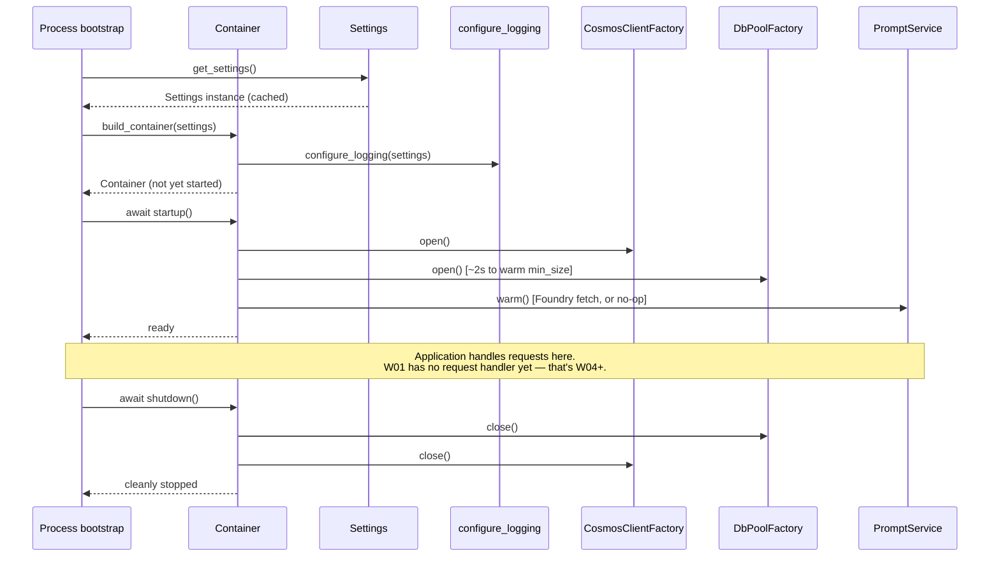
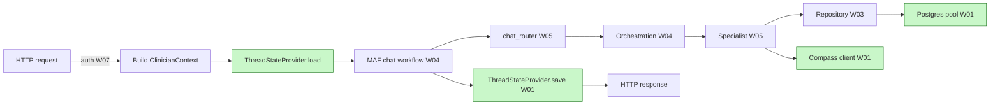

# W01 Foundation — Technical Walkthrough (Onboarding & Maintenance)

**Audience:** engineers who will maintain this code in production, architects reviewing the design, and customer technical stakeholders.
**Reading time:** ~45 minutes cover-to-cover; use as a reference thereafter.
**Companion documents:**

- [architecture-discovery-report.md](../architecture-discovery-report.md) — Phase 0 discovery.
- [solution-design-package.md](../solution-design-package.md) — target design (ADRs, HLD, LLD).
- [engineering-implementation-plan.md](../engineering-implementation-plan.md) — Phase 1 plan.
- [workstreams/workstream-log.md](workstreams/workstream-log.md) — running delivery log.

**Repository under review:** [`epg-maf/`](../epg-maf/) — target Microsoft Agent Framework (MAF) implementation. Sibling to the LangGraph prototype (`agents/`, `config/`, `test_data/`) which is preserved untouched as the reference implementation.

---

## Table of Contents

1. [Orientation — the five mental models](#1-orientation--the-five-mental-models)
2. [Package layout at a glance](#2-package-layout-at-a-glance)
3. [Runtime lifecycle — one turn, one process](#3-runtime-lifecycle--one-turn-one-process)
4. [Folder walkthrough](#4-folder-walkthrough)
   - [4.1 `epg-maf/` (project root)](#41-epg-maf-project-root)
   - [4.2 `src/egp_maf/` (package root)](#42-srcegp_maf-package-root)
   - [4.3 `config/`](#43-config)
   - [4.4 `state/`](#44-state)
   - [4.5 `logging/`](#45-logging)
   - [4.6 `errors.py`](#46-errorspy)
   - [4.7 `infrastructure/`](#47-infrastructure)
   - [4.8 `prompts/`](#48-prompts)
   - [4.9 `services/`](#49-services)
   - [4.10 `di/`](#410-di)
   - [4.11 `tests/`](#411-tests)
5. [Class-by-class deep dive](#5-class-by-class-deep-dive)
6. [Design patterns catalogue](#6-design-patterns-catalogue)
7. [Prototype → target concept map](#7-prototype--target-concept-map)
8. [MAF fit — what W01 does and does not touch](#8-maf-fit--what-w01-does-and-does-not-touch)
9. [How future workstreams will consume W01](#9-how-future-workstreams-will-consume-w01)
10. [Implementation-specific vs. framework-specific](#10-implementation-specific-vs-framework-specific)
11. [Operational hooks (what to log, what to page)](#11-operational-hooks-what-to-log-what-to-page)
12. [Frequently asked questions](#12-frequently-asked-questions)

---

## 1. Orientation — the five mental models

If you carry these five mental models with you as you read the code, everything else falls into place.

### 1.1 W01 is scaffolding, not behaviour

W01 does not produce a single clinical answer. It builds the *frame* on which the specialist agents will be assembled in W03–W05. Nothing here reads a patient row from Postgres, nothing here calls an LLM, nothing here decides which specialist to run.

The value of W01 is **integration ergonomics**. Any code written from W02 onwards can `from egp_maf.di.container import build_container` and immediately have a fully-wired application context.

### 1.2 The DB seam is the load-bearing decision

The single most valuable architectural property of the prototype (per the Discovery Report §24.5) is the `QueryExecutor` seam — a callable that hides which database is behind the tool. W01 preserves that idea and evolves it: instead of a per-tool executor callable, we now have a **pool** owned by a `DbPoolFactory`, which will be injected into every `Repository` in W03.

If you understand nothing else about W01, understand this: `DbPoolFactory` is not "just infrastructure". It is the seam that lets us swap DuckDB → PostgreSQL without touching any specialist or tool code.

### 1.3 Two-schema privacy is a first-class type

The prototype's family-history agent applies a "strip privacy fields before returning" transformation on the way out of the specialist. In W01 we prepare for pushing that transformation *earlier* — into the Repository layer in W03. The state model in `state/session_document.py` treats specialist output slots as opaque `dict[str, Any]` payloads deliberately, so that the Repository is the party that decides which projection to hand out. That choice will be visible from the type system in W05.

### 1.4 Everything is constructor-injected

There are exactly two module-level singletons in W01:

- `PROMPT_BUNDLE` — loaded once from disk because prompts are static files.
- `get_settings()` — memoised via `@lru_cache` because reconstructing pydantic settings is expensive and the values do not change during a process's lifetime.

Everything else is constructed by [`build_container()`](../epg-maf/src/egp_maf/di/container.py) and passed by reference. There are no global `_pool`, `_llm`, `_cosmos` variables. This is a deliberate reaction to the prototype's module-level `_executor` pattern.

### 1.5 The prototype is the reference implementation

The prototype in `agents/`, `config/`, `test_data/`, `tests/` is NOT deprecated code. Do not delete it. Do not modify it. It is the byte-parity oracle for every workstream. When you see `tests/parity/*.py`, those tests reach *up out of* `epg-maf/` and read the prototype files directly — that is the point.

---

## 2. Package layout at a glance

```
epg-maf/
├── README.md                     ← Setup + layout summary
├── pyproject.toml                ← Deps, tooling config, test markers
├── .env.example                  ← Local dev env template (no real secrets)
│
├── src/egp_maf/                  ← The package
│   ├── __init__.py               ← Version marker only
│   ├── errors.py                 ← Typed exception taxonomy
│   │
│   ├── config/                   ← Configuration layer
│   │   ├── settings.py           ← Pydantic-settings Settings class
│   │   └── llm_config.py         ← AGENT_LLM_CONFIGS (byte-parity port)
│   │
│   ├── logging/                  ← Structured JSON logging
│   │   └── setup.py              ← configure_logging(), get_logger()
│   │
│   ├── state/                    ← Data contracts
│   │   ├── clinician_context.py  ← Request-scoped identity
│   │   └── session_document.py   ← Persisted session state (Cosmos)
│   │
│   ├── infrastructure/           ← Adapters + connection factories
│   │   ├── db_pool.py            ← Postgres async pool factory
│   │   ├── cosmos_client.py      ← Cosmos async client factory
│   │   └── compass_client.py     ← MAF OpenAIChatClient factory
│   │
│   ├── prompts/                  ← Prompt bundle
│   │   ├── bundle.py             ← Loads the 8 .txt files at import
│   │   └── data/*.txt (×8)       ← Byte-parity prompt payloads
│   │
│   ├── services/                 ← Cross-cutting services
│   │   ├── prompt_service.py     ← PromptService (Foundry with fallback)
│   │   └── thread_state.py       ← ThreadStateProvider (Cosmos CRUD)
│   │
│   └── di/                       ← Dependency injection
│       └── container.py          ← Container + build_container()
│
└── tests/                        ← Test tree
    ├── conftest.py               ← Shared fixtures
    ├── unit/                     ← Fast, no external services
    ├── integration/              ← Requires Postgres + Cosmos emulator
    └── parity/                   ← Byte-parity vs. LangGraph prototype
```

The package deliberately mirrors the *responsibilities* identified in the design, one folder per concern. A new engineer should be able to guess the module path for any responsibility from this layout in seconds.

---

## 3. Runtime lifecycle — one turn, one process

To make the folder walkthrough concrete, here's what a running process will look like after W01 ships (specialists arrive in W05):



Where the request-handling loop will be attached in later workstreams:



The green nodes are the W01 components. Everything else is a future workstream that consumes them.

---

## 4. Folder walkthrough

Each folder gets four passes: **What**, **Why**, **How the prototype did it**, **How this fits MAF**.

### 4.1 `epg-maf/` (project root)

**What.** Standalone Python package sibling to the prototype. Has its own `pyproject.toml`, its own tests, its own `.env.example`. Can be installed on its own — you don't need the prototype to build a wheel of `epg-maf`.

**Why sibling and not a subfolder of the prototype?** Because the prototype IS the reference implementation. Nesting the new code inside it would blur the audit boundary. A sibling folder means a reviewer can `git diff` the two trees to see exactly which prompts, which tables, which SQL are ported and which are new.

**Prototype comparison.** The prototype had no root — its code was scattered in `agents/`, `config/`, `test_data/`. Every folder was in the repo root and it was hard to tell what was "code" vs "docs" vs "seed data".

**MAF fit.** No MAF specifics at this level. `pyproject.toml` declares `agent-framework>=1.0.0b1` as a dependency, but no other project-root file imports MAF.

Notable files:

- `pyproject.toml` — deps, ruff, mypy strict, pytest markers (`unit`, `integration`, `parity`, `slow`).
- `README.md` — hand-written; explains how to set up locally.
- `.env.example` — the ONLY committed file with credential-shaped strings. Every value here is either (a) a placeholder like `replace_me_with_local_dev_key`, or (b) the well-known public Cosmos emulator key (safe to commit — it's the same for every emulator).

### 4.2 `src/egp_maf/` (package root)

**What.** Just an `__init__.py` with a `__version__` string. No re-exports at the package level.

**Why so empty?** Because we want callers to be explicit about what they import. `from egp_maf.services import PromptService` is much clearer than `from egp_maf import PromptService`. That practice pays off in W05 when we start using `import-linter` to enforce that agents cannot import from `services` directly, only through the DI container.

**Prototype comparison.** The prototype's `agents/__init__.py` was empty too — same reason. Continuity preserved.

**MAF fit.** N/A.

### 4.3 `config/`

**What.** Two files: [`settings.py`](../epg-maf/src/egp_maf/config/settings.py) (env-loaded runtime config) and [`llm_config.py`](../epg-maf/src/egp_maf/config/llm_config.py) (per-agent model config).

**Why two files?** Different lifecycles. `Settings` changes per-environment (dev vs prod); `AGENT_LLM_CONFIGS` is code-versioned — its values are reviewed alongside prompts. Keeping them separate means "who owns this?" is answerable at a glance.

#### `settings.py`

- Uses `pydantic_settings.BaseSettings` — same story as the prototype, just extended.
- Every secret is `SecretStr` so `repr(settings)` shows `**********` instead of the value.
- Preserves the prototype's `AliasChoices("LLM_API_KEY", "OPENAI_API_KEY")` for compatibility.
- Adds enums for `DispatchMode` (sequential/parallel) and `PromptsSource` (bundle/foundry) so misspellings become type errors, not runtime bugs.
- Cached via `@lru_cache(maxsize=1) get_settings()`.

**Why not read config from Key Vault directly here?** Because that would couple every process to Key Vault at construction time. Instead, ACA resolves Key Vault references into environment variables at container start (`secretRef` bindings), and `Settings` reads env vars. This means unit tests never need Key Vault.

#### `llm_config.py`

- Byte-parity port of the prototype's `AGENT_LLM_CONFIGS` dict. Seven agents (`chat`, `main`, and five specialists). `chat` = gpt-5.1, everything else = gpt-4.1.
- Uses `@dataclass(frozen=True)` — the prototype used `@dataclass` (not frozen). Frozen is safer against accidental mutation.
- Exposes `KNOWN_AGENT_NAMES: frozenset[str]` for compile-time safety in downstream code.

**How future workstreams consume this.** `LlmClientFactory` (see 4.7) reads `AGENT_LLM_CONFIGS` to know which model to configure for each agent. When we add a new agent (e.g. a report agent in Phase 3), the ONE place to edit is `AGENT_LLM_CONFIGS`.

### 4.4 `state/`

**What.** Data contracts, no I/O. Two files:

- [`clinician_context.py`](../epg-maf/src/egp_maf/state/clinician_context.py) — `ClinicianContext`, a request-scoped identity object.
- [`session_document.py`](../epg-maf/src/egp_maf/state/session_document.py) — `SessionDocument` (persisted in Cosmos), `SessionMessage`, `CURRENT_SCHEMA_VERSION`.

**Why in its own folder?** These are the vocabulary of the whole system. Every future workstream will import from `state/` — repositories take `ClinicianContext`, workflow reducers act on `SessionDocument`. Isolating the vocabulary makes it grep-able and diff-able.

**Prototype comparison.** The prototype's state models lived under `agents/*/state/`. In W01 we hoist *shared* state to the top-level `state/` package because it is truly cross-cutting (every specialist will write into `SessionDocument.results`). Domain-specific state (`PRSResultList`, etc.) will still live under `agents/<domain>/state/` when W05 ports them.

**MAF fit.** These types are what the future MAF `Workflow` shared-state will be based on. In W04 we will create thin MAF workflow-state Pydantic models that carry (a) a `ClinicianContext` reference and (b) a hydrated `SessionDocument`. The workflow reducers will produce new `SessionDocument` copies using the convenience mutators (`with_message`, `with_agent_completed`, `without_agent`).

**Design patterns used.**

- **Value Object** — both classes are effectively immutable (`frozen=True` on `ClinicianContext`; `SessionDocument` mutators return copies).
- **Schema-versioned document** — `schema_version: int = 1` on `SessionDocument`. When the document shape changes, `SchemaEvolutionError` will fire and we will write an upgrade path.

### 4.5 `logging/`

**What.** A single [`setup.py`](../epg-maf/src/egp_maf/logging/setup.py) that configures `structlog` and returns a bound logger.

**Why not `logging.getLogger(__name__)` per module?** Because we want structured events, not text lines. Every log record must have `service`, `service_version`, `env`, plus event-specific structured fields. That is the schema Application Insights + Log Analytics will index. The prototype had no logging at all; going straight to structured means we never have to migrate.

**Prototype comparison.** The prototype had zero logging beyond two `logger.warning` calls in `variant_annotations`. `Settings.log_level` was declared but never read. W01 makes both real.

**MAF fit.** MAF has no opinion on logging. This is entirely our choice, and it will be the substrate for the W08 OpenTelemetry instrumentation.

**Design pattern.** Structured logging with a **shared processor pipeline** (structlog processors are pipe-and-filter). Dev vs. prod branches on the final renderer only.

### 4.6 `errors.py`

**What.** Typed exception taxonomy. Every exception has a stable `error_code: str` and `http_status: int` class attribute so the future API layer (W07 auth + a later HTTP layer) can uniformly render error responses.

**Why here, not per-module?** Because the exception taxonomy is a public contract of the system. Downstream systems (mostly LAW alert queries) will filter by `error_code`. Keeping every code in one file makes the contract auditable in a single pull request.

**Prototype comparison.** The prototype had no typed exceptions — every failure surface was a `RuntimeError("descriptive text")`. Grepping the log for a specific failure was pattern matching on strings. In W01 we replace strings with types.

**Existing entries:**

| Class | HTTP | Where it fires |
|---|---:|---|
| `EgpError` | 500 | base class |
| `ConfigurationError` | 500 | Settings / factories, wrong or missing config |
| `PromptNotFound` | 500 | PromptService given an unknown prompt name |
| `DatabaseUnavailable` | 503 | Postgres pool open/connect failure |
| `CosmosUnavailable` | 503 | Cosmos client open/read/write failure (non-conflict) |
| `SchemaEvolutionError` | 500 | Loaded a `SessionDocument` with unknown `schema_version` |
| `ConcurrencyConflict` | 409 | ETag write conflict that could not be reconciled |

Future workstreams will grow this file — never shrink it. Removing an `error_code` is a breaking change to alert queries.

### 4.7 `infrastructure/`

**What.** Adapters and connection-lifecycle factories. Three files, one class each.

Everything in this folder holds a resource that must be `open()`-ed and `close()`-d. The DI container calls their lifecycle methods explicitly (see 4.10). Nothing here calls the network at import time.

#### 4.7.1 `db_pool.py :: DbPoolFactory`

**Purpose.** Owns the `psycopg 3` async connection pool. Builds a conninfo string from `Settings`, opens the pool at startup, exposes it via a property, closes it at shutdown.

**Why factory + property instead of just returning a pool from `build_container`?** Two reasons:

1. The pool is a lifecycle-heavy resource. We want to open it inside `container.startup()` (async), not at container construction time.
2. Repositories (W03) will inject `DbPoolFactory` and call `.pool` inside their methods. This lets us swap the underlying pool without touching Repository code — a Phase 3 optimisation (multi-region Postgres, e.g.) becomes a factory-level change.

**Where the SQL restrictions live.**

- Per-connection `SET SESSION CHARACTERISTICS AS TRANSACTION READ ONLY`. If a bug ever tried to `INSERT` into a clinical table, Postgres would reject it before it left the client.
- `statement_timeout` set server-side via the `options=-c statement_timeout=<ms>` conninfo option. Design ADR-022's 30s cap is enforced by Postgres, not by application code.
- `application_name=egp-maf` so LAW can distinguish our sessions from any ad-hoc SQL.

**Managed-identity plumbing.** `DbPoolFactory` accepts a `token_provider: Callable[[], str] | None`. In production this is a `DefaultAzureCredential().get_token(...).token` call. In tests it is a stub returning a fixed string. The point is that `azure-identity` is not a hard test dependency.

**Prototype comparison.** The prototype opened a fresh DuckDB connection **per tool call** (`agents/*/tools/tools.py`). That was fine because DuckDB connections are microseconds to open; PostgreSQL connections are not. The pool is the single biggest reliability delta in W01.

**MAF fit.** None. MAF has no opinion on databases. The pool is entirely our own runtime.

**Design patterns.**

- **Factory + Lazy Init.** Pool is only opened when `open()` is called.
- **Async context manager** (via `psycopg_pool.AsyncConnectionPool.connection()`).
- **Dependency Injection** — the `token_provider` is injected in tests.

#### 4.7.2 `cosmos_client.py :: CosmosClientFactory`

**Purpose.** Same shape as `DbPoolFactory` but for Cosmos DB. Opens `azure.cosmos.aio.CosmosClient`, exposes a `client` property, closes both the client and its credential on shutdown.

**Why so similar to `DbPoolFactory`?** Because they solve the same *shape* of problem: a resource that needs to open before requests, close after requests. The visual parallelism is deliberate — a new engineer only needs to learn the shape once.

**Auth precedence.**

1. `COSMOS_USE_MANAGED_IDENTITY=true` → `DefaultAzureCredential`.
2. Static account key.
3. Neither → `ConfigurationError` (fail closed).

Note: the third branch **must** be enforced by policy in prod. In `Settings.is_production()` we do not yet fail the boot — but a policy gate in the Bicep templates (W11) will reject a prod deployment with `COSMOS_KEY` set.

**Prototype comparison.** Nothing. The prototype used LangGraph's dev server checkpointer, which is in-memory only.

**MAF fit.** In W04, this factory feeds the MAF checkpointer adapter. The adapter will consume `ThreadStateProvider` (which itself consumes this factory), so the MAF workflow gets its thread state from Cosmos with no direct MAF ↔ Cosmos coupling.

#### 4.7.3 `compass_client.py :: LlmClientFactory`

**Purpose.** Constructs and caches one MAF `OpenAIChatClient` per agent name (`prs`, `chat`, `main`, etc.). Every client points at the same APIM base URL and carries the same subscription key; only `model_id` differs per agent.

**The pattern is different from Postgres/Cosmos.** `LlmClientFactory` is NOT a `open()`/`close()` factory because `OpenAIChatClient` is stateless — it holds no sockets. It's just a Python object. The factory's job is to *cache* the constructed clients so we don't rebuild them per request.

**Why a factory at all, then?** Two reasons:

1. Unit tests can inject a `client_constructor` callable and get back a stub without importing MAF. That keeps our unit tests fast and dependency-light.
2. It's the ONE place that talks to `agent_framework.openai` at import time. If MAF's client API changes, we edit one file.

**Prototype comparison.** The prototype had `get_llm(agent_name) -> ChatOpenAI` in `config/llm.py`. Same shape, same dispatch table, different return type. The rename to `LlmClientFactory` is intentional — "factory" signals "will cache and rebuild on demand", which `get_llm` did not.

**MAF fit.** This is the ONLY MAF SDK usage in W01. Every other module is framework-agnostic. If we ever swap MAF for another framework, the surface area of change is this file.

**Design patterns.**

- **Factory.**
- **Object Pool** (via the `_clients` dict cache).
- **Dependency Injection** (`client_constructor` callable for tests).

### 4.8 `prompts/`

**What.** [`bundle.py`](../epg-maf/src/egp_maf/prompts/bundle.py) plus a `data/` subfolder of 8 `.txt` files.

**Why not keep prompts as Python string constants like the prototype?** Three reasons:

1. **Reviewer clarity.** A `.txt` file diff is unambiguous — a Python string diff is coloured by whitespace, `\n`, quote-escapes.
2. **Version pinning.** In W04 we start pulling prompts from the Foundry Prompt Catalog. Foundry versions are text-typed. Keeping our bundle text-typed too means the bundle can be sha-compared to a Foundry version.
3. **PromptService independence.** `PromptService` reads bytes; it does not need to know Python.

**How the bundle loads.** `bundle.py` uses `importlib.resources.files("egp_maf.prompts.data")` to enumerate the `.txt` files at import time. That's the CPython idiom for "read a data file that ships with my package". It works whether the package is installed as a wheel or run in place.

**The single documented deviation from the prototype.** `main_agent.txt` has the duplicated rule 6 removed (Design §15.5). The parity test `test_main_agent_matches_prototype_except_for_rule_6_dupe` reconstructs the expected "prototype minus dupe" so we don't accidentally drift.

**MAF fit.** None yet. In W05, `PromptService.get("prs_agent")` will feed the `ChatAgent(instructions=...)` argument. The `ChatAgent` doesn't care where the string came from.

**Design patterns.**

- **Bundle / Resource Loader.** `importlib.resources` is the standard-library implementation of the pattern.
- **Fallback with graceful degradation** — `PromptService` (in `services/`) knows to fall back to this bundle when Foundry is unreachable.

### 4.9 `services/`

**What.** Cross-cutting services — code that spans multiple concerns and is not a Repository. Two files today:

- [`prompt_service.py`](../epg-maf/src/egp_maf/services/prompt_service.py) — `PromptService`.
- [`thread_state.py`](../epg-maf/src/egp_maf/services/thread_state.py) — `ThreadStateProvider`.

**Why a `services/` folder rather than putting these next to their infrastructure?** Because a Service *composes* infrastructure. `ThreadStateProvider` uses `CosmosClientFactory` — it doesn't own the client. Keeping the Service tier separate makes that composition visible.

**Prototype comparison.**

- The prototype had no PromptService — prompts were in-line constants.
- The prototype's thread state was `langgraph dev`'s in-memory checkpointer. No persistence, no ETag, no TTL. `ThreadStateProvider` is entirely new.

**MAF fit.**

- `PromptService.get(name)` is called by W05 when constructing each `ChatAgent`.
- `ThreadStateProvider` is wrapped by a MAF checkpointer adapter in W04 so the MAF `WorkflowRuntime` sees a "just works" thread store.

**Design patterns.**

- **Repository (loose sense).** `ThreadStateProvider` is essentially a CRUD repository for `SessionDocument`.
- **Strategy.** `PromptService` accepts a `FoundryPromptFetcher` protocol implementation. The default is a null fetcher; a real Foundry fetcher will be plugged in later.
- **Retry with degradation.** ETag conflict on save → retry once with fresh load → raise `ConcurrencyConflict`.

### 4.10 `di/`

**What.** [`container.py`](../epg-maf/src/egp_maf/di/container.py) — the `Container` class + `build_container()` factory.

**Why hand-rolled instead of `dependency-injector` or `punq`?** Because we have ~10 dependencies. A framework would obscure the wiring behind decorators; a 60-line hand-rolled container makes every binding grep-able from `build_container()`. When Varun or Kush read this code in six months, there is no library to learn.

**Prototype comparison.** The prototype had no DI. Modules stored their dependencies in module-level globals (`_executor` in every `tools.py`). W01 replaces that with constructor injection.

**MAF fit.** MAF has no built-in DI. `WorkflowRuntime` will consume the container's services in W04. The container will grow attributes for `Workflow` instances too, but the wiring principle stays the same.

**Design patterns.**

- **Service Locator + Composition Root.** `build_container()` is the composition root (called once at process start). `Container` is the service locator that hands out already-wired singletons.
- **Lifecycle guardian.** The container's async `startup()` / `shutdown()` methods enforce ordering and idempotency.

**One thing to note.** The container is deliberately NOT reflection-driven. There is no `@inject` decorator, no metaclass magic. Every binding lives in `build_container()`. If you want to add a new dependency, you edit that function and the `Container.__init__` signature.

### 4.11 `tests/`

**What.** Three sibling folders — `unit/`, `integration/`, `parity/`. Each folder has its own `__init__.py` and (where needed) its own `conftest.py` for extra fixtures.

**Why three?** Because they have different runtime costs and different guarantees.

- `unit/` — fast, no external services, run on every PR.
- `integration/` — requires Postgres + Cosmos emulator, gated behind `EGP_TEST_POSTGRES=1` / `EGP_TEST_COSMOS=1` env vars so they only run when a developer opts in.
- `parity/` — reaches up out of `epg-maf/` and reads the prototype files directly. Skipped if the prototype is not present alongside the checkout (defensive — someone might install `epg-maf` as a wheel).

**Prototype comparison.** The prototype has integration tests under `agents/*/tests/`. We do not remove them. In W03 we start running them against our new Repositories through the parity harness (Engineering Plan §7.3).

**Test-marker discipline.** `pyproject.toml` declares four markers: `unit`, `integration`, `parity`, `slow`. Every test file uses these — no test is unmarked. `pytest -m "not integration"` is the canonical PR-time invocation.

---

## 5. Class-by-class deep dive

The classes that a maintainer will look at most often.

### 5.1 `Settings` — `config/settings.py`

**Role.** Single source of truth for runtime configuration.

**Public API.**

| Field / method | Purpose |
|---|---|
| `env`, `service_version`, `log_level` | Environment metadata (feeds logs + metrics) |
| `llm_api_key`, `llm_base_url`, `llm_timeout_seconds` | Compass via APIM |
| `postgres_*` (10 fields) | Postgres connection + pool + timeouts + role |
| `cosmos_*` (5 fields) | Cosmos endpoint, database, container, auth, TTL |
| `prompts_source`, `prompts_foundry_endpoint`, `prompts_foundry_timeout_seconds` | Prompt loader behaviour |
| `orch_dispatch_mode`, `orch_max_fanout_width`, `orch_iteration_budget` | Orchestration flags (kept off in W01, wired in W06) |
| `credentials_are_valid()` | Returns True if credentials are consistent (password OR managed identity for both PG and Cosmos) |
| `is_production()` | Convenience |

**Failure modes.** Any missing required field → `pydantic.ValidationError` at construction. Any out-of-range integer (e.g. `POSTGRES_POOL_MAX_SIZE=99999`) → same. The process fails fast at boot — this is a feature, not a bug.

**Maintenance rule.** When you add a new config field, always give it a sane default. The only field allowed to be required is `llm_api_key`.

### 5.2 `AgentLlmConfig` and `AGENT_LLM_CONFIGS` — `config/llm_config.py`

**Role.** Byte-parity port of the prototype's per-agent LLM configuration table.

**Why frozen?** Because the values are effectively constants. `chat` will always use the strongest model in this codebase; a runtime mutation would be a bug.

**Change discipline.** Any edit to this dict is reviewed as a semver-affecting change:

- Adding an agent → minor bump.
- Changing a model → **needs BIX sign-off** (potential clinical-behaviour delta).
- Changing a temperature → **needs BIX sign-off** (breaks determinism).

### 5.3 `SessionMessage` — `state/session_document.py`

**Role.** One message in the conversation. Has a role (`user`/`assistant`/`system`/`tool`), content, timestamp, optional message id.

**Why explicit `Literal` on role?** Because MAF distinguishes `system` and `tool` messages, and we want the same distinction visible in stored state. `str` would be too permissive.

### 5.4 `SessionDocument` — `state/session_document.py`

**Role.** The persisted Cosmos document.

**Public API.**

| Field / method | Purpose |
|---|---|
| `thread_id`, `clinician_id`, `tenant_id`, `patient_id` | Identity (partition key = `clinician_id`) |
| `messages: list[SessionMessage]` | Conversation history |
| `agents_completed: list[str]` | Set semantics (dedupe + sort enforced by mutators) |
| `results: dict[str, Any]` | Specialist outputs — typed in W05 |
| `etag: str \| None` (excluded from serialisation) | ETag from Cosmos response header |
| `ttl: int` | Cosmos native TTL (refreshed on save) |
| `schema_version: int` | Forward-compat guard |
| `with_message(msg)` | Returns a copy with an appended message |
| `with_agent_completed(name)` | Returns a copy with the agent added (set semantics) |
| `without_agent(name)` | Removes both completion entry and results slot |

**Maintenance rules.**

- `extra="forbid"` — unknown fields raise. This is intentional strictness. If Cosmos ever serialises a `_rid` or similar system key back, `ThreadStateProvider._document_from_item` strips it before calling `model_validate`.
- Mutators always return copies. Never write `doc.messages.append(...)` — you break the audit trail.
- `etag` is deliberately NOT part of `model_dump(mode="json")`. This is enforced by `Field(exclude=True)`. The reason: the ETag lives in the Cosmos response header, not the document body.

### 5.5 `ClinicianContext` — `state/clinician_context.py`

**Role.** Request-scoped identity. Populated from the Entra ID JWT in W07.

**Public API.**

| Field / method | Purpose |
|---|---|
| `clinician_id`, `tenant_id`, `roles: frozenset[str]`, `token_expires_at` | Claims from JWT |
| `has_role(role)` | Simple predicate |
| `system()` classmethod | Factory for background jobs and tests |
| `to_span_attributes()` | Returns ONLY `clinician_id` and `tenant_id` — deliberately no PHI, no roles list, no expiry |

**Maintenance rule.** `to_span_attributes()` MUST NOT return anything that could constitute PHI. There is no `message_content`, no `patient_id`, no `roles`. Any addition needs a PHI-safety review.

### 5.6 `configure_logging` — `logging/setup.py`

**Role.** Wires `structlog` + stdlib logging at process start.

**Behaviour.** Idempotent (safe to call more than once). Chooses `ConsoleRenderer` (dev) or `JSONRenderer` (preprod/prod) based on `Settings.env`. Every event carries `service`, `service_version`, `env`.

**Maintenance rule.** DO NOT add processors that touch record content beyond what `_add_service_metadata` does. If you need to filter or scrub PHI, that must go through W08's PHI-safe serializer, not this file.

### 5.7 `DbPoolFactory` — `infrastructure/db_pool.py`

**Role.** Lifecycle wrapper around `psycopg_pool.AsyncConnectionPool`.

**Lifecycle.**

- `await open()` — opens the pool, waits for `min_size` connections, sets per-connection READ ONLY.
- `pool` property — returns the pool; raises `DatabaseUnavailable` if unopened.
- `await close()` — closes the pool.
- `utilisation()` — 0–1 gauge for metrics.

**Maintenance rule.** DO NOT expose the pool as a global. Repositories in W03 will take a `DbPoolFactory` in their constructor and call `factory.pool.connection()` inside their methods. That indirection is the seam that lets us swap pools per Postgres region in Phase 3.

### 5.8 `CosmosClientFactory` — `infrastructure/cosmos_client.py`

Structurally identical to `DbPoolFactory`. `open()` creates the client + credential; `close()` closes both; `get_container()` returns the session container proxy. Only difference: Cosmos client is safe to reuse across threads and requests, so we hold a single instance.

### 5.9 `LlmClientFactory` — `infrastructure/compass_client.py`

**Role.** Per-agent client cache.

**Public API.**

| Field / method | Purpose |
|---|---|
| `get(agent_name)` | Returns a cached `OpenAIChatClient` for the agent |
| `config_for(agent_name)` | Returns the `AgentLlmConfig` used to build it |
| `clear()` | Drops all cached clients (tests only) |

**Maintenance rule.** DO NOT bypass `LlmClientFactory` and construct `OpenAIChatClient` directly elsewhere. If you do, you lose per-agent stratification and cost accounting. The factory is the single control point.

### 5.10 `PROMPT_BUNDLE` and `load_bundle` — `prompts/bundle.py`

**Role.** Static loading of the 8 prompt files at import time.

**Maintenance rule.** DO NOT `PROMPT_BUNDLE[name] = "..."` — you'd mutate a module-level dict and break parity tests. Always instantiate `PromptService` for a scoped view.

### 5.11 `PromptService` — `services/prompt_service.py`

**Role.** Runtime prompt access with Foundry-first, bundle-fallback logic.

**Public API.**

| Field / method | Purpose |
|---|---|
| `await warm()` | One-shot startup fetch. Idempotent. No-op in bundle mode. |
| `get(name)` | Returns text; raises `PromptNotFound` on unknown name |
| `names()` | Sorted list of known prompt names |
| `fallback_count` | Number of prompts that fell back to bundle in the last `warm()` |

**Maintenance rule.** All prompt lookups go through this service — do not import from `bundle.py` directly outside `PromptService` and tests. This ensures the future Foundry override is honoured.

### 5.12 `ThreadStateProvider` — `services/thread_state.py`

**Role.** Cosmos-backed session CRUD.

**Public API.**

| Field / method | Purpose |
|---|---|
| `await load(thread_id, clinician_id)` | Returns `SessionDocument` or `None` |
| `await save(doc)` | ETag-conditional upsert; returns doc with fresh etag |
| `await delete(thread_id, clinician_id)` | Idempotent delete |

**Maintenance rules.**

- Always pass both `thread_id` AND `clinician_id` to `load` and `delete` — the partition key is `clinician_id`, and Cosmos will 400 you if it's missing.
- `save` refreshes `last_activity` and `ttl` unconditionally. That is deliberate: activity extends session lifetime.
- ETag conflict → one retry with fresh load, then `ConcurrencyConflict`. Do not silently swallow.

### 5.13 `Container` and `build_container` — `di/container.py`

**Role.** Composition root + lifecycle owner.

**Behaviour.**

- `build_container(settings=None)` configures logging AND wires all services. Cheap.
- `await container.startup()` opens Cosmos → Postgres → warms prompts. Idempotent.
- `await container.shutdown()` closes Postgres → Cosmos. Idempotent. Never raises.

**Failure modes.** If startup fails after some resources are open, we call `shutdown()` before re-raising. Handles are never leaked.

**Maintenance rule.** All new singletons (Repositories, workflows, agents) get added as attributes on `Container` and wired inside `build_container()`. **Do not** introduce a global from anywhere else in the codebase.

---

## 6. Design patterns catalogue

The patterns we deliberately use, and the ones we deliberately do not.

### 6.1 Patterns present

| Pattern | Where | Why |
|---|---|---|
| **Factory** | `DbPoolFactory`, `CosmosClientFactory`, `LlmClientFactory` | Lifecycle + caching + injection point for tests |
| **Composition Root** | `build_container()` | One place declaring every binding |
| **Service Locator (bounded)** | `Container` attributes | Trade-off: readability over hidden magic |
| **Value Object** | `ClinicianContext`, `SessionDocument`, `SessionMessage`, `AgentLlmConfig` | Immutable-ish, self-validating |
| **Bundle / Resource Loader** | `prompts/bundle.py` | Prompts as byte-equal files |
| **Fallback with degradation** | `PromptService.warm()` | Foundry down → bundle |
| **Strategy** | `FoundryPromptFetcher` protocol | Real fetcher plugged in later |
| **Retry with capped backoff** | `ThreadStateProvider.save` | ETag conflict path |
| **Async lifecycle** | `Container.startup/shutdown` | Explicit ordering |
| **Structured logging** | `logging/setup.py` | Machine-parseable audit trail |
| **Typed exception taxonomy** | `errors.py` | Stable error contract |

### 6.2 Patterns deliberately NOT used

| Pattern | Why not |
|---|---|
| **Global registry** | Prototype had `_executor` per module; we replaced it with DI on purpose |
| **Reflection-driven DI** | Framework magic obscures wiring for a team new to the codebase |
| **Singleton with global access** | Only two: `PROMPT_BUNDLE` and cached `Settings` — both static, both reviewed |
| **Message bus / event dispatcher** | Not needed; MAF workflow runtime is our event substrate in W04 |
| **Repository ORM (e.g. SQLAlchemy)** | Design ADR-005: our SQL is provenance-aware; ORM would obscure the exact SQL |
| **Custom exception hierarchy per layer** | Every exception inherits from a single `EgpError` for one uniform response formatter |

---

## 7. Prototype → target concept map

For architects doing a side-by-side.

| Prototype concept | Target concept | Where |
|---|---|---|
| `config/settings.py` | `Settings` (extended) | `config/settings.py` |
| `config/llm.py::AGENT_LLM_CONFIGS` | `AGENT_LLM_CONFIGS` (byte-parity) | `config/llm_config.py` |
| `config/llm.py::get_llm(agent)` returning `ChatOpenAI` | `LlmClientFactory.get(agent)` returning `OpenAIChatClient` | `infrastructure/compass_client.py` |
| `duckdb.connect(...)` per tool call | `DbPoolFactory` (opened once, pool per replica) | `infrastructure/db_pool.py` |
| No thread persistence (dev server checkpointer) | `SessionDocument` in Cosmos via `ThreadStateProvider` | `state/session_document.py`, `services/thread_state.py` |
| Prompts as Python triple-quoted strings | Prompts as `.txt` files + `PromptService` | `prompts/data/*.txt`, `prompts/bundle.py`, `services/prompt_service.py` |
| No logging | Structured `structlog` JSON | `logging/setup.py` |
| Module-level `_executor` mutation | Constructor injection everywhere | `di/container.py` |
| No auth context | `ClinicianContext` (immutable, propagated by workflow state in W04) | `state/clinician_context.py` |
| No typed errors | `errors.py` with `error_code` + `http_status` per class | `errors.py` |

---

## 8. MAF fit — what W01 does and does not touch

**Does touch (one file).**

- `infrastructure/compass_client.py` — imports `agent_framework.openai.OpenAIChatClient` lazily.

**Does not touch (yet).**

- `WorkflowBuilder`, `Workflow` — W04.
- `Executor` (message-driven handlers) — W04.
- `ChatAgent` (ReAct + tools) — W05.
- `ai_function` (tool binding) — W03.
- Sub-workflow composition (chat → orchestration) — W04.
- MAF checkpointer adapter (Cosmos-backed) — W04.
- MAF fan-out primitives (parallel dispatch) — W06.

**Rationale.** Isolating MAF to one file at foundation time means the rest of W01 could be reused with a different framework tomorrow (Semantic Kernel, custom orchestrator, etc.) with no code changes. That is the value of the seam.

---

## 9. How future workstreams will consume W01

Concrete usage plan per downstream workstream:

| Workstream | Consumes | Adds |
|---|---|---|
| **W02 Data Layer** | `Settings`, `DbPoolFactory`, `errors.py`, `ClinicianContext`, `logging/setup` | Alembic + role SQL + `IRepository` base class + `ProvenanceService` + `AuthzPolicy` (allowlist v1) |
| **W03 Repositories & Tool Shims** | Everything in W01, plus W02's base | 5 domain repositories with construction-time provenance, family-history privacy strip at Repository, deterministic JSON parser, 14 `ai_function` shims |
| **W04 Workflow Skeleton** | `LlmClientFactory`, `PromptService`, `ThreadStateProvider`, `SessionDocument`, `Container` | MAF `WorkflowRuntime` + chat & orchestration workflows + fan-out edges (size 1) + shared-state Pydantic models |
| **W05 Specialists** | `LlmClientFactory.get(agent)`, tool shims (W03), workflow (W04) | 5 `ChatAgent`-backed specialists + specialist output types tightening `SessionDocument.results` |
| **W06 Parallel & Mode-Parity** | `Settings.orch_dispatch_mode`, `SpecialistDispatchSet` (W04), reducers | Parity harness, per-mode telemetry, enablement gate doc |
| **W07 Auth** | `ClinicianContext`, `errors.py::AccessDenied` (added there) | FastAPI JWT middleware, Entra app registration, RBAC allowlist |
| **W08 Observability** | `logging/setup.py`, `DBProvenance` (in W03) | OTEL SDK, span taxonomy, metrics, PHI-safe serializer, provenance ↔ trace ids |
| **W09 Resilience** | `Container.startup/shutdown`, error taxonomy | APIM retry policy XML, DB retries, Cosmos ETag retry metrics, recursion budget |
| **W10 Testing & Load** | `parity/` test tier, `PromptService` bundle | Golden set, Foundry Evaluations, Locust, chaos, PHI CI |
| **W11 Cutover** | `Settings.env == "prod"`, `is_production()` | Prod deploy, dashboards, alerts, runbooks |

---

## 10. Implementation-specific vs. framework-specific

For architects who ask "which of these choices could change under a different framework?"

**Framework-specific (would change under a non-MAF framework):**

- `LlmClientFactory._default_constructor` — imports `agent_framework.openai.OpenAIChatClient`.
- (Later) MAF-based workflow / executor / agent files.

**Implementation-specific (our choices, would stay the same under any framework):**

- `Settings` shape and field names.
- `AGENT_LLM_CONFIGS` shape (per-agent model + temperature).
- `SessionDocument` shape and partition key.
- `ClinicianContext` shape.
- `structlog` for logging.
- Hand-rolled DI container.
- Prompt bundle mechanism.
- Postgres pool via `psycopg 3`.
- Cosmos DB for thread state.
- Error taxonomy structure (`error_code` + `http_status`).

**Deployment-specific (would change under a different Azure landing zone or self-hosting):**

- Managed identity for Postgres (Entra token password callback).
- Cosmos SDK's `DefaultAzureCredential` path.
- APIM as the LLM gateway (baked into the `llm_base_url` value; not a code decision).

---

## 11. Operational hooks (what to log, what to page)

Even though W01 has no request path, several failure modes are already observable.

### 11.1 Startup

| Event | Meaning | Action |
|---|---|---|
| `container.startup.begin` | Container is bootstrapping | Info only |
| `container.startup.cosmos_open` | Cosmos client opened | Info only |
| `container.startup.db_pool_open` | Postgres pool opened + `min_size` connections warm | Info; carries `min_size`, `max_size` |
| `container.startup.prompts_warm` | Prompts fetched (or fallen back) | Warn if `fallback_count > 0` in prod |
| `container.startup.complete` | Container is ready to serve | Info only |
| `container.startup.failed` | Startup failed; shutdown was called | **Page — container will not serve traffic** |
| `container.shutdown.*` | Shutdown path | Info only; errors are logged but not propagated |

### 11.2 Runtime (foundation only)

| Event | Meaning | Action |
|---|---|---|
| `prompt.fallback` | Foundry fetch failed or returned None for a specific prompt | Warn; investigate Foundry availability. In prod, `fallback_count > 0` for ≥ 5 min → alert |
| `session.save.etag_conflict` (attempt 1) | Concurrent write; retrying | Info; expect one per turn under high concurrency, more is a symptom of thread-id collision |
| `db.pool.open_failed` | Pool couldn't open | **Page** |
| `db.pool.configure_failed` | Per-connection setup (`READ ONLY`) failed | Warn; likely a role permissions issue |

### 11.3 Metrics defined but not yet wired

W01 declares metric-shaped observations but does not emit OTEL metrics. Wiring lands in W08. The observations already in the code:

- `DbPoolFactory.utilisation()` — gauge, 0–1.
- `PromptService.fallback_count` — counter.

---

## 12. Frequently asked questions

### 12.1 "Why is `SessionDocument.results` typed as `dict[str, Any]`? That's not type-safe."

Deliberate. Specialist output types are defined in W05 when the specialist agents actually exist. Introducing them in W01 would either (a) require importing from a not-yet-existing module, or (b) create speculative types that we then have to reconcile with reality.

The typed union will land in W05, alongside the specialist implementations, with a schema version bump if the shape changes.

### 12.2 "Why is there a two-line `Settings` file at the workspace root and another inside `epg-maf/`?"

There isn't. The workspace root's `config/settings.py` belongs to the prototype (reference implementation) and is untouched. The `epg-maf/src/egp_maf/config/settings.py` is the new one. They are independent.

### 12.3 "The Postgres pool has `read_only=True` per session characteristic — why also a read-only role?"

Belt-and-braces. The session characteristic is a per-transaction guard; it can be reset by a rogue `SET SESSION CHARACTERISTICS AS TRANSACTION READ WRITE`. The role permission is a server-side denial that cannot be reset by client SQL. Both together mean the code physically cannot mutate clinical data.

### 12.4 "Where does the family-history privacy strip happen?"

Not in W01. Currently `SessionDocument.results` accepts an opaque payload. In W03 the `FamilyHistoryRepository` returns *only* the public projection when writing to session state; the internal projection stays inside the specialist for audit only. The Repository is the last mile that decides.

### 12.5 "Why is `PromptService.get` synchronous when everything else is async?"

Because `get` reads from an in-memory dict that was populated by the async `warm()`. Making it async would be a lie about the operation's cost. The design contract is: **warm at startup; get synchronously at runtime**.

### 12.6 "The Cosmos emulator key is committed in `.env.example`. Isn't that a secret?"

No — it is the public well-known key that ships with every Microsoft Cosmos DB emulator. It is documented as such in Microsoft's own docs and works only against `localhost:8081`. Committing it is safe and expected.

### 12.7 "Can I skip the DI container and just import `settings` and `pool` where I need them?"

You can — the code doesn't prevent it — but you will lose testability. Every future test will need to reset module globals, and the shutdown ordering guarantees will not hold. Every code review will flag it. Please don't.

### 12.8 "Where do I put a new cross-cutting service in W02+?"

- If it composes infrastructure (like `PromptService`, `ThreadStateProvider`) → `services/`.
- If it holds a network resource with an open/close lifecycle → `infrastructure/`.
- If it is a data contract (Pydantic model, dataclass) → `state/` for cross-cutting, `agents/<domain>/state/` for domain-specific (aligning with the prototype's layout).
- Bind it in `Container.__init__` and wire it in `build_container()`.

### 12.9 "How do I know a change I'm making is safe?"

Three checks:

1. `pytest -m "not integration"` — full unit + parity suite, no external services.
2. `pytest -m parity` — proves you didn't drift from the prototype.
3. `git status --porcelain agents/ config/ test_data/ tests/` — must be empty (prototype untouched).

If all three pass, you have not broken the audit boundary.

### 12.10 "Who owns which file?"

| Layer | Owner today |
|---|---|
| `config/` | Delivery Lead (schemas), SA (values) |
| `state/` | SA (schemas), BE1 (mutators) |
| `infrastructure/` | PE (factories), BE1 (integration tests) |
| `prompts/data/` | BIX SME (content), SA (approval) |
| `services/` | BE2 (PromptService), BE1 (ThreadStateProvider) |
| `di/` | Delivery Lead (structure), Everyone (wiring) |
| `logging/` | PE (config), Everyone (usage) |
| `errors.py` | Delivery Lead + SA (contract) |
| `tests/parity/` | QA (harness), Delivery Lead (fixtures) |

---

## Appendix — Where to look next

- **Read next:** [workstreams/workstream-log.md](workstreams/workstream-log.md) — the running delivery log with W01's checklist and future workstream stubs.
- **Design context:** [solution-design-package.md](solution-design-package.md) sections 4 (LLD), 10 (Tool Design), 11 (PostgreSQL), 12 (Repositories), 13 (Shared State).
- **Discovery context:** [architecture-discovery-report.md](architecture-discovery-report.md) sections 4 (Agent Analysis), 5 (Tool Analysis), 6 (Database Analysis), 22 (Migration Risks), 24 (Final Recommendations).

*If a reader has questions this document does not answer, please add them here alongside the answer — this document is the onboarding contract and it should grow to serve future engineers.*

*— Delivery Lead, 2026-07-09*
