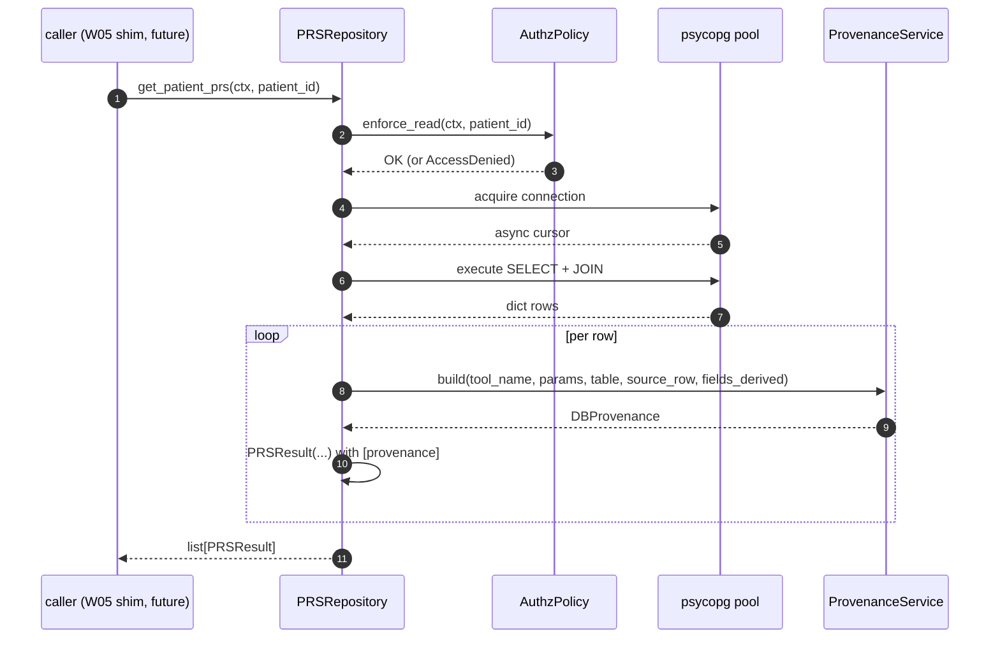

# W03 Domain Repositories & Tool Shims — Walkthrough

**Purpose:** onboarding-friendly reference for W03. Deliberately concise.
For W01/W02 concerns not touched here, see the earlier walkthroughs.

**Companion documents:** [architecture-discovery-report.md](../architecture-discovery-report.md) · [solution-design-package.md](../solution-design-package.md) · [engineering-implementation-plan.md](../engineering-implementation-plan.md) · [workstreams/workstream-log.md](../workstreams/workstream-log.md).

---

## 1. What W03 shipped

**Data-plane completeness** — every SQL query the prototype tools ran is
now available as an async Python method returning typed domain models.

```
epg-maf/src/egp_maf/
├── state/results/                       ← NEW (6 files)
│   ├── prs.py                            (PRSKey, PRSAnnotation, PRSResult, PRSResultList)
│   ├── genomic_variants.py               (Key, Annotation, SampleData, CoreAnn, ExtendedAnn, PARSER, Result, ResultList)
│   ├── family_history.py                 (Key, Annotation, Result(internal+public), ResultList(both))
│   ├── pgx.py                            (Key, Annotation, DrugResult, ResultList)
│   ├── phenotype.py                      (Key, DiseaseResult, ResultList)
│   └── __init__.py
│
└── services/repositories/                ← 5 new files added to the W02 base
    ├── prs.py                            (PRSRepository: 3 methods)
    ├── genomic_variants.py               (GenomicVariantsRepository: 3 methods)
    ├── family_history.py                 (FamilyHistoryRepository: 3 methods)
    ├── pgx.py                            (PGXRepository: 3 methods)
    └── phenotype.py                      (PhenotypeRepository: 2 methods)
```

Plus 6 test files (unit + integration + parity vs DuckDB). See
`workstream-log.md::W03` for the enumerated list.

**Explicitly NOT shipped:** `ai_function` MAF tool shims, MAF workflow,
specialists. Those belong to W04/W05 which have the `ChatAgent` context.

---

## 2. The one-picture summary of a domain Repository

Every one of the five repositories follows the same shape. Reading the
PRS Repository is enough to understand the other four.



Contract for every domain Repository:

1. **RBAC first** — patient-scoped methods call `self._authorize(ctx,
   patient_id)` before any SQL.
2. **SQL via `_fetch_all`** — never raw pool access. All driver errors
   surface as `DatabaseUnavailable`.
3. **Provenance at query time** — `get_patient_*` methods build one
   `DBProvenance` per returned row via `self._build_provenance(...)`.
   `explore_*` and `search_*_annotations` return plain keys / rows with
   no provenance (Discovery §5.7).
4. **Typed results, never dicts** — every public method returns a typed
   Pydantic model or a list thereof.

---

## 3. Three notable design decisions

### 3.1 Repositories return `list[<Result>]`, not `<Result>List`

The `<Result>List` wrapper types (e.g. `PRSResultList`,
`GenomicVariantsResultList`) carry **LLM-derived summary fields**
(`summary`, `summary_model`, `pathogenic_count`, `relevant_disease_names`,
`diseases_meeting_threshold`, `genes_assessed`, ...). Repositories can't
populate those because the LLM hasn't run yet.

So Repositories return `list[<Result>]`. The `<List>` types have a
`from_results(...)` factory that computes the programmatic subset
(counts, sets) from the results — LLM-derived fields stay `None`. W05
specialists will call `<List>.from_results(...)`, add LLM outputs, and
attach the whole thing to workflow state.

### 3.2 Family-history privacy split lives on the model, not on a Service

`FamilyHistoryCriteriaResult.to_public()` returns
`FamilyHistoryCriteriaResultPublic` — a type where the three
privacy-sensitive fields (`affected_relative_count`,
`total_relatives_searched`, `search_context_notes`) simply do not exist.
The same fields are stripped from every attached `DBProvenance.source_row`.

Why on the model rather than a Service?

- **The type IS the contract.** Callers cannot forget to strip because
  the public projection cannot even hold the private fields.
- **One place to review**: the strip logic lives in one method, next to
  the type declaration.
- **No mutation** — `to_public()` returns a new instance; the internal
  record still carries the private fields for specialist-side
  interpretation qualification.

The test suite proves both parts of the contract:
`FamilyHistoryCriteriaResultPublic.model_fields` never contains the
three keys, and every provenance record's `source_row` also has them
removed.

### 3.3 `annotations_json` is parsed in Python, not by the LLM

Design ADR-006 was explicit about this: the prototype asked the LLM to
decompose the JSON blob into typed fields (`hgvs_c`, `gnomad_af`, etc.).
That's a silent-hallucination clinical-safety risk.

[`parse_annotations_json`](../../epg-maf/src/egp_maf/state/results/genomic_variants.py)
is a plain Python function called by
`GenomicVariantsRepository.get_patient_genomic_variants` per row. Known
keys promoted to typed slots; unknown keys land in `raw_annotations`
verbatim. Malformed JSON raises `ValueError` — no silent fallback.

By the time W05's specialist sees a variant, `extended_annotations` is
already typed. The LLM is never asked to do JSON parsing.

---

## 4. Class quick reference

| Class | Where | One-line role |
|---|---|---|
| `PRSKey`, `PGXKey`, `PhenotypeKey`, `FamilyHistoryKey`, `VariantKey` | `state/results/<domain>.py` | Compact `explore_*` outputs |
| `PRSAnnotation`, `PGXAnnotation`, `KinshipHistoryAnnotation`, `VariantAnnotation` | same | Typed rows for `search_*_annotations` |
| `PRSResult`, `PGXDrugResult`, `PhenotypeDiseaseResult`, `FamilyHistoryCriteriaResult`, `GenomicVariantResult` | same | `get_patient_*` outputs, one row each, with `provenance` |
| `FamilyHistoryCriteriaResultPublic` | `state/results/family_history.py` | Public projection produced by `.to_public()` |
| `VariantSampleData`, `VariantCoreAnnotations`, `VariantExtendedAnnotations` | `state/results/genomic_variants.py` | Composed into `GenomicVariantResult` |
| `parse_annotations_json` | same | Deterministic JSON parser (ADR-006) |
| `PRSResultList`, `PGXResultList`, `PhenotypeResultList`, `FamilyHistoryResultList*`, `GenomicVariantsResultList` | `state/results/<domain>.py` | Collections with `from_results(...)` factories (W05 uses) |
| `PRSRepository`, `PGXRepository`, `PhenotypeRepository`, `FamilyHistoryRepository`, `GenomicVariantsRepository` | `services/repositories/<domain>.py` | Each has 2 or 3 async methods mirroring the prototype tools |

---

## 5. How W04/W05 will use W03

A W05 specialist wraps a Repository call inside an `ai_function` (MAF tool
shim). The shim is the ONLY thing that decorates our Repository methods
with MAF — Repositories stay framework-agnostic.

```python
# W05 (illustrative, not yet in the codebase):
class PRSSpecialist:
    def __init__(self, repo: PRSRepository, ...):
        self._repo = repo
        # Bind ai_function tool shims to this specialist's ChatAgent

    @ai_function
    async def explore_patient_prs(self, patient_id: str) -> list[dict]:
        # Ctx picked up from workflow state — one place, one line
        ctx = current_clinician_context.get()
        keys = await self._repo.explore_patient_prs(ctx, patient_id)
        return [k.model_dump() for k in keys]
```

W04 will introduce the workflow scaffolding that populates `ctx`. W05
wires shims to `ChatAgent` and adds specialist-level LLM extraction.

---

## 6. Operational notes

- **Runtime.** W03 code runs against a real Postgres. The seeded DB
  (`db/seed/README.md`) is a prerequisite for any integration test.
- **Auth.** Every patient-scoped call goes through `AuthzPolicy.enforce_read`.
  Denial raises `AccessDenied` (HTTP 403).
- **Errors.** Any driver error → `DatabaseUnavailable` (HTTP 503).
  Malformed JSON in `annotations_json` → `ValueError` (bubbled up as
  `DatabaseUnavailable` from the Repository since it happens during row
  processing — the row is unusable).
- **Log events.**
  - `variant.unknown_value` — `structlog` warning when a pathogenicity or
    variant_type falls outside the known-value list.
  - `authz.denied` — RBAC denial (from `AllowlistAuthzPolicy`, W02).

---

## 7. Where to look next

- **Delivery status:** [workstreams/workstream-log.md § W03](../workstreams/workstream-log.md#workstream-w03--domain-repositories--tool-shims-).
- **Design context:** [solution-design-package.md](../solution-design-package.md) §11 (Postgres), §11.7 (Provenance at construction time), §12 (Repository & Service Layer), ADR-006 (JSON parse), ADR-017 (RBAC last-mile).
- **Discovery context:** [architecture-discovery-report.md](../architecture-discovery-report.md) §5 (Tool Analysis), §22 M7 (denormalisation invariant), §24.1 (Preserve list).
- **Prototype reference:** `agents/<domain>/tools/tools.py` and `agents/<domain>/state/schemas.py` for the five domains.

*Last updated: 2026-07-09.*
