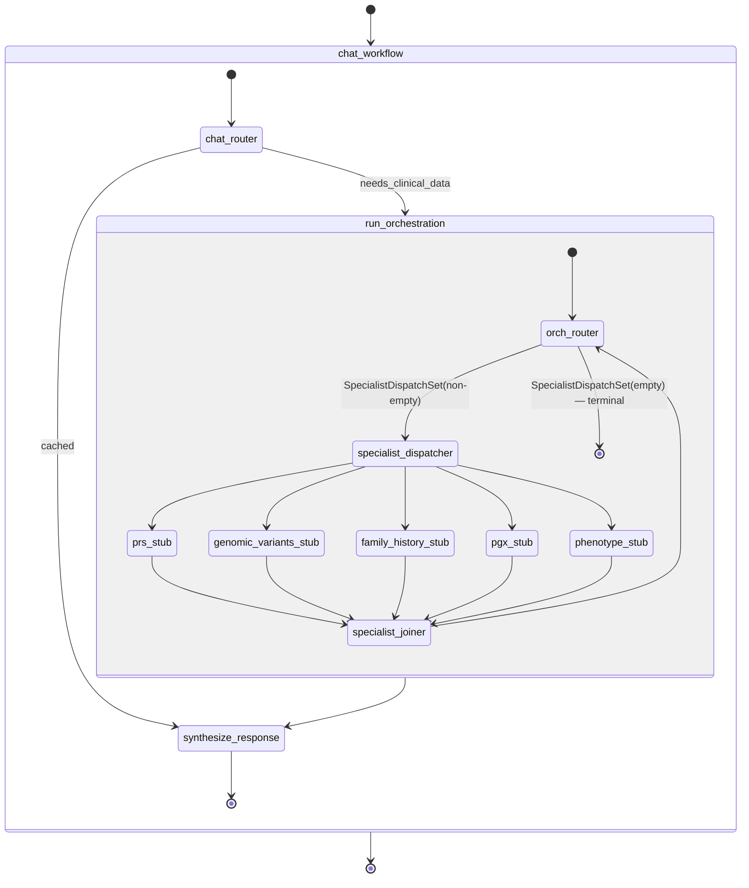

# W04 MAF Workflow Skeleton — Walkthrough

**Purpose:** onboarding-friendly reference for W04. Deliberately concise.
For prior workstreams, see the earlier walkthroughs.

**Companion documents:** [architecture-discovery-report.md](../architecture-discovery-report.md) · [solution-design-package.md](../solution-design-package.md) · [engineering-implementation-plan.md](../engineering-implementation-plan.md) · [workstreams/workstream-log.md](../workstreams/workstream-log.md).

---

## 1. What W04 shipped

The **MAF workflow topology** the specialists (W05) and parallel dispatch
(W06) will slot into — with no `ChatAgent` calls yet.

```
epg-maf/src/egp_maf/workflow/
├── __init__.py
├── state.py               ChatWorkflowState, OrchestrationWorkflowState, reducers, SpecialistSlot, Remove
├── decisions.py           ChatRouterDecision, SpecialistDispatchSet
├── router_llm.py          RouterLlm / OrchRouterLlm protocols + deterministic stubs
├── runtime.py             WorkflowRuntime facade
│
├── chat/
│   ├── chat_router.py             ChatRouterExecutor
│   ├── run_orchestration.py       RunOrchestrationExecutor (sub-workflow invoker)
│   ├── synthesize_response.py     SynthesizeResponseExecutor + strip_provenance + StubSynthesisLlm
│   └── build.py                   build_chat_workflow(deps) → Workflow
│
└── orchestration/
    ├── orch_router.py             OrchRouterExecutor  (dispatch/terminate/budget/mode-sanitisation)
    ├── specialist_stub.py         SpecialistPlaceholderExecutor  (W05 replaces)
    ├── dispatcher.py              SpecialistDispatcherExecutor + SpecialistJoinerExecutor
    └── build.py                   build_orchestration_workflow(deps) → Workflow
```

Plus 7 test files (49 tests) covering state, decisions, every executor,
and 5 real end-to-end `WorkflowBuilder`-built runs. See
`workstream-log.md::W04` for the enumerated list.

**Explicitly NOT shipped:** real `ChatAgent`-backed routers/specialists,
Compass LLM calls, streaming events, auth. Those come in W05/W07/W08.

---

## 2. The topology in one picture



**Phase 1 default:** every `SpecialistDispatchSet` has exactly one name;
four of the five stubs see themselves as un-named and forward state
unchanged so the fan-in barrier completes. **Phase 3 (W06):** flip
`ORCH_DISPATCH_MODE=parallel`, allow larger sets — no code change needed.

---

## 3. Three notable design decisions

### 3.1 Router LLMs are behind a protocol, not baked into the executors

`ChatRouterExecutor` and `OrchRouterExecutor` don't call Compass. They
call `RouterLlm.decide_chat_route(...)` and `OrchRouterLlm.decide_dispatch(...)`
respectively — narrow async protocols with one method each. In W04 the
DI container wires deterministic stubs; in W05 the same seam takes a
real `ChatAgent`-backed implementation with **zero executor changes**.

Why: the executors are the parts we want tested exhaustively (state
mutation, budget, mode sanitisation, fan-in reduction). LLM calls are
integration concerns — they should live behind a seam we can substitute
in tests.

### 3.2 Budget & mode sanitisation are enforced on the wire, not in the prompt

The prototype's router prompt says "emit one specialist at a time".
That's a soft property — an LLM hallucination can break it. `orch_router`:

- **Checks `router_iterations >= orch_iteration_budget` before every LLM
  call.** Breach raises `RoutingBudgetExceeded`, which
  `RunOrchestrationExecutor` catches and translates into graceful
  degradation (whatever's been completed still returns; the user still
  gets a synthesis).
- **Downgrades any multi-element `SpecialistDispatchSet` to a single
  element** when `ORCH_DISPATCH_MODE=sequential`, and caps at
  `ORCH_MAX_FANOUT_WIDTH` otherwise.

These invariants are unit-tested in `test_orch_router.py`. Prompt drift
can't break them.

### 3.3 `agents_completed` uses a set-append reducer with a `Remove` sentinel

Prototype: every specialist manually appended its own name — one bug
and you get duplicates or missing names. W04:

- `apply_agents_completed(current, delta)` is the only mutator.
- `delta` is `str | Remove | list[str | Remove]`.
- Result is deterministically sorted (checkpoint-stable).
- Adding a duplicate is a no-op (set semantics).
- `Remove(name="prs")` drops the name — how the chat router's
  `reset_agents` decision is applied.

Unknown specialist names raise; the type accepts only the 5 valid names.

---

## 4. Class quick reference

| Class / function | Where | One-line role |
|---|---|---|
| `ChatWorkflowState` | `state.py` | Per-turn shared state; owns `ctx`, `messages`, 5 specialist slots, `agents_completed` |
| `OrchestrationWorkflowState` | `state.py` | Sub-workflow shared state; adds `router_iterations` |
| `SpecialistSlot` | `state.py` | Envelope: `status`, `output` (dict in W04), `errors`, `updated_at` |
| `Remove` | `state.py` | Sentinel for dropping a name via `apply_agents_completed` |
| `apply_agents_completed` | `state.py` | Set-append reducer |
| `ChatRouterDecision` | `decisions.py` | LLM output: `needs_clinical_data`, `reason`, `reset_agents` |
| `SpecialistDispatchSet` | `decisions.py` | Router output: `specialists` (set from day 1), `reason`, `requested_diseases` |
| `RouterLlm`, `OrchRouterLlm` | `router_llm.py` | Protocols the executors call — real impl lands in W05 |
| `StubRouterLlm`, `StubOrchRouterLlm` | `router_llm.py` | Deterministic stubs used by W04 tests + default DI container wiring |
| `ChatRouterExecutor` | `chat/chat_router.py` | Routes turn; applies `reset_agents` cascade |
| `RunOrchestrationExecutor` | `chat/run_orchestration.py` | Invokes the orchestration sub-workflow; merges slots back |
| `SynthesizeResponseExecutor` | `chat/synthesize_response.py` | Terminal executor; strips provenance; appends assistant message |
| `strip_provenance` | `chat/synthesize_response.py` | Recursive dict/list stripper (verbatim port from prototype) |
| `OrchRouterExecutor` | `orchestration/orch_router.py` | Dispatch/terminate loop; enforces budget + mode/width sanitisation |
| `SpecialistDispatcherExecutor` | `orchestration/dispatcher.py` | Fan-out source; broadcasts `SpecialistDispatch` to all 5 stubs |
| `SpecialistPlaceholderExecutor` | `orchestration/specialist_stub.py` | W04 stub — replaced by real specialist in W05 |
| `SpecialistJoinerExecutor` | `orchestration/dispatcher.py` | Fan-in barrier; deterministic slot + `agents_completed` merge |
| `WorkflowRuntime` | `runtime.py` | DI-facing facade owning both built workflows |
| `RoutingBudgetExceeded` | `egp_maf.errors` | Typed error: iteration cap breached |
| `SpecialistFailed` | `egp_maf.errors` | Typed error: sub-workflow failure surfaces here in W05 |

---

## 5. How W05 will use W04

W05 makes three narrow substitutions and adds specialist state models:

```python
# W05 (illustrative):
from agent_framework.openai import OpenAIChatClient
from egp_maf.workflow.runtime import WorkflowRuntime
from egp_maf.workflow.decisions import ChatRouterDecision, SpecialistDispatchSet

class CompassChatRouterLlm:
    def __init__(self, client): self._client = client
    async def decide_chat_route(self, *, original_query, agents_completed, cached_domains):
        # ChatCompletion with structured output = ChatRouterDecision
        ...

# In build_container(...):
chat_router_llm = CompassChatRouterLlm(container.llm_client_factory.for_chat())
orch_router_llm = CompassOrchRouterLlm(container.llm_client_factory.for_main())
container.workflow_runtime = WorkflowRuntime(
    settings=settings,
    chat_router_llm=chat_router_llm,
    orch_router_llm=orch_router_llm,
)
```

The `SpecialistPlaceholderExecutor` gets replaced by a
`<Domain>SpecialistExecutor` per domain — each wraps a `ChatAgent`
bound to that domain's Repository via `ai_function` shims (W05 §F07.1
template). **The chat topology, the orch topology, the fan-out edges,
the budget, the state reducers — none of that changes.**

---

## 6. Operational notes

- **Runtime.** `WorkflowRuntime.run_turn(state)` awaits a single non-streaming pass.
- **Errors.**
  - `RoutingBudgetExceeded` (500) — orch loop hit the cap. Caught by `RunOrchestrationExecutor`, degrades to synthesis.
  - `SpecialistFailed` (500) — reserved for W05; sub-workflow catches and returns partial state.
- **Config knobs (from W01 `Settings`):**
  - `ORCH_DISPATCH_MODE=sequential|parallel` (default `sequential`)
  - `ORCH_MAX_FANOUT_WIDTH=1..5` (default `1`)
  - `ORCH_ITERATION_BUDGET=1..100` (default `12` = `2×5+2` per Design ADR-009)
- **Structured log events.** `chat_router.decided`, `orch_router.dispatched|terminal|budget_exceeded|parallel_decision_downgraded|fanout_width_capped`, `specialist.stub_completed`, `specialist_joiner.merged`, `run_orchestration.completed|sub_workflow_failed|no_output`, `synthesize_response.completed`, `workflow_runtime.built`. Every event is JSON in prod, coloured console in dev (W01 setup).
- **Framework version.** `agent-framework 1.10.0`. Two upstream quirks noted in `workstream-log.md::W04 §10`: (a) `add_switch_case_edge_group` has an attribute typo — we use two conditional edges instead. (b) `WorkflowBuilder.build()` wants explicit `output_from=[...]` — we designate the terminal executor.

---

## 7. Where to look next

- **Delivery status:** [workstream-log.md § W04](../workstreams/workstream-log.md#workstream-w04--maf-workflow-skeleton-).
- **Design context:** [solution-design-package.md](../solution-design-package.md) §5 (MAF Architecture), ADR-007 (sub-workflow), ADR-009 (reducer + budget), ADR-013 (fan-out phase-in).
- **Discovery context:** [architecture-discovery-report.md](../architecture-discovery-report.md) §5 (Node/Edge inventory), §21 (LangGraph↔MAF mapping).
- **Prototype reference:** `agents/chat/graph/graph.py`, `agents/main/graph/graph.py`, and the two `state.py` files.

*Last updated: 2026-07-09.*
