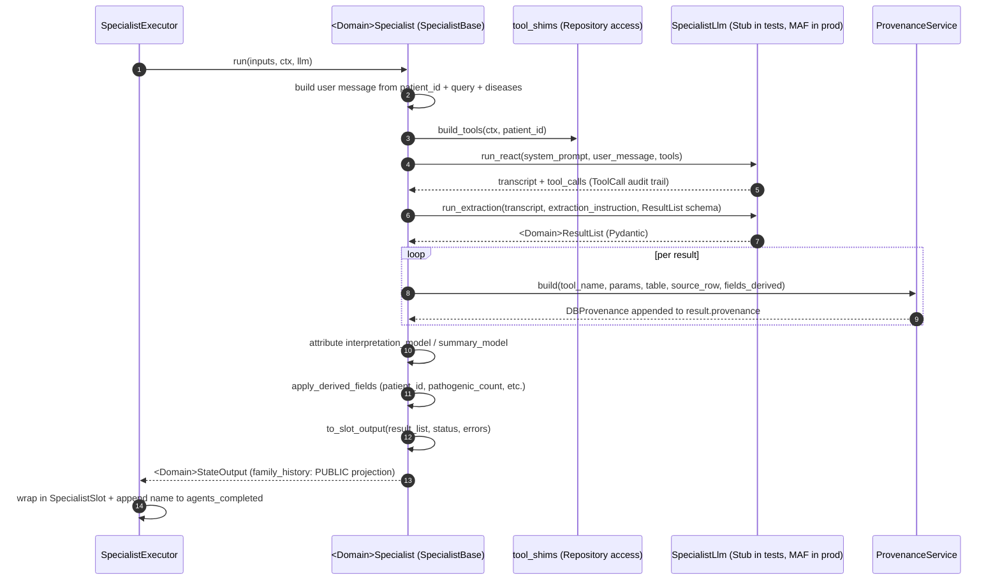
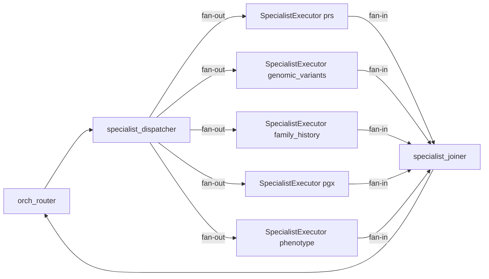

# W05 Specialist Agents — Walkthrough

**Purpose:** onboarding-friendly reference for W05. Deliberately concise.
For prior workstreams, see the earlier walkthroughs.

**Companion documents:** [architecture-discovery-report.md](../architecture-discovery-report.md) · [solution-design-package.md](../solution-design-package.md) · [engineering-implementation-plan.md](../engineering-implementation-plan.md) · [workstreams/workstream-log.md](../workstreams/workstream-log.md).

---

## 1. What W05 shipped

The 5 real specialists — each a ReAct + structured-extraction pipeline
over the W03 Repositories — plus the plumbing that lets them slot into
the W04 workflow topology without any code change to the workflow.

```
epg-maf/src/egp_maf/agents/                       ← NEW (11 files)
├── __init__.py
├── base.py                 SpecialistBase (template) + SpecialistLlm protocol + ToolCall + attach_provenance_to_results
├── state_outputs.py        5 <Domain>StateOutput types (typed payloads for SpecialistSlot)
├── tool_shims.py           14 @tool-decorated shims across the 5 domains
├── llm_bridge.py           MafSpecialistLlm (real MAF Agent-backed) + StubSpecialistLlm (test double)
├── registry.py             SpecialistRegistry + build_specialist_registry(...)
├── prs.py                  PRSSpecialist
├── genomic_variants.py     GenomicVariantsSpecialist (JSON parsing already done by Repository)
├── family_history.py       FamilyHistorySpecialist (privacy strip on state-output construction)
├── pgx.py                  PGXSpecialist
└── phenotype.py            PhenotypeSpecialist

epg-maf/src/egp_maf/workflow/
├── orchestration/specialist_executor.py   ← NEW  (replaces W04 placeholder)
└── router_llm_maf.py                       ← NEW  (real MAF-backed router LLMs)
```

Plus 4 test files (24 tests) — tool-shim coverage, specialist template,
per-domain derived-field + provenance + privacy strip, real
WorkflowBuilder end-to-end. See `workstream-log.md::W05` for the
enumerated list.

**Explicitly NOT shipped:** live LLM integration tests (W07),
shadow-parity harness vs prototype (W06), OTEL spans on tool/LLM calls
(W08), Cosmos-backed checkpointer (W07).

---

## 2. The specialist recipe in one picture

Every specialist runs through the **same 10-step template** defined by
:class:`SpecialistBase.run`. Concrete specialists fill 5 seams; the rest
is inherited.



**Contract for every specialist:**

1. **RBAC first** (inherited from W03 Repository — every tool shim
   authorises before SQL).
2. **Two LLM passes only** — ReAct (with tools) then structured
   extraction (with `response_format=<schema>`). Never mixed.
3. **Provenance on `get_*` results only** — matches Discovery §5.7. The
   `attach_provenance_to_results` helper takes a domain-specific matcher
   callable.
4. **Programmatic derived fields never call the LLM** — every one is a
   plain Python aggregation over `result_list.results`.
5. **`run` never raises** — any exception becomes a
   `status='failed'` slot with a populated `errors` list. The workflow
   keeps running.

---

## 3. Three notable design decisions

### 3.1 One template, five specialists — no duplication

The prototype had a copy-paste of the same ReAct-then-extract pipeline
in each `<domain>_node` function. W05 collapses that into
:class:`SpecialistBase.run`. Concrete specialists fill exactly 5 seams:

| Seam | Purpose | Varies because |
|---|---|---|
| `build_tools` | Return the `@tool` shims | Each domain has 2 or 3 tools |
| `build_extraction_instruction` | Domain-specific prompt for pass 2 | Different fields to fill |
| `response_schema` | Pydantic type for extraction | Different `ResultList` per domain |
| `build_provenance` | Attach `DBProvenance` per result | Different match key per domain |
| `apply_derived_fields` | Compute programmatic aggregates | Different fields per domain |
| `to_slot_output` | Wrap in domain `StateOutput` | Family history strips privacy |

The template also owns model attribution (setting
`interpretation_model` / `summary_model`) uniformly — a bug fix
opportunity the prototype missed in some paths.

### 3.2 LLM calls behind a narrow protocol

:class:`SpecialistLlm` has exactly two async methods:

```python
class SpecialistLlm(Protocol):
    async def run_react(self, req: SpecialistReactRequest) -> SpecialistReactResult: ...
    async def run_extraction(self, req: SpecialistExtractionRequest) -> ResultListT: ...
```

- **Production:** :class:`MafSpecialistLlm` uses
  `OpenAIChatClient.as_agent(instructions=..., tools=...)` for ReAct,
  then `OpenAIChatClient.get_response(..., options=ChatOptions(response_format=<schema>))`
  for extraction. MAF handles the Structured Outputs wiring against
  Compass via APIM (Design ADR-018).
- **Tests:** :class:`StubSpecialistLlm` returns preset canned
  transcripts and result lists. Every W05 unit test uses this stub —
  zero network calls, zero flakiness, ~10s for the full 236-test suite.

### 3.3 Family-history privacy strip is enforced at TWO boundaries

The three PHI-sensitive fields (`affected_relative_count`,
`total_relatives_searched`, `search_context_notes`) must never reach:

1. **The ReAct LLM** — enforced at the tool shim boundary. The
   `get_patient_family_history` shim in `tool_shims.py` calls
   `.to_public()` on every Repository result **before** serialising to
   the ReAct pass.
2. **The orchestrator / synthesis LLM / logs / spans** — enforced at
   the state-output boundary.
   `FamilyHistorySpecialist.to_slot_output` calls `.to_public()` on the
   internal result-list before wrapping it in a
   `FamilyHistoryStateOutput`, whose payload type is
   `FamilyHistoryResultListPublic` — a Pydantic model with the three
   fields **absent from the type entirely**, not merely null.

Both boundaries are unit-tested. `grep -R 'search_context_notes'
epg-maf/src/egp_maf/agents/` yields hits only in `family_history.py`.

---

## 4. Class quick reference

| Class / function | Where | One-line role |
|---|---|---|
| `SpecialistBase` | `agents/base.py` | The template method (`.run`) |
| `SpecialistLlm` | `agents/base.py` | 2-method Protocol for both LLM passes |
| `ToolCall` | `agents/base.py` | Domain-neutral tool-call audit record |
| `attach_provenance_to_results` | `agents/base.py` | Generic per-result provenance helper |
| `MafSpecialistLlm` | `agents/llm_bridge.py` | Real Agent-backed impl of `SpecialistLlm` |
| `StubSpecialistLlm` | `agents/llm_bridge.py` | Test double — used by every W05 unit test |
| `build_<domain>_tools(repo, ctx, patient_id)` | `agents/tool_shims.py` | Per-run factories closing over request-scoped context |
| `PRSSpecialist`, `PGXSpecialist`, `PhenotypeSpecialist`, `FamilyHistorySpecialist`, `GenomicVariantsSpecialist` | `agents/<domain>.py` | The 5 concrete specialists |
| `PRSStateOutput`, `PGXStateOutput`, `PhenotypeStateOutput`, `FamilyHistoryStateOutput`, `GenomicVariantsStateOutput` | `agents/state_outputs.py` | Typed envelopes for `SpecialistSlot.output` |
| `SpecialistRegistry` | `agents/registry.py` | Frozen lookup, name → specialist + LLM |
| `build_specialist_registry(...)` | `agents/registry.py` | Wires all 5 with MAF LLMs by default |
| `SpecialistExecutor` | `workflow/orchestration/specialist_executor.py` | The workflow adapter that runs a `SpecialistBase` |
| `MafChatRouterLlm`, `MafOrchRouterLlm` | `workflow/router_llm_maf.py` | Real MAF-backed impls of the W04 router-LLM protocols |

---

## 5. How W05 slots into W04 (topology unchanged)



`build_orchestration_workflow(specialist_registry=None)` still yields
the W04 shape with 5 `SpecialistPlaceholderExecutor`s. Passing a
registry replaces each of the 5 positions with a `SpecialistExecutor`
bound to the corresponding real `SpecialistBase` + `SpecialistLlm`.
**Executor IDs, fan-out edges, budget, mode sanitisation, joiner
semantics — all identical to W04.**

---

## 6. Operational notes

- **LLM temperature = 0.0** on both passes (Design ADR-018,
  `AGENT_LLM_CONFIGS[<name>].temperature`).
- **Errors on the wire.** A specialist run that fails still produces a
  valid `SpecialistSlot(status='failed', errors=[...])`. The
  orchestration loop continues; the synthesis pass sees the failure
  message but no output.
- **Structured log events (new in W05):**
  `specialist.run.completed`, `specialist.run.failed`,
  `specialist.executor.completed`,
  `specialist_llm.extraction_parse_fallback_failed`.
- **Model attribution.** Every result with a populated
  `interpretation` gets `interpretation_model` set from
  `AGENT_LLM_CONFIGS[<name>].model`; likewise for `summary` /
  `summary_model` on the `ResultList` wrapper. Upstream attribution (if
  the extraction LLM already set it) is preserved.

---

## 7. Where to look next

- **Delivery status:** [workstream-log.md § W05](../workstreams/workstream-log.md#workstream-w05--specialist-agents-).
- **Design context:** [solution-design-package.md](../solution-design-package.md) §5.5 (Executor decomposition), §11.7 (Provenance), ADR-011 (shared helpers), ADR-015 (`IToolProvider` seam), ADR-017 (RBAC last mile), ADR-018 (deterministic behaviour).
- **Discovery context:** [architecture-discovery-report.md](../architecture-discovery-report.md) §2.4 (specialist 10-step recipe), §5.5 (tool inventory).
- **Prototype reference:** `agents/<domain>/graph/graph.py` and `agents/<domain>/state/state.py` for the five domains.

*Last updated: 2026-07-09.*
