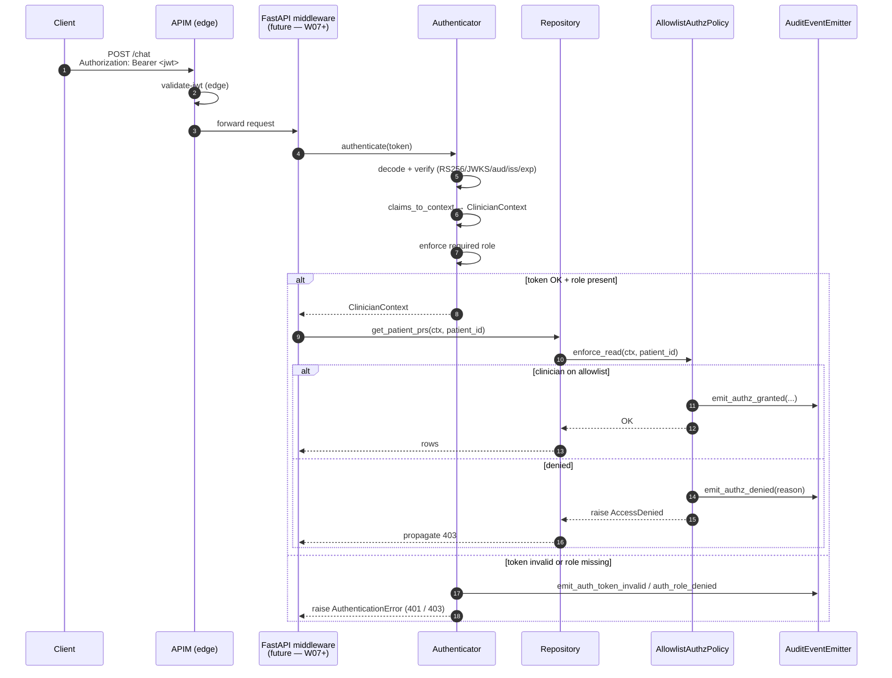
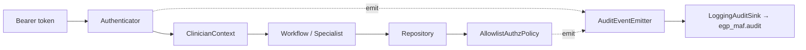

# W07 Authentication & Authorization — Walkthrough

**Purpose:** onboarding-friendly reference for W07. Deliberately concise.
For prior workstreams, see the earlier walkthroughs.

**Companion documents:** [architecture-discovery-report.md](../architecture-discovery-report.md) · [solution-design-package.md](../solution-design-package.md) · [engineering-implementation-plan.md](../engineering-implementation-plan.md) · [workstreams/workstream-log.md](../workstreams/workstream-log.md) · [Entra setup](../security/entra.md) · [allowlist schema](../security/allowlist.md).

---

## 1. What W07 shipped

W02 delivered the **authorisation** half of Design ADR-017 (an
allowlist enforced at the Repository entry). W07 delivers the
**authentication** half — a real Entra ID access token produces the
`ClinicianContext` that then flows through the whole system — plus a
structured audit contract for every allowed / denied outcome.

```
epg-maf/src/egp_maf/auth/                            ← NEW (4 files)
├── __init__.py
├── claims.py           ClinicianTokenClaims + claims_to_context (+ error type)
├── audit.py            AuditEvent + AuditEventEmitter + Logging/Null sinks
└── authenticator.py    Authenticator protocol + EntraTokenAuthenticator + StubAuthenticator + build_authenticator

epg-maf/src/egp_maf/services/authz.py               ← modified (audit-emitter option)
epg-maf/src/egp_maf/di/container.py                 ← modified (Container.authenticator + Container.audit_emitter)
epg-maf/src/egp_maf/config/settings.py              ← + 7 auth fields
epg-maf/pyproject.toml                              ← + pyjwt[crypto]

epg-maf/tests/unit/auth/                             ← NEW (4 test files, 34 tests)
epg-maf/tests/unit/test_di_container.py             ← updated to construct + assert the two new singletons

infra/entra/app-registration.bicep                   ← NEW  (Entra app + 3 app roles)
docs/security/entra.md                               ← NEW  (provisioning + runtime config + audit)
docs/security/allowlist.md                           ← NEW  (schema + lifecycle + fail-closed)
```

**Explicitly NOT shipped:** FastAPI middleware (needs an HTTP layer),
live Entra integration test (needs a preprod token), OTEL `trace_id`
population on audit events (owned by W08).

---

## 2. The auth flow in one picture



**Contract:**

1. **APIM re-validates every token at the edge.** The application
   re-validates defensively because it needs the parsed claims anyway.
2. **`Authenticator` is a narrow async protocol** with exactly one
   method (`authenticate`). Prod = `EntraTokenAuthenticator`; tests +
   dev = `StubAuthenticator`. Same claim-mapping pipeline in both.
3. **Fail-closed everywhere.** Missing `ENTRA_*` config → constructor
   raises. Missing allowlist file at runtime → next call raises.
   No allowlist configured → deny everyone except the built-in
   `system` context.
4. **Every outcome produces an `AuditEvent`.** `authz.granted`,
   `authz.denied`, `auth.token_invalid`, `auth.role_denied` — stable
   4-name vocabulary, stable field schema.

---

## 3. Three notable design decisions

### 3.1 Authenticator behind a protocol (same shape as W04 / W05 seams)

`Authenticator` is a 1-method `Protocol` with `@runtime_checkable`.
Two implementations:

- **`EntraTokenAuthenticator` (production).** PyJWT decodes RS256
  tokens with a JWKS-fetched signing key; audience, issuer, expiry are
  enforced (leeway configurable); the required app role is enforced;
  every failure branch emits an audit event *before* raising
  `AuthenticationError`. A `signing_key_resolver` kwarg lets tests
  bypass JWKS while keeping every other check real.
- **`StubAuthenticator` (dev / tests).** Treats the token as a JSON
  claim dict; skips signature validation; runs the same
  `claims_to_context` mapping so produced `ClinicianContext`s are
  shape-identical. **Constructor refuses to run when `env='prod'`** —
  a defensive block against the stub accidentally shipping.

`build_authenticator(settings, …)` picks the right one based on
`EGP_AUTH_STUB_ENABLED`.

### 3.2 Fail-closed at every seam

- **Authenticator construction.** Missing `ENTRA_TENANT_ID`,
  `ENTRA_EXPECTED_AUDIENCE`, `ENTRA_EXPECTED_ISSUER`, or
  `ENTRA_JWKS_URL` with no `signing_key_resolver` → `ConfigurationError`
  at construction. The app crashes at start, not mid-request.
- **Authorisation policy.** No allowlist file configured → deny
  everyone except the `system` context. Missing / malformed file at
  load → `ConfigurationError`. File deleted after load → next call
  raises `ConfigurationError` on the mtime check.
- **Role check.** `EGP_AUTH_REQUIRED_ROLE` defaults to `Clinician`;
  anyone without that role is rejected with a structured
  `auth.role_denied` event.

### 3.3 Audit is a typed model, not a log line

`AuditEvent` is a Pydantic model with `extra='forbid'` and a stable
schema: `event`, `outcome`, `clinician_id`, `tenant_id`, `patient_id`,
`route`, `reason`, `trace_id`, `timestamp`. Sinks are pluggable
(`LoggingAuditSink` today, W08's OTEL exporter tomorrow). Callers use
domain-specific `emit_*` methods on `AuditEventEmitter` — no manual
event construction, no risk of typo'd field names.

The `LoggingAuditSink` writes to the dedicated `egp_maf.audit` logger
so audit records are routable to a separate LAW workspace without
grepping the main app log.

**PHI safety.** `AccessDenied.message` is a stable "not authorised"
string; the failed-reason detail lives only on the audit event and is
never returned to the caller. `AuditEvent` includes `patient_id` — the
audit workspace is a controlled data plane per Design §21.

---

## 4. Class quick reference

| Class / function | Where | One-line role |
|---|---|---|
| `ClinicianTokenClaims` | `auth/claims.py` | Typed subset of Entra claims (`oid`, `tid`, `roles`, `exp`) + `raw` |
| `claims_to_context` | `auth/claims.py` | Maps `ClinicianTokenClaims` → `ClinicianContext` (raises `ClaimsMappingError` on bad claims) |
| `Authenticator` (Protocol) | `auth/authenticator.py` | `authenticate(token, *, route, trace_id) → ClinicianContext` |
| `EntraTokenAuthenticator` | `auth/authenticator.py` | Production impl: PyJWT + JWKS + audience/issuer/expiry + role check |
| `StubAuthenticator` | `auth/authenticator.py` | Dev/test impl: JSON claim dict as token; refuses to run in prod |
| `build_authenticator` | `auth/authenticator.py` | Factory: stub vs real based on `EGP_AUTH_STUB_ENABLED` |
| `AuditEvent` | `auth/audit.py` | Typed event with `extra='forbid'` |
| `AuditEventEmitter` | `auth/audit.py` | 4 `emit_*` methods (`authz_granted`, `authz_denied`, `auth_token_invalid`, `auth_role_denied`) |
| `LoggingAuditSink` | `auth/audit.py` | Prod default: writes to `egp_maf.audit` logger |
| `NullAuditSink` | `auth/audit.py` | Test default: no-op |
| `AuthenticationError` | `auth/authenticator.py` | Typed EgpError → HTTP 401 |
| `AccessDenied` (W02) | `errors.py` | Typed EgpError → HTTP 403 |
| `AllowlistAuthzPolicy` (W02 + W07) | `services/authz.py` | Now emits `authz.granted` / `authz.denied` via injected emitter |

---

## 5. How W07 slots into the whole system



**Zero API-surface change in the workflow / specialist / repository
layers.** Everything downstream already expected a `ClinicianContext`
— W07 just changed where it comes from.

---

## 6. Operational notes

- **Enabling the real authenticator in a fresh env:** set
  `ENTRA_TENANT_ID`, `ENTRA_EXPECTED_AUDIENCE`, `ENTRA_EXPECTED_ISSUER`,
  `ENTRA_JWKS_URL`; leave `EGP_AUTH_STUB_ENABLED` unset (defaults to
  `false`). Prod refuses to start otherwise.
- **Assigning roles.** After deploying the Bicep template, use the
  Entra portal or `az` CLI to assign `Clinician` (regular users),
  `Auditor` (compliance), `Admin` (break-glass). Design §19.3 caps
  `Admin` at 2 users.
- **Rotating the allowlist.** File-based: mtime change triggers
  reload on the next call. Key Vault mount: use `identity.rotationPolicy`
  so the mounted file updates transparently.
- **Structured audit log query (App Insights / LAW).** Filter on
  `SourceContext == "egp_maf.audit"` and pick the event by
  `Properties.outcome`.
- **Emergency lockout.** Delete or truncate the allowlist file →
  every non-system call raises `ConfigurationError` → all `/chat`
  requests 5xx (fail-closed). Restore or replace the file to resume.

---

## 7. Where to look next

- **Delivery status:** [workstream-log.md § W07](../workstreams/workstream-log.md#workstream-w07--authentication--authorization-).
- **Design context:** [solution-design-package.md](../solution-design-package.md) ADR-008 (Entra + ClinicianContext), ADR-017 (RBAC last mile), §19.3 (auth model), §21 (audit retention).
- **Provisioning:** [docs/security/entra.md](../security/entra.md).
- **Allowlist schema:** [docs/security/allowlist.md](../security/allowlist.md).
- **Prototype reference:** none — the prototype has no auth.

*Last updated: 2026-07-10.*
