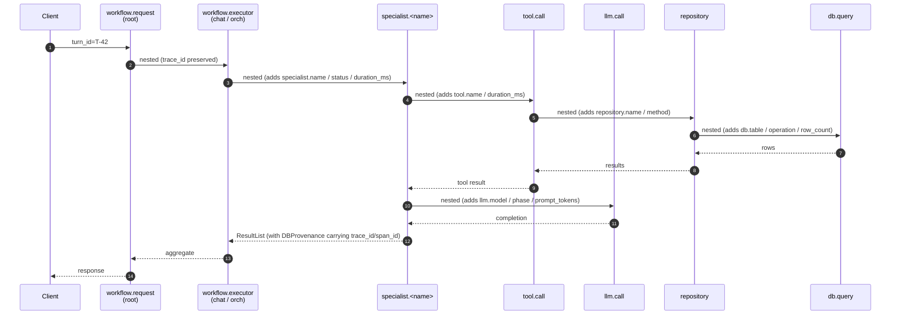
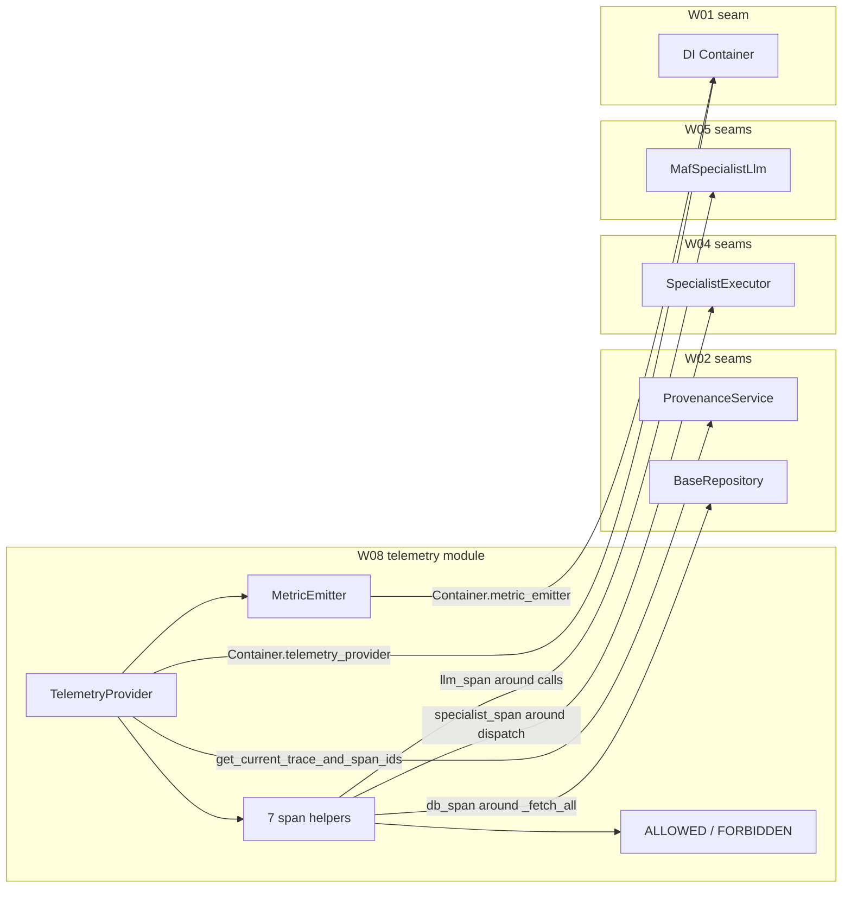

# W08 Observability — Walkthrough

**Purpose:** onboarding-friendly reference for W08. Deliberately concise.
For prior workstreams, see the earlier walkthroughs.

**Companion documents:** [architecture-discovery-report.md](../architecture-discovery-report.md) · [solution-design-package.md](../solution-design-package.md) · [engineering-implementation-plan.md](../engineering-implementation-plan.md) · [workstreams/workstream-log.md](../workstreams/workstream-log.md) · [spans reference](../observability/spans.md) · [metrics reference](../observability/metrics.md).

---

## 1. What W08 shipped

Every workflow request, specialist run, tool call, LLM call, repository
call, and DB query is now a **span**. Every one of the 10 KPI metrics
from Design §20.4 has an **instrument**. Provenance rows carry
`trace_id` + `span_id` so clinicians can jump from a suggestion → the
exact prompts + rows that produced it. And a **PHI-safe attribute
allowlist** refuses to accept forbidden keys at runtime.

```
epg-maf/src/egp_maf/telemetry/                       ← NEW (6 files)
├── __init__.py       re-exports
├── attributes.py     ALLOWED_ATTRIBUTES + FORBIDDEN_ATTRIBUTES + filter_safe_attributes
├── phi_safe.py       ForbiddenAttributeError + safe_set_attribute
├── otel.py           TelemetryProvider + build_telemetry_provider + get_current_trace_and_span_ids
├── spans.py          SpanKind + 7 context managers (workflow_request/executor/specialist/tool/llm/repository/db)
└── metrics.py        MetricEmitter protocol + Null/OtelMetricEmitter + METRIC_NAMES

epg-maf/src/egp_maf/services/repositories/base.py    ← modified (db_span around _fetch_all)
epg-maf/src/egp_maf/agents/llm_bridge.py             ← modified (llm_span around agent.run / get_response)
epg-maf/src/egp_maf/workflow/orchestration/specialist_executor.py ← modified (specialist_span around dispatch)
epg-maf/src/egp_maf/di/container.py                  ← modified (Container.telemetry_provider + metric_emitter)

epg-maf/tests/unit/telemetry/                        ← NEW (7 test files + conftest, 38 tests)
epg-maf/tests/unit/test_di_container.py              ← updated to construct + assert the two new singletons

docs/observability/spans.md                           ← NEW (span taxonomy + attributes + KQL cookbook)
docs/observability/metrics.md                         ← NEW (10 metrics + labels + example queries)
```

**Explicitly NOT shipped:** Azure Monitor OTLP exporter wiring (W11),
auto-instrumentation of libraries (W11), `AuditEvent.trace_id`
population at emit (needs W07's audit emitter to call W08's helper;
wired in W11 with FastAPI middleware), App Insights dashboards (W11),
static-analysis PHI gate (W10).

---

## 2. The trace tree in one picture



**Contract:**

1. **`SpanKind` is a `StrEnum` — no free-form span names.** Every span
   opened by `egp_maf` code comes from one of the 7 enum values.
2. **Every span helper uses the same PHI-safe filter.** Kwargs pass
   through `filter_safe_attributes` before reaching `set_attribute`;
   forbidden keys never make it to the SDK.
3. **Duration is computed by the helper, not the caller.** All
   context managers wrap the `yield` in `time.perf_counter()` bracketing
   and set `*.duration_ms` in a `finally`.
4. **Provenance carries the trace.** `ProvenanceService` was designed
   in W02 with optional `trace_id`/`span_id` fields; W08 wires the
   `get_current_trace_and_span_ids` provider that populates them.

---

## 3. Three notable design decisions

### 3.1 One-shot global provider — via a session-scoped conftest

OTEL's `trace.set_tracer_provider` is a one-shot per process. The
second call logs a warning and silently no-ops — the second provider
is discarded. We install the SDK-backed provider exactly once at
process start (`TelemetryProvider.install_globally`), and the test
suite uses a session-scoped
[`conftest.py`](../../epg-maf/tests/unit/telemetry/conftest.py) that
installs an in-memory exporter + metric reader once, shared across
every telemetry test via the `telemetry_exporter` and
`telemetry_metric_reader` fixtures.

This is the single most important operational fact about the module:
**never call `set_tracer_provider` outside `install_globally`**. The
conftest handles the test-time bootstrap.

### 3.2 PHI-safety is enforced at the emit boundary

Design §10.4 names three family-history attributes that must never
leave the process (`search_context_notes`, `affected_relative_count`,
`total_relatives_searched`) — plus LLM prompt / completion content,
row bodies, and tool result bodies. W08 enumerates every one of these
in
[`FORBIDDEN_ATTRIBUTES`](../../epg-maf/src/egp_maf/telemetry/attributes.py).

Two enforcement layers:

- **`filter_safe_attributes(...)`** — used by every span context
  manager on caller-supplied kwargs. Forbidden keys are dropped
  silently (with the assumption that ergonomic paths shouldn't crash
  the workflow if a caller is careless). Unknown-but-not-forbidden
  keys also dropped silently.
- **`safe_set_attribute(span, key, value)`** — the manual escape hatch
  for span internals. **Raises `ForbiddenAttributeError` on forbidden
  keys.** Used everywhere an internal function might touch a span
  attribute without going through a `filter_safe_attributes` call.

Together they mean an accidentally-added forbidden attribute either
never reaches the SDK (from user kwargs) or fast-fails a unit test
(from internal code paths).

### 3.3 Metrics vs. spans — different lifecycles

W08 delivers the **instruments** for all 10 KPI metrics; individual
call-sites are wired **later**. Reason: metrics require call-site
knowledge that lives in future workstreams — W09 owns the
`RateLimitError` catch that emits `egp.rate_limit.hit`, W11 owns the
HTTP layer that emits `egp.turn.count`. Shipping the instruments in
W08 (behind a `MetricEmitter` protocol seam) lets W09/W11 wire without
another observability-scope PR.

Spans are the opposite — they get wired **now** at the 4 seams W08
touches (base repo, LLM bridge, specialist executor, DI container).
Every specialist run, DB query, and LLM call from this workstream
forward carries a span.

---

## 4. Class quick reference

| Class / function | Where | One-line role |
|---|---|---|
| `SpanKind` (StrEnum) | `telemetry/spans.py` | 7 canonical span names (`workflow.request`, `workflow.executor`, `specialist.*`, `tool.call`, `llm.call`, `repository.*`, `db.query`). |
| `workflow_request_span` | `telemetry/spans.py` | Root span for one clinician turn. |
| `workflow_executor_span` | `telemetry/spans.py` | Child span for a MAF executor. |
| `specialist_span` | `telemetry/spans.py` | Wraps `SpecialistExecutor.handle_dispatch`; records status + duration. |
| `tool_span` | `telemetry/spans.py` | Wraps `@tool` calls; records duration. |
| `llm_span` | `telemetry/spans.py` | Wraps `MafSpecialistLlm` calls; records model + phase + duration. |
| `repository_span` | `telemetry/spans.py` | Optional wrapper for repository methods. |
| `db_span` | `telemetry/spans.py` | Wraps `BaseRepository._fetch_all`; records table + row_count. |
| `ALLOWED_ATTRIBUTES` | `telemetry/attributes.py` | Frozenset of every attribute name legal on a span. |
| `FORBIDDEN_ATTRIBUTES` | `telemetry/attributes.py` | Frozenset of PHI-related names refused at emit. |
| `filter_safe_attributes` | `telemetry/attributes.py` | Drops forbidden + unknown keys. |
| `safe_set_attribute` | `telemetry/phi_safe.py` | Manual attribute setter; raises on forbidden. |
| `ForbiddenAttributeError` | `telemetry/phi_safe.py` | Typed EgpError (`phi_attribute_forbidden`, HTTP 500). |
| `TelemetryProvider` | `telemetry/otel.py` | Bundles SDK `TracerProvider` + `MeterProvider` + `Resource`. |
| `build_telemetry_provider` | `telemetry/otel.py` | Factory reading `Settings`. |
| `get_current_trace_and_span_ids` | `telemetry/otel.py` | Returns `(trace_id_hex, span_id_hex)` for the active span, or `(None, None)`. Non-throwing. |
| `MetricEmitter` (Protocol) | `telemetry/metrics.py` | 8 `emit_*` methods over the 10 KPI instruments. |
| `NullMetricEmitter` | `telemetry/metrics.py` | No-op; test default. |
| `OtelMetricEmitter` | `telemetry/metrics.py` | Prod impl; constructs 10 instruments once. |
| `METRIC_NAMES` | `telemetry/metrics.py` | Frozenset of exactly 10 names — CI-locked. |

---

## 5. How W08 slots into the whole system



W08 lays a thin observability skin over the seams every previous
workstream deliberately designed for it. No public APIs changed —
callers of `BaseRepository._fetch_all`, `MafSpecialistLlm.run_react`,
and `SpecialistExecutor.handle_dispatch` are unaware they now run
inside a span.

---

## 6. Run the tests

```pwsh
cd epg-maf
. .\.venv\Scripts\Activate.ps1
python -m pytest tests/unit/telemetry -v      # 38 tests
python -m pytest -m "not integration and not parity" -q   # 330 total
```

The full suite is **330 passed, 21 skipped** (integration only; require
`EGP_TEST_POSTGRES`).
