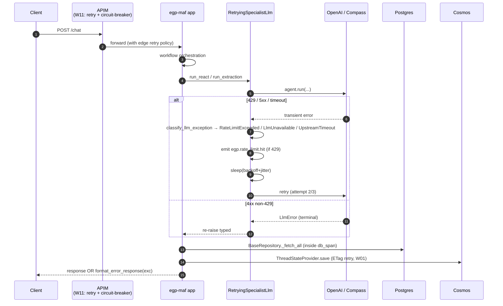
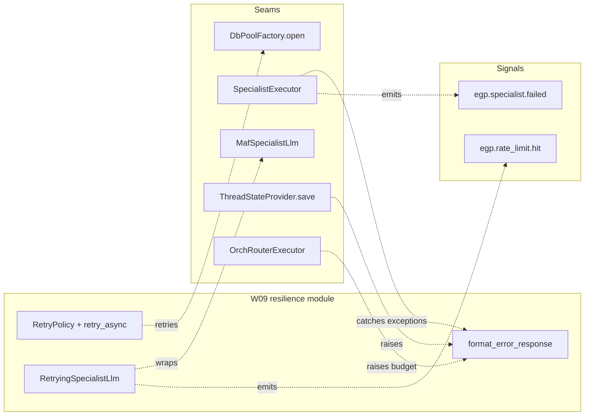

# W09 Resilience & Error Handling — Walkthrough

**Purpose:** onboarding-friendly reference for W09. Deliberately concise.
For prior workstreams, see the earlier walkthroughs.

**Companion documents:** [architecture-discovery-report.md](../architecture-discovery-report.md) · [solution-design-package.md](../solution-design-package.md) · [engineering-implementation-plan.md](../engineering-implementation-plan.md) · [workstreams/workstream-log.md](../workstreams/workstream-log.md) · [resilience reference](../resilience/resilience.md).

---

## 1. What W09 shipped

W07 shipped auth (401/403); W08 shipped observability (spans + metrics
+ PHI-safe). W09 is the **failure story** — a typed error taxonomy, an
in-process retry policy around every LLM call, DB-pool connect retries,
specialist-failure isolation, and a transport-agnostic response
formatter. The recursion budget (F11.6) and Cosmos ETag retry (F11.4)
were both landed earlier (W04 + W01 respectively) — W09 verifies both
and hooks them into the response contract.

```
epg-maf/src/egp_maf/resilience/                       ← NEW (4 files)
├── __init__.py
├── retry.py              RetryPolicy + retry_async + RetryStats
├── llm_retry.py          RetryingSpecialistLlm + classify_llm_exception
└── error_response.py     format_error_response + ErrorResponse envelope

epg-maf/src/egp_maf/errors.py                         ← + 4 typed exceptions
epg-maf/src/egp_maf/infrastructure/db_pool.py         ← retry-loop on open()
epg-maf/src/egp_maf/workflow/orchestration/specialist_executor.py
                                                      ← catches specialist exceptions,
                                                        emits metrics, marks failed slot
epg-maf/src/egp_maf/workflow/orchestration/build.py   ← threads metric_emitter into executors
epg-maf/src/egp_maf/workflow/runtime.py               ← accepts metric_emitter kwarg
epg-maf/src/egp_maf/agents/registry.py                ← wraps MafSpecialistLlm with
                                                        RetryingSpecialistLlm using
                                                        Settings-driven retry policy
epg-maf/src/egp_maf/config/settings.py                ← + 7 resilience knobs
epg-maf/src/egp_maf/di/container.py                   ← passes settings + metric_emitter
                                                        into registry + runtime

epg-maf/tests/unit/resilience/                        ← NEW (4 test files, 42 tests)

docs/resilience/resilience.md                          ← NEW (contract + config surface)
```

**Explicitly NOT shipped:** APIM policy XML files (F11.2 infra — W11
owns Bicep + APIM; the app-side retry we shipped is the in-process
counterpart), FastAPI response-middleware wiring (needs the HTTP layer,
W11), APIM circuit-breaker (W11).

---

## 2. Layered defence in one picture



**Contract:**

1. **Every runtime error is a typed `EgpError`** with a stable
   `error_code` and `http_status`. Everything else is coerced to
   `internal_error` (no leakage).
2. **App-side retry is the belt** — APIM's XML policy is the braces.
   If APIM already exhausted 3 attempts, the app-side retry adds one
   more attempt before we give up.
3. **One specialist's failure is isolated.** The orchestration loop
   keeps going. The failed slot carries `status="failed"` and the
   error class; synthesis can reflect the gap.
4. **Recursion is bounded.** ADR-009's `2 × n + 2 = 12` cap is
   enforced in `OrchRouterExecutor` — a hallucinating router still
   returns partial results (W04 shipped this; W09 documents it).

---

## 3. Three notable design decisions

### 3.1 `RetryingSpecialistLlm` is a composition, not a subclass

W05 kept :class:`MafSpecialistLlm` a **pure MAF adapter** — no retry
logic, no metric emission. W09 preserves that by *composing* around
it:

```python
inner = MafSpecialistLlm(client=..., agent_id=...)
llm   = RetryingSpecialistLlm(
    inner, policy=default_llm_retry_policy(...), metric_emitter=metrics
)
```

Two benefits:

- **Testability.** Unit tests targeting retry behaviour swap in a
  `_StubLlm(outcomes=[Err, Err, "ok"])` — no MAF, no OpenAI SDK, no
  wall-clock sleep (sleeper is injectable).
- **Composability.** A future workstream can slot another decorator
  in (e.g. a rate-limiting throttle) without touching the bridge.

Test-supplied `llm_overrides` in `build_specialist_registry` are NOT
wrapped — parity + isolation tests want deterministic behaviour, and
retry would obscure the failure they're proving.

### 3.2 Classification, not instanceof

SDK-native exceptions from OpenAI, Compass, and Foundry-relay all
carry HTTP status codes in slightly different places (`status_code`,
`.response.status_code`, `.status`). :func:`classify_llm_exception`
**probes attributes**, not exception classes — no hard SDK dependency
in `resilience/`, no import from `openai` or `httpx`.

The classifier normalises everything to
:class:`RateLimitExceeded` / :class:`UpstreamTimeout` /
:class:`LlmUnavailable` / :class:`LlmError`, so the retry predicate
and the response formatter only need to reason over `EgpError`
subclasses.

### 3.3 Specialist failure surfaces as data, not as an exception

W04's `RunOrchestrationExecutor` already catches
:class:`SpecialistFailed` / :class:`RoutingBudgetExceeded` at the
outer boundary. W09 goes one layer deeper: **inside**
:class:`SpecialistExecutor`, any exception from
:meth:`SpecialistBase.run` becomes a failed :class:`SpecialistSlot`.
The workflow never sees the exception.

Why: MAF's `Workflow.run(...)` treats a raised exception from an
`@handler` as terminal for the whole workflow. Isolation requires we
absorb the exception at the executor level, not the orchestrator
level. Metrics carry the error class so alerting still works.

---

## 4. Class quick reference

| Class / function | Where | One-line role |
|---|---|---|
| `RetryPolicy` | `resilience/retry.py` | Frozen dataclass: `max_attempts`, `base_delay_ms`, `max_delay_ms`, `jitter`, `retryable`. |
| `retry_async` | `resilience/retry.py` | Run an async callable under a policy; sleeper + RNG are injectable. |
| `RetryStats` | `resilience/retry.py` | Mutable stats sink: attempts, total slept ms, last exception. |
| `classify_llm_exception` | `resilience/llm_retry.py` | Probe SDK exception → typed `EgpError` variant. |
| `default_llm_retry_policy` | `resilience/llm_retry.py` | Factory reading `Settings.llm_retry_*`. |
| `RetryingSpecialistLlm` | `resilience/llm_retry.py` | Compose retry + classification + `egp.rate_limit.hit` around a `SpecialistLlm`. |
| `ErrorResponse` | `resilience/error_response.py` | `{error_code, message, trace_id}` + `http_status`; `to_dict()` yields body. |
| `format_error_response` | `resilience/error_response.py` | Transport-agnostic error mapping used by CLI + evals now, HTTP middleware in W11. |
| `UpstreamTimeout` | `errors.py` | 504 — LLM / Compass / JWKS timeout. |
| `RateLimitExceeded` | `errors.py` | 429 — LLM upstream rate-limited (after retry exhaustion). |
| `LlmUnavailable` | `errors.py` | 503 — LLM 5xx or connection failure. |
| `LlmError` | `errors.py` | 502 — non-retryable LLM error. |

---

## 5. How W09 slots into the whole system



Every seam a previous workstream designed for is now retry-aware or
failure-isolating. The W08 metric emitters (`egp.rate_limit.hit`,
`egp.specialist.failed`) that were only *available* in W08 are now
*wired*.

---

## 6. Run the tests

```pwsh
cd epg-maf
. .\.venv\Scripts\Activate.ps1
python -m pytest tests/unit/resilience -v      # 42 tests
python -m pytest -m "not integration and not parity" -q   # 372 total
```

The full suite is **372 passed, 21 skipped** (integration only; require
`EGP_TEST_POSTGRES` / `EGP_TEST_COSMOS`).
