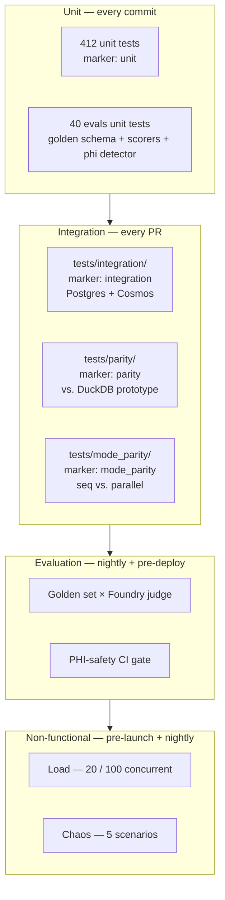

# W10 Testing, Evaluation & Load — Walkthrough

**Purpose:** onboarding-friendly reference for W10. Deliberately concise.
For prior workstreams, see the earlier walkthroughs.

**Companion documents:** [architecture-discovery-report.md](../architecture-discovery-report.md) · [solution-design-package.md](../solution-design-package.md) · [engineering-implementation-plan.md](../engineering-implementation-plan.md) · [workstreams/workstream-log.md](../workstreams/workstream-log.md) · [golden set](../testing/golden-set.md) · [integration harness](../testing/integration.md) · [load](../testing/load.md) · [chaos](../testing/chaos.md) · [PHI CI](../testing/phi-safety-ci.md).

---

## 1. What W10 shipped

W10 is the **evaluation + test pyramid** workstream. The prior seven
workstreams built the app; W10 gives us the artefacts + tooling that
prove it still works on every deploy.

```
epg-maf/src/egp_maf/evals/                            ← NEW (4 modules + seed data)
├── __init__.py
├── golden.py             GoldenItem + GoldenToolCall + load_golden_set
├── scorers.py            ToolCallScorer + InterpretationJudgeScorer + StubJudge + ScorerResult
├── phi_detector.py       detect_phi_in_export + PhiFinding + PhiScanResult
└── golden_set/
    ├── __init__.py
    └── seed.json         8 items spanning all 5 domains + multi

epg-maf/tests/unit/evals/                             ← NEW (3 test files, 40 tests)
epg-maf/pyproject.toml                                ← + 2 markers (evals, chaos)

docs/testing/
├── golden-set.md         F12.1 — item schema + loading + scoring
├── integration.md        F12.2 — harness contract + CI scaffold
├── load.md               F12.5 — baseline + stress scenarios
├── chaos.md              F12.6 — 5 scenarios + runbook conventions
└── phi-safety-ci.md      F12.7 — detector contract + CI wiring

docs/walkthroughs/W10-testing-walkthrough.md          ← this file
```

**Delivered in earlier workstreams (verified + documented in W10):**

- **F12.2** — integration harness already exists at
  `tests/integration/`, gated by `EGP_TEST_POSTGRES` / `EGP_TEST_COSMOS`.
  W10 documents the contract + CI scaffold.
- **F12.3** — repository parity harness already exists at
  `tests/parity/test_repository_parity.py`.

**Explicitly NOT shipped:** BIX-approved 30–50-item golden set
(follow-up PR after review), Foundry Evaluations wiring (W11 owns the
Foundry project), the Locust `locustfile.py` (lands with the FastAPI
layer in W11), the chaos scripts (need preprod — W11), the GHA CI
workflow YAMLs (W11 owns CI/CD infra).

---

## 2. The test pyramid in one picture



**Contract:**

1. **Unit tests must be fast and hermetic.** 412 tests run in under
   20 seconds. No network, no DB.
2. **Integration tests are gated by env vars** — never fail because a
   dev doesn't have the emulator running.
3. **Parity is separate from integration** — the DuckDB / prototype
   comparator has its own marker so we can run integration without
   the prototype.
4. **Evaluation is deploy-gated.** Foundry Evaluations run on merge
   to `main`; a failing evaluation blocks prod promotion (F12.4).
5. **PHI-safety is a hard gate.** Any forbidden attribute name in an
   exported blob fails the build.

---

## 3. Three notable design decisions

### 3.1 Two-layer PHI defence

W08 delivered the runtime guard: `safe_set_attribute` refuses to
attach forbidden names to a span. But a developer can still write to
a log line, a Cosmos audit event, or a response body without going
through that helper.

W10 adds :func:`detect_phi_in_export` — a grep-style detector that
scans an arbitrary blob for the exact same forbidden set. The CI job
runs the golden set end-to-end and scans every exported log line +
span attributes JSON dump. Any hit fails the build.

**Scope is deliberate.** The detector is applied to *exported*
artefacts (logs, spans, responses) — not to internal Pydantic models
like `DBProvenance` whose `source_row` field IS the row body (that's
the whole point of provenance-for-audit; it lives in Cosmos, never
touches spans / logs).

### 3.2 Scorers return a shared envelope

Both :class:`ToolCallScorer` (deterministic) and
:class:`InterpretationJudgeScorer` (LLM-as-judge) return the same
:class:`ScorerResult` — `{passed, score, reason}`. Aggregate
reporting for Foundry Evaluations is uniform regardless of scorer
family. Adding a new scorer (e.g. citation-correctness, safety
classification) means implementing one method; the harness handles
the rest.

**LLM-as-judge is injected, not hard-coded.** :class:`StubJudge` is
the deterministic stand-in for unit tests; the Foundry judge lands
in W11 and implements the same `InterpretationJudge` Protocol.

### 3.3 Golden set is bundled + extensible

The 8-item seed set ships inside the wheel at
`egp_maf/evals/golden_set/seed.json`. `load_golden_set` uses
`importlib.resources` so the file works whether installed as a wheel
or run from source. Private / larger sets (BIX-curated, 30–50 items)
merge on top via ``external_path=Path(...)`` — duplicate ids raise.

Every item carries a `bix_reviewed` flag. The seed set ships with
all-`false`; BIX flip approvals in a follow-up PR. `strict-markers`
guarantees CI catches unmarked BIX-required items.

---

## 4. Class quick reference

| Class / function | Where | One-line role |
|---|---|---|
| `GoldenItem` | `evals/golden.py` | One clinician question + expected tool calls + output keys + BIX metadata. |
| `GoldenToolCall` | `evals/golden.py` | Expected tool invocation with `depends_on` ordering hints. |
| `load_golden_set` | `evals/golden.py` | Bundled + optional external merger; duplicate-id detection. |
| `ScorerResult` | `evals/scorers.py` | `(passed, score, reason)` envelope. |
| `ToolCallScorer` | `evals/scorers.py` | Set-similarity over expected vs. actual tool calls; superset parameter match; `depends_on` ordering check. |
| `InterpretationJudge` (Protocol) | `evals/scorers.py` | 1-method contract Foundry Evaluations wires in W11. |
| `StubJudge` | `evals/scorers.py` | Deterministic needle-based judge for unit tests. |
| `InterpretationJudgeScorer` | `evals/scorers.py` | Adapter that runs a judge for a golden item. |
| `PhiFinding` / `PhiScanResult` | `evals/phi_detector.py` | Detector output shape; `raise_if_findings` raises `AssertionError`. |
| `detect_phi_in_export` | `evals/phi_detector.py` | Grep for :data:`FORBIDDEN_ATTRIBUTES` in a blob. |

---

## 5. Run the tests

```pwsh
cd epg-maf
. .\.venv\Scripts\Activate.ps1

# Fast tier — unit + evals unit
python -m pytest -m "not integration and not parity and not chaos" -q

# Explicitly the W10 slice
python -m pytest tests/unit/evals -v      # 40 tests

# Integration tier (requires Postgres + Cosmos)
$env:EGP_TEST_POSTGRES = "1"
$env:EGP_TEST_COSMOS   = "1"
python -m pytest -m integration -q

# Parity tier (requires DuckDB prototype at test_data/)
python -m pytest -m parity -q
```

The full non-network suite is **412 passed, 21 skipped**.
