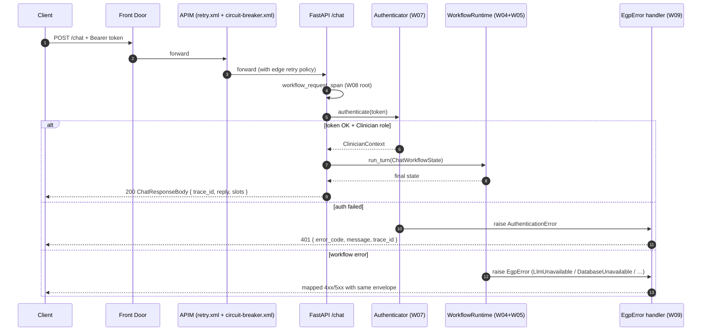
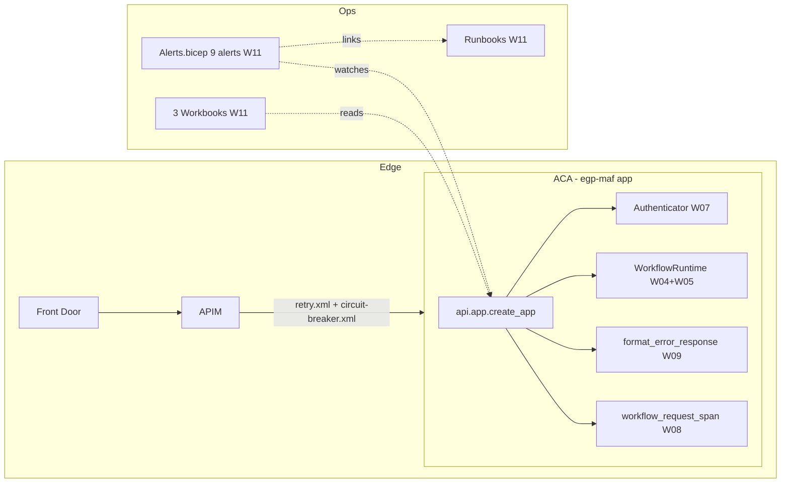

# W11 Cutover, Release & Runbooks — Walkthrough

**Purpose:** onboarding-friendly reference for W11. Deliberately concise.
For prior workstreams, see the earlier walkthroughs.

**Companion documents:** [architecture-discovery-report.md](../architecture-discovery-report.md) · [solution-design-package.md](../solution-design-package.md) · [engineering-implementation-plan.md](../engineering-implementation-plan.md) · [workstreams/workstream-log.md](../workstreams/workstream-log.md) · [cutover playbook](../runbooks/cutover.md) · [release notes](../releases/v1.0.0.md).

---

## 1. What W11 shipped

W11 is the **cutover** workstream. It puts a real HTTP surface over
everything W01–W10 built, wires the infrastructure the deploy needs,
and delivers the operational artefacts (runbooks, dashboards, alerts,
release notes) that make the system actually operable in prod.

```
epg-maf/src/egp_maf/api/                              ← NEW (FastAPI HTTP layer)
├── __init__.py
├── app.py              create_app + exception handlers
└── schemas.py          ChatRequestBody / ChatResponseBody / ErrorResponseBody / HealthResponseBody

epg-maf/tests/unit/api/                               ← NEW (9 API tests)
├── __init__.py
└── test_app.py         end-to-end TestClient over the stubbed container

epg-maf/tests/load/                                   ← NEW (F12.5 scaffold)
├── __init__.py
└── locustfile.py

epg-maf/tests/chaos/                                  ← NEW (F12.6 scripts)
├── __init__.py
├── test_kill_replica.py
└── test_pause_postgres.py

epg-maf/pyproject.toml                                ← + fastapi, uvicorn, opentelemetry, httpx

infra/env/prod.bicepparam                             ← NEW (F13.1)
infra/apim/policies/retry.xml                         ← NEW (F11.2 infra)
infra/apim/policies/circuit-breaker.xml               ← NEW (F11.2 infra)
infra/monitoring/alerts.bicep                         ← NEW (F13.3 — 9 alerts + Action Group)

dashboards/business.workbook.json                     ← NEW (F13.2)
dashboards/ops.workbook.json                          ← NEW (F13.2)
dashboards/security.workbook.json                     ← NEW (F13.2)

.github/workflows/integration.yml                     ← NEW (F12.2 CI)
.github/workflows/phi.yml                             ← NEW (F12.7 CI)
.github/workflows/deploy-prod.yml                     ← NEW (F13.1)

docs/runbooks/                                        ← NEW (F13.4 — 8 runbooks + template + index)
docs/monitoring/queries.kusto.md                      ← NEW (F13.2 KQL cookbook)
docs/releases/v1.0.0.md                               ← NEW (F13.5)
```

**Explicitly deferred:** actual Azure prod deploy (requires a
subscription + approval), Foundry Evaluations project wiring
(requires Foundry tenant access), Grafana Managed dashboards mirror
(Azure Workbook is the primary), any real credential values.

---

## 2. The HTTP surface in one picture



**Contract:**

1. **The HTTP layer is thin.** :func:`create_app` wires a Container's
   authenticator + workflow_runtime + telemetry provider to two
   routes (``/healthz``, ``/chat``). All business logic lives one
   layer down.
2. **Every response carries `trace_id`** — success or failure. The
   :func:`workflow_request_span` root span opens before auth so the
   auth failure envelope also carries a trace id.
3. **Error envelope is exactly what W09 produces.**
   :func:`format_error_response` is called from three exception
   handlers (typed `EgpError`, Pydantic validation, unhandled) —
   response body always ``{error_code, message, trace_id}``.
4. **Extra fields are rejected.** `ChatRequestBody` is
   `extra="forbid"` — accidentally-sent internal fields fail 422 at
   the request boundary.

---

## 3. Three notable design decisions

### 3.1 The HTTP layer takes a fully-built Container

`create_app(container: Container) -> FastAPI` — no DI framework, no
FastAPI `Depends()` singleton dance. The Container is built once
(W01), passed to the app factory, and every route closes over the
authenticator + runtime + telemetry it needs. Trade-off: no per-request
DI overrides. Benefit: the same Container the workflow tests use also
drives the HTTP tests, so nothing about the code path changes when
the client speaks HTTP.

### 3.2 Auth error is a typed EgpError, not a `HTTPException`

`AuthenticationError` inherits from :class:`EgpError` (delivered in
W07). The FastAPI exception handler for `EgpError` calls the same
:func:`format_error_response` that CLI + eval harnesses use. Result:
the response body shape is identical across every entry point.
Nowhere in the API layer do we know or care that 401 is a "HTTP
concept" — we just raise the typed error.

### 3.3 The APIM retry + circuit-breaker is INFRA, not app code

W09 shipped the app-side retry (`RetryingSpecialistLlm`). W11 adds
the APIM edge layer (retry.xml + circuit-breaker.xml). The two
compose: APIM retries once per client attempt; the app retries once
per specialist call. Circuit-breaker at APIM protects the LLM tenant
from a runaway app; app-side retry protects the clinician from a
transient APIM blip. Together they realise Design ADR-022 without
either layer knowing about the other.

---

## 4. Class quick reference

| Class / function | Where | One-line role |
|---|---|---|
| `create_app` | `api/app.py` | Build a FastAPI app wired to a Container. |
| `ChatRequestBody` | `api/schemas.py` | HTTP body — `thread_id`, `patient_id`, `message`, optional filters. `extra="forbid"`. |
| `ChatResponseBody` | `api/schemas.py` | 200 body — `trace_id`, `reply`, `agents_completed`, 5 slot views. |
| `ChatSpecialistSlotView` | `api/schemas.py` | Per-domain slot summary — clinician-visible fields only. |
| `ErrorResponseBody` | `api/schemas.py` | W09 envelope, HTTP-shaped. |
| `HealthResponseBody` | `api/schemas.py` | `/healthz` response. |
| `_egp_error_handler` | `api/app.py` | Maps `EgpError` → W09 envelope → JSON response. |

---

## 5. How W11 slots into the whole system



Every seam a previous workstream deliberately designed for is now
either **wired to HTTP** (auth, workflow, telemetry, error formatter)
or **surfaced to operators** (metrics → dashboards; typed errors →
alerts → runbooks).

---

## 6. Run the tests

```pwsh
cd epg-maf
. .\.venv\Scripts\Activate.ps1

# Fast tier (includes the 9 new API tests)
python -m pytest -m "not integration and not parity and not chaos" -q

# API slice only
python -m pytest tests/unit/api -v

# Run the app locally (for a manual smoke)
python -c "from egp_maf.di.container import build_container; import asyncio, uvicorn; from egp_maf.api import create_app; app = create_app(asyncio.run(build_container()))" # sketch — see README for the real invocation
```

The full non-network suite is **421 passed, 21 skipped** (integration
+ chaos gated by env vars).
