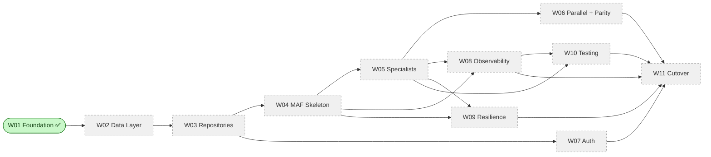

# EGP Window — Workstream Delivery Log

> **Living document.** One workstream per section, appended in delivery order.
> When a new workstream starts, we append a new `## Workstream WXX — <name>`
> block below the previous one. Nothing is ever rewritten in place — an update
> to an in-flight workstream edits *its own* section only.

**Repository:** `nandyap/EPG-MAF` (private, GitHub)
**Baseline documents:** [architecture-discovery-report.md](../architecture-discovery-report.md) · [solution-design-package.md](../solution-design-package.md) · [engineering-implementation-plan.md](../engineering-implementation-plan.md)
**Last updated:** 2026-07-09

---

## 1. How to read this document

- **Progress Dashboard** — quick executive glance at what's done, in flight, and next.
- **Workstream Roadmap** — the full sequence of workstreams we plan to deliver.
- **Workstream sections** — each has a fixed template so it's easy to compare.
- **Status legend**: ✅ Complete · 🚧 In progress · ⏳ Not started · ⏸ Blocked · ⛔ Cancelled.

### Section template used for every workstream

Every workstream section carries the same subsections in the same order:

1. Purpose & scope
2. Mapping to the LangGraph prototype
3. Mapping to Microsoft Agent Framework
4. Files created
5. Files modified
6. Implementation highlights
7. Test coverage summary
8. Validation vs. LangGraph prototype
9. Validation checklist (paste into PR)
10. Known follow-ups (out of scope for this workstream)
11. Sign-off

---

## 2. Progress Dashboard

| # | Workstream | Status | Sprint | Owner | Files (src / test) | LOC | Depends on |
|---|---|---|---|---|---|---|---|
| W01 | [Foundation](#workstream-w01--foundation-) | ✅ Complete | 1 | Delivery Lead | 25 / 15 | ~2,370 | — |
| W02 | [Clinical Data Layer](#workstream-w02--clinical-data-layer-) | ⏳ Not started | 2 | DE + BE2 | — | — | W01 |
| W03 | [Domain Repositories & Tool Shims](#workstream-w03--domain-repositories--tool-shims-) | ⏳ Not started | 2–3 | BE2 | — | — | W01, W02 |
| W04 | [MAF Workflow Skeleton](#workstream-w04--maf-workflow-skeleton-) | ⏳ Not started | 4 | BE1 | — | — | W01, W03 |
| W05 | [Specialist Agents](#workstream-w05--specialist-agents-) | ⏳ Not started | 4–5 | BE2 | — | — | W03, W04 |
| W06 | [Parallel Execution & Mode-Parity](#workstream-w06--parallel-execution--mode-parity-) | ⏳ Not started | 5 | BE1 + QA | — | — | W04, W05 |
| W07 | [Authentication & Authorization](#workstream-w07--authentication--authorization-) | ⏳ Not started | 6 | BE2 + SEC | — | — | W01, W03 |
| W08 | [Observability](#workstream-w08--observability-) | ⏳ Not started | 6 | PE + BE1 | — | — | W01, W04, W05 |
| W09 | [Resilience & Error Handling](#workstream-w09--resilience--error-handling-) | ⏳ Not started | 6 | BE1 | — | — | W04, W05 |
| W10 | [Testing, Evaluation & Load](#workstream-w10--testing-evaluation--load-) | ⏳ Not started | 7 | QA | — | — | W05, W08 |
| W11 | [Cutover, Release & Runbooks](#workstream-w11--cutover-release--runbooks-) | ⏳ Not started | 8 | PE + SA | — | — | All previous |

### Progress diagram



---

## 3. Workstream Roadmap

Brief description of each planned workstream. Full detail lives in each
workstream's own section below.

| # | Name | One-line goal |
|---|---|---|
| W01 | Foundation | Config, DI, logging, prompt loader, Postgres pool, Cosmos client, thread-state provider, Compass client factory. No agents. |
| W02 | Clinical Data Layer | Postgres schema port, seed from DuckDB, Alembic, `IRepository` base, `ProvenanceService`, `AuthzPolicy` allowlist v1. |
| W03 | Domain Repositories & Tool Shims | 5 domain repositories with construction-time provenance, family-history privacy stripping, deterministic JSON parser, 14 `ai_function` shims. |
| W04 | MAF Workflow Skeleton | Chat workflow + orchestration sub-workflow, `SpecialistDispatchSet` decision type, fan-out/fan-in edges (dormant with size 1), streaming events. |
| W05 | Specialist Agents | 5 specialist wrappers (PRS, GV, FH, PGX, Phenotype) with ReAct + structured extraction + provenance attachment. |
| W06 | Parallel Execution & Mode-Parity | `ORCH_DISPATCH_MODE` flag, mode-parity test harness (blocking), per-mode telemetry, enablement gate docs. |
| W07 | Authentication & Authorization | Entra ID app registration + JWT middleware, `ClinicianContext` propagation, RBAC allowlist enforced at Repository entry, audit events. |
| W08 | Observability | OpenTelemetry SDK, custom spans + metrics, PHI-safe serializer, provenance ↔ trace correlation. |
| W09 | Resilience & Error Handling | Error taxonomy, APIM retry / circuit-breaker for LLM, DB timeouts + pool retries, Cosmos ETag retry, specialist-failure isolation, recursion budget. |
| W10 | Testing, Evaluation & Load | Golden question set, Foundry Evaluations, load tests (Locust/k6), chaos scenarios, PHI-hygiene CI gate. |
| W11 | Cutover, Release & Runbooks | Prod environment deploy, dashboards, Action Groups + alerts, runbooks, release notes, LLD sign-off. |

---

## Workstream W01 — Foundation ✅

**Status:** ✅ Complete
**Sprint:** 1
**Owner:** Delivery Lead (implementation), SA (design custody)
**PR gate reviewers:** SA · BIX SME · Security
**Files:** 25 source + 15 test + 3 top-level (README, pyproject, .env.example) = 43 in `epg-maf/`
**LOC:** ~2,370 Python + 8 prompt text files + IaC-adjacent config

### 1. Purpose & scope

Stand up all cross-cutting foundation code the specialist workstreams depend on.

**In scope:** project scaffold, `Settings`, `AGENT_LLM_CONFIGS`, byte-parity prompt bundle, structured logging, Postgres pool factory, Cosmos client factory, MAF `OpenAIChatClient` factory per agent, `PromptService`, `ThreadStateProvider`, `SessionDocument` / `ClinicianContext`, DI container, typed error taxonomy.

**Out of scope (deferred to later workstreams):** specialist agents, repositories with SQL, workflow / orchestration code, auth middleware, API layer, IaC (Bicep), CI pipelines.

### 2. Mapping to the LangGraph prototype

| Prototype file | New home | Change |
|---|---|---|
| [`config/settings.py`](../../config/settings.py) | [`egp-maf/src/egp_maf/config/settings.py`](../../epg-maf/src/egp_maf/config/settings.py) | Extended: adds Postgres, Cosmos, APIM/Compass, orchestration flags, env metadata |
| [`config/llm.py`](../../config/llm.py) — `AGENT_LLM_CONFIGS` | [`egp-maf/src/egp_maf/config/llm_config.py`](../../epg-maf/src/egp_maf/config/llm_config.py) | Byte-parity port |
| [`config/llm.py`](../../config/llm.py) — `get_llm(...)` | [`egp-maf/src/egp_maf/infrastructure/compass_client.py`](../../epg-maf/src/egp_maf/infrastructure/compass_client.py) | Now returns MAF `OpenAIChatClient` instead of `langchain_openai.ChatOpenAI` |
| `agents/chat/prompts/prompt.py` (2 constants) | `epg-maf/src/egp_maf/prompts/data/chat_router.txt`, `chat_synthesis.txt` | Byte-parity |
| `agents/main/prompts/prompt.py` | `epg-maf/src/egp_maf/prompts/data/main_agent.txt` | **One documented deviation** — duplicated rule 6 removed (Design §15.5) |
| `agents/<domain>/prompts/prompt.py` × 5 | `epg-maf/src/egp_maf/prompts/data/<domain>_agent.txt` × 5 | Byte-parity |
| — (new) | [`session_document.py`](../../epg-maf/src/egp_maf/state/session_document.py) | Persisted session state (Cosmos) |
| — (new) | [`clinician_context.py`](../../epg-maf/src/egp_maf/state/clinician_context.py) | Request-scoped identity |
| — (new) | [`db_pool.py`](../../epg-maf/src/egp_maf/infrastructure/db_pool.py) | Replaces prototype's per-call `duckdb.connect(...)` |
| — (new) | [`cosmos_client.py`](../../epg-maf/src/egp_maf/infrastructure/cosmos_client.py) | Replaces prototype's `langgraph dev` in-memory checkpointer |
| — (new) | [`prompt_service.py`](../../epg-maf/src/egp_maf/services/prompt_service.py) | Foundry-fetch with local-bundle fallback |
| — (new) | [`thread_state.py`](../../epg-maf/src/egp_maf/services/thread_state.py) | Cosmos session CRUD with ETag concurrency |
| — (new) | [`logging/setup.py`](../../epg-maf/src/egp_maf/logging/setup.py) | Structured JSON logging |
| — (new) | [`di/container.py`](../../epg-maf/src/egp_maf/di/container.py) | Hand-rolled DI + lifecycle |
| — (new) | [`errors.py`](../../epg-maf/src/egp_maf/errors.py) | Typed error taxonomy |

**Prototype files modified:** none.

### 3. Mapping to Microsoft Agent Framework

Only one module touches MAF SDK, and it isolates the dependency:

- [`compass_client.py`](../../epg-maf/src/egp_maf/infrastructure/compass_client.py) — imports `agent_framework.openai.OpenAIChatClient` lazily inside the default constructor callback. `LlmClientFactory.get(agent_name)` returns a `ChatClient` ready for any future MAF `ChatAgent`.

MAF concepts **not** touched (deferred): `WorkflowBuilder`, `Workflow`, `Executor`, `ChatAgent`, `ai_function`, sub-workflow composition.

### 4. Files created

<details>
<summary>Source (25 files)</summary>

```
epg-maf/README.md
epg-maf/pyproject.toml
epg-maf/.env.example
epg-maf/src/egp_maf/__init__.py
epg-maf/src/egp_maf/errors.py
epg-maf/src/egp_maf/config/__init__.py
epg-maf/src/egp_maf/config/settings.py
epg-maf/src/egp_maf/config/llm_config.py
epg-maf/src/egp_maf/logging/__init__.py
epg-maf/src/egp_maf/logging/setup.py
epg-maf/src/egp_maf/state/__init__.py
epg-maf/src/egp_maf/state/clinician_context.py
epg-maf/src/egp_maf/state/session_document.py
epg-maf/src/egp_maf/infrastructure/__init__.py
epg-maf/src/egp_maf/infrastructure/db_pool.py
epg-maf/src/egp_maf/infrastructure/cosmos_client.py
epg-maf/src/egp_maf/infrastructure/compass_client.py
epg-maf/src/egp_maf/prompts/__init__.py
epg-maf/src/egp_maf/prompts/bundle.py
epg-maf/src/egp_maf/prompts/data/{chat_router,chat_synthesis,main_agent,
  prs_agent,genomic_variants_agent,family_history_agent,
  pgx_agent,phenotype_agent}.txt
epg-maf/src/egp_maf/services/__init__.py
epg-maf/src/egp_maf/services/prompt_service.py
epg-maf/src/egp_maf/services/thread_state.py
epg-maf/src/egp_maf/di/__init__.py
epg-maf/src/egp_maf/di/container.py
```
</details>

<details>
<summary>Tests (15 files, ~88 test cases)</summary>

```
epg-maf/tests/__init__.py
epg-maf/tests/conftest.py
epg-maf/tests/unit/{__init__.py, test_settings.py, test_llm_config.py,
  test_logging.py, test_prompt_bundle.py, test_prompt_service.py,
  test_compass_client.py, test_state.py, test_di_container.py,
  test_db_pool.py, test_errors.py}
epg-maf/tests/integration/{__init__.py, conftest.py,
  test_db_pool.py, test_cosmos.py}
epg-maf/tests/parity/{__init__.py, test_prompt_parity.py,
  test_llm_config_parity.py}
```
</details>

### 5. Files modified

**None.** The LangGraph prototype under `agents/`, `config/`, `test_data/`, `tests/` is preserved untouched and continues to serve as the reference implementation for behaviour parity.

### 6. Implementation highlights

**Configuration**

- `Settings` extends the prototype with Postgres, Cosmos, APIM/Compass, orchestration flags. `SecretStr` used for every secret so accidental logging shows `**********`. `AliasChoices("LLM_API_KEY", "OPENAI_API_KEY")` preserved for prototype compatibility.
- `AGENT_LLM_CONFIGS` byte-parity: 7 agents, chat=`gpt-5.1`, others=`gpt-4.1`, all `temperature=0.0`.

**Prompt bundle**

- 8 prompts shipped as plain text files under `prompts/data/`, loaded at import time via `importlib.resources`.
- `PromptService` supports two modes: `bundle` (no I/O) or `foundry` (fetch with timeout, fall back to bundle on failure). `fallback_count` counter exposed for future alerting.
- **Only documented deviation** from prototype: the duplicated rule 6 in `MAIN_AGENT_SYSTEM` is removed (Design §15.5). Parity test `test_main_agent_matches_prototype_except_for_rule_6_dupe` proves this is the only textual change.

**Infrastructure**

- Postgres pool: `psycopg 3` async, per-connection `SET SESSION CHARACTERISTICS AS TRANSACTION READ ONLY`, server-side `statement_timeout` via `options=-c`, managed-identity token provider callback.
- Cosmos client: `azure-cosmos.aio.CosmosClient` with either `DefaultAzureCredential` or account key; container proxy exposed via `get_container()`.
- LLM client factory: per-agent cached `OpenAIChatClient` pointing at APIM base URL; injectable constructor for unit tests.

**Session state**

- `SessionDocument` — persisted Cosmos document. Partition key `clinician_id`, item id `thread_id`, native TTL 24h (refreshed on save).
- Convenience mutators: `with_message`, `with_agent_completed` (dedupe + sort), `without_agent` (removes both completion entry and results slot).
- `results` typed as `dict[str, Any]` — will tighten to a discriminated union of `<Domain>StateOutput` types in W05.
- `etag` field excluded from `model_dump` so serialisation is symmetric with the Cosmos payload.

**DI container**

- Hand-rolled, no framework dep. Explicit constructor injection everywhere.
- `startup()` idempotent, opens Postgres → Cosmos → warms prompts. Failure inside `startup()` calls `shutdown()` before re-raising to avoid leaked handles.
- `shutdown()` swallows and logs errors — never fails the shutdown path.

**Diagnostics**

- Structured logging via `structlog`. Dev renderer = coloured console; preprod/prod = JSON on stdout (ACA captures automatically). Every log line stamped with `service`, `service_version`, `env`.

### 7. Test coverage summary

| Layer | File | Tests | Kind |
|---|---|---:|---|
| Settings | `tests/unit/test_settings.py` | 10 | unit |
| LLM config | `tests/unit/test_llm_config.py` | 6 | unit |
| Logging | `tests/unit/test_logging.py` | 5 | unit |
| Prompt bundle | `tests/unit/test_prompt_bundle.py` | 9 | unit |
| Prompt service | `tests/unit/test_prompt_service.py` | 7 | unit |
| Compass client factory | `tests/unit/test_compass_client.py` | 9 | unit |
| State models | `tests/unit/test_state.py` | 12 | unit |
| DI container | `tests/unit/test_di_container.py` | 6 | unit |
| DB pool (unit) | `tests/unit/test_db_pool.py` | 5 | unit |
| Errors | `tests/unit/test_errors.py` | 2 | unit |
| DB pool (integration) | `tests/integration/test_db_pool.py` | 5 | integration (Postgres) |
| Cosmos (integration) | `tests/integration/test_cosmos.py` | 4 | integration (Cosmos emulator) |
| Prompt parity | `tests/parity/test_prompt_parity.py` | 5 | parity vs. prototype |
| LLM-config parity | `tests/parity/test_llm_config_parity.py` | 3 | parity vs. prototype |
| **Total** | | **~88** | |

Run commands:

```powershell
cd epg-maf
pytest -m "not integration"               # unit + parity, no external services
$env:EGP_TEST_POSTGRES = "1"
$env:EGP_TEST_COSMOS = "1"
pytest -m integration                     # requires local Postgres + Cosmos emulator
pytest -m parity                          # byte-parity vs the prototype
```

### 8. Validation vs. the LangGraph prototype

W01 ships **no runtime clinical behaviour**, so the parity guarantee here is about the *inputs to* future behaviour:

1. **Byte-parity of the 8 prompts** — `tests/parity/test_prompt_parity.py` reads the prototype's `.py` files, extracts the constant, and diffs against the bundled `.txt`. The `main_agent` test reconstructs the expected "prototype minus dupe" and asserts equality — a guard that will alert us if the prototype is fixed upstream.
2. **Model + temperature parity** — `tests/parity/test_llm_config_parity.py` executes the prototype's `config/llm.py` in a stub-injected namespace (no `langchain_openai` install needed) and diffs every `(name, model, temperature)` triple.
3. **Prototype untouched** — `git status --porcelain agents/ config/ test_data/ tests/` must be empty.

End-to-end behavioural parity harnesses (specialist output snapshots, mode-parity, Foundry evaluations) arrive with the specialist and orchestration workstreams — not applicable yet.

### 9. Validation Checklist (paste into PR)

**Prompts**

- [ ] `pytest -m parity` passes (both parity test files).
- [ ] `main_agent.txt` has exactly **one** occurrence of `"6. If the query is broad"`.
- [ ] No prompt file has trailing Python syntax (`""" NAME = """`).

**Configuration**

- [ ] `pytest tests/unit/test_settings.py -v` all green.
- [ ] `AGENT_LLM_CONFIGS` keys equal the prototype's keys (7 entries).
- [ ] `chat` uses `gpt-5.1`; every other agent uses `gpt-4.1`.
- [ ] All 7 agents have `temperature=0.0`.
- [ ] `Settings` rejects a missing `LLM_API_KEY`.
- [ ] `Settings` accepts either `LLM_API_KEY` or `OPENAI_API_KEY`.
- [ ] `SecretStr` values redacted in `repr(Settings)`.

**Logging**

- [ ] `pytest tests/unit/test_logging.py -v` all green.
- [ ] `EGP_ENV=prod` produces JSON output; `EGP_ENV=dev` produces coloured console.
- [ ] Every log line carries `service`, `service_version`, `env`.
- [ ] `EGP_LOG_LEVEL=ERROR` suppresses `INFO`-level events.

**State**

- [ ] `pytest tests/unit/test_state.py -v` all green.
- [ ] `SessionDocument` rejects unknown fields (`extra='forbid'`).
- [ ] `SessionDocument.etag` excluded from `model_dump(mode="json")`.
- [ ] `with_agent_completed` dedupes and sorts.
- [ ] `without_agent` removes both the completion entry and the results slot.
- [ ] `ClinicianContext` frozen.
- [ ] `ClinicianContext.to_span_attributes` returns only `clinician_id` and `tenant_id` (no PHI).

**Infrastructure**

- [ ] `pytest tests/unit/test_db_pool.py -v` all green.
- [ ] `pytest tests/unit/test_compass_client.py -v` all green.
- [ ] `DbPoolFactory` builds correct conninfo with password.
- [ ] `DbPoolFactory` builds correct conninfo with managed-identity token.
- [ ] `DbPoolFactory` raises `ConfigurationError` when neither is set.
- [ ] `LlmClientFactory.get` caches per agent name.
- [ ] `LlmClientFactory.get` raises `ConfigurationError` on unknown agent.

**Services**

- [ ] `pytest tests/unit/test_prompt_service.py -v` all green.
- [ ] Bundle-mode `warm()` performs no Foundry calls.
- [ ] Foundry-mode `warm()` fetches every known prompt.
- [ ] Foundry `None` responses fall back to the bundle and increment `fallback_count`.
- [ ] Foundry exceptions fall back to the bundle and increment `fallback_count`.
- [ ] `warm()` is idempotent.

**DI container**

- [ ] `pytest tests/unit/test_di_container.py -v` all green.
- [ ] `startup()` opens Postgres and Cosmos in order, then warms prompts.
- [ ] `startup()` is idempotent.
- [ ] `shutdown()` closes everything and is safe before `startup()`.
- [ ] A failing `startup()` calls `shutdown()` before re-raising.
- [ ] `build_container()` wires all attributes to concrete instances.

**Integration** (only if Postgres + Cosmos emulator running)

- [ ] `EGP_TEST_POSTGRES=1 pytest -m integration -k db_pool` all green.
- [ ] `EGP_TEST_COSMOS=1 pytest -m integration -k cosmos` all green.
- [ ] Concurrent-read test with 10 connections succeeds.
- [ ] ETag-conflict retry then raise verified.

**PHI hygiene** (pre-approval — full CI check in W08)

- [ ] `git grep -n "search_context_notes" epg-maf/src` returns **zero** hits.
- [ ] `git grep -n "affected_relative_count" epg-maf/src` returns **zero** hits outside `session_document.py::results` opaque payload.
- [ ] `git grep -n "message.content" epg-maf/src` returns only structured field access, not log arguments.

**Repository hygiene**

- [ ] `git status --porcelain agents/ config/ test_data/ tests/` is empty.
- [ ] `epg-maf/.env.example` contains no real secrets (only local dev placeholders + the public Cosmos emulator key).
- [ ] `pyproject.toml` version pins set.

### 10. Known follow-ups (out of scope for W01)

- **APIM policy XML** (retry, circuit-breaker, JWT validation) → W09 with the platform team.
- **PHI-safe span attribute allowlist + CI check** → W08 (Observability).
- **Foundry Prompt Catalog fetcher implementation** → future story once Foundry region availability is confirmed.
- **Postgres managed-identity token refresh** — the current `token_provider` callback returns a token per new connection; long-lived connections may see the token expire. Refresh policy is a small follow-up in W02.
- **`SessionDocument.results` typed models** — `dict[str, Any]` placeholder → replaced with discriminated union of `<Domain>StateOutput` types in W05.
- **Trace/span ids on `DBProvenance`** → W08 (Observability §10.5).
- **Load-test the pool at realistic concurrency** → W10.

### 11. Sign-off

- [ ] SA — architecture reviewer
- [ ] Delivery Lead — implementation reviewer
- [ ] BIX SME — prompt bundle reviewed for accidental drift
- [ ] Security — `.env.example` reviewed for embedded secrets

---

## Workstream W02 — Clinical Data Layer ⏳

**Status:** ⏳ Not started
**Sprint:** 2
**Owner:** DE (primary), BE2 (integration), SA (review)
**Depends on:** W01

### 1. Purpose & scope (planned)

Produce a production-ready PostgreSQL representation of the current DuckDB schema, plus the base classes and services (`IRepository`, `ProvenanceService`, `AuthzPolicy`) that all downstream repositories will build on.

**In scope:**

- Postgres 16 schema port (all 10 tables, constraints, indexes) — Design §11.2.
- Seed dataset export from the DuckDB snapshot.
- Alembic migration mechanism + `egp_agent_ro` / `egp_migrator` roles.
- Data-quality invariant tests (denormalisation invariants — Design §11 / Discovery §22 M7).
- `IRepository[TQuery, TResult]` protocol.
- `ProvenanceService` — construction-time `DBProvenance` builder.
- `AuthzPolicy` allowlist v1 (Key Vault-backed JSON, hot-reload).

**Out of scope:** the 5 domain-specific repositories (that's W03).

### Sections 2–11

Filled in when the workstream starts.

---

## Workstream W03 — Domain Repositories & Tool Shims ⏳

**Status:** ⏳ Not started
**Sprint:** 2–3
**Owner:** BE2
**Depends on:** W01, W02

### 1. Purpose & scope (planned)

Implement the 5 domain repositories, their tool shims, and the deterministic JSON parser.

**In scope:**

- 5 domain repositories: `PRSRepository`, `GenomicVariantsRepository`, `FamilyHistoryRepository`, `PGXRepository`, `PhenotypeRepository`.
- Provenance constructed at query time inside each Repository (Design §11.7).
- Family-history public / internal projection split (privacy stripping at the Repository layer — Design ADR-017).
- 5 thin domain services (pass-through in Phase 1).
- Deterministic `annotations_json` parser (Design ADR-006).
- 14 `ai_function` shims that delegate to the domain services.

**Out of scope:** MAF workflow, specialist agents.

### Sections 2–11

Filled in when the workstream starts.

---

## Workstream W04 — MAF Workflow Skeleton ⏳

**Status:** ⏳ Not started
**Sprint:** 4
**Owner:** BE1
**Depends on:** W01, W03

### 1. Purpose & scope (planned)

Build the workflow scaffolding — chat + orchestration sub-workflow, `SpecialistDispatchSet` decision type, fan-out/fan-in edges (built from day one but running with size 1 until W06). Specialists remain unimplemented at the end of this workstream — placeholders only.

**In scope:**

- MAF `WorkflowRuntime` bootstrap + shared-state Pydantic models.
- `chat_router` and `synthesize_response` executors.
- Sub-workflow composition with event forwarding (Design ADR-007).
- `orch_router` emitting `SpecialistDispatchSet(specialists, mode, requested_diseases)`.
- Fan-out/fan-in edges — dormant with `|set|=1`.
- Reducers: `agents_completed` list-append with `Remove` sentinel; overwrite reducers for domain slots.
- Iteration budget = `2 × 5 + 2 = 12` with typed `RoutingBudgetExceeded`.

**Out of scope:** specialist agents (W05), auth (W07), observability (W08).

### Sections 2–11

Filled in when the workstream starts.

---

## Workstream W05 — Specialist Agents ⏳

**Status:** ⏳ Not started
**Sprint:** 4–5
**Owner:** BE2
**Depends on:** W03, W04

### 1. Purpose & scope (planned)

Implement the 5 specialist agents on the workflow skeleton from W04.

**In scope:**

- Uniform specialist wrapper base (template method).
- 5 `ChatAgent`-backed specialists with ReAct + structured-extraction two-pass.
- Provenance attachment (via shared `graph_helpers`).
- Family-history privacy strip on state write.
- Programmatic derived fields (`pathogenic_count`, `diseases_meeting_threshold`, `genes_assessed`, `drugs_with_recommendations`, `relevant_disease_names`).
- Specialist output types (`PRSStateOutput`, `GenomicVariantsStateOutput`, etc.) — tighten `SessionDocument.results` typing.

### Sections 2–11

Filled in when the workstream starts.

---

## Workstream W06 — Parallel Execution & Mode-Parity ⏳

**Status:** ⏳ Not started
**Sprint:** 5
**Owner:** BE1 + QA
**Depends on:** W04, W05

### 1. Purpose & scope (planned)

Turn on the parallel-dispatch capability with a runtime flag; prove sequential and parallel modes produce identical business outputs.

**In scope:**

- `ORCH_DISPATCH_MODE` and `ORCH_MAX_FANOUT_WIDTH` flags wired through `Settings`.
- Mode-parity harness (blocking): every golden question passes under both modes, structural equality on `<Domain>StateOutput`.
- Per-mode telemetry — `orch.mode` label on relevant metrics.
- Enablement gate documentation (Design §16.8) — checklist that must pass before enabling parallel in prod.

**Out of scope:** load testing of the parallel path (that's W10).

### Sections 2–11

Filled in when the workstream starts.

---

## Workstream W07 — Authentication & Authorization ⏳

**Status:** ⏳ Not started
**Sprint:** 6
**Owner:** BE2 + SEC
**Depends on:** W01, W03

### 1. Purpose & scope (planned)

Clinical-grade auth via Entra ID, `ClinicianContext` propagated through workflow state, `AuthzPolicy` enforced at Repository entry (last-mile RBAC — Design ADR-017).

**In scope:**

- Entra app registration + app roles (`Clinician`, `Auditor`, `Admin`).
- FastAPI JWT middleware validating token claims.
- `ClinicianContext` populated from token claims.
- Patient-scope allowlist v1 (Key Vault JSON, hot-reload).
- Structured `authz.denied` audit events.

### Sections 2–11

Filled in when the workstream starts.

---

## Workstream W08 — Observability ⏳

**Status:** ⏳ Not started
**Sprint:** 6
**Owner:** PE + BE1
**Depends on:** W01, W04, W05

### 1. Purpose & scope (planned)

OpenTelemetry tracing, structured metrics, PHI-safe serializer, provenance ↔ trace correlation.

**In scope:**

- OTEL SDK + App Insights OTLP exporter + auto-instrumentation.
- Custom span taxonomy: `workflow.request`, `workflow.executor`, `tool.call`, `llm.call`, `db.query`.
- Metrics: 10 metrics from Design §20.4.
- PHI-safe serializer with CI-enforced allowlist (Design §10.4).
- `DBProvenance` carries `trace_id` and `span_id` from active spans.

### Sections 2–11

Filled in when the workstream starts.

---

## Workstream W09 — Resilience & Error Handling ⏳

**Status:** ⏳ Not started
**Sprint:** 6
**Owner:** BE1
**Depends on:** W04, W05

### 1. Purpose & scope (planned)

Typed error taxonomy, response contract, retry/backoff/circuit-breaker per Design ADR-022 and §25–26.

**In scope:**

- Full error taxonomy in FastAPI response formatter.
- APIM retry / timeout / circuit-breaker policy XML.
- DB timeouts and pool connect retries.
- Cosmos ETag retry (already partially in W01 — this adds the failure-metric wiring).
- Specialist-failure isolation (orchestration continues on one specialist's exception).
- Recursion-budget breach → typed `RoutingBudgetExceededError`.

### Sections 2–11

Filled in when the workstream starts.

---

## Workstream W10 — Testing, Evaluation & Load ⏳

**Status:** ⏳ Not started
**Sprint:** 7
**Owner:** QA
**Depends on:** W05, W08

### 1. Purpose & scope (planned)

Deliver the test pyramid, golden set, load tests, chaos scenarios, PHI-hygiene CI.

**In scope:**

- Golden question set curated with BIX (30–50 items).
- Foundry Evaluations project + deterministic and LLM-as-judge scorers.
- Locust/k6 load scripts; baseline captured on preprod.
- Chaos scenarios: kill-replica, DB pause, APIM 429 storm, Foundry outage.
- PHI-hygiene CI gate (attempts to log forbidden attribute names fail CI).

### Sections 2–11

Filled in when the workstream starts.

---

## Workstream W11 — Cutover, Release & Runbooks ⏳

**Status:** ⏳ Not started
**Sprint:** 8
**Owner:** PE + SA
**Depends on:** All previous

### 1. Purpose & scope (planned)

Deploy to prod, wire dashboards + alerts, publish runbooks, receive LLD sign-off.

**In scope:**

- Prod environment deploy via reviewed IaC.
- Dashboards codified as JSON (business, ops, security).
- Azure Monitor alerts + Action Groups.
- Runbooks per Sev 1/Sev 2 alert (symptom → diagnosis → mitigation → escalation).
- Release notes + LLD sign-off review.
- Cutover playbook rehearsed in preprod.

### Sections 2–11

Filled in when the workstream starts.

---

## Appendix — Change history

| Date | Change | Editor |
|---|---|---|
| 2026-07-09 | Consolidated document created. W01 section carried over from `W01-foundation.md` (superseded); roadmap and progress dashboard added. | Delivery Lead |
