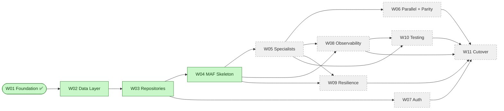

# EGP Window — Workstream Delivery Log

> **Living document.** One workstream per section, appended in delivery order.
> When a new workstream starts, we append a new `## Workstream WXX — <name>`
> block below the previous one. Nothing is ever rewritten in place — an update
> to an in-flight workstream edits *its own* section only.

**Repository:** `nandyap/EPG-MAF` (private, GitHub)
**Baseline documents:** [architecture-discovery-report.md](../architecture-discovery-report.md) · [solution-design-package.md](../solution-design-package.md) · [engineering-implementation-plan.md](../engineering-implementation-plan.md)
**Last updated:** 2026-07-09

---

## 1. How to read this document

- **Progress Dashboard** — quick executive glance at what's done, in flight, and next.
- **Workstream Roadmap** — the full sequence of workstreams we plan to deliver.
- **Workstream sections** — each has a fixed template so it's easy to compare.
- **Status legend**: ✅ Complete · 🚧 In progress · ⏳ Not started · ⏸ Blocked · ⛔ Cancelled.

### Section template used for every workstream

Every workstream section carries the same subsections in the same order:

1. Purpose & scope
2. Mapping to the LangGraph prototype
3. Mapping to Microsoft Agent Framework
4. Files created
5. Files modified
6. Implementation highlights
7. Test coverage summary
8. Validation vs. LangGraph prototype
9. Validation checklist (paste into PR)
10. Known follow-ups (out of scope for this workstream)
11. Sign-off

---

## 2. Progress Dashboard

| # | Workstream | Status | Sprint | Owner | Files (src / test) | LOC | Depends on |
|---|---|---|---|---|---|---|---|
| W01 | [Foundation](#workstream-w01--foundation-) | ✅ Complete | 1 | Delivery Lead | 25 / 15 | ~2,370 | — |
| W02 | [Clinical Data Layer](#workstream-w02--clinical-data-layer-) | ✅ Complete | 2 | DE + BE2 | 14 / 7 | ~1,650 | W01 |
| W03 | [Domain Repositories & Tool Shims](#workstream-w03--domain-repositories--tool-shims-) | ✅ Complete | 2–3 | BE2 | 11 / 7 | ~2,520 | W01, W02 |
| W04 | [MAF Workflow Skeleton](#workstream-w04--maf-workflow-skeleton-) | ✅ Complete | 4 | BE1 | 15 / 7 | ~1,880 | W01, W03 |
| W05 | [Specialist Agents](#workstream-w05--specialist-agents-) | ⏳ Not started | 4–5 | BE2 | — | — | W03, W04 |
| W06 | [Parallel Execution & Mode-Parity](#workstream-w06--parallel-execution--mode-parity-) | ⏳ Not started | 5 | BE1 + QA | — | — | W04, W05 |
| W07 | [Authentication & Authorization](#workstream-w07--authentication--authorization-) | ⏳ Not started | 6 | BE2 + SEC | — | — | W01, W03 |
| W08 | [Observability](#workstream-w08--observability-) | ⏳ Not started | 6 | PE + BE1 | — | — | W01, W04, W05 |
| W09 | [Resilience & Error Handling](#workstream-w09--resilience--error-handling-) | ⏳ Not started | 6 | BE1 | — | — | W04, W05 |
| W10 | [Testing, Evaluation & Load](#workstream-w10--testing-evaluation--load-) | ⏳ Not started | 7 | QA | — | — | W05, W08 |
| W11 | [Cutover, Release & Runbooks](#workstream-w11--cutover-release--runbooks-) | ⏳ Not started | 8 | PE + SA | — | — | All previous |

### Progress diagram



---

## 3. Workstream Roadmap

Brief description of each planned workstream. Full detail lives in each
workstream's own section below.

| # | Name | One-line goal |
|---|---|---|
| W01 | Foundation | Config, DI, logging, prompt loader, Postgres pool, Cosmos client, thread-state provider, Compass client factory. No agents. |
| W02 | Clinical Data Layer | Postgres schema port, seed from DuckDB, Alembic, `BaseRepository`, `ProvenanceService`, `AuthzPolicy` allowlist v1. |
| W03 | Domain Repositories & Tool Shims | 5 domain repositories with construction-time provenance, family-history privacy stripping, deterministic JSON parser, 14 `ai_function` shims. |
| W04 | MAF Workflow Skeleton | Chat workflow + orchestration sub-workflow, `SpecialistDispatchSet` decision type, fan-out/fan-in edges (dormant with size 1), streaming events. |
| W05 | Specialist Agents | 5 specialist wrappers (PRS, GV, FH, PGX, Phenotype) with ReAct + structured extraction + provenance attachment. |
| W06 | Parallel Execution & Mode-Parity | `ORCH_DISPATCH_MODE` flag, mode-parity test harness (blocking), per-mode telemetry, enablement gate docs. |
| W07 | Authentication & Authorization | Entra ID app registration + JWT middleware, `ClinicianContext` propagation, RBAC allowlist enforced at Repository entry, audit events. |
| W08 | Observability | OpenTelemetry SDK, custom spans + metrics, PHI-safe serializer, provenance ↔ trace correlation. |
| W09 | Resilience & Error Handling | Error taxonomy, APIM retry / circuit-breaker for LLM, DB timeouts + pool retries, Cosmos ETag retry, specialist-failure isolation, recursion budget. |
| W10 | Testing, Evaluation & Load | Golden question set, Foundry Evaluations, load tests (Locust/k6), chaos scenarios, PHI-hygiene CI gate. |
| W11 | Cutover, Release & Runbooks | Prod environment deploy, dashboards, Action Groups + alerts, runbooks, release notes, LLD sign-off. |

---

## Workstream W01 — Foundation ✅

**Status:** ✅ Complete
**Sprint:** 1
**Owner:** Delivery Lead (implementation), SA (design custody)
**PR gate reviewers:** SA · BIX SME · Security
**Files:** 25 source + 15 test + 3 top-level (README, pyproject, .env.example) = 43 in `epg-maf/`
**LOC:** ~2,370 Python + 8 prompt text files + IaC-adjacent config

### 1. Purpose & scope

Stand up all cross-cutting foundation code the specialist workstreams depend on.

**In scope:** project scaffold, `Settings`, `AGENT_LLM_CONFIGS`, byte-parity prompt bundle, structured logging, Postgres pool factory, Cosmos client factory, MAF `OpenAIChatClient` factory per agent, `PromptService`, `ThreadStateProvider`, `SessionDocument` / `ClinicianContext`, DI container, typed error taxonomy.

**Out of scope (deferred to later workstreams):** specialist agents, repositories with SQL, workflow / orchestration code, auth middleware, API layer, IaC (Bicep), CI pipelines.

### 2. Mapping to the LangGraph prototype

| Prototype file | New home | Change |
|---|---|---|
| [`config/settings.py`](../../config/settings.py) | [`egp-maf/src/egp_maf/config/settings.py`](../../epg-maf/src/egp_maf/config/settings.py) | Extended: adds Postgres, Cosmos, APIM/Compass, orchestration flags, env metadata |
| [`config/llm.py`](../../config/llm.py) — `AGENT_LLM_CONFIGS` | [`egp-maf/src/egp_maf/config/llm_config.py`](../../epg-maf/src/egp_maf/config/llm_config.py) | Byte-parity port |
| [`config/llm.py`](../../config/llm.py) — `get_llm(...)` | [`egp-maf/src/egp_maf/infrastructure/compass_client.py`](../../epg-maf/src/egp_maf/infrastructure/compass_client.py) | Now returns MAF `OpenAIChatClient` instead of `langchain_openai.ChatOpenAI` |
| `agents/chat/prompts/prompt.py` (2 constants) | `epg-maf/src/egp_maf/prompts/data/chat_router.txt`, `chat_synthesis.txt` | Byte-parity |
| `agents/main/prompts/prompt.py` | `epg-maf/src/egp_maf/prompts/data/main_agent.txt` | **One documented deviation** — duplicated rule 6 removed (Design §15.5) |
| `agents/<domain>/prompts/prompt.py` × 5 | `epg-maf/src/egp_maf/prompts/data/<domain>_agent.txt` × 5 | Byte-parity |
| — (new) | [`session_document.py`](../../epg-maf/src/egp_maf/state/session_document.py) | Persisted session state (Cosmos) |
| — (new) | [`clinician_context.py`](../../epg-maf/src/egp_maf/state/clinician_context.py) | Request-scoped identity |
| — (new) | [`db_pool.py`](../../epg-maf/src/egp_maf/infrastructure/db_pool.py) | Replaces prototype's per-call `duckdb.connect(...)` |
| — (new) | [`cosmos_client.py`](../../epg-maf/src/egp_maf/infrastructure/cosmos_client.py) | Replaces prototype's `langgraph dev` in-memory checkpointer |
| — (new) | [`prompt_service.py`](../../epg-maf/src/egp_maf/services/prompt_service.py) | Foundry-fetch with local-bundle fallback |
| — (new) | [`thread_state.py`](../../epg-maf/src/egp_maf/services/thread_state.py) | Cosmos session CRUD with ETag concurrency |
| — (new) | [`logging/setup.py`](../../epg-maf/src/egp_maf/logging/setup.py) | Structured JSON logging |
| — (new) | [`di/container.py`](../../epg-maf/src/egp_maf/di/container.py) | Hand-rolled DI + lifecycle |
| — (new) | [`errors.py`](../../epg-maf/src/egp_maf/errors.py) | Typed error taxonomy |

**Prototype files modified:** none.

### 3. Mapping to Microsoft Agent Framework

Only one module touches MAF SDK, and it isolates the dependency:

- [`compass_client.py`](../../epg-maf/src/egp_maf/infrastructure/compass_client.py) — imports `agent_framework.openai.OpenAIChatClient` lazily inside the default constructor callback. `LlmClientFactory.get(agent_name)` returns a `ChatClient` ready for any future MAF `ChatAgent`.

MAF concepts **not** touched (deferred): `WorkflowBuilder`, `Workflow`, `Executor`, `ChatAgent`, `ai_function`, sub-workflow composition.

### 4. Files created

<details>
<summary>Source (25 files)</summary>

```
epg-maf/README.md
epg-maf/pyproject.toml
epg-maf/.env.example
epg-maf/src/egp_maf/__init__.py
epg-maf/src/egp_maf/errors.py
epg-maf/src/egp_maf/config/__init__.py
epg-maf/src/egp_maf/config/settings.py
epg-maf/src/egp_maf/config/llm_config.py
epg-maf/src/egp_maf/logging/__init__.py
epg-maf/src/egp_maf/logging/setup.py
epg-maf/src/egp_maf/state/__init__.py
epg-maf/src/egp_maf/state/clinician_context.py
epg-maf/src/egp_maf/state/session_document.py
epg-maf/src/egp_maf/infrastructure/__init__.py
epg-maf/src/egp_maf/infrastructure/db_pool.py
epg-maf/src/egp_maf/infrastructure/cosmos_client.py
epg-maf/src/egp_maf/infrastructure/compass_client.py
epg-maf/src/egp_maf/prompts/__init__.py
epg-maf/src/egp_maf/prompts/bundle.py
epg-maf/src/egp_maf/prompts/data/{chat_router,chat_synthesis,main_agent,
  prs_agent,genomic_variants_agent,family_history_agent,
  pgx_agent,phenotype_agent}.txt
epg-maf/src/egp_maf/services/__init__.py
epg-maf/src/egp_maf/services/prompt_service.py
epg-maf/src/egp_maf/services/thread_state.py
epg-maf/src/egp_maf/di/__init__.py
epg-maf/src/egp_maf/di/container.py
```
</details>

<details>
<summary>Tests (15 files, ~88 test cases)</summary>

```
epg-maf/tests/__init__.py
epg-maf/tests/conftest.py
epg-maf/tests/unit/{__init__.py, test_settings.py, test_llm_config.py,
  test_logging.py, test_prompt_bundle.py, test_prompt_service.py,
  test_compass_client.py, test_state.py, test_di_container.py,
  test_db_pool.py, test_errors.py}
epg-maf/tests/integration/{__init__.py, conftest.py,
  test_db_pool.py, test_cosmos.py}
epg-maf/tests/parity/{__init__.py, test_prompt_parity.py,
  test_llm_config_parity.py}
```
</details>

### 5. Files modified

**None.** The LangGraph prototype under `agents/`, `config/`, `test_data/`, `tests/` is preserved untouched and continues to serve as the reference implementation for behaviour parity.

### 6. Implementation highlights

**Configuration**

- `Settings` extends the prototype with Postgres, Cosmos, APIM/Compass, orchestration flags. `SecretStr` used for every secret so accidental logging shows `**********`. `AliasChoices("LLM_API_KEY", "OPENAI_API_KEY")` preserved for prototype compatibility.
- `AGENT_LLM_CONFIGS` byte-parity: 7 agents, chat=`gpt-5.1`, others=`gpt-4.1`, all `temperature=0.0`.

**Prompt bundle**

- 8 prompts shipped as plain text files under `prompts/data/`, loaded at import time via `importlib.resources`.
- `PromptService` supports two modes: `bundle` (no I/O) or `foundry` (fetch with timeout, fall back to bundle on failure). `fallback_count` counter exposed for future alerting.
- **Only documented deviation** from prototype: the duplicated rule 6 in `MAIN_AGENT_SYSTEM` is removed (Design §15.5). Parity test `test_main_agent_matches_prototype_except_for_rule_6_dupe` proves this is the only textual change.

**Infrastructure**

- Postgres pool: `psycopg 3` async, per-connection `SET SESSION CHARACTERISTICS AS TRANSACTION READ ONLY`, server-side `statement_timeout` via `options=-c`, managed-identity token provider callback.
- Cosmos client: `azure-cosmos.aio.CosmosClient` with either `DefaultAzureCredential` or account key; container proxy exposed via `get_container()`.
- LLM client factory: per-agent cached `OpenAIChatClient` pointing at APIM base URL; injectable constructor for unit tests.

**Session state**

- `SessionDocument` — persisted Cosmos document. Partition key `clinician_id`, item id `thread_id`, native TTL 24h (refreshed on save).
- Convenience mutators: `with_message`, `with_agent_completed` (dedupe + sort), `without_agent` (removes both completion entry and results slot).
- `results` typed as `dict[str, Any]` — will tighten to a discriminated union of `<Domain>StateOutput` types in W05.
- `etag` field excluded from `model_dump` so serialisation is symmetric with the Cosmos payload.

**DI container**

- Hand-rolled, no framework dep. Explicit constructor injection everywhere.
- `startup()` idempotent, opens Postgres → Cosmos → warms prompts. Failure inside `startup()` calls `shutdown()` before re-raising to avoid leaked handles.
- `shutdown()` swallows and logs errors — never fails the shutdown path.

**Diagnostics**

- Structured logging via `structlog`. Dev renderer = coloured console; preprod/prod = JSON on stdout (ACA captures automatically). Every log line stamped with `service`, `service_version`, `env`.

### 7. Test coverage summary

| Layer | File | Tests | Kind |
|---|---|---:|---|
| Settings | `tests/unit/test_settings.py` | 10 | unit |
| LLM config | `tests/unit/test_llm_config.py` | 6 | unit |
| Logging | `tests/unit/test_logging.py` | 5 | unit |
| Prompt bundle | `tests/unit/test_prompt_bundle.py` | 9 | unit |
| Prompt service | `tests/unit/test_prompt_service.py` | 7 | unit |
| Compass client factory | `tests/unit/test_compass_client.py` | 9 | unit |
| State models | `tests/unit/test_state.py` | 12 | unit |
| DI container | `tests/unit/test_di_container.py` | 6 | unit |
| DB pool (unit) | `tests/unit/test_db_pool.py` | 5 | unit |
| Errors | `tests/unit/test_errors.py` | 2 | unit |
| DB pool (integration) | `tests/integration/test_db_pool.py` | 5 | integration (Postgres) |
| Cosmos (integration) | `tests/integration/test_cosmos.py` | 4 | integration (Cosmos emulator) |
| Prompt parity | `tests/parity/test_prompt_parity.py` | 5 | parity vs. prototype |
| LLM-config parity | `tests/parity/test_llm_config_parity.py` | 3 | parity vs. prototype |
| **Total** | | **~88** | |

Run commands:

```powershell
cd epg-maf
pytest -m "not integration"               # unit + parity, no external services
$env:EGP_TEST_POSTGRES = "1"
$env:EGP_TEST_COSMOS = "1"
pytest -m integration                     # requires local Postgres + Cosmos emulator
pytest -m parity                          # byte-parity vs the prototype
```

### 8. Validation vs. the LangGraph prototype

W01 ships **no runtime clinical behaviour**, so the parity guarantee here is about the *inputs to* future behaviour:

1. **Byte-parity of the 8 prompts** — `tests/parity/test_prompt_parity.py` reads the prototype's `.py` files, extracts the constant, and diffs against the bundled `.txt`. The `main_agent` test reconstructs the expected "prototype minus dupe" and asserts equality — a guard that will alert us if the prototype is fixed upstream.
2. **Model + temperature parity** — `tests/parity/test_llm_config_parity.py` executes the prototype's `config/llm.py` in a stub-injected namespace (no `langchain_openai` install needed) and diffs every `(name, model, temperature)` triple.
3. **Prototype untouched** — `git status --porcelain agents/ config/ test_data/ tests/` must be empty.

End-to-end behavioural parity harnesses (specialist output snapshots, mode-parity, Foundry evaluations) arrive with the specialist and orchestration workstreams — not applicable yet.

### 9. Validation Checklist (paste into PR)

**Prompts**

- [ ] `pytest -m parity` passes (both parity test files).
- [ ] `main_agent.txt` has exactly **one** occurrence of `"6. If the query is broad"`.
- [ ] No prompt file has trailing Python syntax (`""" NAME = """`).

**Configuration**

- [ ] `pytest tests/unit/test_settings.py -v` all green.
- [ ] `AGENT_LLM_CONFIGS` keys equal the prototype's keys (7 entries).
- [ ] `chat` uses `gpt-5.1`; every other agent uses `gpt-4.1`.
- [ ] All 7 agents have `temperature=0.0`.
- [ ] `Settings` rejects a missing `LLM_API_KEY`.
- [ ] `Settings` accepts either `LLM_API_KEY` or `OPENAI_API_KEY`.
- [ ] `SecretStr` values redacted in `repr(Settings)`.

**Logging**

- [ ] `pytest tests/unit/test_logging.py -v` all green.
- [ ] `EGP_ENV=prod` produces JSON output; `EGP_ENV=dev` produces coloured console.
- [ ] Every log line carries `service`, `service_version`, `env`.
- [ ] `EGP_LOG_LEVEL=ERROR` suppresses `INFO`-level events.

**State**

- [ ] `pytest tests/unit/test_state.py -v` all green.
- [ ] `SessionDocument` rejects unknown fields (`extra='forbid'`).
- [ ] `SessionDocument.etag` excluded from `model_dump(mode="json")`.
- [ ] `with_agent_completed` dedupes and sorts.
- [ ] `without_agent` removes both the completion entry and the results slot.
- [ ] `ClinicianContext` frozen.
- [ ] `ClinicianContext.to_span_attributes` returns only `clinician_id` and `tenant_id` (no PHI).

**Infrastructure**

- [ ] `pytest tests/unit/test_db_pool.py -v` all green.
- [ ] `pytest tests/unit/test_compass_client.py -v` all green.
- [ ] `DbPoolFactory` builds correct conninfo with password.
- [ ] `DbPoolFactory` builds correct conninfo with managed-identity token.
- [ ] `DbPoolFactory` raises `ConfigurationError` when neither is set.
- [ ] `LlmClientFactory.get` caches per agent name.
- [ ] `LlmClientFactory.get` raises `ConfigurationError` on unknown agent.

**Services**

- [ ] `pytest tests/unit/test_prompt_service.py -v` all green.
- [ ] Bundle-mode `warm()` performs no Foundry calls.
- [ ] Foundry-mode `warm()` fetches every known prompt.
- [ ] Foundry `None` responses fall back to the bundle and increment `fallback_count`.
- [ ] Foundry exceptions fall back to the bundle and increment `fallback_count`.
- [ ] `warm()` is idempotent.

**DI container**

- [ ] `pytest tests/unit/test_di_container.py -v` all green.
- [ ] `startup()` opens Postgres and Cosmos in order, then warms prompts.
- [ ] `startup()` is idempotent.
- [ ] `shutdown()` closes everything and is safe before `startup()`.
- [ ] A failing `startup()` calls `shutdown()` before re-raising.
- [ ] `build_container()` wires all attributes to concrete instances.

**Integration** (only if Postgres + Cosmos emulator running)

- [ ] `EGP_TEST_POSTGRES=1 pytest -m integration -k db_pool` all green.
- [ ] `EGP_TEST_COSMOS=1 pytest -m integration -k cosmos` all green.
- [ ] Concurrent-read test with 10 connections succeeds.
- [ ] ETag-conflict retry then raise verified.

**PHI hygiene** (pre-approval — full CI check in W08)

- [ ] `git grep -n "search_context_notes" epg-maf/src` returns **zero** hits.
- [ ] `git grep -n "affected_relative_count" epg-maf/src` returns **zero** hits outside `session_document.py::results` opaque payload.
- [ ] `git grep -n "message.content" epg-maf/src` returns only structured field access, not log arguments.

**Repository hygiene**

- [ ] `git status --porcelain agents/ config/ test_data/ tests/` is empty.
- [ ] `epg-maf/.env.example` contains no real secrets (only local dev placeholders + the public Cosmos emulator key).
- [ ] `pyproject.toml` version pins set.

### 10. Known follow-ups (out of scope for W01)

- **APIM policy XML** (retry, circuit-breaker, JWT validation) → W09 with the platform team.
- **PHI-safe span attribute allowlist + CI check** → W08 (Observability).
- **Foundry Prompt Catalog fetcher implementation** → future story once Foundry region availability is confirmed.
- **Postgres managed-identity token refresh** — the current `token_provider` callback returns a token per new connection; long-lived connections may see the token expire. Refresh policy is a small follow-up in W02.
- **`SessionDocument.results` typed models** — `dict[str, Any]` placeholder → replaced with discriminated union of `<Domain>StateOutput` types in W05.
- **Trace/span ids on `DBProvenance`** → W08 (Observability §10.5).
- **Load-test the pool at realistic concurrency** → W10.

### 11. Sign-off

- [ ] SA — architecture reviewer
- [ ] Delivery Lead — implementation reviewer
- [ ] BIX SME — prompt bundle reviewed for accidental drift
- [ ] Security — `.env.example` reviewed for embedded secrets

---

## Workstream W02 — Clinical Data Layer ✅

**Status:** ✅ Complete
**Sprint:** 2
**Owner:** DE + BE2 (implementation), SA (contract review), SEC (allowlist review)
**PR gate reviewers:** SA · DE · SEC
**Files:** 14 source (7 new + 7 updated) + 7 test = 21 in `epg-maf/`
**LOC:** ~1,650 Python + 550 SQL + 8 config
**Depends on:** W01

### 1. Purpose & scope

Build the load-bearing data seam described in Discovery §24.5. Everything a
W03 domain Repository needs — Postgres schema, seed pipeline, Alembic
migrations, `BaseRepository`, `ProvenanceService`,
`AuthzPolicy` allowlist v1 — is delivered here.

**In scope:**

- Postgres 16 schema port of all 10 DuckDB tables (Design §11.2).
- One-shot DuckDB→CSV seed exporter + `psql \copy` load script.
- Alembic migration mechanism with hand-written `001_baseline_schema`.
- `egp_migrator` (DDL) and `egp_agent_ro` (SELECT-only) role bootstrap.
- `DBProvenance` ported (with new `trace_id`/`span_id` fields for W08).
- `ProvenanceService` — factory for construction-time provenance.
- `AuthzPolicy` protocol + `AllowlistAuthzPolicy` (JSON file, mtime hot-reload).
  Test doubles `OpenAuthzPolicy` / `ClosedAuthzPolicy` live in
  `tests/support/authz_doubles.py` (moved out of `src/` in the W02 cleanup
  commit — see change history).
- `BaseRepository` (pool + authz + provenance wiring).
- `AccessDenied` typed exception (403).
- New `POSTGRES_MIGRATOR_*` and `EGP_AUTHZ_ALLOWLIST_PATH` settings.
- Data-quality invariant tests (Discovery §22 M7).

**Out of scope (deferred to W03):**

- The 5 domain repositories (`PRSRepository`, `GenomicVariantsRepository`,
  `FamilyHistoryRepository`, `PGXRepository`, `PhenotypeRepository`).
- The deterministic `annotations_json` parser.
- The 14 `ai_function` tool shims.

### 2. Mapping to the LangGraph prototype

| Prototype file | New home | Change |
|---|---|---|
| [`test_data/schema.sql`](../../test_data/schema.sql) (DuckDB) | [`epg-maf/db/schema/V001__baseline.sql`](../../epg-maf/db/schema/V001__baseline.sql) | Mechanical Postgres port: `JSON`→`jsonb`, `DEFAULT nextval(...)`→`GENERATED BY DEFAULT AS IDENTITY`, `VARCHAR`→`text`, `NOT NULL` tightened on composite-PK columns. All CHECK constraints, FKs, PKs, indexes preserved verbatim. |
| [`test_data/clinical_genetics.duckdb`](../../test_data/clinical_genetics.duckdb) (13.76 MB seeded blob) | [`epg-maf/db/seed/export_from_duckdb.py`](../../epg-maf/db/seed/export_from_duckdb.py) + [`load.sql`](../../epg-maf/db/seed/load.sql) | Script-based export (run locally once — CSVs land in `db/seed/data/`, gitignored). |
| [`agents/shared/state/provenance.py::DBProvenance`](../../agents/shared/state/provenance.py) | [`epg-maf/src/egp_maf/state/provenance.py`](../../epg-maf/src/egp_maf/state/provenance.py) | Port + `trace_id`/`span_id` optional fields for W08. Uses `datetime.now(timezone.utc)` (deprecation-safe). Now `frozen=True`. |
| Per-tool `_executor` module global (5×) | [`BaseRepository`](../../epg-maf/src/egp_maf/services/repositories/base.py) | Provenance constructed at query time (Design §11.7); post-hoc `_attach_provenance` obsolete. |
| — | [`ProvenanceService`](../../epg-maf/src/egp_maf/services/provenance.py) | New — construction-time factory with pluggable clock and OTEL provider. |
| — | [`AllowlistAuthzPolicy`](../../epg-maf/src/egp_maf/services/authz.py) | New — Phase 1 RBAC (Design ADR-017). |
| — | [`Alembic env + baseline migration`](../../epg-maf/db/alembic) | New — Design §11.6. |
| — | [`roles.sql`](../../epg-maf/db/bootstrap/roles.sql) | New — two-role separation (Design §11.5). |

**Prototype files modified:** none.

### 3. Mapping to Microsoft Agent Framework

Zero MAF imports in W02. Pure infrastructure preparation. The `ai_function`
tool shims that will consume `BaseRepository` are built in W03.

### 4. Files created

<details>
<summary>Database (11 files under <code>epg-maf/db/</code>)</summary>

```
epg-maf/db/README.md
epg-maf/db/schema/V001__baseline.sql          (~200 lines, 10 tables)
epg-maf/db/bootstrap/roles.sql
epg-maf/db/seed/README.md
epg-maf/db/seed/export_from_duckdb.py
epg-maf/db/seed/load.sql
epg-maf/db/seed/.gitignore                    (excludes data/)
epg-maf/db/alembic/alembic.ini
epg-maf/db/alembic/env.py
epg-maf/db/alembic/script.py.mako
epg-maf/db/alembic/versions/001_baseline_schema.py
```
</details>

<details>
<summary>Source (5 new files)</summary>

```
epg-maf/src/egp_maf/state/provenance.py             (DBProvenance + helper)
epg-maf/src/egp_maf/services/provenance.py          (ProvenanceService)
epg-maf/src/egp_maf/services/authz.py               (AuthzPolicy protocol + AllowlistAuthzPolicy)
epg-maf/src/egp_maf/services/repositories/__init__.py
epg-maf/src/egp_maf/services/repositories/base.py   (BaseRepository)
```
</details>

<details>
<summary>Tests (7 new files, ~55 test cases)</summary>

```
epg-maf/tests/unit/test_provenance.py               (10 tests)
epg-maf/tests/unit/test_provenance_service.py       (7 tests)
epg-maf/tests/unit/test_authz.py                    (14 tests)
epg-maf/tests/unit/test_repository_base.py          (7 tests)
epg-maf/tests/integration/test_schema.py            (2 tests, Alembic lifecycle)
epg-maf/tests/integration/test_seed_invariants.py   (4 tests, data-quality)
epg-maf/tests/parity/test_row_counts.py             (1 test, byte-parity vs DuckDB)
```
</details>

### 5. Files modified

W01 files touched to wire the new services in — every change is additive:

| File | Change |
|---|---|
| `epg-maf/src/egp_maf/errors.py` | Added `AccessDenied` (403). |
| `epg-maf/src/egp_maf/config/settings.py` | Added `postgres_migrator_user`, `postgres_migrator_password`, `authz_allowlist_path`. |
| `epg-maf/src/egp_maf/state/__init__.py` | Exports `DBProvenance` + `find_provenance_for_field`. |
| `epg-maf/src/egp_maf/services/__init__.py` | Exports the new services + policies. |
| `epg-maf/src/egp_maf/di/container.py` | Wires `provenance_service` + `authz_policy` (uses `Settings.authz_allowlist_path`). |
| `epg-maf/pyproject.toml` | Adds `alembic`, `sqlalchemy`, plus `duckdb` (dev) for the seed exporter. |
| `epg-maf/.env.example` | Adds `POSTGRES_MIGRATOR_*` and `EGP_AUTHZ_ALLOWLIST_PATH`. |
| `epg-maf/tests/integration/conftest.py` | Adds `_build_agent_ro_conninfo()` and `_build_migrator_conninfo()` helpers. |
| `epg-maf/tests/unit/test_di_container.py` | Updates container construction test doubles to include new services. |

**Prototype files modified:** none.

### 6. Implementation highlights

**Schema port**

- Every one of the 10 DuckDB tables is present in Postgres with identical
  column names, types (mechanical Postgres equivalents), and constraints.
- CHECK constraints preserved verbatim — same 6-value `pathogenicity`, 5-value
  `phenotype`, 4-value `risk_band`, 7-value `inheritance` vocabularies.
- All indexes preserved.
- `annotations_json` is `jsonb` (Postgres-native, indexable if needed later).
- Identity columns replace explicit sequences (idiomatic Postgres).
- After DDL, `GRANT SELECT ON ALL TABLES IN SCHEMA public TO egp_agent_ro`.

**Seed pipeline**

- One-shot Python script exports each of the 10 tables in FK-safe order.
- JSON columns serialised as compact JSON (`json.dumps(..., separators=(",",":"))`).
- `load.sql` uses `\copy` (client-side) so it works against a private-endpoint
  Postgres without server-side file access.
- Identity sequences reset via `setval(pg_get_serial_sequence(...))` post-load.

**Alembic**

- `env.py` resolves URL from `ALEMBIC_URL` (preferred) or `POSTGRES_MIGRATOR_*`
  env vars (fallback). Never uses the application role.
- `001_baseline_schema.py` reads `db/schema/V001__baseline.sql` and executes
  via `connection.exec_driver_sql(...)` — no SQLAlchemy statement parsing.
- `downgrade()` drops all 10 tables in reverse-dependency order (no CASCADE).

**Provenance construction moves left**

- Prototype: post-hoc `_attach_provenance` matched result rows to tool
  outputs by domain key (fragile).
- Target: `ProvenanceService.build(...)` called by the Repository at the
  moment the row is read. Provenance becomes construction-time truth
  (Design §11.7).
- `DBProvenance` gains `trace_id`/`span_id` optional fields; `ProvenanceService`
  accepts an `otel_context_provider` callable that will be plugged in by W08.

**Authz policy**

- Phase 1 v1 is a JSON allowlist file (Key Vault-mounted in prod). Structure:

  ```json
  {
      "version": 1,
      "clinicians": { "c1": ["P001", "P002"] },
      "admins": ["adm1"]
  }
  ```

- **Fail closed.** If no path is configured, everyone except the built-in
  `system` context is denied. Missing file at startup → `ConfigurationError`.
- Hot reload via file mtime — cheap syscall per `can_read` call.
- Two typed exceptions: `AccessDenied` (403), `ConfigurationError` (500).

**BaseRepository contract**

- Every W03 domain Repository will inherit `BaseRepository` and only add SQL.
- `_authorize(ctx, patient_id)` enforces RBAC on method entry.
- `_fetch_all(sql, params)` returns `list[dict[str, Any]]` — same shape as
  the prototype's tool outputs.
- Driver errors wrapped as `DatabaseUnavailable` (503).

### 7. Test coverage summary

| Layer | File | Tests | Kind |
|---|---|---:|---|
| `DBProvenance` | `tests/unit/test_provenance.py` | 10 | unit |
| `ProvenanceService` | `tests/unit/test_provenance_service.py` | 7 | unit |
| `AuthzPolicy` | `tests/unit/test_authz.py` | 14 | unit |
| `BaseRepository` | `tests/unit/test_repository_base.py` | 7 | unit |
| Schema (Alembic upgrade/downgrade) | `tests/integration/test_schema.py` | 2 | integration (Postgres) |
| Seed invariants | `tests/integration/test_seed_invariants.py` | 4 | integration (Postgres) |
| Row-count parity vs DuckDB | `tests/parity/test_row_counts.py` | 1 | parity (Postgres + DuckDB) |
| **W02 total** | | **~45** | |
| **Programme total (W01 + W02)** | | **~133** | |

Run commands:

```powershell
cd epg-maf
pytest -m "not integration"            # unit + parity (parity row-count skips if no PG)
$env:EGP_TEST_POSTGRES = "1"
$env:EGP_TEST_COSMOS = "1"
pytest -m integration                  # requires local Postgres + Cosmos
```

### 8. Validation vs. the LangGraph prototype

Three parity checks land in W02:

1. **Schema shape** — every DuckDB table exists in Postgres with the same
   column names and constraints. Manually reviewed line-by-line;
   `test_schema.py` proves the 10 tables come up cleanly.
2. **Data quality invariants** — `test_seed_invariants.py` asserts the
   denormalisation-drift invariant (Discovery §22 M7) plus FK coverage.
3. **Row-count parity** — `test_row_counts.py` counts rows in every table
   across DuckDB and Postgres; any drift fails CI.

Column-level value parity is verified per Repository in W03 (specialist
snapshots).

### 9. Validation Checklist (paste into PR)

**Schema port**

- [ ] `pytest tests/integration/test_schema.py -v` — Alembic upgrade + downgrade both succeed.
- [ ] Every one of the 10 expected tables is present after upgrade.
- [ ] All 10 tables are dropped after downgrade.
- [ ] `db/schema/V001__baseline.sql` preserves every CHECK, FK, PK, index from the prototype (line-by-line review).

**Seed pipeline**

- [ ] `python db/seed/export_from_duckdb.py` completes without error.
- [ ] `psql -f db/seed/load.sql` loads every CSV without error.
- [ ] `pytest tests/integration/test_seed_invariants.py -v` — 4 invariants all pass:
  - [ ] Every table has ≥ 1 row.
  - [ ] `patient_prs.disease_name` matches `prs_annotations.disease_name` for every joined row.
  - [ ] Every `patient_variants.variant_id` has an annotation row.
  - [ ] Every `patient_pgx_status.gene` appears in at least one `pgx_annotations` row.
- [ ] `pytest tests/parity/test_row_counts.py -v` — row counts match DuckDB.

**Alembic**

- [ ] `alembic -c db/alembic/alembic.ini upgrade head` succeeds against a fresh DB.
- [ ] `alembic downgrade base` cleanly removes everything.
- [ ] Alembic uses `POSTGRES_MIGRATOR_*` credentials, not the app credentials.
- [ ] Application code never imports Alembic (`git grep "import alembic" epg-maf/src` → 0 hits).

**Roles**

- [ ] `bootstrap/roles.sql` creates both roles idempotently.
- [ ] `egp_agent_ro` can only SELECT (verified manually or via prod policy).
- [ ] `egp_migrator` credentials never appear in application `Settings` at runtime (only Alembic-side).

**Provenance**

- [ ] `pytest tests/unit/test_provenance.py -v` — all 10 tests pass.
- [ ] `pytest tests/unit/test_provenance_service.py -v` — all 7 tests pass.
- [ ] `DBProvenance` is `frozen=True` and rejects extra fields.
- [ ] Inputs to `ProvenanceService.build` are copied (mutating them does not affect the record).
- [ ] OTEL context provider errors are swallowed silently (never fail provenance construction).

**Authorization**

- [ ] `pytest tests/unit/test_authz.py -v` — all 14 tests pass.
- [ ] Missing allowlist path → deny everyone except `system`.
- [ ] Missing allowlist file → `ConfigurationError` at policy construction.
- [ ] Invalid JSON → `ConfigurationError`.
- [ ] Wrong schema version → `ConfigurationError`.
- [ ] Admin bypasses per-patient check.
- [ ] mtime-based hot reload works (1s sleep test confirms).
- [ ] `AccessDenied` maps to HTTP 403 with stable `error_code`.

**Repository base**

- [ ] `pytest tests/unit/test_repository_base.py -v` — all 7 tests pass.
- [ ] `_authorize` delegates to `AuthzPolicy` and re-raises `AccessDenied`.
- [ ] `_fetch_all` wraps driver errors as `DatabaseUnavailable` with `__cause__` preserved.
- [ ] `_build_provenance` produces a valid `DBProvenance` record.
- [ ] `BaseRepository` exposes only `_authorize`, `_fetch_all`, `_build_provenance` — no `execute` method (W03 subclasses will supply their own domain-specific methods).

**DI container**

- [ ] `pytest tests/unit/test_di_container.py -v` — every existing test still passes.
- [ ] `build_container(...)` wires `provenance_service` and `authz_policy`.
- [ ] Startup order unchanged: Cosmos → Postgres → Prompts.

**PHI hygiene**

- [ ] `git grep -n "search_context_notes" epg-maf/src` → 0 hits.
- [ ] `git grep -n "affected_relative_count" epg-maf/src` → 0 hits.
- [ ] Log emitted by `AllowlistAuthzPolicy` on denial contains only `clinician_id`, `patient_id`, `route` — no PHI.

**Repository hygiene**

- [ ] `git status --porcelain agents/ config/ test_data/ tests/` is empty (prototype untouched).
- [ ] `db/seed/data/` is gitignored.
- [ ] `.env.example` contains no real secrets — new entries are placeholders.

### 10. Known follow-ups (out of scope for W02)

- Domain repositories (W03) inherit from `BaseRepository` — one per specialist.
- Deterministic `annotations_json` parser (W03) — replaces LLM parsing of the JSON blob.
- OTEL context provider wired into `ProvenanceService` (W08).
- Bicep templates that provision Postgres Flexible Server + reject `COSMOS_KEY` in prod (W11).
- Real Foundry allowlist source (Phase 3 replaces the JSON file with a policy engine).
- Load-test the pool at realistic concurrency (W10).
- Managed-identity token refresh for long-lived Postgres connections (small follow-up).

### 11. Sign-off

- [ ] SA — architecture reviewer
- [ ] DE — schema port + seed pipeline reviewer
- [ ] BE2 — Repository base + provenance reviewer
- [ ] SEC — allowlist + roles reviewer

---

## Workstream W03 — Domain Repositories & Tool Shims ✅

**Status:** ✅ Complete
**Sprint:** 2–3
**Owner:** BE2 (implementation), SA (contract review), BIX (SQL-parity review)
**PR gate reviewers:** SA · BE2 · BIX
**Files:** 11 source (5 result modules + 5 repositories + 1 `state/results/__init__.py`) + 7 test + 3 modified in `epg-maf/`
**LOC:** ~2,520 Python (source ~1,360 · tests ~1,160)
**Depends on:** W01, W02

### 1. Purpose & scope

Realise the design promise that W02 set up: **typed domain models with
construction-time provenance, one Repository per specialist domain**.

**In scope:**

- 5 concrete repositories inheriting `BaseRepository`:
  `PRSRepository`, `GenomicVariantsRepository`,
  `FamilyHistoryRepository`, `PGXRepository`, `PhenotypeRepository`.
- Typed result models per domain, ported byte-faithfully from the
  prototype's `agents/<domain>/state/schemas.py`.
- **Deterministic** `annotations_json` parser (Design ADR-006) — replaces
  the prototype's LLM-driven JSON decomposition.
- Family-history public/internal projection split via `.to_public()`
  method on the internal model (Design §11.7, ADR-017).
- Byte-faithful SQL port (DuckDB → Postgres); every `explore_/search_/get_`
  method on the prototype maps 1:1 to a Repository method.

**Out of scope (→ W04/W05):**

- `ai_function` tool shims (need MAF `ChatAgent` construction context).
- Domain Services (thin pass-throughs — will be added alongside shims when needed).
- Specialist wrappers, workflow, routing.

### 2. Mapping to the LangGraph prototype

| Prototype file | New home | Change |
|---|---|---|
| `agents/prs/tools/tools.py` (3 `@tool`s) | [`services/repositories/prs.py`](../../epg-maf/src/egp_maf/services/repositories/prs.py) | SQL preserved (Postgres-adjusted); returns typed `PRSResult` |
| `agents/genomic_variants/tools/tools.py` (3 tools) | [`services/repositories/genomic_variants.py`](../../epg-maf/src/egp_maf/services/repositories/genomic_variants.py) | + deterministic JSON parser inline; Python — not LLM — decomposes `annotations_json` |
| `agents/family_history/tools/tools.py` (3 tools) | [`services/repositories/family_history.py`](../../epg-maf/src/egp_maf/services/repositories/family_history.py) | Returns internal projection; `.to_public()` strips privacy fields |
| `agents/pgx/tools/tools.py` (3 tools) | [`services/repositories/pgx.py`](../../epg-maf/src/egp_maf/services/repositories/pgx.py) | LEFT JOIN on `(gene, phenotype)` preserved |
| `agents/phenotype/tools/tools.py` (2 tools) | [`services/repositories/phenotype.py`](../../epg-maf/src/egp_maf/services/repositories/phenotype.py) | `LIST(DISTINCT)` → `array_agg(DISTINCT)`; grouped `COALESCE` preserved |
| `agents/prs/state/schemas.py` | [`state/results/prs.py`](../../epg-maf/src/egp_maf/state/results/prs.py) | Port; adds `PRSAnnotation` reference-row type |
| `agents/genomic_variants/state/schemas.py` | [`state/results/genomic_variants.py`](../../epg-maf/src/egp_maf/state/results/genomic_variants.py) | Port; adds `parse_annotations_json` + `VariantAnnotation`; soft warnings use `structlog` |
| `agents/family_history/state/schemas.py` | [`state/results/family_history.py`](../../epg-maf/src/egp_maf/state/results/family_history.py) | Port; adds `KinshipHistoryAnnotation` + `.to_public()` method |
| `agents/pgx/state/schemas.py` | [`state/results/pgx.py`](../../epg-maf/src/egp_maf/state/results/pgx.py) | Port; adds `PGXAnnotation` |
| `agents/phenotype/state/schemas.py` | [`state/results/phenotype.py`](../../epg-maf/src/egp_maf/state/results/phenotype.py) | Port (no annotation type — no annotation table exists) |

**Prototype files modified:** none.

### 3. Mapping to Microsoft Agent Framework

**Zero MAF imports in W03.** Repositories are framework-agnostic. The
`ai_function` decorator that adapts these methods into MAF tool shims
arrives in W04/W05 when specialists are assembled.

### 4. Files created

<details>
<summary>Source (11 files)</summary>

```
epg-maf/src/egp_maf/state/results/__init__.py         (re-exports)
epg-maf/src/egp_maf/state/results/prs.py              (PRSKey, PRSAnnotation, PRSResult, PRSResultList)
epg-maf/src/egp_maf/state/results/pgx.py              (PGXKey, PGXAnnotation, PGXDrugResult, PGXResultList)
epg-maf/src/egp_maf/state/results/phenotype.py        (PhenotypeKey, PhenotypeDiseaseResult, PhenotypeResultList)
epg-maf/src/egp_maf/state/results/family_history.py   (Key, Annotation, Result(internal+public), ResultList(both))
epg-maf/src/egp_maf/state/results/genomic_variants.py (Key, Annotation, SampleData, CoreAnn, ExtendedAnn, parser, Result, ResultList)
epg-maf/src/egp_maf/services/repositories/prs.py
epg-maf/src/egp_maf/services/repositories/pgx.py
epg-maf/src/egp_maf/services/repositories/phenotype.py
epg-maf/src/egp_maf/services/repositories/family_history.py
epg-maf/src/egp_maf/services/repositories/genomic_variants.py
```
</details>

<details>
<summary>Tests (6 files, ~65 test cases)</summary>

```
epg-maf/tests/support/fake_pool.py                     (test double for psycopg pool)
epg-maf/tests/unit/test_results.py                     (~15 tests — all result models)
epg-maf/tests/unit/test_variant_parser.py              (~13 tests — JSON parser edge cases)
epg-maf/tests/unit/test_family_history_strip.py        (~5 tests — privacy strip contract)
epg-maf/tests/unit/test_repositories.py                (~14 tests — repositories with fake pool)
epg-maf/tests/integration/test_repositories.py         (~5 tests — real Postgres end-to-end)
epg-maf/tests/parity/test_repository_parity.py         (~5 tests — Repo vs DuckDB field parity)
```
</details>

### 5. Files modified

| File | Change |
|---|---|
| `epg-maf/src/egp_maf/state/__init__.py` | Docstring refresh (points to `state.results`); public API unchanged. |
| `epg-maf/src/egp_maf/services/__init__.py` | Re-exports 5 new repository classes. |
| `epg-maf/src/egp_maf/services/repositories/__init__.py` | Re-exports 5 new repository classes. |

**Prototype files modified:** none.

### 6. Implementation highlights

**Uniform Repository shape.**
Every domain Repository inherits `BaseRepository`, adds public `async` methods
that mirror the prototype's tool names 1:1, calls `self._authorize(ctx,
patient_id)` on any patient-scoped call, uses `self._fetch_all(sql, params)`
to run SELECTs, and builds provenance via `self._build_provenance(...)` on
`get_patient_*` methods only. `explore_*` and `search_*_annotations` do not
build provenance (Discovery §5.7 — preserved).

**Postgres-adjusted SQL.**
Mechanical adjustments only: `?` → `%s`, `LIST(DISTINCT x)` → `array_agg(
DISTINCT x)`, `CAST(x AS VARCHAR)` → `to_char(x, 'YYYY-MM-DD')` for dates.
Everything else — `ILIKE`, `COALESCE`, `LEFT JOIN`, index-friendly WHERE
ordering — is unchanged and Postgres-native.

**Deterministic JSON parser (Design ADR-006).**
[`parse_annotations_json`](../../epg-maf/src/egp_maf/state/results/genomic_variants.py) accepts `None`,
`""`, a JSON string, or a dict. Known keys are promoted to typed fields;
unknown keys go into `raw_annotations`. Malformed JSON raises
`ValueError` — no silent fallback. Removes the prototype's silent-
hallucination clinical-safety risk.

**Family-history privacy split at the model layer.**
[`FamilyHistoryCriteriaResult.to_public()`](../../epg-maf/src/egp_maf/state/results/family_history.py) returns a
`FamilyHistoryCriteriaResultPublic` with three privacy-sensitive fields
absent from the type entirely and stripped from every provenance
`source_row`. The Repository returns the internal projection — the
specialist calls `.to_public()` before writing to orchestrator state.

**RBAC first, always.**
Every patient-scoped method starts with `self._authorize(ctx, patient_id)`.
`search_*_annotations` reference-only methods do NOT authorise —
reference data is public within the system.

**Structured warning for unknown pathogenicity / variant_type.**
`VariantCoreAnnotations` post-validator now emits a `variant.unknown_value`
structured event via `structlog` (instead of the prototype's
`logging.warning`). Same soft-warning semantics; machine-parseable event
for W08 alerting.

### 7. Test coverage summary

| Layer | File | Tests | Kind |
|---|---|---:|---|
| Result models | `tests/unit/test_results.py` | ~15 | unit |
| JSON parser | `tests/unit/test_variant_parser.py` | ~13 | unit |
| Family-history strip | `tests/unit/test_family_history_strip.py` | ~5 | unit |
| Repositories (fake pool) | `tests/unit/test_repositories.py` | ~14 | unit |
| Repositories (real PG) | `tests/integration/test_repositories.py` | ~5 | integration |
| Row + field parity vs DuckDB | `tests/parity/test_repository_parity.py` | ~5 | parity |
| **W03 subtotal** | | **~57** | |
| **Programme total (W01–W03)** | | **~190** | |

Run commands:

```powershell
cd epg-maf
pytest -m "not integration"            # unit + parity (skips if no PG)
$env:EGP_TEST_POSTGRES = "1"
pytest -m integration                  # requires seeded local Postgres
pytest -m parity                       # requires PG + DuckDB present
```

### 8. Validation vs. the LangGraph prototype

Three layered parity checks land in W03:

1. **SQL text preserved.** Every `explore_/search_/get_` SQL block is a
   line-by-line port; only mechanical Postgres adjustments were made.
2. **Row-count parity per patient** (`test_repository_parity.py`) — for
   each domain's `get_patient_*`, run against Postgres and DuckDB with the
   same patient and assert equal counts.
3. **Key-set parity** — for PRS/variants the parity test compares the
   set of returned `prs_name`s / `variant_id`s; for family history the
   `(disease_name, criteria_name, meets_threshold)` triples must match;
   for phenotype the `disease_name → encounter_count` map must match
   (grouping semantics preserved).

Column-value parity for LLM-derived fields (interpretations, summaries)
is not applicable — those don't exist yet.

### 9. Validation Checklist (paste into PR)

**Result models**

- [ ] `pytest tests/unit/test_results.py -v` — all green.
- [ ] `PRSResult.risk_band` rejects values outside the 4-value vocabulary.
- [ ] `PRSResult.percentile` bounds enforced (0–100).
- [ ] Every result model rejects unknown fields (`extra='forbid'`).
- [ ] LLM-derived fields default to `None` (Repository never populates them).

**JSON parser**

- [ ] `pytest tests/unit/test_variant_parser.py -v` — all green.
- [ ] `None`, `""`, `{}` → empty `VariantExtendedAnnotations` (never raises).
- [ ] Known keys promoted to typed slots.
- [ ] Unknown keys land in `raw_annotations`.
- [ ] Malformed JSON raises `ValueError` — no silent fallback.
- [ ] `acmg_criteria: "PS1"` (string) coerces to `["PS1"]`.

**Family-history privacy strip**

- [ ] `pytest tests/unit/test_family_history_strip.py -v` — all green.
- [ ] `FamilyHistoryCriteriaResultPublic.model_fields` does not contain the three privacy keys.
- [ ] Provenance `source_row` also has the three keys stripped.
- [ ] `to_public()` does NOT mutate the internal result.
- [ ] `diseases_meeting_threshold` correctly carried over on the list-level projection.

**Repositories (unit)**

- [ ] `pytest tests/unit/test_repositories.py -v` — all green.
- [ ] Every `explore_*` returns typed keys, no provenance.
- [ ] Every `search_*_annotations` returns typed annotation rows, no provenance, does NOT authorise.
- [ ] Every `get_patient_*` returns typed results with exactly one `DBProvenance` record per row.
- [ ] RBAC denial raises `AccessDenied` from `get_patient_*` and `explore_*`.
- [ ] All SQL text uses `%s` placeholders, never `?`.

**Repositories (integration — requires seeded PG)**

- [ ] `EGP_TEST_POSTGRES=1 pytest -m integration -k test_repositories` — all green.
- [ ] Every domain's `explore_*` and `get_patient_*` returns non-empty typed results for the first available patient.
- [ ] Family-history `.to_public()` verified end-to-end.

**Parity vs DuckDB**

- [ ] `EGP_TEST_POSTGRES=1 pytest -m parity -k test_repository_parity` — all green.
- [ ] Row-count parity per domain.
- [ ] Key-set parity per domain.

**PHI hygiene**

- [ ] `git grep -n "search_context_notes" epg-maf/src` — hits only in `state/results/family_history.py` (declared field + strip logic) and `services/repositories/family_history.py` (SELECT + result construction). No downstream.
- [ ] `git grep -n "affected_relative_count" epg-maf/src` — same three files only.
- [ ] `FamilyHistoryCriteriaResultPublic.model_fields` never contains those three names.

**Repository hygiene**

- [ ] `git status --porcelain agents/ config/ test_data/ tests/` is empty (prototype untouched).
- [ ] No `IRepository` protocol re-introduced (removed in the W02 cleanup).
- [ ] No `OpenAuthzPolicy` / `ClosedAuthzPolicy` in `src/` (test-only, live in `tests/support/`).

### 10. Known follow-ups (out of scope for W03)

- `ai_function` tool shims (→ W04/W05) that wrap Repository methods and adapt them to MAF `ChatAgent`.
- Domain Services layer (→ W05) if a specialist needs to compose more than one Repository.
- OTEL context provider wired into `ProvenanceService` (→ W08).
- Phenotype grouping variance: the prototype's OR-combining of `disease_name` + `search_term` filters is preserved verbatim; a comprehensive filter-permutation test comes with the specialist evaluation in W10.

### 11. Sign-off

- [ ] SA — Repository contract review
- [ ] BE2 — implementation reviewer
- [ ] BIX SME — SQL-parity spot check + parser edge cases
- [ ] QA — test coverage sign-off

---

## Workstream W04 — MAF Workflow Skeleton ✅

**Status:** ✅ Complete
**Sprint:** 4
**Owner:** BE1 (implementation), SA (workflow-shape review)
**PR gate reviewers:** SA · BE1
**Files:** 15 source + 7 test in `epg-maf/`; DI container + errors module updated
**LOC:** ~1,880 Python (source ~1,210 · tests ~670)
**Depends on:** W01, W03

### 1. Purpose & scope

Stand up the MAF `WorkflowBuilder` topology that the specialists (W05)
and parallel dispatch (W06) will slot into: chat workflow + orchestration
sub-workflow, fan-out/fan-in edges wired for width ≤10, iteration-budget
safeguard, provenance-stripped synthesis. Specialists are placeholders
that return a canned payload — real `ChatAgent`-backed implementations
land in W05 without touching this scaffolding.

**In scope:**

- Shared-state Pydantic models mirroring the prototype's `ChatAgentState`
  and `OrchestrationAgentState` field-for-field, plus `ClinicianContext`
  (ADR-008) and set-append reducer with `Remove` sentinel on
  `agents_completed` (ADR-009).
- Router decision types: `ChatRouterDecision` (same shape as prototype)
  and `SpecialistDispatchSet` (set from day 1 per ADR-013).
- Two typed errors: `RoutingBudgetExceeded`, `SpecialistFailed`.
- 3 chat executors (`chat_router`, `run_orchestration`,
  `synthesize_response`) + 5-specialist orchestration sub-workflow with
  dispatcher + joiner.
- Fan-out/fan-in edges wired to all 5 stubs — dormant at |set|=1 in
  Phase 1 (Design ADR-013); dispatch mode + max fanout width sanitised
  in `orch_router` before dispatch.
- Iteration budget = `ORCH_ITERATION_BUDGET` (default 12) enforced with
  `RoutingBudgetExceeded`; sub-workflow failures degrade gracefully via
  `SpecialistFailed`.
- `WorkflowRuntime` facade + DI container wiring.
- 49 unit tests covering state/decisions/every executor + fan-in join +
  end-to-end runs (chat-only, sequential-1, sequential-2, parallel-2,
  budget-exceeded degradation).

**Out of scope (→ W05):**

- Real `ChatAgent`-backed router LLMs (the seam is the `RouterLlm` and
  `OrchRouterLlm` protocols; W04 supplies deterministic stubs).
- Real specialists — W04 ships `SpecialistPlaceholderExecutor` that
  reports a canned payload; W05 replaces each with the real ReAct +
  structured-extraction pipeline.
- Streaming events forwarded to an outer UI (→ W08).
- Auth on the workflow entrypoint (→ W07).

### 2. Mapping to the LangGraph prototype

| Prototype file / concept | New home | Change |
|---|---|---|
| `agents/chat/graph/graph.py::chat_router_node` | [`chat/chat_router.py`](../../epg-maf/src/egp_maf/workflow/chat/chat_router.py) | MAF `Executor`; LLM behind `RouterLlm` protocol |
| `agents/chat/graph/graph.py::run_main_agent_node` | [`chat/run_orchestration.py`](../../epg-maf/src/egp_maf/workflow/chat/run_orchestration.py) | ADR-007: uses a MAF sub-workflow instead of plain `.invoke()` |
| `agents/chat/graph/graph.py::synthesize_response_node` | [`chat/synthesize_response.py`](../../epg-maf/src/egp_maf/workflow/chat/synthesize_response.py) | `strip_provenance` preserved verbatim; synthesis LLM behind `SynthesisLlm` protocol |
| `agents/main/graph/graph.py::router_node` | [`orchestration/orch_router.py`](../../epg-maf/src/egp_maf/workflow/orchestration/orch_router.py) | Decision type is `SpecialistDispatchSet` (ADR-013); adds budget + mode/width sanitisation |
| `agents/main/graph/graph.py` specialist nodes (5) | [`orchestration/specialist_stub.py`](../../epg-maf/src/egp_maf/workflow/orchestration/specialist_stub.py) | Placeholder in W04 — replaced by real `ChatAgent` executors in W05 |
| `agents/chat/state/state.py::ChatAgentState` | [`state.py::ChatWorkflowState`](../../epg-maf/src/egp_maf/workflow/state.py) | Adds required `ctx: ClinicianContext` (ADR-008); typed `SpecialistSlot` for slot value |
| `agents/main/state/state.py::OrchestrationAgentState` | [`state.py::OrchestrationWorkflowState`](../../epg-maf/src/egp_maf/workflow/state.py) | Adds `router_iterations` counter for the budget |
| — (new) | [`state.py::apply_agents_completed`](../../epg-maf/src/egp_maf/workflow/state.py) | ADR-009 set-append reducer + `Remove` sentinel |

**Prototype files modified:** none.

### 3. Mapping to Microsoft Agent Framework

| MAF primitive | Used for |
|---|---|
| `WorkflowBuilder(start_executor=..., output_from=[...])` | Both chat and orchestration workflows |
| `Executor` + `@handler` decorator | Every node in both workflows |
| `WorkflowContext.send_message` / `yield_output` | Edge messaging (chat_router → next) and workflow output (synthesizer/orch_router terminal) |
| `add_edge` with `condition=` | Chat router's binary route (bypassing the buggy `SwitchCaseEdgeGroup` in agent-framework 1.10.0 — see follow-up below) |
| `add_fan_out_edges(dispatcher, stubs)` | Fan-out from dispatcher to the 5 specialist stubs |
| `add_fan_in_edges(stubs, joiner)` | Deterministic join back to `orch_router` |
| `Workflow.run(state)` | Sub-workflow invocation inside `RunOrchestrationExecutor` |

Installed version: `agent-framework 1.10.0`. `LlmClientFactory` from
W01 stays untouched — W04 doesn't yet build `ChatAgent`s; that's W05.

### 4. Files created

<details>
<summary>Source (15 files)</summary>

```
epg-maf/src/egp_maf/workflow/__init__.py                        (re-exports)
epg-maf/src/egp_maf/workflow/state.py                           (state models + reducers + Remove sentinel)
epg-maf/src/egp_maf/workflow/decisions.py                       (ChatRouterDecision, SpecialistDispatchSet)
epg-maf/src/egp_maf/workflow/router_llm.py                      (RouterLlm/OrchRouterLlm protocols + stubs)
epg-maf/src/egp_maf/workflow/runtime.py                         (WorkflowRuntime facade)
epg-maf/src/egp_maf/workflow/chat/__init__.py
epg-maf/src/egp_maf/workflow/chat/chat_router.py                (ChatRouterExecutor)
epg-maf/src/egp_maf/workflow/chat/run_orchestration.py          (RunOrchestrationExecutor — sub-workflow invoker)
epg-maf/src/egp_maf/workflow/chat/synthesize_response.py        (SynthesizeResponseExecutor + strip_provenance + StubSynthesisLlm)
epg-maf/src/egp_maf/workflow/chat/build.py                      (build_chat_workflow)
epg-maf/src/egp_maf/workflow/orchestration/__init__.py
epg-maf/src/egp_maf/workflow/orchestration/orch_router.py       (OrchRouterExecutor — dispatch/terminate/budget)
epg-maf/src/egp_maf/workflow/orchestration/specialist_stub.py   (SpecialistPlaceholderExecutor)
epg-maf/src/egp_maf/workflow/orchestration/dispatcher.py        (SpecialistDispatcherExecutor + SpecialistJoinerExecutor)
epg-maf/src/egp_maf/workflow/orchestration/build.py             (build_orchestration_workflow)
```
</details>

<details>
<summary>Tests (7 files, 49 test cases)</summary>

```
epg-maf/tests/unit/workflow/__init__.py
epg-maf/tests/unit/workflow/test_state.py               (~11 tests — reducers, SpecialistSlot, state factories)
epg-maf/tests/unit/workflow/test_decisions.py           (~7 tests — ChatRouterDecision + SpecialistDispatchSet)
epg-maf/tests/unit/workflow/test_chat_router.py         (~4 tests — route paths + reset_agents cascade)
epg-maf/tests/unit/workflow/test_synthesize_response.py (~7 tests — strip_provenance edge cases + executor output)
epg-maf/tests/unit/workflow/test_orch_router.py         (~6 tests — dispatch/terminate/budget/mode/width)
epg-maf/tests/unit/workflow/test_specialists.py         (~6 tests — stub + dispatcher + joiner)
epg-maf/tests/unit/workflow/test_end_to_end.py          (~5 tests — real WorkflowBuilder end-to-end runs)
```
</details>

### 5. Files modified

| File | Change |
|---|---|
| `epg-maf/src/egp_maf/errors.py` | Added `RoutingBudgetExceeded` (500) and `SpecialistFailed` (500). |
| `epg-maf/src/egp_maf/di/container.py` | `Container` gains `workflow_runtime: WorkflowRuntime`; `build_container` constructs it with stub router LLMs (real ones plug in during W05). |
| `epg-maf/tests/unit/test_di_container.py` | Test factory updated for the new required `workflow_runtime` arg; DI test asserts a runtime is present with both workflows built. |
| `epg-maf/tests/unit/test_errors.py` | Coverage extended to the two new errors. |

**Prototype files modified:** none.

### 6. Implementation highlights

**Two workflows, one runtime.** The orchestration is a real MAF sub-workflow
(ADR-007). `RunOrchestrationExecutor.handle_state` calls
`orchestration_workflow.run(inner_state)` and merges the returned final
`OrchestrationWorkflowState` back onto the outer `ChatWorkflowState`. This
is the boundary the streaming/event-forwarding work in W08 will hook into.

**Fan-out is real, dormant by default.** The orchestration sub-workflow
assembly has a genuine `add_fan_out_edges(dispatcher, [5 stubs])` +
`add_fan_in_edges([5 stubs], joiner)` topology. In Phase 1 the router
only ever emits `|specialists| ≤ 1`; the four specialists that aren't
named simply pass the state through so the fan-in barrier completes. In
Phase 3 (W06), a config flag flip enables larger sets — no code change.

**Sanitisation lives on the wire, not in the LLM.** `orch_router`
downgrades any parallel decision to a single-element set when
`ORCH_DISPATCH_MODE=sequential`, and caps at `ORCH_MAX_FANOUT_WIDTH`
otherwise. The LLM prompt still says "emit one" in Phase 1, but the
executor enforces the invariant regardless of what the model returns.

**Budget as a first-class safety property.** `orch_router` checks
`state.router_iterations >= settings.orch_iteration_budget` **before**
spending another LLM call. Breach raises `RoutingBudgetExceeded`, which
`RunOrchestrationExecutor` catches and translates into graceful
degradation — the outer state is forwarded to synthesis unchanged, and
the user still gets an answer (albeit possibly missing some domains).

**Provenance never touches the synthesis prompt.** `strip_provenance`
is a recursive dict/list stripper (verbatim port of the prototype's
function). `SynthesizeResponseExecutor` runs it over every specialist
slot's `output` before serialising to the LLM prompt. Provenance still
lives on the state — it just doesn't cross the LLM boundary.

**Router LLM behind a protocol.** `RouterLlm` and `OrchRouterLlm` are
narrow Python protocols with a single `async` method each. W04 ships
deterministic stubs and uses them in the DI container by default; W05
replaces them with real `ChatAgent`-backed structured-output routers.
No executor code changes in W05.

**Framework bug worked around.** MAF 1.10.0's
`add_switch_case_edge_group` has an attribute typo
(`case.target` vs `case.target_id`) that crashes at build time. We use
two `add_edge(source, target, condition=...)` calls with mutually-exclusive
conditions — semantically identical and works today. When the upstream
is fixed, one line change reverts to switch-case.

### 7. Test coverage summary

| Layer | File | Tests | Kind |
|---|---|---:|---|
| State + reducers | `tests/unit/workflow/test_state.py` | ~11 | unit |
| Decision types | `tests/unit/workflow/test_decisions.py` | ~7 | unit |
| Chat router | `tests/unit/workflow/test_chat_router.py` | ~4 | unit |
| Synthesizer + strip | `tests/unit/workflow/test_synthesize_response.py` | ~7 | unit |
| Orch router (dispatch/budget/mode) | `tests/unit/workflow/test_orch_router.py` | ~6 | unit |
| Specialist stub + dispatcher + joiner | `tests/unit/workflow/test_specialists.py` | ~6 | unit |
| End-to-end with real WorkflowBuilder | `tests/unit/workflow/test_end_to_end.py` | ~5 | unit |
| Errors (extended) | `tests/unit/test_errors.py` | +2 | unit |
| DI wiring | `tests/unit/test_di_container.py` | +1 | unit |
| **W04 subtotal** | | **~49** | |
| **Programme total (W01–W04)** | | **212 passing** | |

Run commands:

```powershell
cd epg-maf
.\.venv\Scripts\python.exe -m pytest -m "not integration and not parity" -q
```

### 8. Validation vs. the LangGraph prototype

End-to-end shape is validated in `test_end_to_end.py` — the exact
chat_router → orch_router → fan-out → fan-in → orch_router (terminal)
→ synthesize sequence of the prototype (with `main_graph.invoke(...)`
replaced by a real MAF sub-workflow per ADR-007). Byte-level output
parity vs. the prototype cannot be checked yet because the specialist
stubs return canned payloads — that parity check lands in W05 (per
Design §28 "Shadow tests").

### 9. Validation Checklist (paste into PR)

**State + reducers**

- [ ] `pytest tests/unit/workflow/test_state.py -v` — all green.
- [ ] `apply_agents_completed` dedupes, sorts, drops via `Remove`, rejects unknown names.
- [ ] `SpecialistSlot.completed_with` and `failed_with` produce the documented shapes.
- [ ] `ChatWorkflowState` requires only `ctx`, `patient_id`, `thread_id`.

**Decisions**

- [ ] `pytest tests/unit/workflow/test_decisions.py -v` — all green.
- [ ] `SpecialistDispatchSet(specialists=[]).is_terminal()` is True.
- [ ] Duplicate specialists rejected.
- [ ] Unknown specialist names rejected (via `Literal`).

**Chat router**

- [ ] `pytest tests/unit/workflow/test_chat_router.py -v` — all green.
- [ ] `reset_agents=[prs]` nulls the slot **and** drops the name from `agents_completed`; other slots untouched.
- [ ] Latest `user` message pulled into `original_query`.

**Synthesizer**

- [ ] `pytest tests/unit/workflow/test_synthesize_response.py -v` — all green.
- [ ] `strip_provenance` removes `provenance` at every nesting depth.
- [ ] Clinical-context string presented to the synthesis LLM never contains the substring `provenance`.

**Orch router**

- [ ] `pytest tests/unit/workflow/test_orch_router.py -v` — all green.
- [ ] Empty `SpecialistDispatchSet` yields the current state — does not send to the dispatcher.
- [ ] Non-empty decision increments `router_iterations`.
- [ ] `ORCH_DISPATCH_MODE=sequential` downgrades any multi-element decision to the first specialist only.
- [ ] `router_iterations >= ORCH_ITERATION_BUDGET` raises `RoutingBudgetExceeded`.

**Fan-out**

- [ ] `pytest tests/unit/workflow/test_specialists.py -v` — all green.
- [ ] Every specialist stub not named in the decision passes state through unchanged.
- [ ] Joiner merges `agents_completed` deterministically regardless of branch order.

**End-to-end**

- [ ] `pytest tests/unit/workflow/test_end_to_end.py -v` — all green.
- [ ] Sequential 1-specialist path completes in a single orchestration iteration.
- [ ] Sequential 2-specialist path completes both across two iterations.
- [ ] Parallel width-2 (opt-in) completes both in one iteration.
- [ ] Budget breach doesn't crash the workflow — synth still produces the assistant reply.

**Repository hygiene**

- [ ] `git status --porcelain agents/ config/ test_data/ tests/` is empty (prototype untouched).
- [ ] No MAF-only symbols leak into `state/`, `services/`, or `errors.py` (`grep -R 'agent_framework' src/egp_maf/{state,services,errors.py}` returns nothing).

### 10. Known follow-ups (out of scope for W04)

- **Real `ChatAgent`-backed routers** (→ W05) plug into the two protocol seams.
- **Real specialists** (→ W05) replace `SpecialistPlaceholderExecutor`.
- **Event forwarding to outer stream** (→ W08) — W04 logs one structured event per sub-workflow run; W08 wires the stream properly.
- **MAF switch-case edge group** currently has an internal attribute-name bug (`case.target` vs `case.target_id`) in agent-framework 1.10.0 — we use two conditional edges instead; revisit once upstream patches.
- **Checkpointer wiring** — `WorkflowBuilder` accepts a `CheckpointStorage`; the Cosmos-backed adapter lands with W07's session-persistence work.

### 11. Sign-off

- [ ] SA — workflow-shape review
- [ ] BE1 — implementation reviewer
- [ ] QA — test coverage sign-off

---

## Workstream W05 — Specialist Agents ⏳

**Status:** ⏳ Not started
**Sprint:** 4–5
**Owner:** BE2
**Depends on:** W03, W04

### 1. Purpose & scope (planned)

Implement the 5 specialist agents on the workflow skeleton from W04.

**In scope:**

- Uniform specialist wrapper base (template method).
- 5 `ChatAgent`-backed specialists with ReAct + structured-extraction two-pass.
- Provenance attachment (via shared `graph_helpers`).
- Family-history privacy strip on state write.
- Programmatic derived fields (`pathogenic_count`, `diseases_meeting_threshold`, `genes_assessed`, `drugs_with_recommendations`, `relevant_disease_names`).
- Specialist output types (`PRSStateOutput`, `GenomicVariantsStateOutput`, etc.) — tighten `SessionDocument.results` typing.

### Sections 2–11

Filled in when the workstream starts.

---

## Workstream W06 — Parallel Execution & Mode-Parity ⏳

**Status:** ⏳ Not started
**Sprint:** 5
**Owner:** BE1 + QA
**Depends on:** W04, W05

### 1. Purpose & scope (planned)

Turn on the parallel-dispatch capability with a runtime flag; prove sequential and parallel modes produce identical business outputs.

**In scope:**

- `ORCH_DISPATCH_MODE` and `ORCH_MAX_FANOUT_WIDTH` flags wired through `Settings`.
- Mode-parity harness (blocking): every golden question passes under both modes, structural equality on `<Domain>StateOutput`.
- Per-mode telemetry — `orch.mode` label on relevant metrics.
- Enablement gate documentation (Design §16.8) — checklist that must pass before enabling parallel in prod.

**Out of scope:** load testing of the parallel path (that's W10).

### Sections 2–11

Filled in when the workstream starts.

---

## Workstream W07 — Authentication & Authorization ⏳

**Status:** ⏳ Not started
**Sprint:** 6
**Owner:** BE2 + SEC
**Depends on:** W01, W03

### 1. Purpose & scope (planned)

Clinical-grade auth via Entra ID, `ClinicianContext` propagated through workflow state, `AuthzPolicy` enforced at Repository entry (last-mile RBAC — Design ADR-017).

**In scope:**

- Entra app registration + app roles (`Clinician`, `Auditor`, `Admin`).
- FastAPI JWT middleware validating token claims.
- `ClinicianContext` populated from token claims.
- Patient-scope allowlist v1 (Key Vault JSON, hot-reload).
- Structured `authz.denied` audit events.

### Sections 2–11

Filled in when the workstream starts.

---

## Workstream W08 — Observability ⏳

**Status:** ⏳ Not started
**Sprint:** 6
**Owner:** PE + BE1
**Depends on:** W01, W04, W05

### 1. Purpose & scope (planned)

OpenTelemetry tracing, structured metrics, PHI-safe serializer, provenance ↔ trace correlation.

**In scope:**

- OTEL SDK + App Insights OTLP exporter + auto-instrumentation.
- Custom span taxonomy: `workflow.request`, `workflow.executor`, `tool.call`, `llm.call`, `db.query`.
- Metrics: 10 metrics from Design §20.4.
- PHI-safe serializer with CI-enforced allowlist (Design §10.4).
- `DBProvenance` carries `trace_id` and `span_id` from active spans.

### Sections 2–11

Filled in when the workstream starts.

---

## Workstream W09 — Resilience & Error Handling ⏳

**Status:** ⏳ Not started
**Sprint:** 6
**Owner:** BE1
**Depends on:** W04, W05

### 1. Purpose & scope (planned)

Typed error taxonomy, response contract, retry/backoff/circuit-breaker per Design ADR-022 and §25–26.

**In scope:**

- Full error taxonomy in FastAPI response formatter.
- APIM retry / timeout / circuit-breaker policy XML.
- DB timeouts and pool connect retries.
- Cosmos ETag retry (already partially in W01 — this adds the failure-metric wiring).
- Specialist-failure isolation (orchestration continues on one specialist's exception).
- Recursion-budget breach → typed `RoutingBudgetExceededError`.

### Sections 2–11

Filled in when the workstream starts.

---

## Workstream W10 — Testing, Evaluation & Load ⏳

**Status:** ⏳ Not started
**Sprint:** 7
**Owner:** QA
**Depends on:** W05, W08

### 1. Purpose & scope (planned)

Deliver the test pyramid, golden set, load tests, chaos scenarios, PHI-hygiene CI.

**In scope:**

- Golden question set curated with BIX (30–50 items).
- Foundry Evaluations project + deterministic and LLM-as-judge scorers.
- Locust/k6 load scripts; baseline captured on preprod.
- Chaos scenarios: kill-replica, DB pause, APIM 429 storm, Foundry outage.
- PHI-hygiene CI gate (attempts to log forbidden attribute names fail CI).

### Sections 2–11

Filled in when the workstream starts.

---

## Workstream W11 — Cutover, Release & Runbooks ⏳

**Status:** ⏳ Not started
**Sprint:** 8
**Owner:** PE + SA
**Depends on:** All previous

### 1. Purpose & scope (planned)

Deploy to prod, wire dashboards + alerts, publish runbooks, receive LLD sign-off.

**In scope:**

- Prod environment deploy via reviewed IaC.
- Dashboards codified as JSON (business, ops, security).
- Azure Monitor alerts + Action Groups.
- Runbooks per Sev 1/Sev 2 alert (symptom → diagnosis → mitigation → escalation).
- Release notes + LLD sign-off review.
- Cutover playbook rehearsed in preprod.

### Sections 2–11

Filled in when the workstream starts.

---

## Appendix — Change history

| Date | Change | Editor |
|---|---|---|
| 2026-07-09 | Consolidated document created. W01 section carried over from `W01-foundation.md` (superseded); roadmap and progress dashboard added. | Delivery Lead |
| 2026-07-09 | W02 (Clinical Data Layer) implementation complete. Section filled in; progress dashboard + diagram updated. | Delivery Lead |
| 2026-07-09 | W02 cleanup: removed unused `IRepository` protocol; moved `OpenAuthzPolicy` / `ClosedAuthzPolicy` from `src/egp_maf/services/authz.py` to `tests/support/authz_doubles.py`. No behavioural change. Docs updated where they described removed classes. | Delivery Lead |
| 2026-07-09 | W03 (Domain Repositories) implementation complete. 5 repositories + typed result models + deterministic JSON parser + family-history privacy strip. Section filled in; dashboard + diagram updated. | Delivery Lead |
| 2026-07-09 | W03 pre-push: drive-by fixes to keep pytest fully green — repaired PEP 3110 scoping bug in `tests/unit/test_errors.py::test_error_chain` and silenced two Pydantic 2.11 `model_fields`-on-instance deprecation warnings in the two W03 family-history tests. Behaviour unchanged. | Delivery Lead |
| 2026-07-09 | W04 (MAF Workflow Skeleton) implementation complete. Chat + orchestration sub-workflow on `agent-framework 1.10.0`; state models with set-append reducer; router decision types; fan-out plumbing dormant at width 1; iteration budget with typed `RoutingBudgetExceeded`. 49 new unit tests; 212 total passing. | Delivery Lead |
