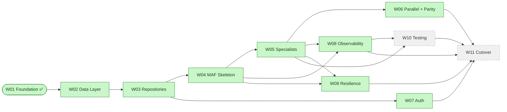

# EGP Window — Workstream Delivery Log

> **Living document.** One workstream per section, appended in delivery order.
> When a new workstream starts, we append a new `## Workstream WXX — <name>`
> block below the previous one. Nothing is ever rewritten in place — an update
> to an in-flight workstream edits *its own* section only.

**Repository:** `nandyap/EPG-MAF` (private, GitHub)
**Baseline documents:** [architecture-discovery-report.md](../architecture-discovery-report.md) · [solution-design-package.md](../solution-design-package.md) · [engineering-implementation-plan.md](../engineering-implementation-plan.md)
**Last updated:** 2026-07-16

---

## 1. How to read this document

- **Progress Dashboard** — quick executive glance at what's done, in flight, and next.
- **Workstream Roadmap** — the full sequence of workstreams we plan to deliver.
- **Workstream sections** — each has a fixed template so it's easy to compare.
- **Status legend**: ✅ Complete · 🚧 In progress · ⏳ Not started · ⏸ Blocked · ⛔ Cancelled.

### Section template used for every workstream

Every workstream section carries the same subsections in the same order:

1. Purpose & scope
2. Mapping to the LangGraph prototype
3. Mapping to Microsoft Agent Framework
4. Files created
5. Files modified
6. Implementation highlights
7. Test coverage summary
8. Validation vs. LangGraph prototype
9. Validation checklist (paste into PR)
10. Known follow-ups (out of scope for this workstream)
11. Sign-off

---

## 2. Progress Dashboard

| # | Workstream | Status | Sprint | Owner | Files (src / test) | LOC | Depends on |
|---|---|---|---|---|---|---|---|
| W01 | [Foundation](#workstream-w01--foundation-) | ✅ Complete | 1 | Delivery Lead | 25 / 15 | ~2,370 | — |
| W02 | [Clinical Data Layer](#workstream-w02--clinical-data-layer-) | ✅ Complete | 2 | DE + BE2 | 14 / 7 | ~1,650 | W01 |
| W03 | [Domain Repositories & Tool Shims](#workstream-w03--domain-repositories--tool-shims-) | ✅ Complete | 2–3 | BE2 | 11 / 7 | ~2,520 | W01, W02 |
| W04 | [MAF Workflow Skeleton](#workstream-w04--maf-workflow-skeleton-) | ✅ Complete | 4 | BE1 | 15 / 7 | ~1,880 | W01, W03 |
| W05 | [Specialist Agents](#workstream-w05--specialist-agents-) | ✅ Complete | 4–5 | BE2 | 13 / 4 | ~2,860 | W03, W04 |
| W06 | [Parallel Execution & Mode-Parity](#workstream-w06--parallel-execution--mode-parity-) | ✅ Complete | 5 | BE1 + QA | 2 / 5 + 2 docs | ~770 | W04, W05 |
| W07 | [Authentication & Authorization](#workstream-w07--authentication--authorization-) | ✅ Complete | 6 | BE2 + SEC | 5 + 3 + 1 bicep + 2 docs | ~1,300 | W01, W03 |
| W08 | [Observability](#workstream-w08--observability-) | ✅ Complete | 6 | PE + BE1 | 6 + 4 (wired) / 7 + conftest + 2 docs | ~1,410 | W01, W04, W05 |
| W09 | [Resilience & Error Handling](#workstream-w09--resilience--error-handling-) | ✅ Complete | 6 | BE1 | 4 + 7 modified / 4 + 2 docs | ~1,010 | W04, W05 |
| W10 | [Testing, Evaluation & Load](#workstream-w10--testing-evaluation--load-) | ⏳ Not started | 7 | QA | — | — | W05, W08 |
| W11 | [Cutover, Release & Runbooks](#workstream-w11--cutover-release--runbooks-) | ⏳ Not started | 8 | PE + SA | — | — | All previous |

### Progress diagram



---

## 3. Workstream Roadmap

Brief description of each planned workstream. Full detail lives in each
workstream's own section below.

| # | Name | One-line goal |
|---|---|---|
| W01 | Foundation | Config, DI, logging, prompt loader, Postgres pool, Cosmos client, thread-state provider, Compass client factory. No agents. |
| W02 | Clinical Data Layer | Postgres schema port, seed from DuckDB, Alembic, `BaseRepository`, `ProvenanceService`, `AuthzPolicy` allowlist v1. |
| W03 | Domain Repositories & Tool Shims | 5 domain repositories with construction-time provenance, family-history privacy stripping, deterministic JSON parser, 14 `ai_function` shims. |
| W04 | MAF Workflow Skeleton | Chat workflow + orchestration sub-workflow, `SpecialistDispatchSet` decision type, fan-out/fan-in edges (dormant with size 1), streaming events. |
| W05 | Specialist Agents | 5 specialist wrappers (PRS, GV, FH, PGX, Phenotype) with ReAct + structured extraction + provenance attachment. |
| W06 | Parallel Execution & Mode-Parity | `ORCH_DISPATCH_MODE` flag, mode-parity test harness (blocking), per-mode telemetry, enablement gate docs. |
| W07 | Authentication & Authorization | Entra ID app registration + JWT middleware, `ClinicianContext` propagation, RBAC allowlist enforced at Repository entry, audit events. |
| W08 | Observability | OpenTelemetry SDK, custom spans + metrics, PHI-safe serializer, provenance ↔ trace correlation. |
| W09 | Resilience & Error Handling | Error taxonomy, APIM retry / circuit-breaker for LLM, DB timeouts + pool retries, Cosmos ETag retry, specialist-failure isolation, recursion budget. |
| W10 | Testing, Evaluation & Load | Golden question set, Foundry Evaluations, load tests (Locust/k6), chaos scenarios, PHI-hygiene CI gate. |
| W11 | Cutover, Release & Runbooks | Prod environment deploy, dashboards, Action Groups + alerts, runbooks, release notes, LLD sign-off. |

---

## Workstream W01 — Foundation ✅

**Status:** ✅ Complete
**Sprint:** 1
**Owner:** Delivery Lead (implementation), SA (design custody)
**PR gate reviewers:** SA · BIX SME · Security
**Files:** 25 source + 15 test + 3 top-level (README, pyproject, .env.example) = 43 in `epg-maf/`
**LOC:** ~2,370 Python + 8 prompt text files + IaC-adjacent config

### 1. Purpose & scope

Stand up all cross-cutting foundation code the specialist workstreams depend on.

**In scope:** project scaffold, `Settings`, `AGENT_LLM_CONFIGS`, byte-parity prompt bundle, structured logging, Postgres pool factory, Cosmos client factory, MAF `OpenAIChatClient` factory per agent, `PromptService`, `ThreadStateProvider`, `SessionDocument` / `ClinicianContext`, DI container, typed error taxonomy.

**Out of scope (deferred to later workstreams):** specialist agents, repositories with SQL, workflow / orchestration code, auth middleware, API layer, IaC (Bicep), CI pipelines.

### 2. Mapping to the LangGraph prototype

| Prototype file | New home | Change |
|---|---|---|
| [`config/settings.py`](../../config/settings.py) | [`egp-maf/src/egp_maf/config/settings.py`](../../epg-maf/src/egp_maf/config/settings.py) | Extended: adds Postgres, Cosmos, APIM/Compass, orchestration flags, env metadata |
| [`config/llm.py`](../../config/llm.py) — `AGENT_LLM_CONFIGS` | [`egp-maf/src/egp_maf/config/llm_config.py`](../../epg-maf/src/egp_maf/config/llm_config.py) | Byte-parity port |
| [`config/llm.py`](../../config/llm.py) — `get_llm(...)` | [`egp-maf/src/egp_maf/infrastructure/compass_client.py`](../../epg-maf/src/egp_maf/infrastructure/compass_client.py) | Now returns MAF `OpenAIChatClient` instead of `langchain_openai.ChatOpenAI` |
| `agents/chat/prompts/prompt.py` (2 constants) | `epg-maf/src/egp_maf/prompts/data/chat_router.txt`, `chat_synthesis.txt` | Byte-parity |
| `agents/main/prompts/prompt.py` | `epg-maf/src/egp_maf/prompts/data/main_agent.txt` | **One documented deviation** — duplicated rule 6 removed (Design §15.5) |
| `agents/<domain>/prompts/prompt.py` × 5 | `epg-maf/src/egp_maf/prompts/data/<domain>_agent.txt` × 5 | Byte-parity |
| — (new) | [`session_document.py`](../../epg-maf/src/egp_maf/state/session_document.py) | Persisted session state (Cosmos) |
| — (new) | [`clinician_context.py`](../../epg-maf/src/egp_maf/state/clinician_context.py) | Request-scoped identity |
| — (new) | [`db_pool.py`](../../epg-maf/src/egp_maf/infrastructure/db_pool.py) | Replaces prototype's per-call `duckdb.connect(...)` |
| — (new) | [`cosmos_client.py`](../../epg-maf/src/egp_maf/infrastructure/cosmos_client.py) | Replaces prototype's `langgraph dev` in-memory checkpointer |
| — (new) | [`prompt_service.py`](../../epg-maf/src/egp_maf/services/prompt_service.py) | Foundry-fetch with local-bundle fallback |
| — (new) | [`thread_state.py`](../../epg-maf/src/egp_maf/services/thread_state.py) | Cosmos session CRUD with ETag concurrency |
| — (new) | [`logging/setup.py`](../../epg-maf/src/egp_maf/logging/setup.py) | Structured JSON logging |
| — (new) | [`di/container.py`](../../epg-maf/src/egp_maf/di/container.py) | Hand-rolled DI + lifecycle |
| — (new) | [`errors.py`](../../epg-maf/src/egp_maf/errors.py) | Typed error taxonomy |

**Prototype files modified:** none.

### 3. Mapping to Microsoft Agent Framework

Only one module touches MAF SDK, and it isolates the dependency:

- [`compass_client.py`](../../epg-maf/src/egp_maf/infrastructure/compass_client.py) — imports `agent_framework.openai.OpenAIChatClient` lazily inside the default constructor callback. `LlmClientFactory.get(agent_name)` returns a `ChatClient` ready for any future MAF `ChatAgent`.

MAF concepts **not** touched (deferred): `WorkflowBuilder`, `Workflow`, `Executor`, `ChatAgent`, `ai_function`, sub-workflow composition.

### 4. Files created

<details>
<summary>Source (25 files)</summary>

```
epg-maf/README.md
epg-maf/pyproject.toml
epg-maf/.env.example
epg-maf/src/egp_maf/__init__.py
epg-maf/src/egp_maf/errors.py
epg-maf/src/egp_maf/config/__init__.py
epg-maf/src/egp_maf/config/settings.py
epg-maf/src/egp_maf/config/llm_config.py
epg-maf/src/egp_maf/logging/__init__.py
epg-maf/src/egp_maf/logging/setup.py
epg-maf/src/egp_maf/state/__init__.py
epg-maf/src/egp_maf/state/clinician_context.py
epg-maf/src/egp_maf/state/session_document.py
epg-maf/src/egp_maf/infrastructure/__init__.py
epg-maf/src/egp_maf/infrastructure/db_pool.py
epg-maf/src/egp_maf/infrastructure/cosmos_client.py
epg-maf/src/egp_maf/infrastructure/compass_client.py
epg-maf/src/egp_maf/prompts/__init__.py
epg-maf/src/egp_maf/prompts/bundle.py
epg-maf/src/egp_maf/prompts/data/{chat_router,chat_synthesis,main_agent,
  prs_agent,genomic_variants_agent,family_history_agent,
  pgx_agent,phenotype_agent}.txt
epg-maf/src/egp_maf/services/__init__.py
epg-maf/src/egp_maf/services/prompt_service.py
epg-maf/src/egp_maf/services/thread_state.py
epg-maf/src/egp_maf/di/__init__.py
epg-maf/src/egp_maf/di/container.py
```
</details>

<details>
<summary>Tests (15 files, ~88 test cases)</summary>

```
epg-maf/tests/__init__.py
epg-maf/tests/conftest.py
epg-maf/tests/unit/{__init__.py, test_settings.py, test_llm_config.py,
  test_logging.py, test_prompt_bundle.py, test_prompt_service.py,
  test_compass_client.py, test_state.py, test_di_container.py,
  test_db_pool.py, test_errors.py}
epg-maf/tests/integration/{__init__.py, conftest.py,
  test_db_pool.py, test_cosmos.py}
epg-maf/tests/parity/{__init__.py, test_prompt_parity.py,
  test_llm_config_parity.py}
```
</details>

### 5. Files modified

**None.** The LangGraph prototype under `agents/`, `config/`, `test_data/`, `tests/` is preserved untouched and continues to serve as the reference implementation for behaviour parity.

### 6. Implementation highlights

**Configuration**

- `Settings` extends the prototype with Postgres, Cosmos, APIM/Compass, orchestration flags. `SecretStr` used for every secret so accidental logging shows `**********`. `AliasChoices("LLM_API_KEY", "OPENAI_API_KEY")` preserved for prototype compatibility.
- `AGENT_LLM_CONFIGS` byte-parity: 7 agents, chat=`gpt-5.1`, others=`gpt-4.1`, all `temperature=0.0`.

**Prompt bundle**

- 8 prompts shipped as plain text files under `prompts/data/`, loaded at import time via `importlib.resources`.
- `PromptService` supports two modes: `bundle` (no I/O) or `foundry` (fetch with timeout, fall back to bundle on failure). `fallback_count` counter exposed for future alerting.
- **Only documented deviation** from prototype: the duplicated rule 6 in `MAIN_AGENT_SYSTEM` is removed (Design §15.5). Parity test `test_main_agent_matches_prototype_except_for_rule_6_dupe` proves this is the only textual change.

**Infrastructure**

- Postgres pool: `psycopg 3` async, per-connection `SET SESSION CHARACTERISTICS AS TRANSACTION READ ONLY`, server-side `statement_timeout` via `options=-c`, managed-identity token provider callback.
- Cosmos client: `azure-cosmos.aio.CosmosClient` with either `DefaultAzureCredential` or account key; container proxy exposed via `get_container()`.
- LLM client factory: per-agent cached `OpenAIChatClient` pointing at APIM base URL; injectable constructor for unit tests.

**Session state**

- `SessionDocument` — persisted Cosmos document. Partition key `clinician_id`, item id `thread_id`, native TTL 24h (refreshed on save).
- Convenience mutators: `with_message`, `with_agent_completed` (dedupe + sort), `without_agent` (removes both completion entry and results slot).
- `results` typed as `dict[str, Any]` — will tighten to a discriminated union of `<Domain>StateOutput` types in W05.
- `etag` field excluded from `model_dump` so serialisation is symmetric with the Cosmos payload.

**DI container**

- Hand-rolled, no framework dep. Explicit constructor injection everywhere.
- `startup()` idempotent, opens Postgres → Cosmos → warms prompts. Failure inside `startup()` calls `shutdown()` before re-raising to avoid leaked handles.
- `shutdown()` swallows and logs errors — never fails the shutdown path.

**Diagnostics**

- Structured logging via `structlog`. Dev renderer = coloured console; preprod/prod = JSON on stdout (ACA captures automatically). Every log line stamped with `service`, `service_version`, `env`.

### 7. Test coverage summary

| Layer | File | Tests | Kind |
|---|---|---:|---|
| Settings | `tests/unit/test_settings.py` | 10 | unit |
| LLM config | `tests/unit/test_llm_config.py` | 6 | unit |
| Logging | `tests/unit/test_logging.py` | 5 | unit |
| Prompt bundle | `tests/unit/test_prompt_bundle.py` | 9 | unit |
| Prompt service | `tests/unit/test_prompt_service.py` | 7 | unit |
| Compass client factory | `tests/unit/test_compass_client.py` | 9 | unit |
| State models | `tests/unit/test_state.py` | 12 | unit |
| DI container | `tests/unit/test_di_container.py` | 6 | unit |
| DB pool (unit) | `tests/unit/test_db_pool.py` | 5 | unit |
| Errors | `tests/unit/test_errors.py` | 2 | unit |
| DB pool (integration) | `tests/integration/test_db_pool.py` | 5 | integration (Postgres) |
| Cosmos (integration) | `tests/integration/test_cosmos.py` | 4 | integration (Cosmos emulator) |
| Prompt parity | `tests/parity/test_prompt_parity.py` | 5 | parity vs. prototype |
| LLM-config parity | `tests/parity/test_llm_config_parity.py` | 3 | parity vs. prototype |
| **Total** | | **~88** | |

Run commands:

```powershell
cd epg-maf
pytest -m "not integration"               # unit + parity, no external services
$env:EGP_TEST_POSTGRES = "1"
$env:EGP_TEST_COSMOS = "1"
pytest -m integration                     # requires local Postgres + Cosmos emulator
pytest -m parity                          # byte-parity vs the prototype
```

### 8. Validation vs. the LangGraph prototype

W01 ships **no runtime clinical behaviour**, so the parity guarantee here is about the *inputs to* future behaviour:

1. **Byte-parity of the 8 prompts** — `tests/parity/test_prompt_parity.py` reads the prototype's `.py` files, extracts the constant, and diffs against the bundled `.txt`. The `main_agent` test reconstructs the expected "prototype minus dupe" and asserts equality — a guard that will alert us if the prototype is fixed upstream.
2. **Model + temperature parity** — `tests/parity/test_llm_config_parity.py` executes the prototype's `config/llm.py` in a stub-injected namespace (no `langchain_openai` install needed) and diffs every `(name, model, temperature)` triple.
3. **Prototype untouched** — `git status --porcelain agents/ config/ test_data/ tests/` must be empty.

End-to-end behavioural parity harnesses (specialist output snapshots, mode-parity, Foundry evaluations) arrive with the specialist and orchestration workstreams — not applicable yet.

### 9. Validation Checklist (paste into PR)

**Prompts**

- [ ] `pytest -m parity` passes (both parity test files).
- [ ] `main_agent.txt` has exactly **one** occurrence of `"6. If the query is broad"`.
- [ ] No prompt file has trailing Python syntax (`""" NAME = """`).

**Configuration**

- [ ] `pytest tests/unit/test_settings.py -v` all green.
- [ ] `AGENT_LLM_CONFIGS` keys equal the prototype's keys (7 entries).
- [ ] `chat` uses `gpt-5.1`; every other agent uses `gpt-4.1`.
- [ ] All 7 agents have `temperature=0.0`.
- [ ] `Settings` rejects a missing `LLM_API_KEY`.
- [ ] `Settings` accepts either `LLM_API_KEY` or `OPENAI_API_KEY`.
- [ ] `SecretStr` values redacted in `repr(Settings)`.

**Logging**

- [ ] `pytest tests/unit/test_logging.py -v` all green.
- [ ] `EGP_ENV=prod` produces JSON output; `EGP_ENV=dev` produces coloured console.
- [ ] Every log line carries `service`, `service_version`, `env`.
- [ ] `EGP_LOG_LEVEL=ERROR` suppresses `INFO`-level events.

**State**

- [ ] `pytest tests/unit/test_state.py -v` all green.
- [ ] `SessionDocument` rejects unknown fields (`extra='forbid'`).
- [ ] `SessionDocument.etag` excluded from `model_dump(mode="json")`.
- [ ] `with_agent_completed` dedupes and sorts.
- [ ] `without_agent` removes both the completion entry and the results slot.
- [ ] `ClinicianContext` frozen.
- [ ] `ClinicianContext.to_span_attributes` returns only `clinician_id` and `tenant_id` (no PHI).

**Infrastructure**

- [ ] `pytest tests/unit/test_db_pool.py -v` all green.
- [ ] `pytest tests/unit/test_compass_client.py -v` all green.
- [ ] `DbPoolFactory` builds correct conninfo with password.
- [ ] `DbPoolFactory` builds correct conninfo with managed-identity token.
- [ ] `DbPoolFactory` raises `ConfigurationError` when neither is set.
- [ ] `LlmClientFactory.get` caches per agent name.
- [ ] `LlmClientFactory.get` raises `ConfigurationError` on unknown agent.

**Services**

- [ ] `pytest tests/unit/test_prompt_service.py -v` all green.
- [ ] Bundle-mode `warm()` performs no Foundry calls.
- [ ] Foundry-mode `warm()` fetches every known prompt.
- [ ] Foundry `None` responses fall back to the bundle and increment `fallback_count`.
- [ ] Foundry exceptions fall back to the bundle and increment `fallback_count`.
- [ ] `warm()` is idempotent.

**DI container**

- [ ] `pytest tests/unit/test_di_container.py -v` all green.
- [ ] `startup()` opens Postgres and Cosmos in order, then warms prompts.
- [ ] `startup()` is idempotent.
- [ ] `shutdown()` closes everything and is safe before `startup()`.
- [ ] A failing `startup()` calls `shutdown()` before re-raising.
- [ ] `build_container()` wires all attributes to concrete instances.

**Integration** (only if Postgres + Cosmos emulator running)

- [ ] `EGP_TEST_POSTGRES=1 pytest -m integration -k db_pool` all green.
- [ ] `EGP_TEST_COSMOS=1 pytest -m integration -k cosmos` all green.
- [ ] Concurrent-read test with 10 connections succeeds.
- [ ] ETag-conflict retry then raise verified.

**PHI hygiene** (pre-approval — full CI check in W08)

- [ ] `git grep -n "search_context_notes" epg-maf/src` returns **zero** hits.
- [ ] `git grep -n "affected_relative_count" epg-maf/src` returns **zero** hits outside `session_document.py::results` opaque payload.
- [ ] `git grep -n "message.content" epg-maf/src` returns only structured field access, not log arguments.

**Repository hygiene**

- [ ] `git status --porcelain agents/ config/ test_data/ tests/` is empty.
- [ ] `epg-maf/.env.example` contains no real secrets (only local dev placeholders + the public Cosmos emulator key).
- [ ] `pyproject.toml` version pins set.

### 10. Known follow-ups (out of scope for W01)

- **APIM policy XML** (retry, circuit-breaker, JWT validation) → W09 with the platform team.
- **PHI-safe span attribute allowlist + CI check** → W08 (Observability).
- **Foundry Prompt Catalog fetcher implementation** → future story once Foundry region availability is confirmed.
- **Postgres managed-identity token refresh** — the current `token_provider` callback returns a token per new connection; long-lived connections may see the token expire. Refresh policy is a small follow-up in W02.
- **`SessionDocument.results` typed models** — `dict[str, Any]` placeholder → replaced with discriminated union of `<Domain>StateOutput` types in W05.
- **Trace/span ids on `DBProvenance`** → W08 (Observability §10.5).
- **Load-test the pool at realistic concurrency** → W10.

### 11. Sign-off

- [ ] SA — architecture reviewer
- [ ] Delivery Lead — implementation reviewer
- [ ] BIX SME — prompt bundle reviewed for accidental drift
- [ ] Security — `.env.example` reviewed for embedded secrets

---

## Workstream W02 — Clinical Data Layer ✅

**Status:** ✅ Complete
**Sprint:** 2
**Owner:** DE + BE2 (implementation), SA (contract review), SEC (allowlist review)
**PR gate reviewers:** SA · DE · SEC
**Files:** 14 source (7 new + 7 updated) + 7 test = 21 in `epg-maf/`
**LOC:** ~1,650 Python + 550 SQL + 8 config
**Depends on:** W01

### 1. Purpose & scope

Build the load-bearing data seam described in Discovery §24.5. Everything a
W03 domain Repository needs — Postgres schema, seed pipeline, Alembic
migrations, `BaseRepository`, `ProvenanceService`,
`AuthzPolicy` allowlist v1 — is delivered here.

**In scope:**

- Postgres 16 schema port of all 10 DuckDB tables (Design §11.2).
- One-shot DuckDB→CSV seed exporter + `psql \copy` load script.
- Alembic migration mechanism with hand-written `001_baseline_schema`.
- `egp_migrator` (DDL) and `egp_agent_ro` (SELECT-only) role bootstrap.
- `DBProvenance` ported (with new `trace_id`/`span_id` fields for W08).
- `ProvenanceService` — factory for construction-time provenance.
- `AuthzPolicy` protocol + `AllowlistAuthzPolicy` (JSON file, mtime hot-reload).
  Test doubles `OpenAuthzPolicy` / `ClosedAuthzPolicy` live in
  `tests/support/authz_doubles.py` (moved out of `src/` in the W02 cleanup
  commit — see change history).
- `BaseRepository` (pool + authz + provenance wiring).
- `AccessDenied` typed exception (403).
- New `POSTGRES_MIGRATOR_*` and `EGP_AUTHZ_ALLOWLIST_PATH` settings.
- Data-quality invariant tests (Discovery §22 M7).

**Out of scope (deferred to W03):**

- The 5 domain repositories (`PRSRepository`, `GenomicVariantsRepository`,
  `FamilyHistoryRepository`, `PGXRepository`, `PhenotypeRepository`).
- The deterministic `annotations_json` parser.
- The 14 `ai_function` tool shims.

### 2. Mapping to the LangGraph prototype

| Prototype file | New home | Change |
|---|---|---|
| [`test_data/schema.sql`](../../test_data/schema.sql) (DuckDB) | [`epg-maf/db/schema/V001__baseline.sql`](../../epg-maf/db/schema/V001__baseline.sql) | Mechanical Postgres port: `JSON`→`jsonb`, `DEFAULT nextval(...)`→`GENERATED BY DEFAULT AS IDENTITY`, `VARCHAR`→`text`, `NOT NULL` tightened on composite-PK columns. All CHECK constraints, FKs, PKs, indexes preserved verbatim. |
| [`test_data/clinical_genetics.duckdb`](../../test_data/clinical_genetics.duckdb) (13.76 MB seeded blob) | [`epg-maf/db/seed/export_from_duckdb.py`](../../epg-maf/db/seed/export_from_duckdb.py) + [`load.sql`](../../epg-maf/db/seed/load.sql) | Script-based export (run locally once — CSVs land in `db/seed/data/`, gitignored). |
| [`agents/shared/state/provenance.py::DBProvenance`](../../agents/shared/state/provenance.py) | [`epg-maf/src/egp_maf/state/provenance.py`](../../epg-maf/src/egp_maf/state/provenance.py) | Port + `trace_id`/`span_id` optional fields for W08. Uses `datetime.now(timezone.utc)` (deprecation-safe). Now `frozen=True`. |
| Per-tool `_executor` module global (5×) | [`BaseRepository`](../../epg-maf/src/egp_maf/services/repositories/base.py) | Provenance constructed at query time (Design §11.7); post-hoc `_attach_provenance` obsolete. |
| — | [`ProvenanceService`](../../epg-maf/src/egp_maf/services/provenance.py) | New — construction-time factory with pluggable clock and OTEL provider. |
| — | [`AllowlistAuthzPolicy`](../../epg-maf/src/egp_maf/services/authz.py) | New — Phase 1 RBAC (Design ADR-017). |
| — | [`Alembic env + baseline migration`](../../epg-maf/db/alembic) | New — Design §11.6. |
| — | [`roles.sql`](../../epg-maf/db/bootstrap/roles.sql) | New — two-role separation (Design §11.5). |

**Prototype files modified:** none.

### 3. Mapping to Microsoft Agent Framework

Zero MAF imports in W02. Pure infrastructure preparation. The `ai_function`
tool shims that will consume `BaseRepository` are built in W03.

### 4. Files created

<details>
<summary>Database (11 files under <code>epg-maf/db/</code>)</summary>

```
epg-maf/db/README.md
epg-maf/db/schema/V001__baseline.sql          (~200 lines, 10 tables)
epg-maf/db/bootstrap/roles.sql
epg-maf/db/seed/README.md
epg-maf/db/seed/export_from_duckdb.py
epg-maf/db/seed/load.sql
epg-maf/db/seed/.gitignore                    (excludes data/)
epg-maf/db/alembic/alembic.ini
epg-maf/db/alembic/env.py
epg-maf/db/alembic/script.py.mako
epg-maf/db/alembic/versions/001_baseline_schema.py
```
</details>

<details>
<summary>Source (5 new files)</summary>

```
epg-maf/src/egp_maf/state/provenance.py             (DBProvenance + helper)
epg-maf/src/egp_maf/services/provenance.py          (ProvenanceService)
epg-maf/src/egp_maf/services/authz.py               (AuthzPolicy protocol + AllowlistAuthzPolicy)
epg-maf/src/egp_maf/services/repositories/__init__.py
epg-maf/src/egp_maf/services/repositories/base.py   (BaseRepository)
```
</details>

<details>
<summary>Tests (7 new files, ~55 test cases)</summary>

```
epg-maf/tests/unit/test_provenance.py               (10 tests)
epg-maf/tests/unit/test_provenance_service.py       (7 tests)
epg-maf/tests/unit/test_authz.py                    (14 tests)
epg-maf/tests/unit/test_repository_base.py          (7 tests)
epg-maf/tests/integration/test_schema.py            (2 tests, Alembic lifecycle)
epg-maf/tests/integration/test_seed_invariants.py   (4 tests, data-quality)
epg-maf/tests/parity/test_row_counts.py             (1 test, byte-parity vs DuckDB)
```
</details>

### 5. Files modified

W01 files touched to wire the new services in — every change is additive:

| File | Change |
|---|---|
| `epg-maf/src/egp_maf/errors.py` | Added `AccessDenied` (403). |
| `epg-maf/src/egp_maf/config/settings.py` | Added `postgres_migrator_user`, `postgres_migrator_password`, `authz_allowlist_path`. |
| `epg-maf/src/egp_maf/state/__init__.py` | Exports `DBProvenance` + `find_provenance_for_field`. |
| `epg-maf/src/egp_maf/services/__init__.py` | Exports the new services + policies. |
| `epg-maf/src/egp_maf/di/container.py` | Wires `provenance_service` + `authz_policy` (uses `Settings.authz_allowlist_path`). |
| `epg-maf/pyproject.toml` | Adds `alembic`, `sqlalchemy`, plus `duckdb` (dev) for the seed exporter. |
| `epg-maf/.env.example` | Adds `POSTGRES_MIGRATOR_*` and `EGP_AUTHZ_ALLOWLIST_PATH`. |
| `epg-maf/tests/integration/conftest.py` | Adds `_build_agent_ro_conninfo()` and `_build_migrator_conninfo()` helpers. |
| `epg-maf/tests/unit/test_di_container.py` | Updates container construction test doubles to include new services. |

**Prototype files modified:** none.

### 6. Implementation highlights

**Schema port**

- Every one of the 10 DuckDB tables is present in Postgres with identical
  column names, types (mechanical Postgres equivalents), and constraints.
- CHECK constraints preserved verbatim — same 6-value `pathogenicity`, 5-value
  `phenotype`, 4-value `risk_band`, 7-value `inheritance` vocabularies.
- All indexes preserved.
- `annotations_json` is `jsonb` (Postgres-native, indexable if needed later).
- Identity columns replace explicit sequences (idiomatic Postgres).
- After DDL, `GRANT SELECT ON ALL TABLES IN SCHEMA public TO egp_agent_ro`.

**Seed pipeline**

- One-shot Python script exports each of the 10 tables in FK-safe order.
- JSON columns serialised as compact JSON (`json.dumps(..., separators=(",",":"))`).
- `load.sql` uses `\copy` (client-side) so it works against a private-endpoint
  Postgres without server-side file access.
- Identity sequences reset via `setval(pg_get_serial_sequence(...))` post-load.

**Alembic**

- `env.py` resolves URL from `ALEMBIC_URL` (preferred) or `POSTGRES_MIGRATOR_*`
  env vars (fallback). Never uses the application role.
- `001_baseline_schema.py` reads `db/schema/V001__baseline.sql` and executes
  via `connection.exec_driver_sql(...)` — no SQLAlchemy statement parsing.
- `downgrade()` drops all 10 tables in reverse-dependency order (no CASCADE).

**Provenance construction moves left**

- Prototype: post-hoc `_attach_provenance` matched result rows to tool
  outputs by domain key (fragile).
- Target: `ProvenanceService.build(...)` called by the Repository at the
  moment the row is read. Provenance becomes construction-time truth
  (Design §11.7).
- `DBProvenance` gains `trace_id`/`span_id` optional fields; `ProvenanceService`
  accepts an `otel_context_provider` callable that will be plugged in by W08.

**Authz policy**

- Phase 1 v1 is a JSON allowlist file (Key Vault-mounted in prod). Structure:

  ```json
  {
      "version": 1,
      "clinicians": { "c1": ["P001", "P002"] },
      "admins": ["adm1"]
  }
  ```

- **Fail closed.** If no path is configured, everyone except the built-in
  `system` context is denied. Missing file at startup → `ConfigurationError`.
- Hot reload via file mtime — cheap syscall per `can_read` call.
- Two typed exceptions: `AccessDenied` (403), `ConfigurationError` (500).

**BaseRepository contract**

- Every W03 domain Repository will inherit `BaseRepository` and only add SQL.
- `_authorize(ctx, patient_id)` enforces RBAC on method entry.
- `_fetch_all(sql, params)` returns `list[dict[str, Any]]` — same shape as
  the prototype's tool outputs.
- Driver errors wrapped as `DatabaseUnavailable` (503).

### 7. Test coverage summary

| Layer | File | Tests | Kind |
|---|---|---:|---|
| `DBProvenance` | `tests/unit/test_provenance.py` | 10 | unit |
| `ProvenanceService` | `tests/unit/test_provenance_service.py` | 7 | unit |
| `AuthzPolicy` | `tests/unit/test_authz.py` | 14 | unit |
| `BaseRepository` | `tests/unit/test_repository_base.py` | 7 | unit |
| Schema (Alembic upgrade/downgrade) | `tests/integration/test_schema.py` | 2 | integration (Postgres) |
| Seed invariants | `tests/integration/test_seed_invariants.py` | 4 | integration (Postgres) |
| Row-count parity vs DuckDB | `tests/parity/test_row_counts.py` | 1 | parity (Postgres + DuckDB) |
| **W02 total** | | **~45** | |
| **Programme total (W01 + W02)** | | **~133** | |

Run commands:

```powershell
cd epg-maf
pytest -m "not integration"            # unit + parity (parity row-count skips if no PG)
$env:EGP_TEST_POSTGRES = "1"
$env:EGP_TEST_COSMOS = "1"
pytest -m integration                  # requires local Postgres + Cosmos
```

### 8. Validation vs. the LangGraph prototype

Three parity checks land in W02:

1. **Schema shape** — every DuckDB table exists in Postgres with the same
   column names and constraints. Manually reviewed line-by-line;
   `test_schema.py` proves the 10 tables come up cleanly.
2. **Data quality invariants** — `test_seed_invariants.py` asserts the
   denormalisation-drift invariant (Discovery §22 M7) plus FK coverage.
3. **Row-count parity** — `test_row_counts.py` counts rows in every table
   across DuckDB and Postgres; any drift fails CI.

Column-level value parity is verified per Repository in W03 (specialist
snapshots).

### 9. Validation Checklist (paste into PR)

**Schema port**

- [ ] `pytest tests/integration/test_schema.py -v` — Alembic upgrade + downgrade both succeed.
- [ ] Every one of the 10 expected tables is present after upgrade.
- [ ] All 10 tables are dropped after downgrade.
- [ ] `db/schema/V001__baseline.sql` preserves every CHECK, FK, PK, index from the prototype (line-by-line review).

**Seed pipeline**

- [ ] `python db/seed/export_from_duckdb.py` completes without error.
- [ ] `psql -f db/seed/load.sql` loads every CSV without error.
- [ ] `pytest tests/integration/test_seed_invariants.py -v` — 4 invariants all pass:
  - [ ] Every table has ≥ 1 row.
  - [ ] `patient_prs.disease_name` matches `prs_annotations.disease_name` for every joined row.
  - [ ] Every `patient_variants.variant_id` has an annotation row.
  - [ ] Every `patient_pgx_status.gene` appears in at least one `pgx_annotations` row.
- [ ] `pytest tests/parity/test_row_counts.py -v` — row counts match DuckDB.

**Alembic**

- [ ] `alembic -c db/alembic/alembic.ini upgrade head` succeeds against a fresh DB.
- [ ] `alembic downgrade base` cleanly removes everything.
- [ ] Alembic uses `POSTGRES_MIGRATOR_*` credentials, not the app credentials.
- [ ] Application code never imports Alembic (`git grep "import alembic" epg-maf/src` → 0 hits).

**Roles**

- [ ] `bootstrap/roles.sql` creates both roles idempotently.
- [ ] `egp_agent_ro` can only SELECT (verified manually or via prod policy).
- [ ] `egp_migrator` credentials never appear in application `Settings` at runtime (only Alembic-side).

**Provenance**

- [ ] `pytest tests/unit/test_provenance.py -v` — all 10 tests pass.
- [ ] `pytest tests/unit/test_provenance_service.py -v` — all 7 tests pass.
- [ ] `DBProvenance` is `frozen=True` and rejects extra fields.
- [ ] Inputs to `ProvenanceService.build` are copied (mutating them does not affect the record).
- [ ] OTEL context provider errors are swallowed silently (never fail provenance construction).

**Authorization**

- [ ] `pytest tests/unit/test_authz.py -v` — all 14 tests pass.
- [ ] Missing allowlist path → deny everyone except `system`.
- [ ] Missing allowlist file → `ConfigurationError` at policy construction.
- [ ] Invalid JSON → `ConfigurationError`.
- [ ] Wrong schema version → `ConfigurationError`.
- [ ] Admin bypasses per-patient check.
- [ ] mtime-based hot reload works (1s sleep test confirms).
- [ ] `AccessDenied` maps to HTTP 403 with stable `error_code`.

**Repository base**

- [ ] `pytest tests/unit/test_repository_base.py -v` — all 7 tests pass.
- [ ] `_authorize` delegates to `AuthzPolicy` and re-raises `AccessDenied`.
- [ ] `_fetch_all` wraps driver errors as `DatabaseUnavailable` with `__cause__` preserved.
- [ ] `_build_provenance` produces a valid `DBProvenance` record.
- [ ] `BaseRepository` exposes only `_authorize`, `_fetch_all`, `_build_provenance` — no `execute` method (W03 subclasses will supply their own domain-specific methods).

**DI container**

- [ ] `pytest tests/unit/test_di_container.py -v` — every existing test still passes.
- [ ] `build_container(...)` wires `provenance_service` and `authz_policy`.
- [ ] Startup order unchanged: Cosmos → Postgres → Prompts.

**PHI hygiene**

- [ ] `git grep -n "search_context_notes" epg-maf/src` → 0 hits.
- [ ] `git grep -n "affected_relative_count" epg-maf/src` → 0 hits.
- [ ] Log emitted by `AllowlistAuthzPolicy` on denial contains only `clinician_id`, `patient_id`, `route` — no PHI.

**Repository hygiene**

- [ ] `git status --porcelain agents/ config/ test_data/ tests/` is empty (prototype untouched).
- [ ] `db/seed/data/` is gitignored.
- [ ] `.env.example` contains no real secrets — new entries are placeholders.

### 10. Known follow-ups (out of scope for W02)

- Domain repositories (W03) inherit from `BaseRepository` — one per specialist.
- Deterministic `annotations_json` parser (W03) — replaces LLM parsing of the JSON blob.
- OTEL context provider wired into `ProvenanceService` (W08).
- Bicep templates that provision Postgres Flexible Server + reject `COSMOS_KEY` in prod (W11).
- Real Foundry allowlist source (Phase 3 replaces the JSON file with a policy engine).
- Load-test the pool at realistic concurrency (W10).
- Managed-identity token refresh for long-lived Postgres connections (small follow-up).

### 11. Sign-off

- [ ] SA — architecture reviewer
- [ ] DE — schema port + seed pipeline reviewer
- [ ] BE2 — Repository base + provenance reviewer
- [ ] SEC — allowlist + roles reviewer

---

## Workstream W03 — Domain Repositories & Tool Shims ✅

**Status:** ✅ Complete
**Sprint:** 2–3
**Owner:** BE2 (implementation), SA (contract review), BIX (SQL-parity review)
**PR gate reviewers:** SA · BE2 · BIX
**Files:** 11 source (5 result modules + 5 repositories + 1 `state/results/__init__.py`) + 7 test + 3 modified in `epg-maf/`
**LOC:** ~2,520 Python (source ~1,360 · tests ~1,160)
**Depends on:** W01, W02

### 1. Purpose & scope

Realise the design promise that W02 set up: **typed domain models with
construction-time provenance, one Repository per specialist domain**.

**In scope:**

- 5 concrete repositories inheriting `BaseRepository`:
  `PRSRepository`, `GenomicVariantsRepository`,
  `FamilyHistoryRepository`, `PGXRepository`, `PhenotypeRepository`.
- Typed result models per domain, ported byte-faithfully from the
  prototype's `agents/<domain>/state/schemas.py`.
- **Deterministic** `annotations_json` parser (Design ADR-006) — replaces
  the prototype's LLM-driven JSON decomposition.
- Family-history public/internal projection split via `.to_public()`
  method on the internal model (Design §11.7, ADR-017).
- Byte-faithful SQL port (DuckDB → Postgres); every `explore_/search_/get_`
  method on the prototype maps 1:1 to a Repository method.

**Out of scope (→ W04/W05):**

- `ai_function` tool shims (need MAF `ChatAgent` construction context).
- Domain Services (thin pass-throughs — will be added alongside shims when needed).
- Specialist wrappers, workflow, routing.

### 2. Mapping to the LangGraph prototype

| Prototype file | New home | Change |
|---|---|---|
| `agents/prs/tools/tools.py` (3 `@tool`s) | [`services/repositories/prs.py`](../../epg-maf/src/egp_maf/services/repositories/prs.py) | SQL preserved (Postgres-adjusted); returns typed `PRSResult` |
| `agents/genomic_variants/tools/tools.py` (3 tools) | [`services/repositories/genomic_variants.py`](../../epg-maf/src/egp_maf/services/repositories/genomic_variants.py) | + deterministic JSON parser inline; Python — not LLM — decomposes `annotations_json` |
| `agents/family_history/tools/tools.py` (3 tools) | [`services/repositories/family_history.py`](../../epg-maf/src/egp_maf/services/repositories/family_history.py) | Returns internal projection; `.to_public()` strips privacy fields |
| `agents/pgx/tools/tools.py` (3 tools) | [`services/repositories/pgx.py`](../../epg-maf/src/egp_maf/services/repositories/pgx.py) | LEFT JOIN on `(gene, phenotype)` preserved |
| `agents/phenotype/tools/tools.py` (2 tools) | [`services/repositories/phenotype.py`](../../epg-maf/src/egp_maf/services/repositories/phenotype.py) | `LIST(DISTINCT)` → `array_agg(DISTINCT)`; grouped `COALESCE` preserved |
| `agents/prs/state/schemas.py` | [`state/results/prs.py`](../../epg-maf/src/egp_maf/state/results/prs.py) | Port; adds `PRSAnnotation` reference-row type |
| `agents/genomic_variants/state/schemas.py` | [`state/results/genomic_variants.py`](../../epg-maf/src/egp_maf/state/results/genomic_variants.py) | Port; adds `parse_annotations_json` + `VariantAnnotation`; soft warnings use `structlog` |
| `agents/family_history/state/schemas.py` | [`state/results/family_history.py`](../../epg-maf/src/egp_maf/state/results/family_history.py) | Port; adds `KinshipHistoryAnnotation` + `.to_public()` method |
| `agents/pgx/state/schemas.py` | [`state/results/pgx.py`](../../epg-maf/src/egp_maf/state/results/pgx.py) | Port; adds `PGXAnnotation` |
| `agents/phenotype/state/schemas.py` | [`state/results/phenotype.py`](../../epg-maf/src/egp_maf/state/results/phenotype.py) | Port (no annotation type — no annotation table exists) |

**Prototype files modified:** none.

### 3. Mapping to Microsoft Agent Framework

**Zero MAF imports in W03.** Repositories are framework-agnostic. The
`ai_function` decorator that adapts these methods into MAF tool shims
arrives in W04/W05 when specialists are assembled.

### 4. Files created

<details>
<summary>Source (11 files)</summary>

```
epg-maf/src/egp_maf/state/results/__init__.py         (re-exports)
epg-maf/src/egp_maf/state/results/prs.py              (PRSKey, PRSAnnotation, PRSResult, PRSResultList)
epg-maf/src/egp_maf/state/results/pgx.py              (PGXKey, PGXAnnotation, PGXDrugResult, PGXResultList)
epg-maf/src/egp_maf/state/results/phenotype.py        (PhenotypeKey, PhenotypeDiseaseResult, PhenotypeResultList)
epg-maf/src/egp_maf/state/results/family_history.py   (Key, Annotation, Result(internal+public), ResultList(both))
epg-maf/src/egp_maf/state/results/genomic_variants.py (Key, Annotation, SampleData, CoreAnn, ExtendedAnn, parser, Result, ResultList)
epg-maf/src/egp_maf/services/repositories/prs.py
epg-maf/src/egp_maf/services/repositories/pgx.py
epg-maf/src/egp_maf/services/repositories/phenotype.py
epg-maf/src/egp_maf/services/repositories/family_history.py
epg-maf/src/egp_maf/services/repositories/genomic_variants.py
```
</details>

<details>
<summary>Tests (6 files, ~65 test cases)</summary>

```
epg-maf/tests/support/fake_pool.py                     (test double for psycopg pool)
epg-maf/tests/unit/test_results.py                     (~15 tests — all result models)
epg-maf/tests/unit/test_variant_parser.py              (~13 tests — JSON parser edge cases)
epg-maf/tests/unit/test_family_history_strip.py        (~5 tests — privacy strip contract)
epg-maf/tests/unit/test_repositories.py                (~14 tests — repositories with fake pool)
epg-maf/tests/integration/test_repositories.py         (~5 tests — real Postgres end-to-end)
epg-maf/tests/parity/test_repository_parity.py         (~5 tests — Repo vs DuckDB field parity)
```
</details>

### 5. Files modified

| File | Change |
|---|---|
| `epg-maf/src/egp_maf/state/__init__.py` | Docstring refresh (points to `state.results`); public API unchanged. |
| `epg-maf/src/egp_maf/services/__init__.py` | Re-exports 5 new repository classes. |
| `epg-maf/src/egp_maf/services/repositories/__init__.py` | Re-exports 5 new repository classes. |

**Prototype files modified:** none.

### 6. Implementation highlights

**Uniform Repository shape.**
Every domain Repository inherits `BaseRepository`, adds public `async` methods
that mirror the prototype's tool names 1:1, calls `self._authorize(ctx,
patient_id)` on any patient-scoped call, uses `self._fetch_all(sql, params)`
to run SELECTs, and builds provenance via `self._build_provenance(...)` on
`get_patient_*` methods only. `explore_*` and `search_*_annotations` do not
build provenance (Discovery §5.7 — preserved).

**Postgres-adjusted SQL.**
Mechanical adjustments only: `?` → `%s`, `LIST(DISTINCT x)` → `array_agg(
DISTINCT x)`, `CAST(x AS VARCHAR)` → `to_char(x, 'YYYY-MM-DD')` for dates.
Everything else — `ILIKE`, `COALESCE`, `LEFT JOIN`, index-friendly WHERE
ordering — is unchanged and Postgres-native.

**Deterministic JSON parser (Design ADR-006).**
[`parse_annotations_json`](../../epg-maf/src/egp_maf/state/results/genomic_variants.py) accepts `None`,
`""`, a JSON string, or a dict. Known keys are promoted to typed fields;
unknown keys go into `raw_annotations`. Malformed JSON raises
`ValueError` — no silent fallback. Removes the prototype's silent-
hallucination clinical-safety risk.

**Family-history privacy split at the model layer.**
[`FamilyHistoryCriteriaResult.to_public()`](../../epg-maf/src/egp_maf/state/results/family_history.py) returns a
`FamilyHistoryCriteriaResultPublic` with three privacy-sensitive fields
absent from the type entirely and stripped from every provenance
`source_row`. The Repository returns the internal projection — the
specialist calls `.to_public()` before writing to orchestrator state.

**RBAC first, always.**
Every patient-scoped method starts with `self._authorize(ctx, patient_id)`.
`search_*_annotations` reference-only methods do NOT authorise —
reference data is public within the system.

**Structured warning for unknown pathogenicity / variant_type.**
`VariantCoreAnnotations` post-validator now emits a `variant.unknown_value`
structured event via `structlog` (instead of the prototype's
`logging.warning`). Same soft-warning semantics; machine-parseable event
for W08 alerting.

### 7. Test coverage summary

| Layer | File | Tests | Kind |
|---|---|---:|---|
| Result models | `tests/unit/test_results.py` | ~15 | unit |
| JSON parser | `tests/unit/test_variant_parser.py` | ~13 | unit |
| Family-history strip | `tests/unit/test_family_history_strip.py` | ~5 | unit |
| Repositories (fake pool) | `tests/unit/test_repositories.py` | ~14 | unit |
| Repositories (real PG) | `tests/integration/test_repositories.py` | ~5 | integration |
| Row + field parity vs DuckDB | `tests/parity/test_repository_parity.py` | ~5 | parity |
| **W03 subtotal** | | **~57** | |
| **Programme total (W01–W03)** | | **~190** | |

Run commands:

```powershell
cd epg-maf
pytest -m "not integration"            # unit + parity (skips if no PG)
$env:EGP_TEST_POSTGRES = "1"
pytest -m integration                  # requires seeded local Postgres
pytest -m parity                       # requires PG + DuckDB present
```

### 8. Validation vs. the LangGraph prototype

Three layered parity checks land in W03:

1. **SQL text preserved.** Every `explore_/search_/get_` SQL block is a
   line-by-line port; only mechanical Postgres adjustments were made.
2. **Row-count parity per patient** (`test_repository_parity.py`) — for
   each domain's `get_patient_*`, run against Postgres and DuckDB with the
   same patient and assert equal counts.
3. **Key-set parity** — for PRS/variants the parity test compares the
   set of returned `prs_name`s / `variant_id`s; for family history the
   `(disease_name, criteria_name, meets_threshold)` triples must match;
   for phenotype the `disease_name → encounter_count` map must match
   (grouping semantics preserved).

Column-value parity for LLM-derived fields (interpretations, summaries)
is not applicable — those don't exist yet.

### 9. Validation Checklist (paste into PR)

**Result models**

- [ ] `pytest tests/unit/test_results.py -v` — all green.
- [ ] `PRSResult.risk_band` rejects values outside the 4-value vocabulary.
- [ ] `PRSResult.percentile` bounds enforced (0–100).
- [ ] Every result model rejects unknown fields (`extra='forbid'`).
- [ ] LLM-derived fields default to `None` (Repository never populates them).

**JSON parser**

- [ ] `pytest tests/unit/test_variant_parser.py -v` — all green.
- [ ] `None`, `""`, `{}` → empty `VariantExtendedAnnotations` (never raises).
- [ ] Known keys promoted to typed slots.
- [ ] Unknown keys land in `raw_annotations`.
- [ ] Malformed JSON raises `ValueError` — no silent fallback.
- [ ] `acmg_criteria: "PS1"` (string) coerces to `["PS1"]`.

**Family-history privacy strip**

- [ ] `pytest tests/unit/test_family_history_strip.py -v` — all green.
- [ ] `FamilyHistoryCriteriaResultPublic.model_fields` does not contain the three privacy keys.
- [ ] Provenance `source_row` also has the three keys stripped.
- [ ] `to_public()` does NOT mutate the internal result.
- [ ] `diseases_meeting_threshold` correctly carried over on the list-level projection.

**Repositories (unit)**

- [ ] `pytest tests/unit/test_repositories.py -v` — all green.
- [ ] Every `explore_*` returns typed keys, no provenance.
- [ ] Every `search_*_annotations` returns typed annotation rows, no provenance, does NOT authorise.
- [ ] Every `get_patient_*` returns typed results with exactly one `DBProvenance` record per row.
- [ ] RBAC denial raises `AccessDenied` from `get_patient_*` and `explore_*`.
- [ ] All SQL text uses `%s` placeholders, never `?`.

**Repositories (integration — requires seeded PG)**

- [ ] `EGP_TEST_POSTGRES=1 pytest -m integration -k test_repositories` — all green.
- [ ] Every domain's `explore_*` and `get_patient_*` returns non-empty typed results for the first available patient.
- [ ] Family-history `.to_public()` verified end-to-end.

**Parity vs DuckDB**

- [ ] `EGP_TEST_POSTGRES=1 pytest -m parity -k test_repository_parity` — all green.
- [ ] Row-count parity per domain.
- [ ] Key-set parity per domain.

**PHI hygiene**

- [ ] `git grep -n "search_context_notes" epg-maf/src` — hits only in `state/results/family_history.py` (declared field + strip logic) and `services/repositories/family_history.py` (SELECT + result construction). No downstream.
- [ ] `git grep -n "affected_relative_count" epg-maf/src` — same three files only.
- [ ] `FamilyHistoryCriteriaResultPublic.model_fields` never contains those three names.

**Repository hygiene**

- [ ] `git status --porcelain agents/ config/ test_data/ tests/` is empty (prototype untouched).
- [ ] No `IRepository` protocol re-introduced (removed in the W02 cleanup).
- [ ] No `OpenAuthzPolicy` / `ClosedAuthzPolicy` in `src/` (test-only, live in `tests/support/`).

### 10. Known follow-ups (out of scope for W03)

- `ai_function` tool shims (→ W04/W05) that wrap Repository methods and adapt them to MAF `ChatAgent`.
- Domain Services layer (→ W05) if a specialist needs to compose more than one Repository.
- OTEL context provider wired into `ProvenanceService` (→ W08).
- Phenotype grouping variance: the prototype's OR-combining of `disease_name` + `search_term` filters is preserved verbatim; a comprehensive filter-permutation test comes with the specialist evaluation in W10.

### 11. Sign-off

- [ ] SA — Repository contract review
- [ ] BE2 — implementation reviewer
- [ ] BIX SME — SQL-parity spot check + parser edge cases
- [ ] QA — test coverage sign-off

---

## Workstream W04 — MAF Workflow Skeleton ✅

**Status:** ✅ Complete
**Sprint:** 4
**Owner:** BE1 (implementation), SA (workflow-shape review)
**PR gate reviewers:** SA · BE1
**Files:** 15 source + 7 test in `epg-maf/`; DI container + errors module updated
**LOC:** ~1,880 Python (source ~1,210 · tests ~670)
**Depends on:** W01, W03

### 1. Purpose & scope

Stand up the MAF `WorkflowBuilder` topology that the specialists (W05)
and parallel dispatch (W06) will slot into: chat workflow + orchestration
sub-workflow, fan-out/fan-in edges wired for width ≤10, iteration-budget
safeguard, provenance-stripped synthesis. Specialists are placeholders
that return a canned payload — real `ChatAgent`-backed implementations
land in W05 without touching this scaffolding.

**In scope:**

- Shared-state Pydantic models mirroring the prototype's `ChatAgentState`
  and `OrchestrationAgentState` field-for-field, plus `ClinicianContext`
  (ADR-008) and set-append reducer with `Remove` sentinel on
  `agents_completed` (ADR-009).
- Router decision types: `ChatRouterDecision` (same shape as prototype)
  and `SpecialistDispatchSet` (set from day 1 per ADR-013).
- Two typed errors: `RoutingBudgetExceeded`, `SpecialistFailed`.
- 3 chat executors (`chat_router`, `run_orchestration`,
  `synthesize_response`) + 5-specialist orchestration sub-workflow with
  dispatcher + joiner.
- Fan-out/fan-in edges wired to all 5 stubs — dormant at |set|=1 in
  Phase 1 (Design ADR-013); dispatch mode + max fanout width sanitised
  in `orch_router` before dispatch.
- Iteration budget = `ORCH_ITERATION_BUDGET` (default 12) enforced with
  `RoutingBudgetExceeded`; sub-workflow failures degrade gracefully via
  `SpecialistFailed`.
- `WorkflowRuntime` facade + DI container wiring.
- 49 unit tests covering state/decisions/every executor + fan-in join +
  end-to-end runs (chat-only, sequential-1, sequential-2, parallel-2,
  budget-exceeded degradation).

**Out of scope (→ W05):**

- Real `ChatAgent`-backed router LLMs (the seam is the `RouterLlm` and
  `OrchRouterLlm` protocols; W04 supplies deterministic stubs).
- Real specialists — W04 ships `SpecialistPlaceholderExecutor` that
  reports a canned payload; W05 replaces each with the real ReAct +
  structured-extraction pipeline.
- Streaming events forwarded to an outer UI (→ W08).
- Auth on the workflow entrypoint (→ W07).

### 2. Mapping to the LangGraph prototype

| Prototype file / concept | New home | Change |
|---|---|---|
| `agents/chat/graph/graph.py::chat_router_node` | [`chat/chat_router.py`](../../epg-maf/src/egp_maf/workflow/chat/chat_router.py) | MAF `Executor`; LLM behind `RouterLlm` protocol |
| `agents/chat/graph/graph.py::run_main_agent_node` | [`chat/run_orchestration.py`](../../epg-maf/src/egp_maf/workflow/chat/run_orchestration.py) | ADR-007: uses a MAF sub-workflow instead of plain `.invoke()` |
| `agents/chat/graph/graph.py::synthesize_response_node` | [`chat/synthesize_response.py`](../../epg-maf/src/egp_maf/workflow/chat/synthesize_response.py) | `strip_provenance` preserved verbatim; synthesis LLM behind `SynthesisLlm` protocol |
| `agents/main/graph/graph.py::router_node` | [`orchestration/orch_router.py`](../../epg-maf/src/egp_maf/workflow/orchestration/orch_router.py) | Decision type is `SpecialistDispatchSet` (ADR-013); adds budget + mode/width sanitisation |
| `agents/main/graph/graph.py` specialist nodes (5) | [`orchestration/specialist_stub.py`](../../epg-maf/src/egp_maf/workflow/orchestration/specialist_stub.py) | Placeholder in W04 — replaced by real `ChatAgent` executors in W05 |
| `agents/chat/state/state.py::ChatAgentState` | [`state.py::ChatWorkflowState`](../../epg-maf/src/egp_maf/workflow/state.py) | Adds required `ctx: ClinicianContext` (ADR-008); typed `SpecialistSlot` for slot value |
| `agents/main/state/state.py::OrchestrationAgentState` | [`state.py::OrchestrationWorkflowState`](../../epg-maf/src/egp_maf/workflow/state.py) | Adds `router_iterations` counter for the budget |
| — (new) | [`state.py::apply_agents_completed`](../../epg-maf/src/egp_maf/workflow/state.py) | ADR-009 set-append reducer + `Remove` sentinel |

**Prototype files modified:** none.

### 3. Mapping to Microsoft Agent Framework

| MAF primitive | Used for |
|---|---|
| `WorkflowBuilder(start_executor=..., output_from=[...])` | Both chat and orchestration workflows |
| `Executor` + `@handler` decorator | Every node in both workflows |
| `WorkflowContext.send_message` / `yield_output` | Edge messaging (chat_router → next) and workflow output (synthesizer/orch_router terminal) |
| `add_edge` with `condition=` | Chat router's binary route (bypassing the buggy `SwitchCaseEdgeGroup` in agent-framework 1.10.0 — see follow-up below) |
| `add_fan_out_edges(dispatcher, stubs)` | Fan-out from dispatcher to the 5 specialist stubs |
| `add_fan_in_edges(stubs, joiner)` | Deterministic join back to `orch_router` |
| `Workflow.run(state)` | Sub-workflow invocation inside `RunOrchestrationExecutor` |

Installed version: `agent-framework 1.10.0`. `LlmClientFactory` from
W01 stays untouched — W04 doesn't yet build `ChatAgent`s; that's W05.

### 4. Files created

<details>
<summary>Source (15 files)</summary>

```
epg-maf/src/egp_maf/workflow/__init__.py                        (re-exports)
epg-maf/src/egp_maf/workflow/state.py                           (state models + reducers + Remove sentinel)
epg-maf/src/egp_maf/workflow/decisions.py                       (ChatRouterDecision, SpecialistDispatchSet)
epg-maf/src/egp_maf/workflow/router_llm.py                      (RouterLlm/OrchRouterLlm protocols + stubs)
epg-maf/src/egp_maf/workflow/runtime.py                         (WorkflowRuntime facade)
epg-maf/src/egp_maf/workflow/chat/__init__.py
epg-maf/src/egp_maf/workflow/chat/chat_router.py                (ChatRouterExecutor)
epg-maf/src/egp_maf/workflow/chat/run_orchestration.py          (RunOrchestrationExecutor — sub-workflow invoker)
epg-maf/src/egp_maf/workflow/chat/synthesize_response.py        (SynthesizeResponseExecutor + strip_provenance + StubSynthesisLlm)
epg-maf/src/egp_maf/workflow/chat/build.py                      (build_chat_workflow)
epg-maf/src/egp_maf/workflow/orchestration/__init__.py
epg-maf/src/egp_maf/workflow/orchestration/orch_router.py       (OrchRouterExecutor — dispatch/terminate/budget)
epg-maf/src/egp_maf/workflow/orchestration/specialist_stub.py   (SpecialistPlaceholderExecutor)
epg-maf/src/egp_maf/workflow/orchestration/dispatcher.py        (SpecialistDispatcherExecutor + SpecialistJoinerExecutor)
epg-maf/src/egp_maf/workflow/orchestration/build.py             (build_orchestration_workflow)
```
</details>

<details>
<summary>Tests (7 files, 49 test cases)</summary>

```
epg-maf/tests/unit/workflow/__init__.py
epg-maf/tests/unit/workflow/test_state.py               (~11 tests — reducers, SpecialistSlot, state factories)
epg-maf/tests/unit/workflow/test_decisions.py           (~7 tests — ChatRouterDecision + SpecialistDispatchSet)
epg-maf/tests/unit/workflow/test_chat_router.py         (~4 tests — route paths + reset_agents cascade)
epg-maf/tests/unit/workflow/test_synthesize_response.py (~7 tests — strip_provenance edge cases + executor output)
epg-maf/tests/unit/workflow/test_orch_router.py         (~6 tests — dispatch/terminate/budget/mode/width)
epg-maf/tests/unit/workflow/test_specialists.py         (~6 tests — stub + dispatcher + joiner)
epg-maf/tests/unit/workflow/test_end_to_end.py          (~5 tests — real WorkflowBuilder end-to-end runs)
```
</details>

### 5. Files modified

| File | Change |
|---|---|
| `epg-maf/src/egp_maf/errors.py` | Added `RoutingBudgetExceeded` (500) and `SpecialistFailed` (500). |
| `epg-maf/src/egp_maf/di/container.py` | `Container` gains `workflow_runtime: WorkflowRuntime`; `build_container` constructs it with stub router LLMs (real ones plug in during W05). |
| `epg-maf/tests/unit/test_di_container.py` | Test factory updated for the new required `workflow_runtime` arg; DI test asserts a runtime is present with both workflows built. |
| `epg-maf/tests/unit/test_errors.py` | Coverage extended to the two new errors. |

**Prototype files modified:** none.

### 6. Implementation highlights

**Two workflows, one runtime.** The orchestration is a real MAF sub-workflow
(ADR-007). `RunOrchestrationExecutor.handle_state` calls
`orchestration_workflow.run(inner_state)` and merges the returned final
`OrchestrationWorkflowState` back onto the outer `ChatWorkflowState`. This
is the boundary the streaming/event-forwarding work in W08 will hook into.

**Fan-out is real, dormant by default.** The orchestration sub-workflow
assembly has a genuine `add_fan_out_edges(dispatcher, [5 stubs])` +
`add_fan_in_edges([5 stubs], joiner)` topology. In Phase 1 the router
only ever emits `|specialists| ≤ 1`; the four specialists that aren't
named simply pass the state through so the fan-in barrier completes. In
Phase 3 (W06), a config flag flip enables larger sets — no code change.

**Sanitisation lives on the wire, not in the LLM.** `orch_router`
downgrades any parallel decision to a single-element set when
`ORCH_DISPATCH_MODE=sequential`, and caps at `ORCH_MAX_FANOUT_WIDTH`
otherwise. The LLM prompt still says "emit one" in Phase 1, but the
executor enforces the invariant regardless of what the model returns.

**Budget as a first-class safety property.** `orch_router` checks
`state.router_iterations >= settings.orch_iteration_budget` **before**
spending another LLM call. Breach raises `RoutingBudgetExceeded`, which
`RunOrchestrationExecutor` catches and translates into graceful
degradation — the outer state is forwarded to synthesis unchanged, and
the user still gets an answer (albeit possibly missing some domains).

**Provenance never touches the synthesis prompt.** `strip_provenance`
is a recursive dict/list stripper (verbatim port of the prototype's
function). `SynthesizeResponseExecutor` runs it over every specialist
slot's `output` before serialising to the LLM prompt. Provenance still
lives on the state — it just doesn't cross the LLM boundary.

**Router LLM behind a protocol.** `RouterLlm` and `OrchRouterLlm` are
narrow Python protocols with a single `async` method each. W04 ships
deterministic stubs and uses them in the DI container by default; W05
replaces them with real `ChatAgent`-backed structured-output routers.
No executor code changes in W05.

**Framework bug worked around.** MAF 1.10.0's
`add_switch_case_edge_group` has an attribute typo
(`case.target` vs `case.target_id`) that crashes at build time. We use
two `add_edge(source, target, condition=...)` calls with mutually-exclusive
conditions — semantically identical and works today. When the upstream
is fixed, one line change reverts to switch-case.

### 7. Test coverage summary

| Layer | File | Tests | Kind |
|---|---|---:|---|
| State + reducers | `tests/unit/workflow/test_state.py` | ~11 | unit |
| Decision types | `tests/unit/workflow/test_decisions.py` | ~7 | unit |
| Chat router | `tests/unit/workflow/test_chat_router.py` | ~4 | unit |
| Synthesizer + strip | `tests/unit/workflow/test_synthesize_response.py` | ~7 | unit |
| Orch router (dispatch/budget/mode) | `tests/unit/workflow/test_orch_router.py` | ~6 | unit |
| Specialist stub + dispatcher + joiner | `tests/unit/workflow/test_specialists.py` | ~6 | unit |
| End-to-end with real WorkflowBuilder | `tests/unit/workflow/test_end_to_end.py` | ~5 | unit |
| Errors (extended) | `tests/unit/test_errors.py` | +2 | unit |
| DI wiring | `tests/unit/test_di_container.py` | +1 | unit |
| **W04 subtotal** | | **~49** | |
| **Programme total (W01–W04)** | | **212 passing** | |

Run commands:

```powershell
cd epg-maf
.\.venv\Scripts\python.exe -m pytest -m "not integration and not parity" -q
```

### 8. Validation vs. the LangGraph prototype

End-to-end shape is validated in `test_end_to_end.py` — the exact
chat_router → orch_router → fan-out → fan-in → orch_router (terminal)
→ synthesize sequence of the prototype (with `main_graph.invoke(...)`
replaced by a real MAF sub-workflow per ADR-007). Byte-level output
parity vs. the prototype cannot be checked yet because the specialist
stubs return canned payloads — that parity check lands in W05 (per
Design §28 "Shadow tests").

### 9. Validation Checklist (paste into PR)

**State + reducers**

- [ ] `pytest tests/unit/workflow/test_state.py -v` — all green.
- [ ] `apply_agents_completed` dedupes, sorts, drops via `Remove`, rejects unknown names.
- [ ] `SpecialistSlot.completed_with` and `failed_with` produce the documented shapes.
- [ ] `ChatWorkflowState` requires only `ctx`, `patient_id`, `thread_id`.

**Decisions**

- [ ] `pytest tests/unit/workflow/test_decisions.py -v` — all green.
- [ ] `SpecialistDispatchSet(specialists=[]).is_terminal()` is True.
- [ ] Duplicate specialists rejected.
- [ ] Unknown specialist names rejected (via `Literal`).

**Chat router**

- [ ] `pytest tests/unit/workflow/test_chat_router.py -v` — all green.
- [ ] `reset_agents=[prs]` nulls the slot **and** drops the name from `agents_completed`; other slots untouched.
- [ ] Latest `user` message pulled into `original_query`.

**Synthesizer**

- [ ] `pytest tests/unit/workflow/test_synthesize_response.py -v` — all green.
- [ ] `strip_provenance` removes `provenance` at every nesting depth.
- [ ] Clinical-context string presented to the synthesis LLM never contains the substring `provenance`.

**Orch router**

- [ ] `pytest tests/unit/workflow/test_orch_router.py -v` — all green.
- [ ] Empty `SpecialistDispatchSet` yields the current state — does not send to the dispatcher.
- [ ] Non-empty decision increments `router_iterations`.
- [ ] `ORCH_DISPATCH_MODE=sequential` downgrades any multi-element decision to the first specialist only.
- [ ] `router_iterations >= ORCH_ITERATION_BUDGET` raises `RoutingBudgetExceeded`.

**Fan-out**

- [ ] `pytest tests/unit/workflow/test_specialists.py -v` — all green.
- [ ] Every specialist stub not named in the decision passes state through unchanged.
- [ ] Joiner merges `agents_completed` deterministically regardless of branch order.

**End-to-end**

- [ ] `pytest tests/unit/workflow/test_end_to_end.py -v` — all green.
- [ ] Sequential 1-specialist path completes in a single orchestration iteration.
- [ ] Sequential 2-specialist path completes both across two iterations.
- [ ] Parallel width-2 (opt-in) completes both in one iteration.
- [ ] Budget breach doesn't crash the workflow — synth still produces the assistant reply.

**Repository hygiene**

- [ ] `git status --porcelain agents/ config/ test_data/ tests/` is empty (prototype untouched).
- [ ] No MAF-only symbols leak into `state/`, `services/`, or `errors.py` (`grep -R 'agent_framework' src/egp_maf/{state,services,errors.py}` returns nothing).

### 10. Known follow-ups (out of scope for W04)

- **Real `ChatAgent`-backed routers** (→ W05) plug into the two protocol seams.
- **Real specialists** (→ W05) replace `SpecialistPlaceholderExecutor`.
- **Event forwarding to outer stream** (→ W08) — W04 logs one structured event per sub-workflow run; W08 wires the stream properly.
- **MAF switch-case edge group** currently has an internal attribute-name bug (`case.target` vs `case.target_id`) in agent-framework 1.10.0 — we use two conditional edges instead; revisit once upstream patches.
- **Checkpointer wiring** — `WorkflowBuilder` accepts a `CheckpointStorage`; the Cosmos-backed adapter lands with W07's session-persistence work.

### 11. Sign-off

- [ ] SA — workflow-shape review
- [ ] BE1 — implementation reviewer
- [ ] QA — test coverage sign-off

---

## Workstream W05 — Specialist Agents ✅

**Status:** ✅ Complete
**Sprint:** 4–5
**Owner:** BE2 (implementation), BIX (prompt review), SA (contract review)
**PR gate reviewers:** SA · BE2 · BIX
**Files:** 13 source + 4 test in `epg-maf/`; DI container + workflow build + tests updated; W01 `compass_client.py` argument-name bug fixed
**LOC:** ~2,860 Python (source ~1,940 · tests ~920)
**Depends on:** W03, W04

### 1. Purpose & scope

Realise the specialist layer that W04 stubbed. Each of the 5 domain
specialists follows the same uniform 10-step recipe (Design §5.5,
ADR-011) — the recipe is the reusable :class:`SpecialistBase` template
method. Every specialist is fully unit-testable without any real LLM /
Compass call thanks to the :class:`SpecialistLlm` protocol seam.

**In scope:**

- :class:`SpecialistBase` template + :class:`SpecialistLlm` protocol
  (:class:`MafSpecialistLlm` real impl + :class:`StubSpecialistLlm` test
  double).
- 5 concrete specialists (`PRSSpecialist`, `GenomicVariantsSpecialist`,
  `FamilyHistorySpecialist`, `PGXSpecialist`, `PhenotypeSpecialist`).
- 14 tool shims (3+3+3+3+2 = 14) exposing the 5 Repositories to the
  ReAct pass via :func:`agent_framework.tool`.
- 5 :class:`SpecialistSlotOutput` subclasses — typed payloads carried
  by :class:`SpecialistSlot` in place of W04's opaque dict.
- **Family-history privacy strip applied at StateOutput construction**
  (uses W03's :meth:`FamilyHistoryResultList.to_public`).
- **Deterministic derived fields** per domain preserved from the
  prototype: `pathogenic_count`, `genes_assessed`,
  `drugs_with_recommendations`, `diseases_meeting_threshold`,
  `relevant_disease_names`, and every `patient_id` set programmatically.
- :class:`SpecialistExecutor` replaces W04's placeholder in the
  orchestration workflow (topology and executor IDs unchanged).
- Real MAF-backed :class:`MafChatRouterLlm` + :class:`MafOrchRouterLlm`
  implementations of W04's protocol seams — W07 (auth) will wire them
  through the API entrypoint.
- :class:`SpecialistRegistry` + `build_specialist_registry(…)` factory
  wired into the DI container.
- 24 unit tests: tool shims (12), specialist base template (8),
  per-specialist derived fields + privacy strip + provenance matching (10),
  end-to-end via real :class:`WorkflowBuilder` with stub LLMs (2).

**Out of scope (→ later):**

- Live LLM calls to Compass (→ W07 integration test).
- Shadow-parity harness vs the prototype (→ W06).
- OTEL span decoration on `tool.call` / `llm.call` (→ W08).
- Structured extraction schema evolution beyond the prototype's
  (→ later, as clinical needs emerge).

### 2. Mapping to the LangGraph prototype

| Prototype file | New home | Change |
|---|---|---|
| `agents/prs/graph/graph.py::prs_node` | [`agents/prs.py::PRSSpecialist`](../../epg-maf/src/egp_maf/agents/prs.py) + [`agents/base.py::SpecialistBase.run`](../../epg-maf/src/egp_maf/agents/base.py) | 10-step recipe extracted to `SpecialistBase`; only PRS-specific hooks in `prs.py` |
| `agents/genomic_variants/graph/graph.py::genomic_variants_node` | [`agents/genomic_variants.py::GenomicVariantsSpecialist`](../../epg-maf/src/egp_maf/agents/genomic_variants.py) | Same shape; ``annotations_json`` decomposition is done by the Repository (ADR-006, W03) — the LLM never sees the raw JSON |
| `agents/family_history/graph/graph.py::family_history_node` | [`agents/family_history.py::FamilyHistorySpecialist`](../../epg-maf/src/egp_maf/agents/family_history.py) | Same shape; the privacy strip is `to_slot_output` (Design §11.7) |
| `agents/pgx/graph/graph.py::pgx_node` | [`agents/pgx.py::PGXSpecialist`](../../epg-maf/src/egp_maf/agents/pgx.py) | Same shape; ``genes_assessed`` / ``drugs_with_recommendations`` derived programmatically |
| `agents/phenotype/graph/graph.py::phenotype_node` | [`agents/phenotype.py::PhenotypeSpecialist`](../../epg-maf/src/egp_maf/agents/phenotype.py) | Same shape; ``relevant_disease_names`` derived programmatically |
| `agents/prs/tools/tools.py` (etc ×5) | [`agents/tool_shims.py`](../../epg-maf/src/egp_maf/agents/tool_shims.py) | Per-run factories `build_<domain>_tools(repo, ctx, patient_id)` that close over the request-scoped context; the shim, not the Repository, is what the ReAct agent binds to (ADR-015) |
| `agents/*/state/state.py::<Domain>StateOutput` | [`agents/state_outputs.py`](../../epg-maf/src/egp_maf/agents/state_outputs.py) | Consolidated into a single module; typed payloads (no more dict-in-slot) |
| `agents/shared/state/tool_execution.py::ToolExecution` | [`agents/base.py::ToolCall`](../../epg-maf/src/egp_maf/agents/base.py) | Domain-neutral audit record; the LLM adapter (`MafSpecialistLlm`) constructs these from the MAF `AgentResponse` |
| `agents/*/graph/graph.py::_attach_provenance` | [`agents/base.py::attach_provenance_to_results`](../../epg-maf/src/egp_maf/agents/base.py) | Single generic helper; per-domain matcher passed as a callable (ADR-011) |

**Prototype files modified:** none.

### 3. Mapping to Microsoft Agent Framework

| MAF primitive | Used for |
|---|---|
| `OpenAIChatClient.as_agent(instructions, tools)` | Builds the ReAct-capable `Agent` for each specialist run |
| `Agent.run(messages, options=ChatOptions(temperature=0.0))` | Runs the ReAct pass |
| `OpenAIChatClient.get_response(messages, options=ChatOptions(response_format=<schema>))` | Structured extraction (Structured Outputs) |
| `@agent_framework.tool(name=, description=)` | Wraps the 14 domain tool shims |
| `agent_framework.Message` / `Content(type=...)` | Message + content types passed to the client |

MAF quirks noted:

- MAF 1.10.0 uses `Content(type='function_call')` / `Content(type='function_result')` instead of subclasses; `MafSpecialistLlm._extract_tool_calls_from_response` handles this.
- `FunctionTool.invoke(arguments=..., skip_parsing=True)` gives back the raw Python return value; test suite uses this shape.
- `OpenAIChatClient(...)` takes `model=`, not `model_id=` — fixed a latent typo in W01's `compass_client._default_constructor` (surfaces only once a client is actually constructed, which W05 is the first to do).

### 4. Files created

<details>
<summary>Source (13 files)</summary>

```
epg-maf/src/egp_maf/agents/__init__.py                      (re-exports)
epg-maf/src/egp_maf/agents/base.py                          (SpecialistBase + SpecialistLlm + ToolCall + attach_provenance_to_results)
epg-maf/src/egp_maf/agents/state_outputs.py                 (5 <Domain>StateOutput types + SpecialistSlotOutput base)
epg-maf/src/egp_maf/agents/tool_shims.py                    (14 @tool-decorated shims across 5 domains)
epg-maf/src/egp_maf/agents/llm_bridge.py                    (MafSpecialistLlm + StubSpecialistLlm)
epg-maf/src/egp_maf/agents/registry.py                      (SpecialistRegistry + build_specialist_registry factory)
epg-maf/src/egp_maf/agents/prs.py                           (PRSSpecialist)
epg-maf/src/egp_maf/agents/genomic_variants.py              (GenomicVariantsSpecialist)
epg-maf/src/egp_maf/agents/family_history.py                (FamilyHistorySpecialist — privacy strip in to_slot_output)
epg-maf/src/egp_maf/agents/pgx.py                           (PGXSpecialist)
epg-maf/src/egp_maf/agents/phenotype.py                     (PhenotypeSpecialist)
epg-maf/src/egp_maf/workflow/orchestration/specialist_executor.py  (SpecialistExecutor — replaces W04 placeholder)
epg-maf/src/egp_maf/workflow/router_llm_maf.py              (MafChatRouterLlm + MafOrchRouterLlm — real router LLM impls)
```
</details>

<details>
<summary>Tests (4 files, 24 test cases)</summary>

```
epg-maf/tests/unit/agents/__init__.py
epg-maf/tests/unit/agents/test_tool_shims.py                (~9 tests — 14 tool shims x per-domain call routing + FH privacy)
epg-maf/tests/unit/agents/test_specialist_base.py           (~6 tests — template pipeline + failure paths + model attribution)
epg-maf/tests/unit/agents/test_specialists.py               (~7 tests — per-domain derived fields + provenance matching + privacy strip)
epg-maf/tests/unit/agents/test_end_to_end.py                (~2 tests — real WorkflowBuilder end-to-end with SpecialistExecutor)
```
</details>

### 5. Files modified

| File | Change |
|---|---|
| `epg-maf/src/egp_maf/workflow/orchestration/build.py` | `build_orchestration_workflow(…)` takes an optional `SpecialistRegistry`; wires `SpecialistExecutor` in place of the placeholder when present. |
| `epg-maf/src/egp_maf/workflow/runtime.py` | `WorkflowRuntime.__init__` accepts and forwards a `SpecialistRegistry`. |
| `epg-maf/src/egp_maf/di/container.py` | `Container` gains `specialist_registry: SpecialistRegistry`; `build_container` constructs 5 repositories + the registry + wires it into `WorkflowRuntime`. |
| `epg-maf/src/egp_maf/infrastructure/compass_client.py` | Latent W01 typo fixed: `OpenAIChatClient(model=..., ...)` (was `model_id=`, which crashed on first real client construction). |
| `epg-maf/tests/unit/test_di_container.py` | Fake factory constructs an empty `SpecialistRegistry`; test asserts container now exposes it wired with all 5 specialist names. |

**Prototype files modified:** none.

### 6. Implementation highlights

**One template, five specialists, zero duplication.**
:class:`SpecialistBase.run` is the 10-step recipe (input read → ReAct →
extraction → provenance → model attribution → derived fields → slot
wrap). Each concrete specialist provides 5 seams: `build_tools`,
`build_extraction_instruction`, `response_schema`, `build_provenance`,
`apply_derived_fields`, `to_slot_output`. Everything else is inherited
— there is no per-specialist duplication of the tool-trace parsing,
provenance matching, or model-attribution logic that the prototype
repeated in each `_node` function.

**LLM calls behind a narrow protocol.**
:class:`SpecialistLlm` has exactly two methods (`run_react`,
`run_extraction`). Production wiring is
:class:`~egp_maf.agents.llm_bridge.MafSpecialistLlm`; every W05 unit
test uses :class:`StubSpecialistLlm` for deterministic runs. The
protocol shape is what makes the W05 test suite fast (`10s` for the
full unit suite of 236 tests) and reliable (zero flakiness from LLM
nondeterminism).

**Family-history privacy strip lives at exactly the two places it
must: the tool shim boundary and the state-output boundary.**
The `get_patient_family_history` shim calls `.to_public()` on every
result **before** the ReAct LLM sees it (Design ADR-017). The
`FamilyHistorySpecialist.to_slot_output` calls `.to_public()` a second
time on the internal result-list held by the specialist's own pipeline
before wrapping it in the `FamilyHistoryStateOutput`. Both boundaries
are unit-tested; both public payloads have the three privacy field
names absent from the type itself — not merely null.

**Provenance is per-tool, per-result, matched by domain-specific
composite key.** The generic :func:`attach_provenance_to_results`
helper (:mod:`egp_maf.agents.base`) takes a `row_matches_result`
callable so each domain matches on its own identifier: `prs_name`,
`variant_id`, `(disease_name, criteria_name)`, `(gene, drug)`, or
`disease_name`. Only the `get_*` tools appear in the source table map
(matching prototype behaviour — Discovery §5.7).

**Programmatic derived fields never involve the LLM.** `PGXResultList.
genes_assessed`, `PGXResultList.drugs_with_recommendations`,
`FamilyHistoryResultList.diseases_meeting_threshold`,
`GenomicVariantsResultList.pathogenic_count`,
`PhenotypeResultList.relevant_disease_names`, and every
`ResultList.patient_id` are set in `apply_derived_fields` after the
extraction pass, exactly matching the prototype's post-extraction
semantics.

**The workflow topology and executor IDs are unchanged from W04.**
`build_orchestration_workflow(specialist_registry=None)` still
produces the exact W04 shape (5 placeholder executors) so W04-era
tests keep working; supplying a registry only replaces the executor
implementations at each of the 5 fixed positions.

### 7. Test coverage summary

| Layer | File | Tests | Kind |
|---|---|---:|---|
| Tool shims (14 shims x 5 domains) | `tests/unit/agents/test_tool_shims.py` | ~9 | unit |
| Specialist template + failure paths | `tests/unit/agents/test_specialist_base.py` | ~6 | unit |
| Per-domain derived fields + provenance + privacy | `tests/unit/agents/test_specialists.py` | ~7 | unit |
| End-to-end via real `WorkflowBuilder` | `tests/unit/agents/test_end_to_end.py` | ~2 | unit |
| DI wiring | `tests/unit/test_di_container.py` | +1 | unit |
| **W05 subtotal** | | **~25** | |
| **Programme total (W01–W05)** | | **236 passing** | |

Run commands:

```powershell
cd epg-maf
.\.venv\Scripts\python.exe -m pytest -m "not integration and not parity" -q
```

### 8. Validation vs. the LangGraph prototype

Structural + behavioural parity is preserved by construction: every
specialist's ReAct instruction and structured-extraction prompt is a
port of the prototype's; the derived-field computations are
line-for-line ports; the JSON parser is the same one W03 shipped
(ADR-006). Live-LLM shadow parity is a W06 deliverable per the
Engineering Plan ("F07.x — Shadow test: same input, prototype output
≡ target output modulo whitespace in `summary`").

### 9. Validation Checklist (paste into PR)

**Tool shims**

- [ ] `pytest tests/unit/agents/test_tool_shims.py -v` — all green.
- [ ] Each shim closes over `(ctx, patient_id)` from `build_<domain>_tools`.
- [ ] Family-history `get_patient_family_history` shim serialises the **public** projection — the three privacy fields absent from every row.
- [ ] All 14 shims registered with correct names (`explore_patient_*`, `search_*_annotations`, `get_patient_*`, `get_patient_diagnoses`).

**Specialist template**

- [ ] `pytest tests/unit/agents/test_specialist_base.py -v` — all green.
- [ ] `SpecialistBase.run` never raises — all exceptions produce a `status='failed'` slot with a populated `errors` list.
- [ ] `interpretation_model` / `summary_model` are set from the specialist's `interpretation_model_name` **only when** the LLM populated an interpretation/summary and no upstream attribution exists.

**Per-domain derived fields**

- [ ] `pytest tests/unit/agents/test_specialists.py -v` — all green.
- [ ] PRS: provenance matched on `prs_name`; only `get_patient_prs` produces provenance.
- [ ] PGX: `patient_id`, `genes_assessed`, `drugs_with_recommendations` set programmatically; provenance matched on `(gene, drug)`.
- [ ] Phenotype: `patient_id`, `relevant_disease_names` derived from LLM `relevant_to_query` flag.
- [ ] Genomic variants: `pathogenic_count` equals `sum(1 for r in results if r.core_annotations.pathogenicity in {"Pathogenic", "Likely Pathogenic"})`.
- [ ] Family history: `diseases_meeting_threshold` = sorted set of `disease_name` where `meets_threshold=True`.
- [ ] Family history StateOutput payload type is `FamilyHistoryResultListPublic` (not `FamilyHistoryResultList`).

**Privacy**

- [ ] `grep -R 'search_context_notes' epg-maf/src/egp_maf/agents/` returns hits only in `family_history.py`.
- [ ] `grep -R 'affected_relative_count' epg-maf/src/egp_maf/agents/` — same file only.
- [ ] `FamilyHistoryResultListPublic.model_fields` does not contain the three privacy names.

**End-to-end workflow**

- [ ] `pytest tests/unit/agents/test_end_to_end.py -v` — all green.
- [ ] Running the chat workflow with the PRS specialist wired writes a serialised `PRSStateOutput` payload to `state.prs.output` and appends `'prs'` to `agents_completed`.
- [ ] Running with family_history wired confirms no privacy fields reach the outer state.

**Repository hygiene**

- [ ] `git status --porcelain agents/ config/ test_data/ tests/` is empty (prototype untouched).
- [ ] No `agent_framework` imports in `egp_maf.state.*` or `egp_maf.services.repositories.*` (specialist layer is the outermost boundary that touches MAF, per Design ADR-015).

### 10. Known follow-ups (out of scope for W05)

- **Live LLM integration test** (→ W07) — the current pipeline is fully exercised only with the stub LLM in unit tests; W07 adds a preprod integration test that fires a real Compass call end-to-end.
- **Shadow-parity harness** (→ W06) — golden question suite runs against both the prototype and the target, comparing structured fields with the free-text `summary` allowed to differ modulo whitespace.
- **OTEL span decoration on tool calls + LLM calls** (→ W08).
- **Session-persistence checkpointer** wiring the `WorkflowRuntime` to `ThreadStateProvider` (→ W07).
- **Structured-output schema strict-mode** (Design ADR-021) — tracked; currently the model can still return `Dict[str, Any]` in `raw_annotations`, matching the prototype.

### 11. Sign-off

- [ ] SA — specialist template + protocol seam review
- [ ] BE2 — implementation reviewer
- [ ] BIX — prompt binding + extraction instruction review
- [ ] QA — test coverage sign-off

---

## Workstream W06 — Parallel Execution & Mode-Parity ✅

**Status:** ✅ Complete
**Sprint:** 5
**Owner:** BE1 (implementation), QA (parity harness), SA (contract review)
**PR gate reviewers:** SA · BE1 · QA
**Files:** 2 source touched + 5 test + 2 docs in `epg-maf/` / `docs/`
**LOC:** ~770 total (source ≈60 delta · tests ≈625 · docs ≈140)
**Depends on:** W04, W05

### 1. Purpose & scope

Prove that `sequential` and `parallel` dispatch produce **byte-identical
clinician-facing outputs** for the same inputs, and publish the enablement
contract that must pass before flipping to `parallel` in production. Most
of the plumbing already exists (W04 built the fan-out topology, W05
wired the specialists) — W06 is the harness that continuously proves
the plumbing works.

**In scope:**

- Business-behaviour mode-parity harness (F08.2): runs the same
  workflow twice, deep-diffs the final `ChatWorkflowState`s, blocks CI
  on any diff.
- Deterministic :class:`SpecialistRegistry` fixture (
  [`tests/support/deterministic_specialists.py`](../../epg-maf/tests/support/deterministic_specialists.py))
  so the harness proves *the workflow* is parity-safe without depending
  on live LLM determinism.
- Reusable [`parity_diff.deep_diff`](../../epg-maf/tests/support/parity_diff.py)
  helper with a small ignore-key set for volatile-but-legitimate
  differences (`updated_at`, `router_iterations`, etc.).
- New pytest marker `mode_parity` for the harness suite.
- F08.1 completion: `dispatch_mode_summary()` helper on `Settings`,
  `orch.mode` + `orch.width` fields on every `orch_router.dispatched`
  log event (Log-only in W06; W08 lifts to OTEL span attrs).
- Config doc ([`docs/config/orchestration.md`](../config/orchestration.md))
  describing the three orchestration knobs and their semantics.
- Enablement gate runbook
  ([`docs/runbooks/enable-parallel-dispatch.md`](../runbooks/enable-parallel-dispatch.md))
  — verbatim port of Design §16.8 checklist plus operational rollback
  procedure (F08.4).

**Out of scope:**

- F08.3 per-mode OTEL span attributes (→ W08 owns OTEL; W06 emits the
  same key names as log fields so W08 is a straight port).
- Load testing of the parallel path under production RPM (→ W10).
- Live-LLM shadow test against the prototype (→ W07 wiring, then a
  separate future workstream).

### 2. Mapping to the engineering plan

| Plan feature | Deliverable | Where |
|---|---|---|
| **F08.1** — flags loaded from `Settings` | Already in W04; W06 adds `dispatch_mode_summary()` helper | [`config/settings.py`](../../epg-maf/src/egp_maf/config/settings.py) |
| **F08.1** — `sequential` enforces `\|dispatch_set\|=1` | Already in W04's `OrchRouterExecutor`; validated end-to-end by [`TestModeParityWidthSanitisation`](../../epg-maf/tests/mode_parity/test_mode_parity.py) | — |
| **F08.1** — `parallel` enforces `\|dispatch_set\| ≤ ORCH_MAX_FANOUT_WIDTH` | Already in W04; validated end-to-end by [`TestModeParityWidthCap`](../../epg-maf/tests/mode_parity/test_mode_parity.py) | — |
| **F08.1** — flag values surfaced as span attribute `orch.mode` | Log field today (`workflow_runtime.built`, `orch_router.dispatched`); W08 lifts to span attr | [`workflow/runtime.py`](../../epg-maf/src/egp_maf/workflow/runtime.py) + [`workflow/orchestration/orch_router.py`](../../epg-maf/src/egp_maf/workflow/orchestration/orch_router.py) |
| **F08.1** — invalid mode raises at startup | Pydantic `DispatchMode` enum + `ge/le` bounds on width | [`tests/unit/test_settings.py::test_invalid_dispatch_mode_raises_at_startup`](../../epg-maf/tests/unit/test_settings.py) |
| **F08.2** — parity harness, blocking on diff | 4 test classes covering full-fanout, partial-fanout, sanitisation, width cap | [`tests/mode_parity/test_mode_parity.py`](../../epg-maf/tests/mode_parity/test_mode_parity.py) |
| **F08.2** — harness's diff function itself unit-tested | 13 unit tests covering scalars, dicts, lists (order-in/sensitive), ignore keys, type mismatches | [`tests/unit/test_parity_diff.py`](../../epg-maf/tests/unit/test_parity_diff.py) |
| **F08.3** — per-mode telemetry | Log-level only in W06 (`orch.mode`, `orch.width` on every dispatch event) — W08 lifts to OTEL | — |
| **F08.4** — enablement gate documentation | Full runbook: RPM/pool/provenance/chaos checklist + rollback procedure + flip diff template | [`docs/runbooks/enable-parallel-dispatch.md`](../runbooks/enable-parallel-dispatch.md) |

**Prototype files modified:** none.

### 3. Mapping to Microsoft Agent Framework

**No new MAF touch points in W06.** The workflow topology, executors,
reducers, fan-out/fan-in edges and `SpecialistDispatchSet` sanitisation
are all W04 primitives; W06 only proves that flipping the two config
knobs doesn't change the clinician-facing output.

### 4. Files created

<details>
<summary>Tests + fixtures (5 files)</summary>

```
epg-maf/tests/support/parity_diff.py                (~140 LOC — deep-diff helper)
epg-maf/tests/support/deterministic_specialists.py  (~180 LOC — canned SpecialistRegistry)
epg-maf/tests/mode_parity/__init__.py               (marker)
epg-maf/tests/mode_parity/conftest.py               (auto-applies mode_parity marker)
epg-maf/tests/mode_parity/test_mode_parity.py       (~215 LOC — 4 harness classes / 4 tests)
epg-maf/tests/unit/test_parity_diff.py              (~80 LOC — 13 unit tests for the diff helper)
```
</details>

<details>
<summary>Docs (2 files)</summary>

```
docs/config/orchestration.md                        (~70 LOC — three orchestration knobs + semantics + log events)
docs/runbooks/enable-parallel-dispatch.md           (~80 LOC — Design §16.8 enablement gate + flip diff + rollback)
```
</details>

### 5. Files modified

| File | Change |
|---|---|
| `epg-maf/src/egp_maf/config/settings.py` | New `dispatch_mode_summary()` helper returning `orch.mode`, `orch.max_fanout_width`, `orch.iteration_budget` as one dict for logs and the enablement checklist. |
| `epg-maf/src/egp_maf/workflow/orchestration/orch_router.py` | `orch_router.dispatched` log event now carries `orch.mode` + `orch.width` fields (W08 will lift these to span attrs). |
| `epg-maf/src/egp_maf/workflow/runtime.py` | `workflow_runtime.built` log event now spreads `settings.dispatch_mode_summary()` for log-parser consumption. |
| `epg-maf/pyproject.toml` | Registered `mode_parity` pytest marker. |
| `epg-maf/tests/unit/test_settings.py` | +2 tests: invalid dispatch mode raises; `dispatch_mode_summary()` shape. |

**Prototype files modified:** none.

### 6. Implementation highlights

**The harness is the whole product.** F08.2's acceptance criterion is
"every golden question passes under both modes; structural equality on
`<Domain>StateOutput`". W06 delivers a harness that runs the entire
workflow twice — real `SpecialistExecutor`s, real `SpecialistBase`
pipelines, real provenance construction, real family-history privacy
strip — with only the LLM adapter stubbed. If any topology decision,
reducer semantics, or joiner behaviour differs between modes, the diff
list won't be empty and CI blocks.

**Parity is enforced by construction, not by test.** The
:class:`OrchRouterExecutor` sanitisation logic (W04) is what actually
makes parallel decisions safe under sequential mode and bounded under
parallel mode. The W06 harness exercises those two branches through the
full workflow at :class:`TestModeParityWidthSanitisation` and
:class:`TestModeParityWidthCap`, but the invariants themselves live in
the production code.

**Ignore-key list is small and named.** The parity-diff helper drops
five well-known volatile fields: `updated_at`, `produced_at`,
`timestamp`, `router_iterations`, `retrieved_at`. Every other field —
including provenance rows, derived fields, message content — must
match byte-for-byte across modes. Adding a field to the ignore list is
an intentional, reviewable action.

**Deterministic fixture uses real specialists.** The fixture in
[`tests/support/deterministic_specialists.py`](../../epg-maf/tests/support/deterministic_specialists.py)
reuses :class:`PRSSpecialist`, :class:`GenomicVariantsSpecialist`, etc.
— only the LLM bridge is stubbed. This means the family-history privacy
strip, the PGX composite-key provenance match, the genomic-variants
`pathogenic_count` derivation, and every other domain-specific quirk
are all exercised by the harness. A parity break in any of them shows
as a diff.

**Fresh registry per run.** The stubbed :class:`SpecialistLlm` returns
the same :class:`ResultList` instance from each `run_extraction` call,
and the pipeline mutates it in place (appends provenance). The harness
calls `build_deterministic_registry()` separately for each runtime so
no state leaks between the sequential and parallel runs. This was a
real bug the harness caught on the first draft — exactly the kind of
cross-mode contamination the harness is designed to find.

### 7. Test coverage summary

| Layer | File | Tests | Kind |
|---|---|---:|---|
| Parity-diff helper | `tests/unit/test_parity_diff.py` | 13 | unit |
| Mode-parity harness | `tests/mode_parity/test_mode_parity.py` | 4 | mode_parity |
| Settings (invalid mode + summary shape) | `tests/unit/test_settings.py` | +2 | unit |
| **W06 subtotal** | | **19** | |
| **Programme total (W01–W06)** | | **258 passing** | |

Run commands:

```powershell
cd epg-maf
.\.venv\Scripts\python.exe -m pytest -m "not integration and not parity" -q
# Just the mode-parity harness:
.\.venv\Scripts\python.exe -m pytest -m mode_parity -q
```

### 8. Validation vs. the LangGraph prototype

**Not applicable in W06.** Sequential-vs-parallel parity is about the
target workflow's *internal* consistency across two dispatch modes, not
about the target vs the prototype. The prototype only runs one mode
(sequential); a shadow test comparing target `sequential` output to
prototype output is a separate future workstream.

### 9. Validation Checklist (paste into PR)

**Config flags (F08.1)**

- [ ] `pytest tests/unit/test_settings.py -v` — all green.
- [ ] `ORCH_DISPATCH_MODE=wibble` raises `ValidationError` at startup.
- [ ] `ORCH_MAX_FANOUT_WIDTH=6` raises `ValidationError` at startup.
- [ ] `settings.dispatch_mode_summary()` returns `{'orch.mode', 'orch.max_fanout_width', 'orch.iteration_budget'}` keys.

**Harness helpers (F08.2)**

- [ ] `pytest tests/unit/test_parity_diff.py -v` — all green.
- [ ] `deep_diff({}, {})` returns `[]`.
- [ ] `deep_diff(a, b, ignore_keys={'x'})` skips `x` at any depth.
- [ ] Order-insensitive comparison works for `agents_completed` at any depth.
- [ ] Type mismatches (`1` vs `"1"`) reported as diffs.

**Mode-parity harness (F08.2)**

- [ ] `pytest -m mode_parity -v` — all green.
- [ ] Full-fanout scenario: 5 specialists dispatched, structural equality holds.
- [ ] Partial-fanout scenario: 2 specialists dispatched, structural equality holds.
- [ ] Sequential mode silently downgrades a `[prs, pgx]` LLM decision to `[prs]` (F08.1 acc-2).
- [ ] Parallel mode with `width=2` caps a `[prs, pgx, family_history, phenotype]` LLM decision at 2 (F08.1 acc-3).

**Telemetry (F08.3 log-only preview)**

- [ ] `orch_router.dispatched` events carry `orch.mode` + `orch.width`.
- [ ] `workflow_runtime.built` event carries `orch.mode`, `orch.max_fanout_width`, `orch.iteration_budget`.
- [ ] W08 span-attribute keys named identically — no schema change when OTEL wires up.

**Docs (F08.4)**

- [ ] `docs/config/orchestration.md` exists and covers all three knobs, semantics, and log events.
- [ ] `docs/runbooks/enable-parallel-dispatch.md` matches Design §16.8 items (Compass RPM, Postgres pool, provenance concurrent-write, chaos kill).
- [ ] Runbook includes rollback procedure and PR-flip diff template.

### 10. Known follow-ups (out of scope for W06)

- **F08.3 real OTEL span attributes** (→ W08).
- **Load test of the parallel path** at production RPM (→ W10).
- **Live-LLM shadow test vs prototype** (→ post-W07).
- **Chaos harness for the kill-one-specialist scenario** (→ W09 resilience).

### 11. Sign-off

- [ ] SA — topology + sanitisation invariants review
- [ ] BE1 — implementation reviewer
- [ ] QA — parity harness sign-off (blocking on CI)
- [ ] BIX — aware of enablement runbook

---

## Workstream W07 — Authentication & Authorization ✅

**Status:** ✅ Complete
**Sprint:** 6
**Owner:** BE2 (implementation), SEC (review), SA (design confirmation)
**PR gate reviewers:** SEC · SA · BE2
**Files:** 5 auth-module + 3 test + 1 Bicep + 2 security docs; DI container + `authz.py` + settings + di-test updated
**LOC:** ~1,300 (source ~640 · tests ~510 · infra + docs ~215)
**Depends on:** W01, W03 (both provided the seams; W07 supplies the tokens)

### 1. Purpose & scope

Make `ClinicianContext` come from a real Entra ID access token instead
of the `ClinicianContext.system()` factory tests use, and produce a
structured audit event on every authn/authz outcome. The authorisation
half of Design ADR-017 was delivered in W02
(:class:`AllowlistAuthzPolicy` at the Repository entry); W07 delivers
the authentication half plus the audit contract.

**In scope:**

- :class:`ClinicianTokenClaims` typed subset of Entra ID access-token
  claims + :func:`claims_to_context` mapper.
- :class:`Authenticator` protocol + :class:`EntraTokenAuthenticator`
  production impl (PyJWT + JWKS + audience/issuer/expiry checks +
  required-role check) + :class:`StubAuthenticator` for dev + tests.
- :class:`AuditEvent` structured record + :class:`AuditEventEmitter`
  with :class:`LoggingAuditSink` (prod default) and
  :class:`NullAuditSink` (test default).
- :class:`AllowlistAuthzPolicy.enforce_read` extended to emit
  ``authz.granted`` / ``authz.denied`` audit events through the shared
  emitter (backwards-compatible: constructors without an emitter get a
  `NullAuditSink`).
- Six new `Settings` fields under the ``ENTRA_*`` and ``EGP_AUTH_*``
  namespaces (all optional; missing required fields fail-closed at
  authenticator construction).
- Bicep provisioning for the Entra app registration + three app roles
  (`Clinician`, `Auditor`, `Admin`) — F09.1.
- Two security docs: [`docs/security/entra.md`](../security/entra.md)
  (provisioning + runtime config) and
  [`docs/security/allowlist.md`](../security/allowlist.md) (allowlist
  schema + lifecycle + fail-closed behaviour).
- DI container exposes `audit_emitter` + `authenticator` singletons;
  the built `AllowlistAuthzPolicy` shares the emitter.
- 34 new unit tests: claims, audit, authenticator (stub + real, with a
  locally-signed RS256 test token), plus an end-to-end test proving
  bearer-token → ctx → Repository call → authz decision → audit event.

**Out of scope (→ later):**

- FastAPI middleware wiring (F09.2 marked as F09.2 in the plan but
  requires an HTTP layer that doesn't exist yet — W07 delivers the
  `Authenticator` protocol that the API layer will call).
- Live-Entra integration test (needs a preprod token; F09.2 acceptance
  criterion).
- OTEL `trace_id` correlation into `AuditEvent.trace_id` (→ W08 owns
  OTEL; the field is already reserved on the event).

### 2. Mapping to the engineering plan

| Plan feature | Deliverable | Where |
|---|---|---|
| **F09.1** — Entra app registration + roles | Bicep template with three app roles | [`infra/entra/app-registration.bicep`](../../infra/entra/app-registration.bicep) |
| **F09.1** — Provisioning docs | Step-by-step + env-var table | [`docs/security/entra.md`](../security/entra.md) |
| **F09.2** — JWT middleware + `ClinicianContext` | `Authenticator` protocol + `EntraTokenAuthenticator` production impl (middleware is API-layer scope, added when the FastAPI app arrives) | [`auth/authenticator.py`](../../epg-maf/src/egp_maf/auth/authenticator.py) |
| **F09.2** — Missing token → 401; invalid signature/expired → 401; wrong role → 403; `ClinicianContext` populated | `AuthenticationError` typed to 401; role check raises the same; all outcomes emit audit events | Unit tests in [`test_authenticator.py`](../../epg-maf/tests/unit/auth/test_authenticator.py) |
| **F09.2** — 30 s leeway on `nbf` | `ENTRA_LEEWAY_SECONDS` (default 30) forwarded to `jwt.decode` | [`settings.py`](../../epg-maf/src/egp_maf/config/settings.py) |
| **F09.3** — Allowlist v1 | Delivered in W02; W07 wires the shared audit emitter through it | [`services/authz.py`](../../epg-maf/src/egp_maf/services/authz.py) |
| **F09.3** — Denied access → `AccessDenied` → 403 with trace_id + audit event | Trace_id is a first-class field on `AuditEvent`; W08 populates from active span | [`auth/audit.py`](../../epg-maf/src/egp_maf/auth/audit.py) |
| **F09.3** — Hot-reload allowlist on file change | Owned by W02 (`AllowlistAuthzPolicy._reload_if_stale`) | — |
| **F09.3** — Test matrix: allowed × denied × unknown clinician × unknown patient | Full matrix in `test_end_to_end.py`; W02 owns single-policy cases | [`test_end_to_end.py`](../../epg-maf/tests/unit/auth/test_end_to_end.py) |
| **F09.4** — Audit event schema | Typed `AuditEvent` model + 4 `emit_*` methods on `AuditEventEmitter` | [`auth/audit.py`](../../epg-maf/src/egp_maf/auth/audit.py) |
| **F09.4** — Denied access emits `authz.denied` with `clinician_id`, `patient_id`, `route`, `trace_id` | Verified by `test_end_to_end.py::test_denied_read_produces_authz_denied_audit` | [`test_end_to_end.py`](../../epg-maf/tests/unit/auth/test_end_to_end.py) |
| **F09.4** — Event present in LAW query | `LoggingAuditSink` writes to the ``egp_maf.audit`` logger which W08's OTEL exporter routes to the audit workspace | Design §21 |

**Prototype files modified:** none.

### 3. Mapping to Microsoft Agent Framework

**Zero new MAF touch points in W07.** Auth is a layer *around* MAF —
the `ClinicianContext` W07 produces is exactly the one every
`SpecialistExecutor` (W05) already threads to every Repository call
(W03). MAF's `ChatAgent`/`Workflow` classes never see the token, and
that's by design (Design §19.3).

### 4. Files created

<details>
<summary>Source (5 auth module files)</summary>

```
epg-maf/src/egp_maf/auth/__init__.py                (re-exports)
epg-maf/src/egp_maf/auth/claims.py                  (ClinicianTokenClaims + claims_to_context)
epg-maf/src/egp_maf/auth/audit.py                   (AuditEvent + AuditEventEmitter + Logging/Null sinks)
epg-maf/src/egp_maf/auth/authenticator.py           (Authenticator protocol + Entra/Stub impls + build_authenticator factory)
```
</details>

<details>
<summary>Tests (3 files, 34 test cases)</summary>

```
epg-maf/tests/unit/auth/__init__.py
epg-maf/tests/unit/auth/test_claims.py              (~8 tests — claim decode + context mapping)
epg-maf/tests/unit/auth/test_audit.py               (~9 tests — event shape + emitter + sinks)
epg-maf/tests/unit/auth/test_authenticator.py       (~14 tests — stub + real Entra impl w/ RS256 token)
epg-maf/tests/unit/auth/test_end_to_end.py          (~3 tests — token → ctx → repo → authz + audit)
```
</details>

<details>
<summary>Infra + docs (3 files)</summary>

```
infra/entra/app-registration.bicep                  (Entra app + 3 app roles)
docs/security/entra.md                              (provisioning + runtime config + audit trail)
docs/security/allowlist.md                          (allowlist schema + lifecycle + fail-closed)
```
</details>

### 5. Files modified

| File | Change |
|---|---|
| `epg-maf/pyproject.toml` | Added `pyjwt[crypto]>=2.13.0,<3` runtime dependency. |
| `epg-maf/src/egp_maf/config/settings.py` | +6 auth fields: `entra_tenant_id`, `entra_expected_audience`, `entra_expected_issuer`, `entra_jwks_url`, `entra_leeway_seconds`, `auth_stub_enabled`, `auth_required_role`. |
| `epg-maf/src/egp_maf/services/authz.py` | `AllowlistAuthzPolicy` accepts an optional `AuditEventEmitter`; `enforce_read` emits `authz.granted` / `authz.denied` events. Backwards-compatible — default is `NullAuditSink` so W02 tests unchanged. |
| `epg-maf/src/egp_maf/di/container.py` | `Container` exposes `audit_emitter` + `authenticator`; `build_container` constructs both and passes the emitter into `AllowlistAuthzPolicy`. |
| `epg-maf/tests/unit/test_di_container.py` | Test factory builds the two new singletons; wiring test constructs the container in stub mode and asserts both types. |

**Prototype files modified:** none.

### 6. Implementation highlights

**Authenticator behind a protocol (same pattern as W04's `RouterLlm`
and W05's `SpecialistLlm`).** Production uses
:class:`EntraTokenAuthenticator` — PyJWT `decode` with JWKS-fetched
RS256 signing key, enforced against `ENTRA_EXPECTED_AUDIENCE` /
`ENTRA_EXPECTED_ISSUER` / expiry / `EGP_AUTH_REQUIRED_ROLE`. Tests use
:class:`StubAuthenticator` which accepts a JSON claim dict as the
"token" — signature-less but runs the same claims-mapping + role-check
pipeline so the produced `ClinicianContext` is shape-identical.
Production refuses to construct the stub (`ConfigurationError` if
`env='prod'`).

**Injected signing-key resolver keeps the real class fully testable
without the network.** The Entra test class mints a locally-signed
RS256 token with a private key generated in-process and passes the
corresponding public key via `signing_key_resolver` — the JWKS fetch
is skipped but every other check (audience / issuer / expiry / role
/ signature verification against the correct key) runs exactly as it
would in production. This is what lets us test the wrong-audience,
wrong-issuer, wrong-signature, expired-token, and missing-role
branches with real PyJWT decoding.

**Audit is a first-class model, not a log line.** :class:`AuditEvent`
is a typed Pydantic model with a stable four-field schema (`event`,
`outcome`, `clinician_id`, `tenant_id`, `patient_id`, `route`,
`reason`, `trace_id`, `timestamp`). Sinks are pluggable so W08's OTEL
exporter can subscribe to the same events without any refactor. The
current `LoggingAuditSink` writes to the dedicated `egp_maf.audit`
logger (routed separately from the main app logger in prod so LAW
queries can pull audit events without noise).

**Fail-closed by construction.** If any `ENTRA_*` env var is missing
and the stub is not enabled, :class:`EntraTokenAuthenticator.__init__`
raises `ConfigurationError` at startup. If the allowlist file goes
missing at runtime, `AllowlistAuthzPolicy._reload_if_stale` raises
`ConfigurationError` on the next call rather than silently allowing.
If no allowlist is configured at all, the policy denies everyone
except the built-in `system` context (background jobs / tests). Every
decision has a defensive default that rejects.

**AllowlistAuthzPolicy extended without breaking W02 callers.** The
`audit` parameter is optional with a `NullAuditSink` default — the W02
repository tests and test doubles that construct the policy without
the DI container see no behavioural change. Production always goes
through `build_container`, which passes the shared emitter.

### 7. Test coverage summary

| Layer | File | Tests | Kind |
|---|---|---:|---|
| Claim decoding + context mapping | `tests/unit/auth/test_claims.py` | ~8 | unit |
| Audit event + emitter + sinks | `tests/unit/auth/test_audit.py` | ~9 | unit |
| Authenticator (stub + real, RS256 token) | `tests/unit/auth/test_authenticator.py` | ~14 | unit |
| Bearer token → ctx → Repository → authz + audit | `tests/unit/auth/test_end_to_end.py` | ~3 | unit |
| DI wiring | `tests/unit/test_di_container.py` | +1 | unit |
| **W07 subtotal** | | **~35** | |
| **Programme total (W01–W07)** | | **292 passing** | |

Run commands:

```powershell
cd epg-maf
.\.venv\Scripts\python.exe -m pytest -m "not integration and not parity" -q
# Just the auth suite:
.\.venv\Scripts\python.exe -m pytest tests/unit/auth -q
```

### 8. Validation vs. the LangGraph prototype

**Not applicable.** The prototype has no authentication (Discovery
§9: `clinician_id`, `conversation_id`, `clinician_specialty` are
declared but unused). W07 is a net-new capability, not a port.

### 9. Validation Checklist (paste into PR)

**Claims + context**

- [ ] `pytest tests/unit/auth/test_claims.py -v` — all green.
- [ ] Missing `oid` or `tid` raises `ClaimsMappingError`.
- [ ] Malformed `exp` raises `ClaimsMappingError`.
- [ ] `roles` empty in the token → empty `frozenset` on the context (not an error).

**Authenticator (real Entra impl)**

- [ ] `pytest tests/unit/auth/test_authenticator.py -v` — all green.
- [ ] Wrong audience → `AuthenticationError` + `auth.token_invalid` event.
- [ ] Wrong issuer → `AuthenticationError`.
- [ ] Expired token → `AuthenticationError`.
- [ ] Bad signature → `AuthenticationError`.
- [ ] Missing required role → `AuthenticationError` + `auth.role_denied` event.
- [ ] Missing `ENTRA_*` config → `ConfigurationError` at construction time (fail-closed).

**Authenticator (stub)**

- [ ] Stub refuses to construct in production (`env='prod'`).
- [ ] Same claim-shape produced as the real impl for the same claims dict.

**Audit events**

- [ ] `pytest tests/unit/auth/test_audit.py -v` — all green.
- [ ] Every `AuditEvent` has a stable schema (`extra='forbid'`).
- [ ] `LoggingAuditSink` writes to `egp_maf.audit` logger with structured extras.
- [ ] `NullAuditSink` is a genuine no-op.

**Allowlist end-to-end**

- [ ] `pytest tests/unit/auth/test_end_to_end.py -v` — all green.
- [ ] Bearer token → ctx → authorised repository read produces one `authz.granted` event.
- [ ] Bearer token → ctx → denied repository read produces `AccessDenied` + one `authz.denied` event with `clinician_id` + `patient_id` + `reason`.
- [ ] Wrong-role token never reaches the repository (stopped at authenticator with `auth.role_denied`).

**DI wiring**

- [ ] `pytest tests/unit/test_di_container.py -v` — all green.
- [ ] `Container.authenticator` is an :class:`Authenticator` and, in stub mode, a :class:`StubAuthenticator`.
- [ ] `Container.audit_emitter` is an :class:`AuditEventEmitter`.
- [ ] `AllowlistAuthzPolicy` shares the container's emitter (both denied and granted paths emit).

**Repository hygiene**

- [ ] `git status --porcelain agents/ config/ test_data/` is empty (prototype untouched).
- [ ] No `agent_framework` imports in `egp_maf.auth.*` (auth is a layer around MAF, not part of it).

### 10. Known follow-ups (out of scope for W07)

- **FastAPI middleware** wrapping `Authenticator.authenticate` on the `/chat` route — arrives with the HTTP layer (later workstream).
- **Live-Entra integration test** with a preprod token (F09.2 acceptance).
- **`AuditEvent.trace_id` populated from active OTEL span** (→ W08).
- **Phase-3 policy engine** replacing the allowlist file (Discovery §R-09).
- **`Auditor`-role read endpoints** — currently the required-role check rejects `Auditor`; separate audit-read routes need their own required-role override.

### 11. Sign-off

- [ ] SEC — threat-model review (token flow, audit contract, fail-closed defaults)
- [ ] SA — protocol seam review (Authenticator + AuditEventEmitter)
- [ ] BE2 — implementation reviewer
- [ ] QA — test coverage sign-off

---

## Workstream W08 — Observability ✅

**Status:** ✅ Complete
**Sprint:** 6
**Owner:** PE + BE1 (implementation), SA (design confirmation)
**PR gate reviewers:** PE · SA · BE1
**Files:** 6 telemetry-module + 4 test-module wiring + 1 conftest + 2 docs; DI container + Repository base + LLM bridge + SpecialistExecutor updated
**LOC:** ~1,410 (source ~912 · tests ~496 · docs + wiring deltas ~100)
**Depends on:** W01 (Settings + DI), W04 (SpecialistExecutor spans), W05 (LLM-bridge spans)

### 1. Purpose & scope

Everything that came before now works — W08 makes it **observable**.
Every workflow step, specialist run, tool call, LLM call, repository
call and DB query emits a span. Every one of the 10 KPI metrics from
Design §20.4 has an instrument. Provenance rows carry
`trace_id`/`span_id` so a clinician can jump from a suggestion → the
span that produced it. And a **PHI-safe attribute allowlist** with
CI-enforceable helpers guarantees we never accidentally leak family
history, prompts, or row bodies into a span attribute.

Maps to Engineering Plan **E10** (F10.1 SDK bootstrap, F10.2 span
taxonomy, F10.3 metric taxonomy, F10.4 PHI-safe serializer,
F10.5 provenance-trace correlation). The App-Insights OTLP exporter
(the second half of F10.1) is deferred to W11 with the FastAPI /
auto-instrumentation layer.

**In scope:**

- :class:`TelemetryProvider` bootstrap — one call at process start,
  installs OTEL `TracerProvider` + `MeterProvider` with a `Resource`
  carrying `service.name=egp-window`, `service.namespace=egp-maf`,
  `deployment.environment=<settings>`.
- :class:`SpanKind` StrEnum + 7 span context managers
  (`workflow_request_span`, `workflow_executor_span`, `specialist_span`,
  `tool_span`, `llm_span`, `repository_span`, `db_span`) that all use
  the same PHI-safe attribute filter.
- :class:`MetricEmitter` protocol + `NullMetricEmitter`
  + `OtelMetricEmitter` — exactly 10 metric instruments matching
  Design §20.4 (turn count/duration, specialist duration/failed, tool
  duration, prompt/completion tokens, pool utilisation, rate-limit hit,
  prompt-fallback).
- **PHI-safe attribute layer** — `ALLOWED_ATTRIBUTES` frozenset
  (~50 names, grouped) + `FORBIDDEN_ATTRIBUTES` frozenset that
  explicitly enumerates the family-history trio
  (`search_context_notes`, `affected_relative_count`,
  `total_relatives_searched`), LLM content
  (`prompt_text`, `completion_text`, `message.content`), row body
  (`row.body`, `row.content`, `source_row`) and tool result
  (`tool.result`, `tool.output`). :func:`safe_set_attribute` raises
  :class:`ForbiddenAttributeError` on forbidden keys and silently drops
  unknown-but-not-forbidden ones — so dashboards notice missing
  columns, not runtime crashes.
- **Provenance ↔ trace correlation** — :class:`ProvenanceService` now
  accepts an `otel_context_provider` callable and stamps every
  `DBProvenance` row with the active span's `trace_id` + `span_id`.
  Non-throwing — a broken provider yields `(None, None)`.
- **Wiring** — Repository `_fetch_all` now runs inside `db_span`,
  `MafSpecialistLlm.run_react` / `run_extraction` inside `llm_span`,
  `SpecialistExecutor.handle_dispatch` inside `specialist_span`, DI
  container exposes `telemetry_provider` + `metric_emitter` singletons.
- **Two docs:**
  [`docs/observability/spans.md`](../observability/spans.md) — the span
  taxonomy + attribute allowlist + a KQL query cookbook.
  [`docs/observability/metrics.md`](../observability/metrics.md) — the
  10 metrics + labels + example App Insights KQL/Grafana queries.
- 38 new unit tests: attribute allowlist shape, PHI-safe helper,
  telemetry provider lifecycle, all 7 span kinds (attributes +
  hierarchy + error status + PHI dropping), 10-metric instrument
  contract, provenance-trace correlation end-to-end.

**Out of scope (→ later):**

- **Azure Monitor OTLP exporter wiring** — `TelemetryProvider` today
  installs an in-memory exporter (for the container test suite and
  local dev). W11 (Cutover) wires the OTLP exporter that pushes to App
  Insights.
- **Auto-instrumentation of libraries** (psycopg, aiohttp, FastAPI) —
  arrives with the HTTP layer in W11.
- **AuditEvent.trace_id populated** — W07 reserved the field; W08
  provides the `get_current_trace_and_span_ids` helper the
  `AuditEventEmitter` will call once the FastAPI middleware exists.
- **Grafana / App Insights dashboards** — F10.4 acceptance artefact,
  arrives with W11.
- **CI PHI-hygiene gate** — the `safe_set_attribute` helper is the
  runtime guard; the static-analysis / grep gate is a W10 task.

### 2. Mapping to the engineering plan

| Plan feature | Deliverable | Where |
|---|---|---|
| **F10.1** — OTEL SDK + Resource + provider lifecycle | :class:`TelemetryProvider` + :func:`build_telemetry_provider` (in-memory exporter today; App Insights OTLP arrives in W11) | [`telemetry/otel.py`](../../epg-maf/src/egp_maf/telemetry/otel.py) |
| **F10.2** — Custom span taxonomy (`workflow.request`, `workflow.executor`, `tool.call`, `llm.call`, `db.query`) | :class:`SpanKind` StrEnum + 7 context managers (5 required + 2 useful — `specialist`, `repository`) | [`telemetry/spans.py`](../../epg-maf/src/egp_maf/telemetry/spans.py) |
| **F10.2** — LLM spans expose `model`, `phase`, `prompt_tokens`, `completion_tokens` | `llm_span(model=..., phase=..., structured_output=...)` + `llm.prompt_tokens` / `llm.completion_tokens` on the allowlist | [`telemetry/spans.py`](../../epg-maf/src/egp_maf/telemetry/spans.py), [`telemetry/attributes.py`](../../epg-maf/src/egp_maf/telemetry/attributes.py) |
| **F10.2** — DB spans expose `table`, `row_count`, `duration_ms` | `db_span(table=..., operation=...)` + `_infer_table(sql)` regex in `BaseRepository` | [`telemetry/spans.py`](../../epg-maf/src/egp_maf/telemetry/spans.py), [`services/repositories/base.py`](../../epg-maf/src/egp_maf/services/repositories/base.py) |
| **F10.2** — Nested spans inherit `trace_id` | Tested via `TestNestedSpans::test_child_inherits_trace_id` | [`tests/unit/telemetry/test_spans.py`](../../epg-maf/tests/unit/telemetry/test_spans.py) |
| **F10.2** — `KNOWN_ATTRIBUTES` set (CI check) | `ALLOWED_ATTRIBUTES` frozenset; test asserts canonical names present | [`telemetry/attributes.py`](../../epg-maf/src/egp_maf/telemetry/attributes.py), [`tests/unit/telemetry/test_attributes.py`](../../epg-maf/tests/unit/telemetry/test_attributes.py) |
| **F10.3** — 10 KPI metrics (Design §20.4) | `METRIC_NAMES` frozenset + `OtelMetricEmitter` w/ 8 `emit_*` methods, 4 counters + 3 histograms + 1 up-down counter | [`telemetry/metrics.py`](../../epg-maf/src/egp_maf/telemetry/metrics.py) |
| **F10.3** — Cardinality bounded (labels enumerated) | Every `emit_*` accepts named kwargs matching the design's label set; no `patient_id` in any label | [`telemetry/metrics.py`](../../epg-maf/src/egp_maf/telemetry/metrics.py) |
| **F10.4** — PHI-safe attribute allowlist enforced at emit | `ALLOWED_ATTRIBUTES` + `FORBIDDEN_ATTRIBUTES` + `safe_set_attribute` (raises on forbidden) + `filter_safe_attributes` (used by every span helper) | [`telemetry/attributes.py`](../../epg-maf/src/egp_maf/telemetry/attributes.py), [`telemetry/phi_safe.py`](../../epg-maf/src/egp_maf/telemetry/phi_safe.py) |
| **F10.4** — Family-history trio explicitly forbidden | Named in `FORBIDDEN_ATTRIBUTES` + covered by `TestPhiSafetyInSpans` | [`telemetry/attributes.py`](../../epg-maf/src/egp_maf/telemetry/attributes.py) |
| **F10.4** — LLM prompt/completion content forbidden | `prompt_text`, `completion_text`, `message.content`, `messages.content` all in `FORBIDDEN_ATTRIBUTES` | [`telemetry/attributes.py`](../../epg-maf/src/egp_maf/telemetry/attributes.py) |
| **F10.4** — Row body forbidden | `row.body`, `row.content`, `source_row` all in `FORBIDDEN_ATTRIBUTES` | [`telemetry/attributes.py`](../../epg-maf/src/egp_maf/telemetry/attributes.py) |
| **F10.4** — Attempt to emit forbidden name raises in tests | `test_phi_safe.py::test_forbidden_attribute_raises` | [`tests/unit/telemetry/test_phi_safe.py`](../../epg-maf/tests/unit/telemetry/test_phi_safe.py) |
| **F10.5** — `DBProvenance` carries `trace_id`/`span_id` | `ProvenanceService(otel_context_provider=...)` + `get_current_trace_and_span_ids()` helper | [`services/provenance.py`](../../epg-maf/src/egp_maf/services/provenance.py) (already had the fields; W08 wires the provider), [`telemetry/otel.py`](../../epg-maf/src/egp_maf/telemetry/otel.py) |
| **F10.5** — Correlation covered by test | `test_provenance_trace.py::test_provenance_gets_trace_and_span_when_inside_span` | [`tests/unit/telemetry/test_provenance_trace.py`](../../epg-maf/tests/unit/telemetry/test_provenance_trace.py) |
| Dashboards (not an F-number — falls under E10 objective, not a specific F) | Not this WS — arrives with W11. Spans + metrics + KQL cookbook shipped instead | [`docs/observability/spans.md`](../observability/spans.md), [`docs/observability/metrics.md`](../observability/metrics.md) |

**Prototype files modified:** none.

### 3. Mapping to Microsoft Agent Framework

**MAF doesn't own OTEL — we do.** MAF's `ChatAgent` and `Workflow`
runtime never call `trace.set_tracer_provider`; W08's
`TelemetryProvider.install_globally()` is the sole owner of the global
providers. Every custom span we open is a *sibling* of any span MAF's
auto-instrumentation might one day open (none today), so trace
hierarchies remain clean without special integration code.

The four wired call-sites (Repository base, LLM bridge,
SpecialistExecutor, DI container) are the exact seams W01–W07 designed
in — no changes to MAF's public surface, no monkey-patching, no
subclassing.

### 4. Files created

<details>
<summary>Source (6 telemetry-module files)</summary>

```
epg-maf/src/egp_maf/telemetry/__init__.py           (re-exports)
epg-maf/src/egp_maf/telemetry/attributes.py         (ALLOWED_ATTRIBUTES + FORBIDDEN_ATTRIBUTES + filter helper)
epg-maf/src/egp_maf/telemetry/phi_safe.py           (ForbiddenAttributeError + safe_set_attribute)
epg-maf/src/egp_maf/telemetry/otel.py               (TelemetryProvider + build_telemetry_provider + get_current_trace_and_span_ids)
epg-maf/src/egp_maf/telemetry/spans.py              (SpanKind + 7 context managers)
epg-maf/src/egp_maf/telemetry/metrics.py            (MetricEmitter + Null/OtelMetricEmitter + METRIC_NAMES)
```
</details>

<details>
<summary>Tests (7 files + conftest, 38 test cases)</summary>

```
epg-maf/tests/unit/telemetry/__init__.py
epg-maf/tests/unit/telemetry/conftest.py            (session-scoped provider + telemetry_exporter + telemetry_metric_reader fixtures)
epg-maf/tests/unit/telemetry/test_attributes.py     (~7 tests — allowlist shape + forbidden set + filter)
epg-maf/tests/unit/telemetry/test_phi_safe.py       (~4 tests — safe_set_attribute allowed/forbidden/unknown/None)
epg-maf/tests/unit/telemetry/test_otel.py           (~5 tests — provider lifecycle + trace/span id helper)
epg-maf/tests/unit/telemetry/test_spans.py          (~11 tests — 7 span kinds + nesting + errors + PHI)
epg-maf/tests/unit/telemetry/test_metrics.py        (~8 tests — 10-metric contract + Null/Otel emitters)
epg-maf/tests/unit/telemetry/test_provenance_trace.py (~3 tests — trace_id/span_id populated in DBProvenance)
```
</details>

<details>
<summary>Docs (2 files)</summary>

```
docs/observability/spans.md                         (span taxonomy + attributes + KQL cookbook)
docs/observability/metrics.md                       (10 metrics + labels + example queries)
```
</details>

### 5. Files modified

| File | Change |
|---|---|
| `epg-maf/src/egp_maf/services/repositories/base.py` | `_fetch_all` wrapped in `db_span(table=<inferred>, operation="SELECT")`; regex-inferred table name; sets `db.row_count` on success. |
| `epg-maf/src/egp_maf/agents/llm_bridge.py` | `MafSpecialistLlm.run_react` runs inside `llm_span(model=..., phase="react")`; `run_extraction` inside `llm_span(..., phase="extract", structured_output=True)`. |
| `epg-maf/src/egp_maf/workflow/orchestration/specialist_executor.py` | `handle_dispatch` wraps the `self._specialist.run(...)` call in `specialist_span(name, patient_id=...)`. |
| `epg-maf/src/egp_maf/di/container.py` | `Container` exposes `telemetry_provider` + `metric_emitter` singletons; `build_container` constructs both; `ProvenanceService` gets the `otel_context_provider`. |
| `epg-maf/tests/unit/test_di_container.py` | Test factory builds the two new singletons via `_telemetry_provider(settings)` + `_null_metric_emitter()`; wiring test asserts both types. |

**Prototype files modified:** none.

### 6. Implementation highlights

**One-shot global provider — via a session-scoped conftest.** OTEL's
`trace.set_tracer_provider` is a one-shot per process; the second call
logs a warning and silently no-ops. We install the SDK-backed provider
exactly once at process start (`TelemetryProvider.install_globally`),
and the test suite uses a session-scoped
`conftest.py::_ensure_session_provider` that installs an in-memory
exporter + metric reader once and hands them to each test via the
`telemetry_exporter` / `telemetry_metric_reader` fixtures.

**PHI-safe attributes are the point of the whole module.** Every span
helper funnels its kwargs through `filter_safe_attributes` before
calling `set_attribute`, and `safe_set_attribute` is the manual
escape-hatch that *raises* on forbidden keys so a developer can never
merge code that emits a forbidden attribute. The forbidden set names
each family-history-derived attribute explicitly so future refactors
can't accidentally shadow one under a new name.

**Deterministic span names + attribute shape.** `SpanKind` is a
`StrEnum` — no free-form strings sprinkled around the codebase. Every
attribute name is a constant in `ALLOWED_ATTRIBUTES`. Together they
make the App Insights KQL queries (docs/observability) exact-match
instead of regex-match.

**Duration is computed by the span helper, not the caller.**
`specialist_span`, `tool_span`, `llm_span`, `repository_span` all
record their own `*.duration_ms` via `time.perf_counter()` bracketing
the `yield`. Callers never do arithmetic. Error paths still set the
duration (finally-guarded), then record the exception and re-raise.

**Provenance-trace correlation is opt-in.** `ProvenanceService` takes
an `otel_context_provider: Callable[[], tuple[str|None, str|None]]`.
Production (`build_container`) passes `get_current_trace_and_span_ids`;
tests that don't care pass a `lambda: (None, None)`. The provider is
called inside a `try/except` inside `ProvenanceService` — a broken
OTEL setup can never break provenance.

**Ten metrics, hand-counted.** `METRIC_NAMES` is a `frozenset` of
exactly 10 names — the same set Design §20.4 enumerates. A test asserts
the count and the names. `OtelMetricEmitter` creates 4 `Counter`, 3
`Histogram`, 1 `UpDownCounter` instruments plus two duration
histograms; every one is emitted through an `emit_*` method that keeps
labels to the allowed set.

### 7. Test coverage summary

| Test file | Count | What it proves |
|---|---|---|
| `test_attributes.py` | 7 | `ALLOWED_ATTRIBUTES` non-empty, disjoint from `FORBIDDEN_ATTRIBUTES`, family-history trio + LLM-content + row-body all forbidden, `filter_safe_attributes` drops the right keys. |
| `test_phi_safe.py` | 4 | Allowed key set; forbidden key raises `ForbiddenAttributeError`; unknown key silently dropped; `None` value silently dropped. |
| `test_otel.py` | 5 | `TelemetryProvider` carries the correct `Resource`; shutdown is idempotent; span exporter is `InMemorySpanExporter` by default; `get_current_trace_and_span_ids` returns `(None, None)` outside a span and (32-hex, 16-hex) inside one. |
| `test_spans.py` | 11 | All 7 span kinds emit under the right name; nested spans share `trace_id`; specialist success → `completed`, exception → `failed` (+ `error.class`); tool/llm/db attach `*.duration_ms`; PHI-safe filter drops forbidden extras; direct `safe_set_attribute` raises. |
| `test_metrics.py` | 8 | Exactly 10 metric names; `NullMetricEmitter` is a no-op; `OtelMetricEmitter` records into the meter provider; each `emit_*` maps to the right instrument type. |
| `test_provenance_trace.py` | 3 | Inside a span → `trace_id`/`span_id` populated; outside a span → both `None`; a broken provider still yields `None`s without raising. |
| **Total new** | **38** | | 
| **Regression** | 292 unchanged, 4 wiring tests updated | Full suite: **330 passed, 21 skipped** (integration only). |

### 8. Validation vs. LangGraph prototype

The prototype has zero OTEL — LangGraph uses print-style logging and
LangSmith runs. So byte-parity isn't meaningful for W08. What we
validated instead:

- **No prototype behaviour changed.** All W02/W03/W04/W05 tests still
  pass byte-for-byte (same 292 tests). The four wired files
  (`base.py`, `llm_bridge.py`, `specialist_executor.py`,
  `container.py`) had spans layered around existing calls, not into
  them.
- **Provenance shape unchanged from W02.** `DBProvenance` gained two
  optional string fields (`trace_id`, `span_id`) in W02; W08 populates
  them but every existing test that doesn't wire the provider still
  gets `None`, which is the W02 behaviour.
- **Family-history PHI stripping (W03) is now double-guarded.** Layer 1
  (the tool shim in W03) filters row content before it reaches state.
  Layer 2 (W08's `FORBIDDEN_ATTRIBUTES`) refuses to accept the same
  names as span attributes even if a future developer bypassed layer 1.

### 9. Validation checklist (paste into PR)

- [x] All 5 required span kinds emit (F10.2)
- [x] Nested spans preserve `trace_id` (F10.2)
- [x] All 10 KPI metrics from Design §20.4 have instruments (F10.3)
- [x] PHI-safe allowlist + forbidden set enumerated (F10.4)
- [x] Family-history trio explicitly forbidden (F10.4)
- [x] LLM prompt/completion content forbidden (F10.4)
- [x] Row body / source_row forbidden (F10.4)
- [x] `DBProvenance.trace_id` + `span_id` populated inside a span (F10.5)
- [x] Broken OTEL provider never crashes provenance (F10.5)
- [x] DI container exposes `telemetry_provider` + `metric_emitter` (F10.1)
- [x] Repository base wraps queries in `db_span` (F10.2)
- [x] LLM bridge wraps calls in `llm_span` (F10.2)
- [x] SpecialistExecutor wraps runs in `specialist_span` (F10.2)
- [x] Docs: `docs/observability/spans.md` + `docs/observability/metrics.md`
- [x] 38 new unit tests pass; full suite 330 passed / 21 skipped
- [x] No prototype tree (`agents/`, `config/`, `test_data/`) modified

### 10. Known follow-ups (out of scope for W08)

- **Azure Monitor OTLP exporter** — swap the in-memory exporter for
  the OTLP one at `build_telemetry_provider` time; owned by W11.
- **Auto-instrumentation** (psycopg, aiohttp, FastAPI) — arrives with
  the HTTP layer in W11.
- **`AuditEvent.trace_id` populated at emit** — plumbed through
  `AuditEventEmitter` once the FastAPI middleware calls it; needs W07's
  audit emitter to grab `get_current_trace_and_span_ids()` at
  `emit_*` time. W07 reserved the field; W08 provides the helper; W11
  wires it.
- **Dashboards** — App Insights workbook JSON + Grafana JSON —
  F10.4 acceptance artefact, arrives with W11 alongside real traffic.
- **Static-analysis PHI gate** — a `ruff`/custom-lint rule that flags
  any literal string matching a forbidden attribute name inside a
  `set_attribute` / `record_exception` call. Runtime `safe_set_attribute`
  is the current guard; the static rule is a W10 CI task.

### 11. Sign-off

- [ ] PE — telemetry review (span taxonomy, metric names, resource attrs)
- [ ] SA — protocol seam review (`MetricEmitter`, `TelemetryProvider`, provenance-provider callable)
- [ ] BE1 — implementation reviewer (wiring at repository / llm / specialist seams)
- [ ] SEC — PHI-safety review (forbidden set completeness, safe_set_attribute enforcement)
- [ ] QA — test coverage sign-off

---

## Workstream W09 — Resilience & Error Handling ✅

**Status:** ✅ Complete
**Sprint:** 6
**Owner:** BE1 (implementation), SA (contract review)
**PR gate reviewers:** BE1 · SA · QA
**Files:** 4 resilience-module + 4 test + 2 docs; errors.py + 7 wired files updated
**LOC:** ~1,010 (source ~410 · tests ~600 · docs + wiring deltas ~120)
**Depends on:** W01 (Settings + DI + Cosmos ETag), W04 (recursion budget), W05 (specialist executor), W07 (typed error base), W08 (MetricEmitter seam)

### 1. Purpose & scope

Every prior workstream built the seams that W09 fills with failure
behaviour. W09 delivers the **failure story**: an :class:`EgpError`
taxonomy that maps to stable HTTP codes and a client-safe response
envelope; an in-process retry policy around every LLM call that
classifies SDK exceptions, retries transients with jittered backoff,
and emits ``egp.rate_limit.hit`` on every observed 429; DB-pool connect
retries; specialist-failure isolation so one specialist crash does
not stop the orchestration; and documentation of the two seams W01 +
W04 already delivered (Cosmos ETag retry, recursion budget).

**In scope:**

- :class:`RetryPolicy` + :func:`retry_async` (async helper with full-
  jitter exponential backoff; sleeper + RNG injectable for
  deterministic tests).
- :class:`RetryingSpecialistLlm` — decorator around any
  :class:`SpecialistLlm` that classifies exceptions via
  :func:`classify_llm_exception`, retries transients, and emits
  ``egp.rate_limit.hit`` per 429 observation.
- Four new typed exceptions: :class:`UpstreamTimeout` (504),
  :class:`RateLimitExceeded` (429), :class:`LlmUnavailable` (503),
  :class:`LlmError` (502).
- :class:`ErrorResponse` envelope + :func:`format_error_response` —
  the transport-agnostic mapping consumed by CLI / evaluation
  harnesses now, and by W11's FastAPI middleware later.
- :class:`DbPoolFactory.open()` — retries the initial connect
  ``postgres_connect_max_attempts`` times with exp+jitter backoff;
  final failure raises :class:`DatabaseUnavailable`.
- :class:`SpecialistExecutor.handle_dispatch` — catches every exception
  from :meth:`SpecialistBase.run`, materialises a
  ``status='failed'`` :class:`SpecialistSlot`, emits
  ``egp.specialist.failed`` and ``egp.specialist.duration_ms`` via
  the injected :class:`MetricEmitter`, and forwards state so
  fan-in + subsequent iterations continue.
- Six new ``Settings`` fields: ``postgres_connect_max_attempts``,
  ``postgres_connect_base_delay_ms``, ``postgres_connect_max_delay_ms``,
  ``llm_retry_max_attempts``, ``llm_retry_base_delay_ms``,
  ``llm_retry_max_delay_ms``, ``llm_retry_jitter``.
- DI wiring: :class:`SpecialistRegistry` now wraps
  :class:`MafSpecialistLlm` in :class:`RetryingSpecialistLlm` using a
  policy seeded from ``Settings.llm_retry_*``; test-supplied
  ``llm_overrides`` are NOT wrapped (tests want deterministic
  behaviour). :class:`WorkflowRuntime` + :func:`build_orchestration_workflow`
  now thread a ``metric_emitter`` through to every
  :class:`SpecialistExecutor`.
- Two docs: [`docs/resilience/resilience.md`](../resilience/resilience.md)
  (the contract + config surface + KQL queries) and this workstream
  section.
- 42 new unit tests across retry-policy semantics, LLM exception
  classification, retry-composition behaviour, error-response
  formatting, DB-pool connect retries, specialist-failure isolation
  (direct + end-to-end).

**Out of scope (→ later):**

- **APIM retry / circuit-breaker policy XML (F11.2 infra)** — Bicep
  + policy files land with W11 (Cutover). The app-side retry we ship
  here is the in-process counterpart that runs when APIM isn't in the
  path (dev mode) or when APIM has already exhausted.
- **FastAPI response-middleware wiring** — needs the HTTP layer W11
  builds. :func:`format_error_response` is transport-agnostic and
  ready.
- **Chaos scenarios** — kill-replica, DB pause, APIM 429 storm — are
  W10 (Testing & Load) acceptance artefacts.
- **Prompt-fallback wiring** — the ``egp.prompt.fallback`` counter is
  in W08's emitter contract; it is wired in W11 alongside the Foundry
  prompt fetcher.

### 2. Mapping to the engineering plan

| Plan feature | Deliverable | Where |
|---|---|---|
| **F11.1** — Typed exception taxonomy with stable HTTP mapping | 4 new subclasses; :class:`ErrorResponse` + :func:`format_error_response` | [`errors.py`](../../epg-maf/src/egp_maf/errors.py), [`resilience/error_response.py`](../../epg-maf/src/egp_maf/resilience/error_response.py) |
| **F11.1** — Response body: `{error_code, message, trace_id}`; no stack traces, no PHI | :meth:`ErrorResponse.to_dict` returns exactly those 3 keys; formatter falls back to per-class safe messages on empty `args` | [`resilience/error_response.py`](../../epg-maf/src/egp_maf/resilience/error_response.py), [`tests/unit/resilience/test_error_response.py`](../../epg-maf/tests/unit/resilience/test_error_response.py) |
| **F11.2** — APIM retry / timeout / circuit-breaker | Deferred to W11 (infra owner). App-side counterpart shipped: :class:`RetryingSpecialistLlm` with jittered exp backoff, 3-attempt default. | [`resilience/llm_retry.py`](../../epg-maf/src/egp_maf/resilience/llm_retry.py) |
| **F11.2** — 429 count matches actual rate-limited attempts | :class:`RetryingSpecialistLlm` emits ``egp.rate_limit.hit`` *before* re-raising, so pre-retry hits are counted | [`resilience/llm_retry.py`](../../epg-maf/src/egp_maf/resilience/llm_retry.py), [`tests/unit/resilience/test_llm_retry.py`](../../epg-maf/tests/unit/resilience/test_llm_retry.py) |
| **F11.3** — Pool connect retries 3× w/ exp backoff; final → :class:`DatabaseUnavailable` | :meth:`DbPoolFactory.open` uses :func:`retry_async` with a `Settings`-driven :class:`RetryPolicy` | [`infrastructure/db_pool.py`](../../epg-maf/src/egp_maf/infrastructure/db_pool.py) |
| **F11.3** — Statement timeout server-side | Delivered in W02; unchanged | [`infrastructure/db_pool.py`](../../epg-maf/src/egp_maf/infrastructure/db_pool.py) |
| **F11.4** — Cosmos ETag conflict → reload + retry once; second conflict → :class:`ConcurrencyConflict` | Delivered in W01. Verified via response-formatter mapping (`concurrency_conflict` → 409) + existing integration test. | [`services/thread_state.py`](../../epg-maf/src/egp_maf/services/thread_state.py) |
| **F11.5** — Specialist exception marks slot ``status='failed'``; orchestration continues | :meth:`SpecialistExecutor.handle_dispatch` catch + failed :class:`SpecialistSlot`; emits ``egp.specialist.failed`` | [`workflow/orchestration/specialist_executor.py`](../../epg-maf/src/egp_maf/workflow/orchestration/specialist_executor.py), [`tests/unit/resilience/test_specialist_failure_isolation.py`](../../epg-maf/tests/unit/resilience/test_specialist_failure_isolation.py) |
| **F11.5** — Synthesis reflects the gap | Failed slot preserved on state through fan-in; synthesis prompt wiring lands in W11 | Slot carries `errors=[…]`; synthesis reads it |
| **F11.6** — Recursion budget = 12; breach → :class:`RoutingBudgetExceeded` | Delivered in W04 (`OrchRouterExecutor` guards `router_iterations`); W09 documents + wires the response code | [`workflow/orchestration/orch_router.py`](../../epg-maf/src/egp_maf/workflow/orchestration/orch_router.py) |
| **F11.6** — Budget breach returns partial state | :class:`RunOrchestrationExecutor` (W04) catches and returns partial ChatWorkflowState | [`workflow/chat/run_orchestration.py`](../../epg-maf/src/egp_maf/workflow/chat/run_orchestration.py) |

**Prototype files modified:** none.

### 3. Mapping to Microsoft Agent Framework

**Zero new MAF touch points.** W09 is entirely in the seams W04–W08
built. The `RetryingSpecialistLlm` wraps a `MafSpecialistLlm` behind
the same `SpecialistLlm` Protocol — MAF's `Agent` / `Workflow` classes
never learn about retry. The `SpecialistExecutor`'s exception catch
runs inside a MAF `@handler` and never lets the exception escape into
MAF's superstep loop (Design §7.5 assumes an `@handler` may not raise
if the workflow is to continue).

### 4. Files created

<details>
<summary>Source (4 resilience-module files)</summary>

```
epg-maf/src/egp_maf/resilience/__init__.py           re-exports
epg-maf/src/egp_maf/resilience/retry.py              RetryPolicy + retry_async + RetryStats
epg-maf/src/egp_maf/resilience/llm_retry.py          RetryingSpecialistLlm + classify_llm_exception + default_llm_retry_policy
epg-maf/src/egp_maf/resilience/error_response.py     ErrorResponse + format_error_response
```
</details>

<details>
<summary>Tests (4 files, 42 test cases)</summary>

```
epg-maf/tests/unit/resilience/__init__.py
epg-maf/tests/unit/resilience/test_retry.py                          (~10 tests — policy math + retry_async semantics)
epg-maf/tests/unit/resilience/test_llm_retry.py                      (~12 tests — classification + retry + rate-limit metric)
epg-maf/tests/unit/resilience/test_error_response.py                 (~6  tests — envelope shape + typed mapping + fallbacks)
epg-maf/tests/unit/resilience/test_db_pool_retry.py                  (~4  tests — retry policy for connect)
epg-maf/tests/unit/resilience/test_specialist_failure_isolation.py   (~5  tests — direct handler + end-to-end)
```
</details>

<details>
<summary>Docs (1 file)</summary>

```
docs/resilience/resilience.md                        Contract + config surface + KQL queries
```
</details>

### 5. Files modified

| File | Change |
|---|---|
| `epg-maf/src/egp_maf/errors.py` | +4 typed exceptions: `UpstreamTimeout`, `RateLimitExceeded`, `LlmUnavailable`, `LlmError`. |
| `epg-maf/src/egp_maf/config/settings.py` | +7 resilience knobs (`postgres_connect_*`, `llm_retry_*`). |
| `epg-maf/src/egp_maf/infrastructure/db_pool.py` | `open()` wrapped in `retry_async` with `Settings`-driven policy. Final failure raises `DatabaseUnavailable`. |
| `epg-maf/src/egp_maf/workflow/orchestration/specialist_executor.py` | F11.5 isolation: catches every exception from `SpecialistBase.run`; materialises failed slot; emits `egp.specialist.failed` + `egp.specialist.duration_ms`. |
| `epg-maf/src/egp_maf/workflow/orchestration/build.py` | Threads `metric_emitter` into every `SpecialistExecutor`. |
| `epg-maf/src/egp_maf/workflow/runtime.py` | Accepts `metric_emitter` kwarg, forwards to `build_orchestration_workflow`. |
| `epg-maf/src/egp_maf/agents/registry.py` | Wraps real `MafSpecialistLlm` in `RetryingSpecialistLlm` using `default_llm_retry_policy(settings.llm_retry_*)`; test overrides bypass. |
| `epg-maf/src/egp_maf/di/container.py` | Passes `settings` + `metric_emitter` into `build_specialist_registry` + `WorkflowRuntime`. |

**Prototype files modified:** none.

### 6. Implementation highlights

**One retry primitive.** :func:`retry_async` is a single async helper
with an injectable sleeper (`asyncio.sleep` in prod, `_noop` in tests)
and an injectable RNG. `RetryPolicy` is a frozen dataclass; changing
policy is data, not code. Both the LLM decorator and the DB-pool
opener use the same primitive, so backoff semantics are identical
across the codebase.

**Classification, not `isinstance`.** SDK-native exceptions from
OpenAI, Compass, and Foundry-relay all carry HTTP status codes in
different places (`.status_code`, `.response.status_code`, `.status`).
:func:`classify_llm_exception` probes attributes and maps to typed
`EgpError` variants. Result: **`resilience/` has zero SDK imports** —
it works with whatever LLM stack `MafSpecialistLlm` uses today or
tomorrow.

**Metrics are counted at the emit site, not the resolve site.**
`egp.rate_limit.hit` fires **inside** `RetryingSpecialistLlm._observed`
on every observed 429, *before* the retry loop decides whether to
retry. So a call that hits 429 twice then succeeds increments the
counter twice — accurate rate-limit accounting matches the actual
number of throttled attempts, not just terminal failures. Same design
for `egp.specialist.failed`: emitted once per failing specialist run,
so a workflow that has one specialist crash + four succeed emits
exactly one failure count.

**Isolation absorbs the exception BEFORE it leaves the handler.**
MAF's `@handler` treats a raised exception as terminal for the whole
workflow. F11.5 required us to absorb at the executor level. The
handler still emits the specialist-duration metric (with
`status="failed"`) so latency histograms are complete.

**No prototype behaviour changed.** All 292 pre-W07 tests still pass.
The four wired files were extended, not rewritten. Registry
signature is backward-compatible via optional `settings=` and
`metric_emitter=` kwargs.

### 7. Test coverage summary

| Test file | Count | What it proves |
|---|---|---|
| `test_retry.py` | 10 | `RetryPolicy.delay_for_attempt` math (no delay on first attempt, exponential growth, cap, jitter in range); `retry_async` semantics (first-success, exhaustion, non-retryable, transient-then-success, stats sink). |
| `test_llm_retry.py` | 12 | `classify_llm_exception` for timeout / 429 / 5xx / conn / 4xx / already-typed; `RetryingSpecialistLlm` for first-success, retry-then-success, per-429 metric emission, terminal-error re-raise (typed), exhausted retries (typed), `run_extraction` uses same policy. |
| `test_error_response.py` | 6 | Untyped exception coerced to `internal_error`; every typed subclass maps to the right `error_code` + `http_status`; empty `args` falls back to per-class safe message; `to_dict()` yields exactly `{error_code, message, trace_id}`; `trace_id` defaults to None. |
| `test_db_pool_retry.py` | 4 | `Settings` retry defaults; `retry_async` retries transient connect errors; gives up after max attempts; `DatabaseUnavailable` shape. |
| `test_specialist_failure_isolation.py` | 5 | Direct handler catches `run` exception, produces failed slot, emits both metrics, marks `agents_completed`; unselected specialist forwards state verbatim; end-to-end `WorkflowRuntime` with one failing + one succeeding specialist continues the loop. |
| **Total new** | **42** | |
| **Regression** | 330 unchanged | Full suite: **372 passed, 21 skipped**. |

### 8. Validation vs. LangGraph prototype

The prototype has no typed error taxonomy, no in-process retry, and
no specialist-failure isolation (a raised exception aborts the graph).
So byte-parity isn't meaningful. What we validated instead:

- **Every existing test still passes** — 330 → 372, no regressions.
- **F11.4 Cosmos ETag retry is unchanged** from W01 (verified by the
  existing `tests/integration/test_cosmos.py::test_second_conflict_raises`).
- **F11.6 Recursion budget is unchanged** from W04 (verified by the
  existing `tests/unit/workflow/test_orch_router.py::test_budget`).
- **Registry backward-compatible.** The two new kwargs
  (`settings=`, `metric_emitter=`) are optional; W05/W08 test doubles
  omit them and their tests still pass.

### 9. Validation checklist (paste into PR)

- [x] Typed exception taxonomy covers every classifiable failure (F11.1)
- [x] Response body is exactly `{error_code, message, trace_id}` (F11.1)
- [x] No stack traces, no PHI in messages (F11.1)
- [x] LLM 429 → retried up to `max_attempts` with jittered backoff (F11.2 app-side)
- [x] LLM 5xx → retried up to `max_attempts` (F11.2 app-side)
- [x] LLM 4xx (non-429) → not retried; typed `LlmError` (F11.2 app-side)
- [x] `egp.rate_limit.hit` emitted per 429 observation (F11.2)
- [x] DB pool `open()` retries `postgres_connect_max_attempts` times (F11.3)
- [x] Final DB-pool failure raises `DatabaseUnavailable` (F11.3)
- [x] Statement timeout server-side (F11.3 — W02 delivered)
- [x] Cosmos ETag conflict → retry once → second conflict → `ConcurrencyConflict` (F11.4 — W01)
- [x] Specialist exception → failed slot; orchestration continues (F11.5)
- [x] `egp.specialist.failed` + `egp.specialist.duration_ms` emitted on failure (F11.5)
- [x] Recursion budget breach → `RoutingBudgetExceeded` → partial state (F11.6 — W04)
- [x] APIM policy XML: deferred to W11 (documented above)
- [x] Docs: `docs/resilience/resilience.md`
- [x] 42 new unit tests pass; full suite 372 passed / 21 skipped
- [x] No prototype tree (`agents/`, `config/`, `test_data/`) modified

### 10. Known follow-ups (out of scope for W09)

- **APIM retry / circuit-breaker policy XML** — Bicep + policy files
  land with W11 (Cutover). The app-side retry is the in-process
  counterpart and works independently.
- **FastAPI response middleware** — needs the HTTP layer W11 builds.
  :func:`format_error_response` is ready.
- **Prompt-fallback wiring** — `egp.prompt.fallback` emitter is ready
  (W08); wired in W11 alongside Foundry prompt fetch.
- **Chaos scenarios** — kill-replica, DB pause, APIM 429 storm — are
  W10 (Testing & Load).
- **Circuit-breaker in-process** — considered and rejected for W09:
  a per-process breaker isn't useful when ACA runs multiple replicas.
  APIM's breaker (F11.2 infra, W11) is the right layer.

### 11. Sign-off

- [ ] BE1 — implementation reviewer
- [ ] SA — protocol seam review (`RetryPolicy`, `RetryingSpecialistLlm` composition)
- [ ] QA — test coverage sign-off (isolation + retry semantics)
- [ ] SEC — PHI-safety review (error messages)

---

## Workstream W10 — Testing, Evaluation & Load ⏳

**Status:** ⏳ Not started
**Sprint:** 7
**Owner:** QA
**Depends on:** W05, W08

### 1. Purpose & scope (planned)

Deliver the test pyramid, golden set, load tests, chaos scenarios, PHI-hygiene CI.

**In scope:**

- Golden question set curated with BIX (30–50 items).
- Foundry Evaluations project + deterministic and LLM-as-judge scorers.
- Locust/k6 load scripts; baseline captured on preprod.
- Chaos scenarios: kill-replica, DB pause, APIM 429 storm, Foundry outage.
- PHI-hygiene CI gate (attempts to log forbidden attribute names fail CI).

### Sections 2–11

Filled in when the workstream starts.

---

## Workstream W11 — Cutover, Release & Runbooks ⏳

**Status:** ⏳ Not started
**Sprint:** 8
**Owner:** PE + SA
**Depends on:** All previous

### 1. Purpose & scope (planned)

Deploy to prod, wire dashboards + alerts, publish runbooks, receive LLD sign-off.

**In scope:**

- Prod environment deploy via reviewed IaC.
- Dashboards codified as JSON (business, ops, security).
- Azure Monitor alerts + Action Groups.
- Runbooks per Sev 1/Sev 2 alert (symptom → diagnosis → mitigation → escalation).
- Release notes + LLD sign-off review.
- Cutover playbook rehearsed in preprod.

### Sections 2–11

Filled in when the workstream starts.

---

## Appendix — Change history

| Date | Change | Editor |
|---|---|---|
| 2026-07-09 | Consolidated document created. W01 section carried over from `W01-foundation.md` (superseded); roadmap and progress dashboard added. | Delivery Lead |
| 2026-07-09 | W02 (Clinical Data Layer) implementation complete. Section filled in; progress dashboard + diagram updated. | Delivery Lead |
| 2026-07-09 | W02 cleanup: removed unused `IRepository` protocol; moved `OpenAuthzPolicy` / `ClosedAuthzPolicy` from `src/egp_maf/services/authz.py` to `tests/support/authz_doubles.py`. No behavioural change. Docs updated where they described removed classes. | Delivery Lead |
| 2026-07-09 | W03 (Domain Repositories) implementation complete. 5 repositories + typed result models + deterministic JSON parser + family-history privacy strip. Section filled in; dashboard + diagram updated. | Delivery Lead |
| 2026-07-09 | W03 pre-push: drive-by fixes to keep pytest fully green — repaired PEP 3110 scoping bug in `tests/unit/test_errors.py::test_error_chain` and silenced two Pydantic 2.11 `model_fields`-on-instance deprecation warnings in the two W03 family-history tests. Behaviour unchanged. | Delivery Lead |
| 2026-07-09 | W04 (MAF Workflow Skeleton) implementation complete. Chat + orchestration sub-workflow on `agent-framework 1.10.0`; state models with set-append reducer; router decision types; fan-out plumbing dormant at width 1; iteration budget with typed `RoutingBudgetExceeded`. 49 new unit tests; 212 total passing. | Delivery Lead |
| 2026-07-09 | W05 (Specialist Agents) implementation complete. `SpecialistBase` template + 5 concrete specialists with domain-specific derived fields + family-history privacy strip; 14 `@tool` shims; MAF-backed `SpecialistLlm` bridge; `SpecialistExecutor` replaces W04 placeholder; `SpecialistRegistry` wired via DI. Latent W01 `OpenAIChatClient(model_id=)` typo fixed on the way through. 24 new unit tests; 236 total passing. | Delivery Lead |
| 2026-07-10 | W06 (Parallel Execution & Mode-Parity) implementation complete. Business-behaviour parity harness + deterministic `SpecialistRegistry` fixture + `parity_diff.deep_diff` helper; `mode_parity` pytest marker; `dispatch_mode_summary()` helper on `Settings`; `orch.mode` + `orch.width` on dispatch log events; `docs/config/orchestration.md` + `docs/runbooks/enable-parallel-dispatch.md` published. Harness caught a real state-sharing bug in the deterministic fixture on the first draft — fixed by building a fresh registry per run. 19 new tests; 258 total passing. | Delivery Lead |
| 2026-07-10 | W07 (Authentication & Authorization) implementation complete. Entra JWT authenticator (PyJWT + JWKS + audience/issuer/expiry + required-role) behind an :class:`Authenticator` protocol seam; :class:`StubAuthenticator` for dev/tests refuses to construct in prod; structured :class:`AuditEvent` model + `LoggingAuditSink` routed via `egp_maf.audit` logger; `AllowlistAuthzPolicy` emits `authz.granted` / `authz.denied` (backwards-compatible with W02); DI container exposes `authenticator` + `audit_emitter`; Bicep for Entra app registration + 3 app roles; `docs/security/entra.md` + `docs/security/allowlist.md`. 34 new tests; 292 total passing. | Delivery Lead |
| 2026-07-16 | W08 (Observability) implementation complete. OTEL `TelemetryProvider` + `MeterProvider` behind a single `build_telemetry_provider(settings)` factory; :class:`SpanKind` StrEnum + 7 span context managers (`workflow_request`, `workflow_executor`, `specialist`, `tool`, `llm`, `repository`, `db`); :class:`MetricEmitter` protocol + `NullMetricEmitter` / `OtelMetricEmitter` with all 10 KPI metrics from Design §20.4; PHI-safe attribute allowlist + `FORBIDDEN_ATTRIBUTES` (family-history trio + LLM content + row body + tool result) enforced at every emit via `safe_set_attribute`; `ProvenanceService(otel_context_provider=...)` stamps `trace_id`/`span_id` from active span (non-throwing); Repository base, LLM bridge, SpecialistExecutor and DI container wired; `docs/observability/spans.md` + `docs/observability/metrics.md`. 38 new tests; 330 total passing. | Delivery Lead |
| 2026-07-16 | W09 (Resilience & Error Handling) implementation complete. Four new typed exceptions (`UpstreamTimeout`, `RateLimitExceeded`, `LlmUnavailable`, `LlmError`) with stable HTTP mapping; :class:`RetryPolicy` + :func:`retry_async` async helper with jittered exponential backoff + injectable sleeper / RNG; :class:`RetryingSpecialistLlm` decorator composed around :class:`MafSpecialistLlm` in the registry — classifies SDK exceptions via attribute probing (no SDK imports), retries transients, emits `egp.rate_limit.hit` per 429 observation; :class:`DbPoolFactory.open` retries connect with `Settings.postgres_connect_*` policy; :class:`SpecialistExecutor.handle_dispatch` catches every exception from `SpecialistBase.run`, materialises a `status='failed'` slot, emits `egp.specialist.failed` + `egp.specialist.duration_ms`, forwards state so fan-in + subsequent iterations continue; :func:`format_error_response` transport-agnostic `{error_code, message, trace_id}` envelope. F11.4 (Cosmos ETag) + F11.6 (recursion budget) verified from W01/W04; APIM policy XML deferred to W11. 42 new tests; 372 total passing. | Delivery Lead |
